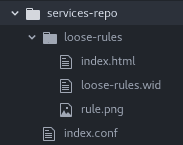
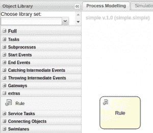

# 通过服务存储库扩展 Red Hat JBoss BPM Suite

> 原文：<https://developers.redhat.com/blog/2018/01/30/red-hat-jboss-bpm-suite-5>

## 介绍

[Red Hat JBoss BPM Suite](https://www.redhat.com/en/technologies/jboss-middleware/bpm) 提供了一个真正灵活的 BPMN 引擎，可以用定制的可重用服务进行扩展。大多数用户都知道它们是`Work Item Handler`(技术实现名)，但是很少有人知道可以在一个舒适的可重用服务列表中公开它们。事实上，您可以创建一个服务存储库，简化 BPMN 设计人员的工作，让他们能够轻松挑选合适的服务。

这种方法的另一个优点是 BPM 设计人员不必深入配置的本质，因为导入过程几乎为您解决了所有问题，所以您需要专注于通过一个干净的接口消费服务。为了让奇迹发生，*服务开发者*必须准备**服务库。**通过这样做，您使得组织的其他部分能够以简单明了的方式重用您的工作项处理程序。但是，即使服务开发人员不打算在整个组织中共享这些服务，他们也可以利用服务存储库来简化内部团队中工作项处理程序的安装。

## 服务存储库

在 BPM 项目中创建新服务(工作项处理程序)需要 BPM 设计人员修改至少三个配置文件:

*   `kie-deployment-descriptor.xml`定义如何实例化工作项处理程序类
*   `WorkDefinitions.wid`BPMN 编辑器中使用的服务界面和图标
*   `pom.xml`在何处添加工作项处理程序项目的依赖关系
*   可选图标

您可能会争辩说，即使创建存储库结构也需要一些小心，但是最大的好处是这项工作只需做一次，就可以在多个项目中重用。服务提供者管理许多配置细节，而服务消费者可以忽略它们。

服务存储库基本上是一个静态目录结构，可以通过 HTTP 服务器或业务中心可访问的普通文件系统提供服务。

您可以在下图中看到这个简单的结构:

根源在于:

*   文件`index.conf`
*   每个**服务**的文件夹

`index.conf`包含文件夹列表(名称必须与文件夹名称完全匹配)。
每个文件夹包含:

*   `<service-name>.wid`包含服务定义的果汁； **<服务名>** 必须与包含的文件夹名完全匹配
*   可选地，一个包含服务图标的 **png 文件**，它必须与前一个文件中的定义相匹配
*   可选地，一个记录服务使用的`index.html`

这里有一个包含服务存储库的 [github 项目示例。](https://github.com/dmarrazzo/demo-rule-wih)

核心是**。文件夹中包含的 wid** 文件:

https://gist.github.com/dmarrazzo/1b9c5e1e6696a957a4e8c6b3b298dcdd

内容非常简单:

1.  **名称:**实现服务的工作项处理程序
2.  **描述:**一个服务描述
3.  **参数:**输入参数
4.  **结果:**服务输出
5.  **显示名称:**在 BPMN 图中使用时的任务名称
6.  **图标:**服务的图标
7.  **类别:**用于在 BPMN 编辑器面板中对服务进行分组的类别
8.  **defaultHandler:** 一个 mvel 表达式，用于实例化工作项处理程序类(带有参数的构造函数)。请注意，您可以利用上下文中的一些变量:`ksession`和`classLoader`
9.  **文档:**指向文档 html 文件
10.  mavenDependencies: 使用 GAV 约定的 maven 依赖项
11.  **依赖关系:**包含在存储库中的 jar 文件的可选依赖关系

## 服务消费者

从用户的角度来看，消费服务很容易:

1.  打开 **BPMN 编辑器**，点击**服务库**图标:
    
2.  点击相应的**扳手**图标:
    选择您需要的服务
3.  关闭并再次打开 BPMN 编辑器以重新加载服务选项板
4.  拖放您的新服务:
    

## 结论

共享存储库中的服务鼓励重用，并明确流程设计者和服务开发人员之间的角色分离。
[红帽 JBoss BPM Suite](https://www.redhat.com/en/technologies/jboss-middleware/bpm) 推广这种好的实践。

*Last updated: January 29, 2018*