# 使用 Red Hat JBoss Developer Studio 在 OpenShift Online Starter 上开发和部署

> 原文：<https://developers.redhat.com/blog/2018/01/02/openshift-online-starter-using-jboss-developer-studio>

OpenShift 在线入门平台免费提供:请访问[https://manage.openshift.com](https://manage.openshift.com/)/。它基于 Red Hat OpenShift 容器平台 3.7。该产品允许您使用 OpenShift 容器平台并部署工件。本文的目的是描述如何将 Red Hat JBoss Developer Studio 或 JBoss Tools 与这个在线平台一起使用。

## 安装红帽 JBoss Developer Studio

如果你还没有安装 Red Hat JBoss Developer Studio 或 JBoss Tools，请访问此网页:[https://developers.redhat.com/products/devstudio/download/](https://developers.redhat.com/products/devstudio/download/)并按照说明进行操作。如果您将 JBoss 工具安装到现有的 Eclipse 安装上，请确保您选择了 **Jboss 云和容器开发工具**。

## 启动红帽 JBoss 开发者工作室

如果你已经安装了红帽 JBoss Developer Studio，启动 *devstudio.sh* (在 Linux 或者 MacOS 上)或者 *devstudio.bat* (Windows)脚本。

您应该会看到以下环境:

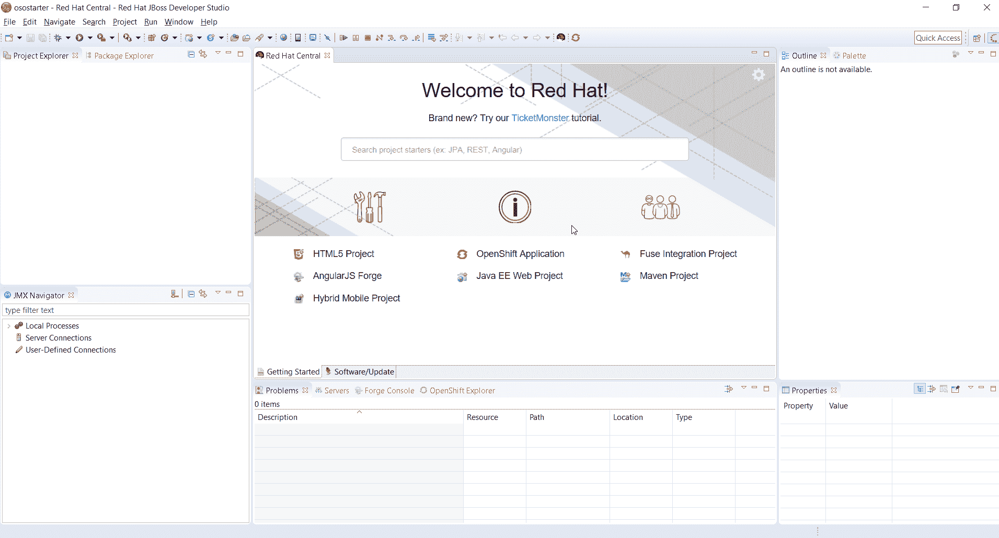

## 定义 OpenShift 在线启动器连接

选择 **OpenShift Explorer** 视图(位于用户界面的底部)，您应该看到以下环境:

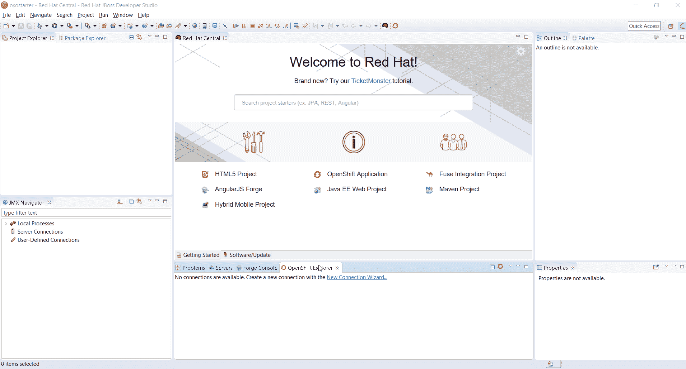

点击 **OpenShift Explorer** 视图中的**新建连接向导**链接。将显示以下向导窗口:

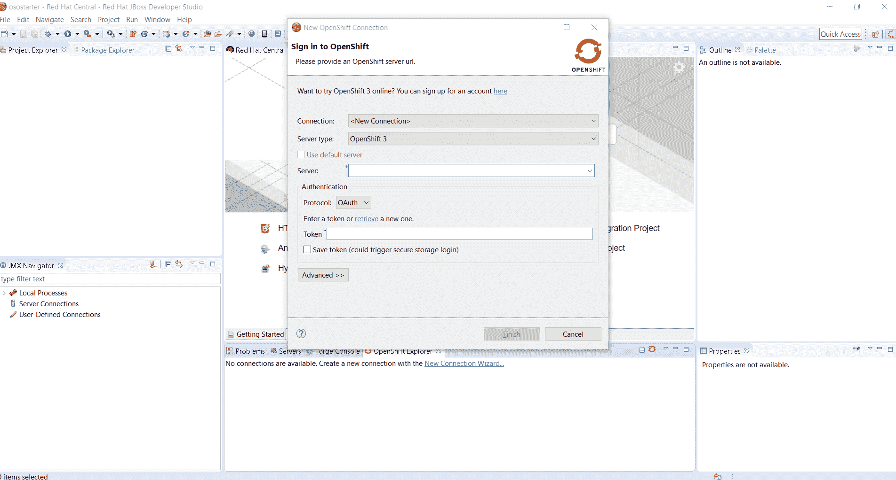

在**服务器**字段中:输入以下值:【https://api.starter-us-east-2.openshift.com】T2。请注意，您可能被分配到不同的集群，因此主机名可能会有所不同。如果你想知道你的，从网络浏览器登录 OpenShift Online Starter，然后从右上角的*帮助*菜单中选择*命令行工具*菜单。然后点击**检索**链接，将显示一个新窗口:

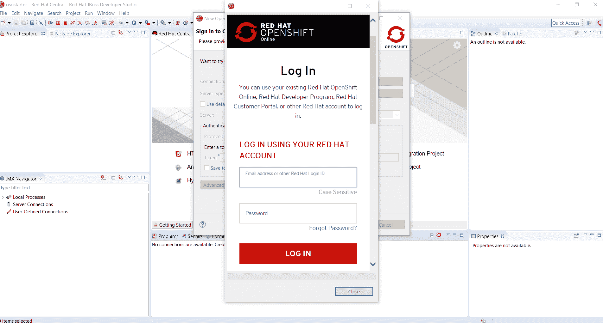

点击**登录**按钮，按照步骤操作，一旦登录，您应该会看到一个类似的窗口:


点击**关闭**按钮，令牌现在将在向导中设置:

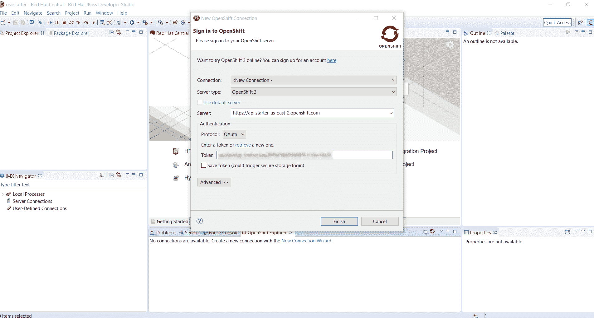

点击**完成**按钮。连接将被建立，一旦成功， **OpenShift Explorer** 视图将被更新如下:


如果您打开连接，您可能会看到 OpenShift 项目的列表。你应该有一个以你的名字命名的项目。如果您可以看到其他项目，那么您可能也是 OpenShift.io 产品的一部分:

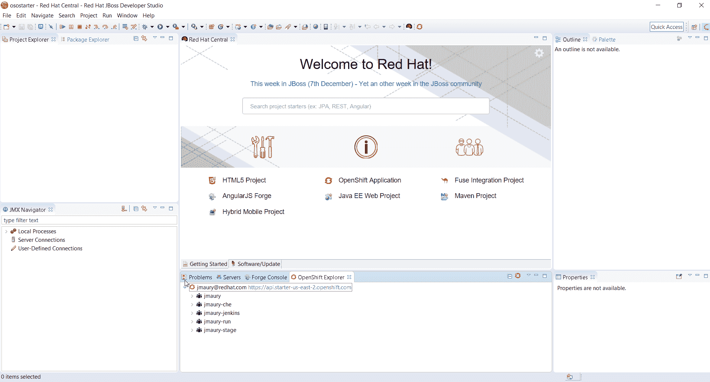

我们现在已经准备好使用 OpenShift 在线入门平台了。让我们看看如何部署和调试应用程序。

## 部署和调试基于 JBoss 企业应用平台的应用程序

在下文中，我们将使用以您的名字命名的 OpenShift 项目来托管我们的部署。

### 部署基于 Wildfly 的应用程序

Red Hat JBoss Developer Studio 提供了一个向导，用于在 OpenShift 平台上部署应用程序。在 **OpenShift Explorer** 视图中，右键单击 OpenShift 项目(your_name)并选择“**新建- >应用**菜单项。然后将出现应用程序向导:

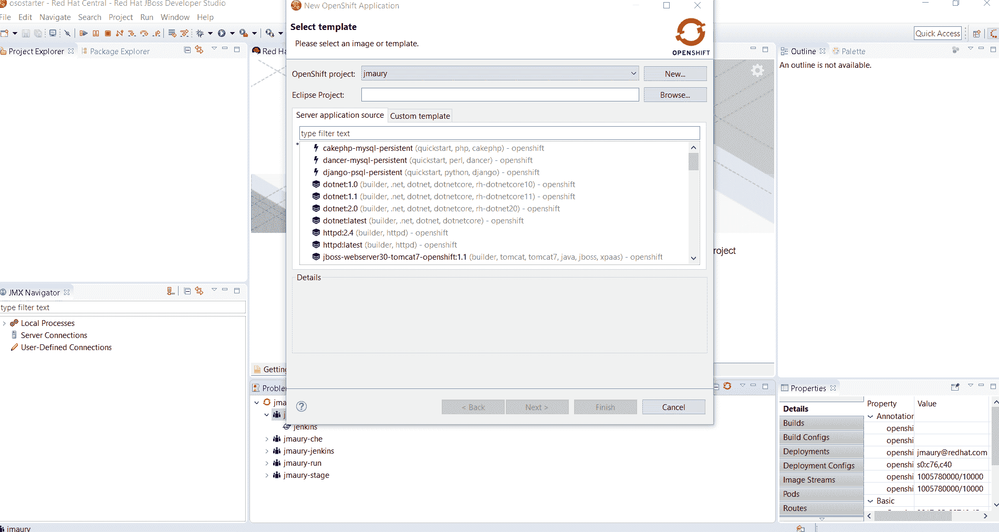

然后显示可用应用程序类型的列表。为了减少可用的选择，在**过滤器文本字段**中输入“ **wildfly** ”。显示将更新如下:

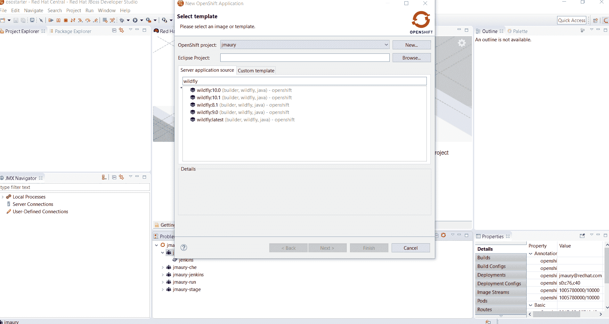

在可用应用程序类型列表中，选择“ **wildfly:latest** ”项目。详细信息字段将相应更新，并且**下一步**按钮现已启用。点击它。向导现在将显示以下内容:

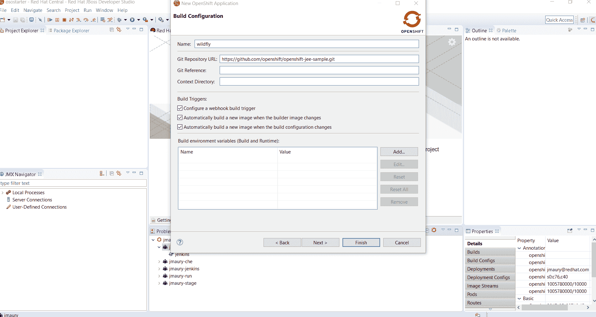

由于默认应用程序源代码(https://github.com/openshift/openshift-jee-sample.git)不包含 Java 源代码，我们将更改该页面中的以下字段:

*   **Git 存储库 URL**:https://github.com/wildfly/quickstart.git
*   **Git 参考** : 10.x
*   **上下文目录** : kitchensink

该页面现在应该看起来像这样:

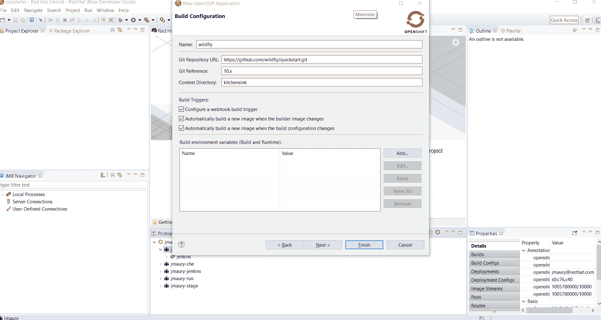

点击**完成**按钮。将在 OpenShift 在线入门平台上创建应用程序，然后显示 OpenShift 资源列表:

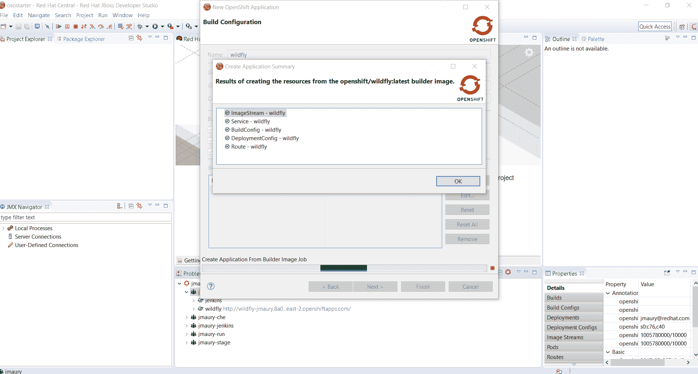

点击**确定**按钮。部署将会启动，您将会看到一个新的向导，用于将应用程序源文件导入到本地工作区:

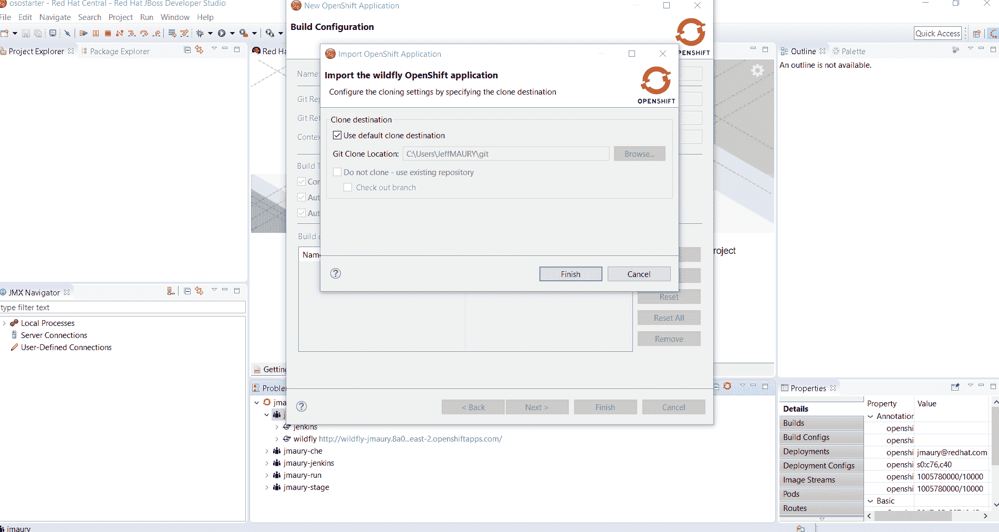

点击**完成**按钮。应用程序的源文件将从 Github Git 存储库中复制，并将在本地工作区创建一个新项目:

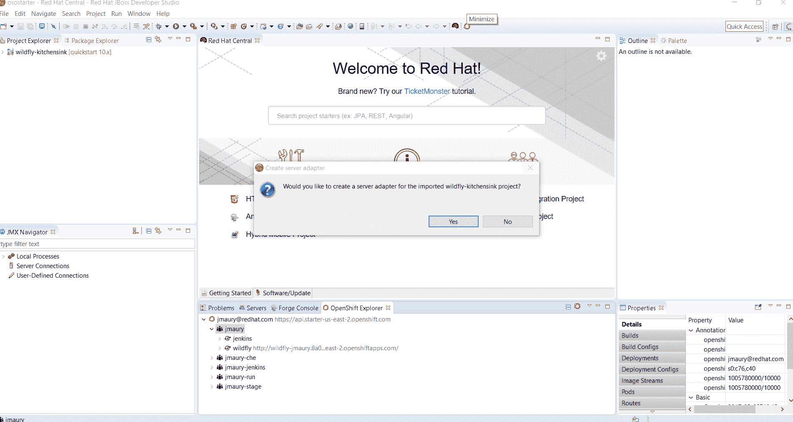

一旦应用程序的源文件被成功导入，您将被要求创建一个服务器适配器。回答否，因为我们需要首先检查我们的部署。

如果您在 **OpenShift Explorer** 视图中展开“ **your_name** ”项目，您应该会看到类似这样的内容:

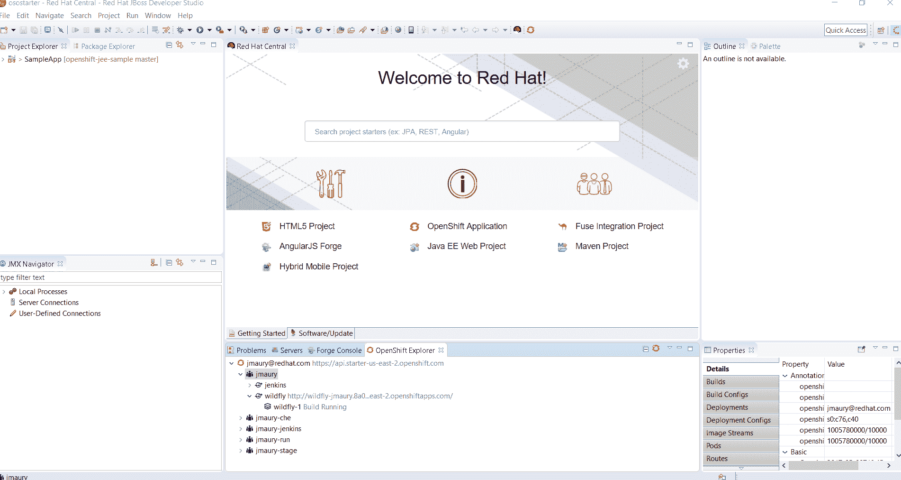

如果你没有看到“wildfly-1 Build Running”项，那么这意味着构建已经运行，并且该项应该已经被应用程序项所替换。这不太可能，因为 OpenShift Online Starter 上的资源有限，并且在撰写本文时，构建只花了大约 1 分钟的时间。

当构建完成时， **OpenShift Explorer** 视图将被更新，看起来如下:

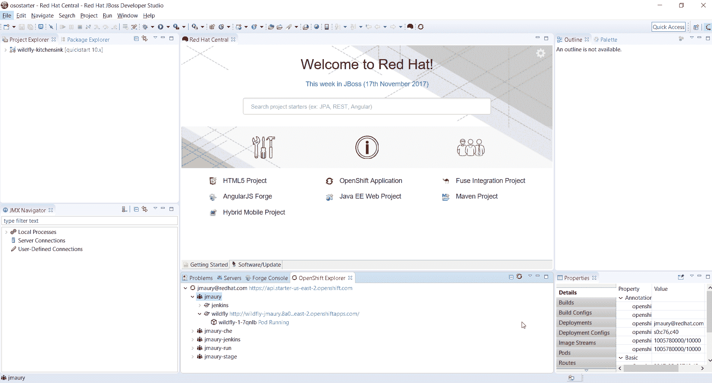

叶项目的名称是动态生成的，但应该遵循以下模式:*wildly-1-suffix*。

#### 检查部署

现在让我们访问应用程序。右击'**野花**项，选择'**显示在- >网页浏览器**菜单项。将会打开一个新的浏览器窗口，您应该会看到以下内容:

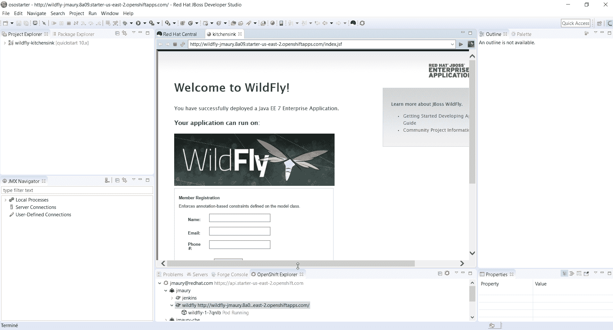

如果您可以看到这一点，那么该应用程序已经成功部署在 OpenShift Online Starter 平台上。我们现在准备切换到下一个阶段，调试。

### 调试基于 Wildfly 的应用程序

在我们深入之前，让我们解释一下我们在哪里。我们已经在 OpenShift Online Starter 平台上部署了一个应用程序，并且还在本地工作区下载了应用程序源文件。

Red Hat JBoss Developer Studio 将允许开发人员在处理面向云的应用程序时获得与本地应用程序相同的用户体验:对应用程序源文件的本地更改应在不重启应用程序的情况下可用，即使应用程序运行在 OpenShift Online Starter 平台上，也应允许调试应用程序代码。

让我们描述一下它是如何工作的:

Red Hat JBoss Developer Studio 提供了一个名为 OpenShift server adapter 的工具，它充当本地 Eclipse 项目和 OpenShift 部署之间的同步工具(它可以是服务、部署配置或复制控制器)。

它可以在两种不同的模式下运行:

*   **运行**:这是基本模式。它提供了本地 Eclipse 项目和 OpenShift 部署之间的变更同步。每次在本地项目中检测到一个修改的文件时，这些更改都会被发送到 OpenShift 窗格中。该文件可以是 Java 文件，而。类文件，以便可以立即检查新代码。但是这也可以是一个. jsp 文件(表示层),这样也可以检查用户界面。
*   **debug** mode:这是一个高级案例，您拥有 **run** mode 的所有同步特性，但是除此之外，OpenShift 部署将被更新，因此远程 JVM 现在以调试模式启动，并且本地 Eclipse 还将启动一个远程 Java 应用程序配置，该配置将连接到 OpenShift 部署的 OpenShift pods。因此，如果您在本地 Eclipse 项目的文件中放置断点，并且如果该特定代码行在远程 OpenShift 平台上执行，那么您的本地 Eclipse 将停止执行并显示调试后的文件！！是不是很神奇？

现在我们已经有了可用的 OpenShift 部署和 Eclipse 工作区中相应的源文件，让我们开始吧！！！

#### 创建 OpenShift 服务器适配器

为了创建 OpenShift 服务器适配器，您需要一个正在运行的部署和一个本地 Eclipse 工作区。因为我们有一个，并且我们下载了应用程序源文件，这对我们来说很容易。

在 **OpenShift Explorer** 视图中，选择‘wild fly’节点，右键单击并选择‘T2’服务器适配器...菜单项。将显示一个新向导:

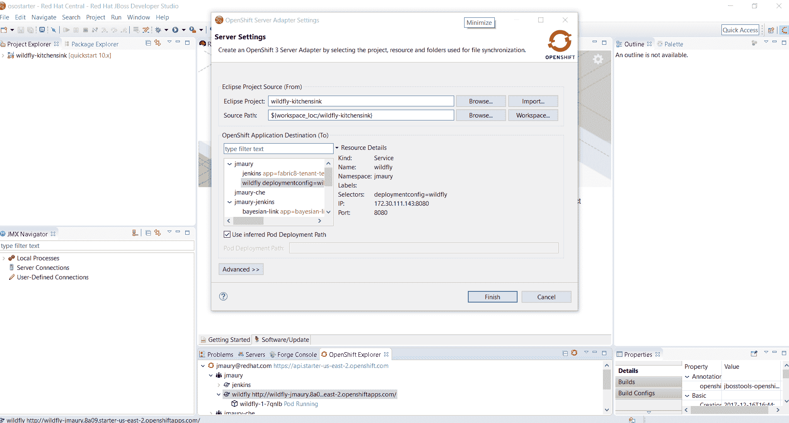

您应该选择将与 OpenShift 部署和 OpenShift 部署同步的本地 Eclipse 项目。由于我们的工作区中只有一个 Eclipse 项目和一个 OpenShift 部署，它们将被自动选择，您可以使用默认设置，因此单击' **Finish** '按钮。

首先， **Servers** 视图将自动显示，新创建的服务器将被添加到视图中。然后将显示**控制台**视图，您将看到那里显示的消息:这是同步过程，已经启动以确保本地 Eclipse 项目与 OpenShift 部署保持同步:

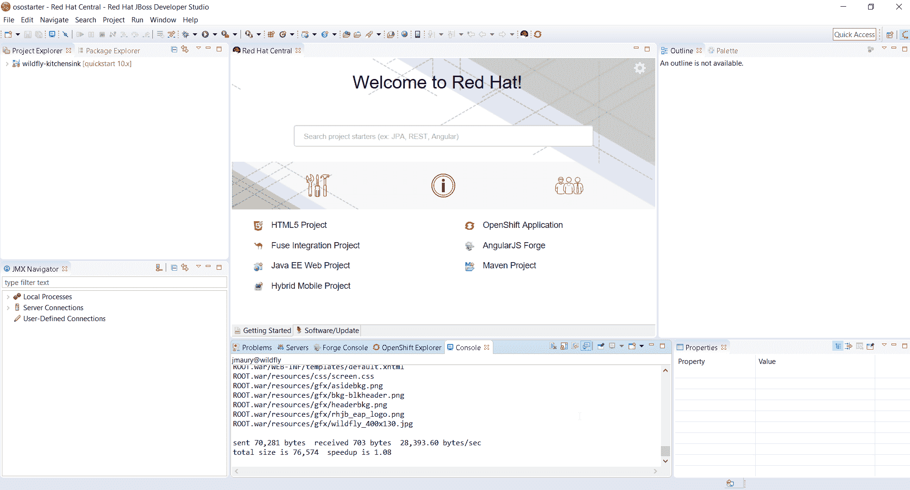

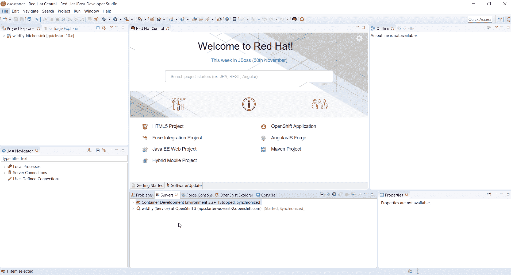

#### 更新应用程序文件并查看实时传播的更改

在这个场景中，我们将修改应用程序的欢迎页面，并检查更改是否已经传播到 OpenShift 部署。

在**项目浏览器**视图中，展开“**wildly-kitch sink**项目，在该项目下，展开 **Deployed Resources** 节点，应该会看到一个“ **webapp** 节点，展开后双击 **index.xhtml** 文件:
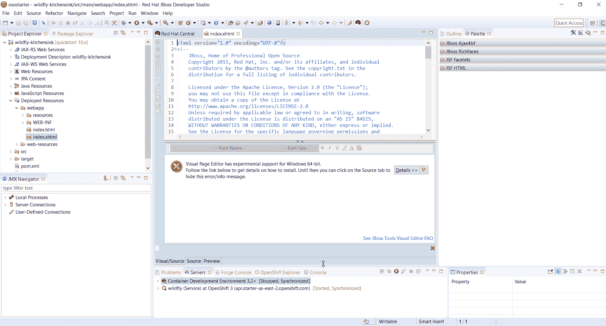

如果您向下滚动几行，您应该会看到下面一行:

```
<h1>Welcome to Wildfly!</h1>
```

将其替换为以下内容:

```
<h1>Welcome to Wildfly! from Red Hat JBoss Developer Studio</h1>
```

保存并关闭编辑器(Ctrl + W)。

您应该在“控制台”视图中看到一些消息:更改被传播到 OpenShift 部署。

让我们检查这是真实的！！！！

在 **OpenShift explorer** 视图中，选择“ **jboss-eap70-openshift** 项，右键选择“**显示在- >浏览器**菜单项。将显示一个新的浏览器窗口，内容如下:

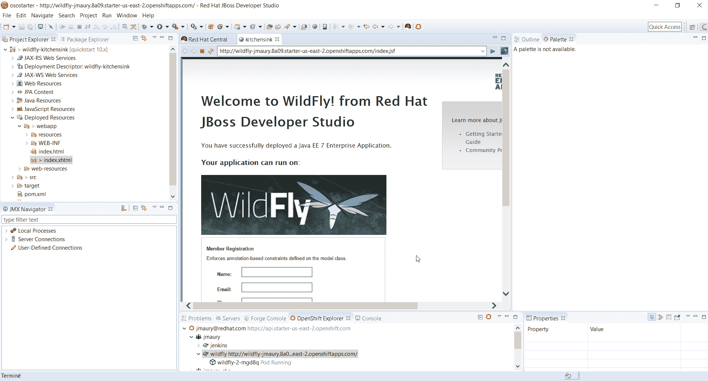

如你所见，页面的标题已经更新了！！！！

现在让我们进入一个更复杂的阶段，调试我们的应用程序。

#### 调试应用程序

接下来的第一步是让我们的部署切换到调试模式。这可以通过在调试模式下重启我们刚刚创建的服务器适配器来完成(在 open shift 3(api.starter-us-east-2.openshift.com)中它应该被称为 *wildfly (Service)】)。选择**服务器**视图，然后选择我们刚刚创建的 OpenShift 服务器适配器，右击并选择“**在调试中重启**”菜单项。您将在**控制台**视图中再次看到一些同步消息，但是如果您切换回**服务器**视图，OpenShift 服务器适配器的状态应该更新为【调试，同步】。请注意，由于 OpenShift Online Starter 的限制，这可能是一个长期的操作，因此请耐心等待:*

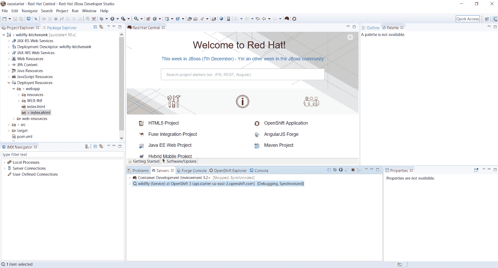

接下来，我们需要在应用程序代码中设置一个断点。由于应用程序允许注册新成员，我们将在注册完成的地方设置一个断点。由于应用程序是按照 MVC 模式设计的，我们将把断点放在控制器中。

在**项目浏览器**视图中，展开“**wildly-kitch sink**项目，在该项目下，展开 **Java 资源**节点，应该会看到一个“ **src/main/java** 节点，展开它，展开“**org . JBoss . as . quick starts . kitchen sink . controller**包，双击**MemberController.java**文件:

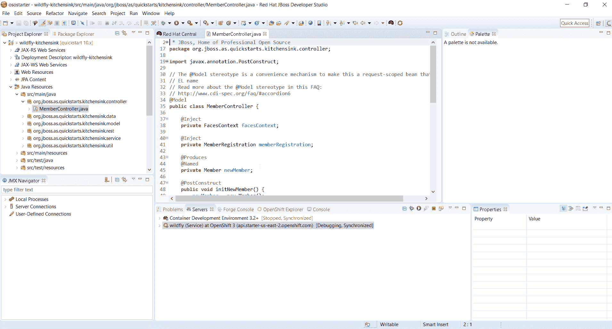

如果向下滚动一点，您可以看到**寄存器**方法的全部内容:

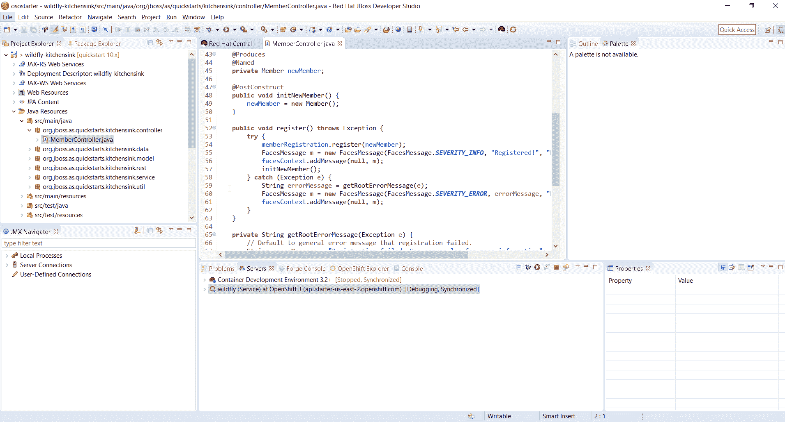

让我们在这个方法的第一行代码上设置一个断点:这应该是第 54 行，代码应该是:

```
memberRegistration.register(newMember);
```

双击 54 行号旁边的左标尺，将设置断点，并出现一个蓝色小气球:

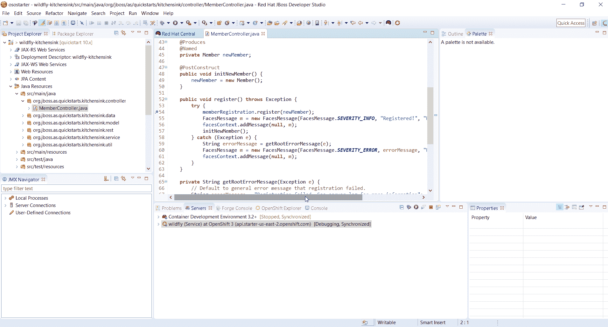

我们现在都准备好了。由于 OpenShift 服务器适配器在调试模式下重启，我们的部署在调试模式下运行，并且我们在应用程序代码中设置了一个断点。我们现在需要到达那行代码，因此我们需要为此启动应用程序用户界面。

因此，正如我们之前所做的，返回到 **OpenShift Explorer** 视图，选择“ **wildfly** ”节点，右键单击并选择“ **Show In - > Web Browser** ”菜单项，应用程序用户界面将显示在新的浏览器窗口中:

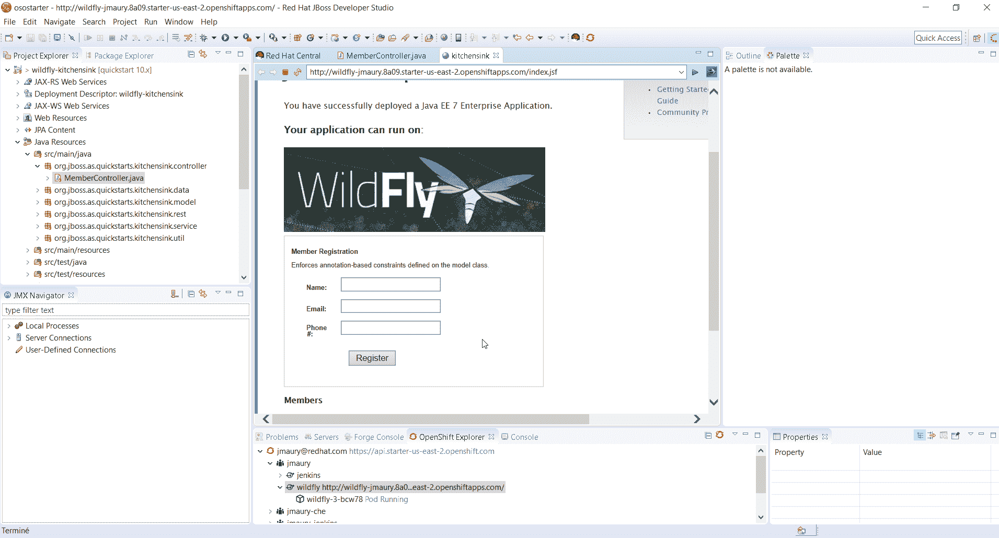

在显示的表单中，输入任意姓名(演示)、电子邮件地址和电话号码(必须在 10 到 12 位之间)，然后点击**注册**按钮。

如果这是您第一次调试应用程序，或者如果您的工作区是新的，您将看到一个对话框，要求您切换到 debug 透视图。点击**是**按钮。否则，您将被自动驱动到 Debug 透视图:

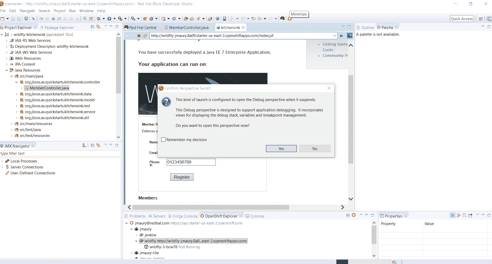

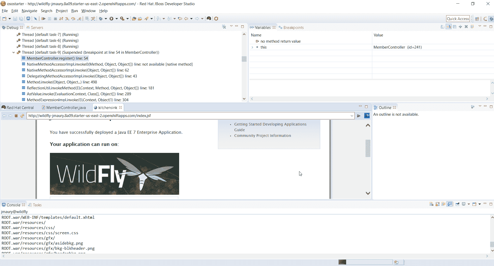

我们做到了。我们到达了断点，如果您在**变量**视图中展开“**this”**变量，您应该会看到您提交的值:


然后，您可以像处理本地 Java 应用程序一样单步执行代码。

因此，您已经发现调试远程部署的 Java 应用程序是多么简单。我们还有更多。Red Hat JBoss Developer Studio 也为基于 NodeJS 的应用程序提供了相同的用户体验！！我们将在本文的第二部分讨论这个问题。

* * *

**[红帽 JBoss 开发者工作室](https://developers.redhat.com/products/devstudio/download/)可供下载，今天安装。**

*Last updated: March 19, 2020*