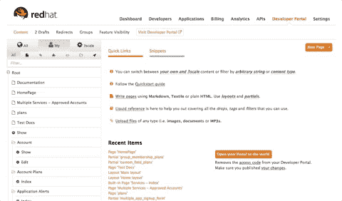
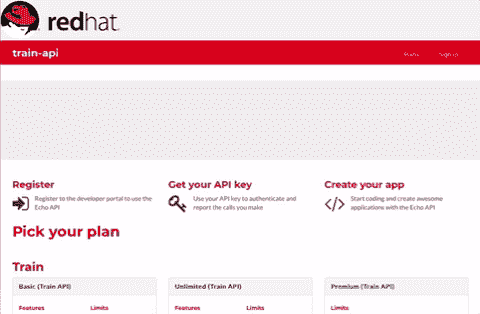
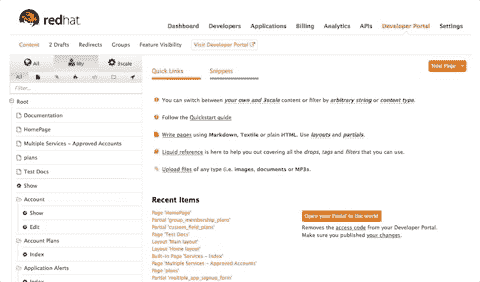
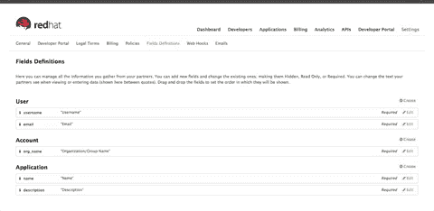
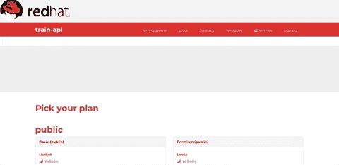
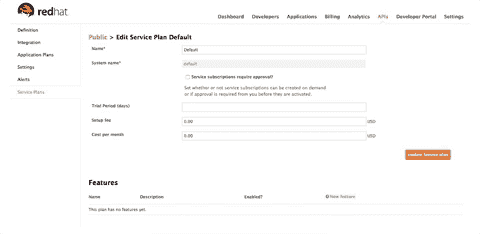
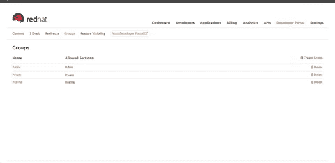

# 3 大规模开发人员门户注册流程

> 原文：<https://developers.redhat.com/blog/2017/12/18/3scale-developer-portal-signup-flows>

本例中有 4 个自定义注册流程[父主页](https://github.com/kevprice83/Custom-signup-flows-3scale-Dev-portal/blob/master/index.html.liquid)。由于所有的流都被分成了各个部分，您可以使用 Liquid 标签将它们包含到主页中，如下面的代码片段所示:``。您可以将部分内容单独或一起包含在您的 3scale 开发人员门户中。这取决于您希望在您的门户中启用哪些流，并使将来在流之间切换更容易，而不会造成太大的麻烦。

**注意:**如果您愿意，您可以创建一个单独的页面来存放计划订阅表格。如果您希望允许[自定义字段](#customfieldflow) & [群组成员资格流](#groupmembershipflow)的每个账户有多个应用程序，这将非常有用。

## 3scale 注册是如何工作的？

### 基础知识

开发人员可以通过多种方式注册订阅 API 服务，具体方式取决于 3scale 管理门户上所有设置的配置。虽然这是灵活的，并且在后台工作的过程和机制方面有所不同，但最终用户从他们的角度看不会看到很大的差异，这是交付良好用户体验的关键。

通常，开发者可以作为公共用户在大多数开发者门户的主页上发现任何 API 服务及其计划(合同)。当开发人员选择服务和计划时，门户会将他们重定向到注册表单，以完成他们的基本细节。3scale 需要注册表单的某些参数来创建帐户和 API 服务之间的契约。它还需要表单上的一些默认字段，您可以根据需要使用额外的自定义字段进行扩展。3scale 在后台创建一个应用程序，作为标准注册过程的一部分。应用程序是包含 API 密钥的对象。开发人员使用门户来访问和管理他们的密钥，以便他们可以成功地使用他们订阅的服务。作为 API 提供者，您对参数和字段的控制突出了 3scale 开发人员门户的灵活性。

### 注册期间创建的对象

*   账户
*   用户
*   应用
*   钥匙

Account 对象与用户有一对多的关系，但在最初创建时只有一个关系。如果帐户在注册期间订阅了多个服务，则它通过服务订阅与这些服务相关联。对于每个服务，都会创建一个订阅一组密钥的应用程序。尽管理解 3scale 数据对象模型和每个对象之间的关系很重要，但我们在这里不会详细讨论。

## 捐款

当开发者提交注册表单时，3scale 创建了两个订阅。但是用户通常只看到和关心其中的一个。最重要的订阅是应用程序订阅，其次是服务订阅。

### 应用程序订阅

应用程序对象通过 3scale 中的应用程序计划与服务具有一对一的关系。这是决定消费和访问单个服务的访问级别、费率限制和定价层(如果是货币化 API)的合同/政策。

### 服务订阅

帐户对象可以订阅 3scale 中的许多服务，并可以通过服务计划访问这些服务。服务计划通常仅用于管理帐户可以订阅的 API 服务列表。作为管理员用户，您将在管理门户中看到这些服务订阅列表。

## 注册流程

您可以按照步骤完成每个流程的整合，并使用每个简短的屏幕记录作为参考。

### 单一应用流程

这是最简单的注册流程，仅允许在创建帐户时订阅单个服务和应用程序计划。要使用此流程，您不需要在 3scale 开发人员门户中启用任何特殊功能。只需包含[单个 app 部分](https://github.com/kevprice83/Custom-signup-flows-3scale-Dev-portal/blob/master/_single_app_signup_form.html.liquid)，从你的[主页](https://github.com/kevprice83/Custom-signup-flows-3scale-Dev-portal/blob/master/index.html.liquid)用``调用即可。

##### 管理门户:



##### 开发者门户:



### 多应用流程

这也是一个简单的注册流程。它允许任何公共用户在一个注册表单中直接注册多个服务和相关的应用程序计划。用户在注册之前不需要一个帐户，因为你想要公开可用的服务。启用开发人员门户上的多应用程序功能以使用此流程。你可以在*开发者门户>特性可见性*做这件事。使用[多个应用部分](https://github.com/kevprice83/Custom-signup-flows-3scale-Dev-portal/blob/master/_mulitple_app_signup_form.html.liquid)，从[主页](https://github.com/kevprice83/Custom-signup-flows-3scale-Dev-portal/blob/master/index.html.liquid)调用如下:``。

##### 管理门户:



##### 开发者门户:


### 自定义字段流

当您想要控制用户可以查看或订阅的服务时，可以使用此流程。想象一个简单的场景，其中您管理三个类别的 API:公共、私有和内部。您可以通过一些管理门户设置将用户限制为只能“请求订阅服务”。然而，每当用户想要订阅或更改服务时，您都需要做一些手工工作。如果经常发布很多服务，这就不容易维护了。随着开发人员社区的增长，您会希望尽可能地保持开发人员门户的可伸缩性和可管理性。以下步骤将帮助您实现这一目标。

#### 第一步

要使用这个流程，您应该使用一些预定义的选项*设置>字段定义*在 Account 对象上定义一个自定义字段。比如说；**公有、私有、内部**。然后，您将使用这些值来执行子字符串匹配，使用一些灵活的逻辑来呈现允许的服务和计划。您希望控制用户的访问权限，因此注册表单本身将只创建一个帐户和用户对象。创建后，在自定义字段上为帐户分配适当的值。您还可以使用一些有趣的 JavaScript(一些检查注册表单上的电子邮件域并将自定义字段值作为参数传递的函数)来自动化这一部分。

##### 管理门户:



**注意:**如果您确实要自动执行这一部分，我们建议您启用“需要账户批准”复选框以增加安全措施。你可以在*设置>常规>注册*完成。

#### 第二步

您需要将[自定义字段部分](https://github.com/kevprice83/Custom-signup-flows-3scale-Dev-portal/blob/master/_custom_field_plans.html.liquid)包含在 3scale CMS 中，并从[主页](https://github.com/kevprice83/Custom-signup-flows-3scale-Dev-portal/blob/master/index.html.liquid)中用 Liquid 标签:``调用它。

##### 开发者门户:



### 群组成员流程

当您想要控制对服务的访问时，这个流程特别有用，就像我们在前一个流程中所做的那样。如果您想要创建用户只有在拥有正确权限时才能访问的内容部分，那么您应该使用此流程。要订阅任何 API，用户必须先注册创建一个帐户。因此，用户只有在拥有帐户后才能看到服务和计划。创建帐户后，您应该分配适当的组成员身份。您可能还想启用“需要帐户批准”复选框以增加控制。要启用此流程，您需要完成以下步骤。

#### 第一步

在*开发者门户>群组*创建群组。创建“允许的部分”后，您可以将其分配给相关的组。

#### 第二步

在每个服务的默认服务计划中创建一个功能。在这个例子中，这个特性表示 API 的“类别”，记住 **public，private，internal** 是我们之前使用的例子。您可以随意命名该特性。重要的是要记住，这个字符串将用于匹配门户中的用户数据。

##### 服务计划功能



#### 第三步

在*开发者门户>内容*为每个组创建一个新的部分。从下拉菜单中选择“新部分”。将部分路径设置为至少匹配您之前创建的特征`system_name`的子字符串。您将比较这两个属性的字符串值，以控制向用户显示的订阅表单。

##### 创建组和节



#### 第四步

最后，您需要在 3scale CMS 中包含[组成员部分](https://github.com/kevprice83/Custom-signup-flows-3scale-Dev-portal/blob/master/_group_membership_plans.html.liquid)。和前面所有的流程一样，你应该从[主页](https://github.com/kevprice83/Custom-signup-flows-3scale-Dev-portal/blob/master/index.html.liquid)调用它。

## 附加点

### JavaScript 函数

您只需要使用一个定制的 JavaScript 函数，`redirectUser()`。该函数将用户从[应用程序索引页面](https://github.com/kevprice83/Custom-signup-flows-3scale-Dev-portal/blob/master/_applications_index.html.liquid)重定向到您在[布局模板](https://github.com/kevprice83/Custom-signup-flows-3scale-Dev-portal/blob/master/l_main_layout.html.liquid)上定义的页面。当用户首次登录门户时，门户会将他们重定向到*应用程序索引*视图，但是如果他们还没有创建任何应用程序，这将会感觉有点混乱或奇怪。这个自定义重定向稍微提高了 UX。它还用在[服务索引](https://github.com/kevprice83/Custom-signup-flows-3scale-Dev-portal/blob/master/services_index.html.liquid)页面上，这样用户就可以订阅服务，而无需被重定向到另一个页面。同样，我在这里的例子中主要实现了这个来提高 UX。

```
function redirectUser() {
    // You can set this redirect to any page you wish. The default is the homepage.
    window.location.href="/"
};
```

只有当您使用[自定义字段](#customfieldflow)或[群组成员资格流](#groupmembershipflow)时，此自定义行为才适用于您。

* * *

**利用您的红帽开发者会员资格和** [**免费下载 RHEL**](http://developers.redhat.com/products/rhel/download/) **。**

*Last updated: September 3, 2019*