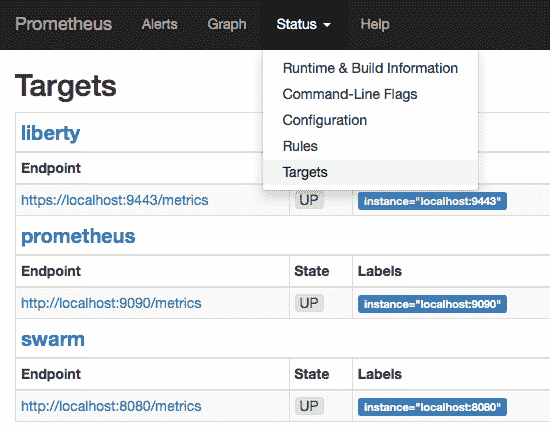
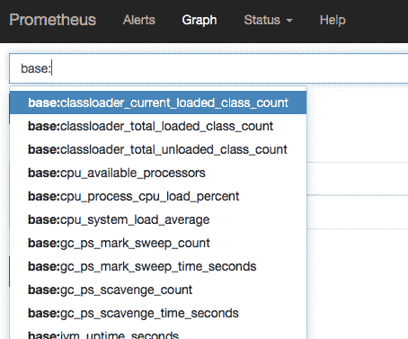
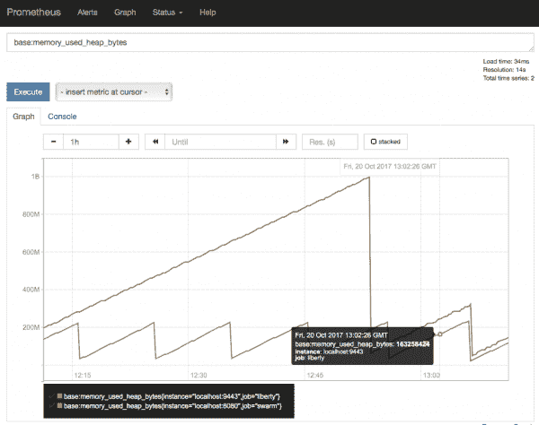

# 如何用 Prometheus 监控 Eclipse MicroProfile 1.2 服务器

> 原文：<https://developers.redhat.com/blog/2017/10/25/monitor-eclipse-microprofile-1-2-server-prometheus>

Eclipse MicroProfile has added a Monitoring specification in its 1.2 release. This allows for a common way of monitoring servers that implement the specification. In this article, you will learn how to monitor MicroProfile 1.2 servers with the popular Prometheus monitoring system.

## 概观

I have described the [concepts of Eclipse MircoProfile (MP) Monitoring](https://developers.redhat.com/blog/2017/10/17/monitoring-aspects-eclipse-microprofile-1-2/) in a previous article: servers expose a basic set of system metrics that are common for each implementation of the MP-Metrics specification. Applications can in addition also make specific metrics available.The server then exposes the gathered metric data over http(s) endpoints. Monitoring agents can then connect to the server's `/metrics` endpoint and poll the data.

### 设置要监控的(服务器)运行时

I am now going to show how to set up the runtimes to use MicroProfile metrics. For this, I am showcasing WildFly Swarm and OpenLiberty as two of the early adopters of the Metrics specification. I will start with WildFly Swarm.

#### 野生蜂群

[WildFly Swarm](http://wildfly-swarm.io/) or Swarm for short uses a so-called fat-jar approach: You build your application and then get a jar file that contains the application and all of the server logic, which you then just start via `java -jar application-swarm.jar`. To enable the MicroProfile Metrics to support, you need to pull in the MicroProfile *fraction* in your build.For Apache Maven users it looks like this:After this is done, you just build your project as usual with `mvn install`, which will create the usual uber-jar in a target.When you run it, you will see a line like the following in the server log:

```
WFSWARM0013: Installed fraction:     Microprofile-Metrics - EXPERIMENTAL    org.wildfly.swarm:microprofile-metrics:2017.11.0-SNAPSHOT
```

一旦服务器准备就绪，默认情况下，它会在`http://localhost:8080/metrics`下显示指标。

#### 开放自由

You can download [OpenLiberty](https://OpenLiberty.io/) from its homepage. After downloading and unpacking it, you need to create a server configuration. Pass the respective template in to obtain a MicroProfile configuration.

```
$ bin/server create  mp --template=microProfile1
```

The `/metrics` endpoint is secured by default on OpenLiberty.You need to add a small addition to the config file under `usr/servers/mp1/server.xml` inside the `<server>` element.

完成后，您可以通过`bin/server run mp`启动服务器。通过标准设置，可以在`https://localhost:9443/metrics`下找到这些指标。凭证是
*用户/密码*，如上面代码片段的第 2 行所示。

### 设置普罗米修斯

Now that we have our targets set up to be monitored, we can install [Prometheus](https://prometheus.io/) to monitor them. Prometheus is relatively easy to get going. Just download, unpack and start it. Before you can start it, you need to provide a configuration file. Create a file `prom.yml` with the following content:

```
scrape_configs:
  # Configuration to poll from WildFly Swarm
  - job_name: 'swarm'
    scrape_interval: 15s

    # translates to http://localhost:8080/metrics
    static_configs:
      - targets: ['localhost:8080']

  # Configuration to poll from OpenLiberty
  - job_name: 'liberty'
    scrape_interval: 15s
    scheme: https
    basic_auth:
      username: 'theUser'
      password: 'thePassword'

    tls_config:
      insecure_skip_verify: true

    # translates to https://localhost:9443/metrics
    static_configs:
      - targets: ['localhost:9443']
```

After editing the file, you can start Prometheus via;

```
$prometheus -config.file=prom.yml
```

Prometheus will show a few lines about starting and a few seconds later it is ready.Head over to your browser and go to `http://localhost:9090/`.As a first step select Status -> Targets from the menu and make check that both servers are marked as UP.[](/sites/default/files/blog/2017/10/Bildschirmfoto-2017-10-20-um-12.48.26.png)List of targets that Prometheus is scraping along with their statusList of endpoints to be scraped from along with their status.">Chose Metrics for display.[](/sites/default/files/blog/2017/10/Bildschirmfoto-2017-10-20-um-12.48.55.png)Prometheus metric selector with a list of base: metrics">When the servers are running, we are ready to display some metrics (that gets more interesting when you wait a while so that Prometheus has polled more data).[](/sites/default/files/blog/2017/10/Bildschirmfoto-2017-10-20-um-15.11.41.png)Metrics as shown in Prometheus UI">

在最后一个图表中，您可以看到我们只要求了指标，`base:memory_used_heap_bytes`,但是得到了两个图，每个 MP 服务器一个，因为两个图都在相同的名称下显示了相同的指标。普罗米修斯正在添加标签，然后可以用来区分服务器(绿色是 OpenLiberty，棕色是 Swarm)。

## 结论

MicroProfile Metrics 定义了一种从系统中公开度量的通用方法。因此，像 Prometheus 这样的监控工具能够以独立于供应商的方式轻松监控这些服务器。

在撰写本文时，MP-Metrics 代码可能还没有大规模发布，但很快就会了。

* * *

要构建您的 Java EE 微服务 **请访问** [**野生蜂群**](https://developers.redhat.com/promotions/wildflyswarm-cheatsheet/) **并下载备忘单。**

*Last updated: October 26, 2017*