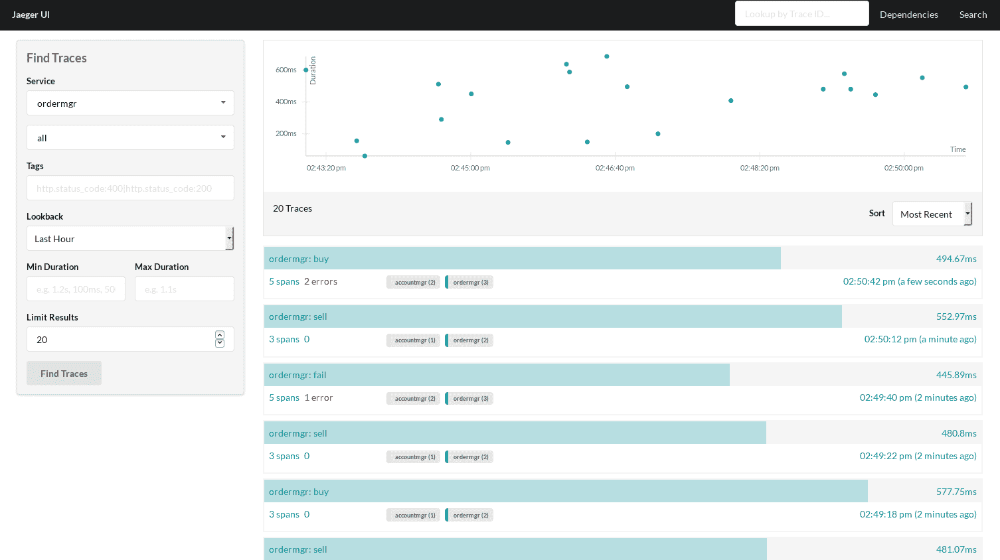
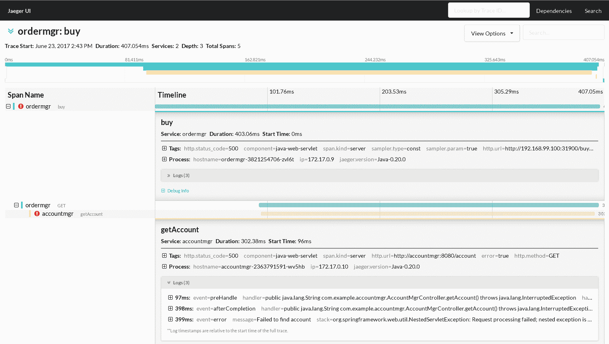
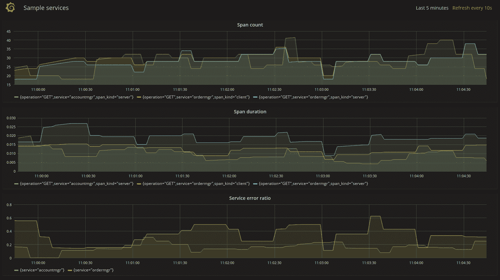
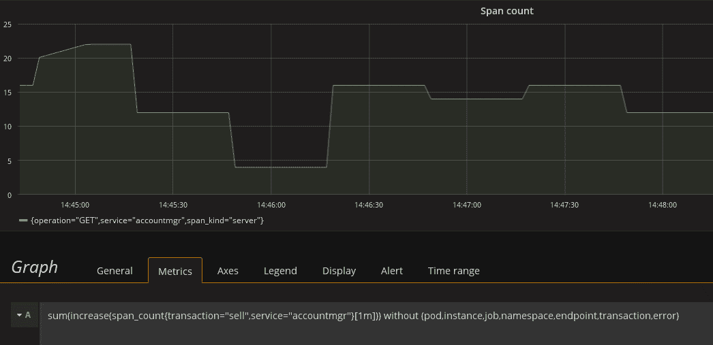

# 使用 OpenTracing 和 Jaeger 在 Kubernetes 中收集应用程序指标

> 原文：<https://developers.redhat.com/blog/2017/07/10/using-opentracing-with-jaeger-to-collect-application-metrics-in-kubernetes>

本文将展示如何使用 [OpenTracing](http://opentracing.io/) 工具从部署在 [Kubernetes](https://kubernetes.io/) 内的服务中收集应用程序指标，以及(但独立于)报告的跟踪数据。然后，这些应用程序指标可以显示在您的监控仪表板中，并用于触发警报。


## 示例应用程序

在最近的一篇文章中，我们展示了如何使用 OpenTracing 轻松地对 Spring Boot 应用程序进行[检测。](http://www.hawkular.org/blog/2017/06/9/opentracing-spring-boot.html)

我们将在本文中使用的[示例](https://github.com/objectiser/opentracing-prometheus-example)使用相同的方法创建两个服务， *ordermgr* 和 *accountmgr* 。

*accountmgr* 提供了一个单一 REST 端点(`/getAccount`)供 *ordermgr* 内部使用。此端点的代码是:

Account Manager's Controller:

```
    @RequestMapping("/account")
    public String getAccount() throws InterruptedException {
        Thread.sleep(1 + (long)(Math.random()*500)); 
        if (Math.random() > 0.8) { 
            throw new RuntimeException("Failed to find account");
        }
        return "Account details";
    }
```

|   | 这一行只是引入了一个随机延迟，以使收集的指标更有趣。 |
|   | 这三行代码随机地导致一个异常，这将导致 span(与 REST 端点调用相关联)被标记为一个错误，相关的日志事件标识错误的详细信息。 |

ordermgr 提供了三个 REST 端点供最终用户使用。这些是:

Order Manager’s Controller:

```
    @Autowired
    private io.opentracing.Tracer tracer; 

    @RequestMapping("/buy")
    public String buy() throws InterruptedException {
        Thread.sleep(1 + (long)(Math.random()*500)); 
        tracer.activeSpan().setBaggageItem("transaction", "buy"); 
        ResponseEntity<String> response = restTemplate.getForEntity(accountMgrUrl + "/account", String.class);
        return "BUY + " + response.getBody();
    }

    @RequestMapping("/sell")
    public String sell() throws InterruptedException {
        Thread.sleep(1 + (long)(Math.random()*500)); 
        tracer.activeSpan().setBaggageItem("transaction", "sell"); 
        ResponseEntity<String> response = restTemplate.getForEntity(accountMgrUrl + "/account", String.class);
        return "SELL + " + response.getBody();
    }

    @RequestMapping("/fail")
    public String fail() throws InterruptedException {
        Thread.sleep(1 + (long)(Math.random()*500)); 
        ResponseEntity<String> response = restTemplate.getForEntity(accountMgrUrl + "/missing", String.class); 
        return "FAIL + " + response.getBody();
    }
```

|   | 该服务注入 OpenTracing `Tracer`来启用对活动 span 的访问。 |
|   | 这三种方法都会引入随机延迟。 |
|   | `buy`和`sell`方法额外设置了一个行李项`transaction`,带有正在执行的商业交易的名称(即购买或出售)。对于那些不熟悉 OpenTracing 的人来说，[行李概念](https://github.com/opentracing/specification/blob/master/specification.md#set-a-baggage-item)允许在带中携带信息*以及被调用服务之间的跟踪上下文。我们将向您展示如何使用行李项来分离仅与特定业务交易相关的指标。* |
|   | 在 *accountmgr* 上调用不存在的端点将导致在跟踪和度量数据中报告错误。 |

## 向 OPENTRACING 工具添加指标报告

OpenTracing API 定义了一个 *Span，*的概念，它表示由服务执行的一个工作单元，例如接收服务调用、执行一些内部任务(例如访问数据库)或调用外部服务。它们提供了一个理想的基础来报告关于服务中这些点的度量(计数和持续时间)。

因此，已经建立了一个新的 [OpenTracing contrib 项目](https://github.com/opentracing-contrib/java-metrics)(最初只是针对 Java)来截取完成的跨度，并创建相关的度量。这些指标随后被提交给一个*指标报告员*进行记录——这个接口的最初实现是为[普罗米修斯](https://prometheus.io/)准备的。

第一步是公开收集普罗米修斯指标的端点。每个服务都有以下配置:

```
@Configuration
@ConditionalOnClass(CollectorRegistry.class)
public class PrometheusConfiguration {

     @Bean
     @ConditionalOnMissingBean
     CollectorRegistry metricRegistry() {
         return CollectorRegistry.defaultRegistry;
     }

     @Bean
     ServletRegistrationBean registerPrometheusExporterServlet(CollectorRegistry metricRegistry) {
           return new ServletRegistrationBean(new MetricsServlet(metricRegistry), "/metrics");
     }
}
```

这将允许从服务的`/metrics` REST 端点获取 Prometheus 指标。

然后，每个服务都需要一个配置来获得`io.opentracing.Tracer`:

```
@Configuration
public class TracerConfiguration implements javax.servlet.ServletContextListener {

	@Bean
	public io.opentracing.Tracer tracer() {
		return io.opentracing.contrib.metrics.Metrics.decorate(
			io.opentracing.contrib.tracerresolver.TracerResolver.resolveTracer(),
			PrometheusMetricsReporter.newMetricsReporter()
				.withBaggageLabel("transaction","n/a")
				.build());
	}

	@Override
	public void contextInitialized(javax.servlet.ServletContextEvent sce) {
		sce.getServletContext().setAttribute(io.opentracing.contrib.web.servlet.filter.TracingFilter.SKIP_PATTERN, Pattern.compile("/metrics"));
	}

	...
```

第一种方法使用 [TracerResolver](https://github.com/opentracing-contrib/java-tracerresolver) 来提供一种厂商中立的方法来访问`Tracer`。然后使用一个`PrometheusMetricsReporter`来增强这个跟踪器的度量能力。这个 metrics reporter 被进一步配置为添加一个与行李密钥`transaction`(稍后讨论)相关的特殊标签。

默认情况下，Servlet OpenTracing 集成将跟踪所有 REST 端点。因此，在上面的第二个方法中，我们添加了一个属性，通知工具忽略`/metrics`端点。否则，我们将在 Prometheus 每次读取服务指标时报告跟踪数据。

## 在 KUBERNETES 部署

在 Kubernetes 上设置环境的步骤在[示例代码库](https://github.com/objectiser/opentracing-prometheus-example)中讨论。这些步骤的总结如下:

*   开始[minikube](https://kubernetes.io/docs/getting-started-guides/minikube)T3T0
*   部署 Prometheus——使用 [Prometheus 操作符](https://github.com/coreos/prometheus-operator)项目从服务

    ```
    kubectl create -f https://raw.githubusercontent.com/coreos/prometheus-operator/master/bundle.yaml

    # Wait until pods are green, then add configuration to locate service monitors based on label "team: frontend": kubectl create -f https://raw.githubusercontent.com/objectiser/opentracing-prometheus-example/master/prometheus-kubernetes.yml

    # Wait until these pods are green, then get the URL from the following command and open in browser: minikube service prometheus --url
    ```

    中获取指标
*   部署[积家](https://github.com/uber/jaeger)——一个兼容 OpenTracing 的追踪系统

    ```
    kubectl create -f https://raw.githubusercontent.com/jaegertracing/jaeger-kubernetes/master/all-in-one/jaeger-all-in-one-template.yml

    # Once pods are green, then get the Jaeger dashboard URL from the following command and open in a browser minikube service jaeger-query --url
    ```

*   对于本文，我们还[部署了 Grafana](https://github.com/kubernetes/charts/tree/master/stable/grafana) 来显示指标，尽管也可以使用 Prometheus 仪表板。安装 Grafana 后:

    *   使用`minikube service prometheus --url`
    *   获取 Prometheus 服务器 URL 配置一个名为 *Prometheus* 的类型为`Prometheus`的新数据源，并指定从前面的命令
    *   中获取的 URL 使用以下命令下载示例仪表板并将其导入 Grafana

        ```
        wget https://raw.githubusercontent.com/objectiser/opentracing-prometheus-example/master/simple/GrafanaDashboard.json
        ```

一旦它们都运行了，那么就可以部署包含两个服务的简单示例了。为此，你需要克隆[示例代码 repo](https://github.com/objectiser/opentracing-prometheus-example) 并遵循[这些指令](https://github.com/objectiser/opentracing-prometheus-example/blob/master/simple/README.md)。

在这一阶段，Kubernetes 仪表板将如下所示:

Figure 1: Kubernetes dashboard

示例代码包括一个循环脚本，随机调用由 *ordermgr* 提供的三个 REST 端点。一旦创建了一些示例请求，您就可以查看跟踪仪表板:

Figure 2: Jaeger tracing dashboard

然后，您可以选择一个特定的跟踪实例并查看进一步的详细信息:

Figure 3: Jaeger trace instance view

这表明 trace 实例有三个跨度，第一个表示收到对 *ordermgr* 的`/buy`请求，第二个表示 *ordermgr* 调用 *accountmgr* ，最后是 *accountmgr* 接收`/hello`请求。在这个特定的跟踪实例中， *accountmgr* 调用报告了一个错误，由`error=true`标记表示。

现在，我们将查看 Grafana 仪表板，看看 OpenTracing 工具在两个服务中报告了哪些指标:

Figure 4: Grafana dashboard

这个仪表板包括三个图表，第一个显示了由我们的`sell()`方法创建的跨度数(即跨度计数),我们可以使用它来跟踪这个业务操作已经执行了多少次。第二个显示跨度的平均持续时间，第三个显示成功跨度和错误跨度之间的比率。

Prometheus 报告的指标基于一系列标签——这些标签的每个独特组合都有一个指标。

OpenTracing java-metrics 项目包含的标准标签有:`operation`、`span.kind`和`error`。

在这个特殊的例子中，我们还包含了`transaction`标签。

但是，当服务部署到 Kubernetes 时，会免费包含以下附加标签:`pod`、`instance`、`service`、`job`和`namespace`。

在我们的 Prometheus 查询示例中，我们忽略了大多数 Kubernetes 添加的标签(除了`service`)，因此指标是跨特定的 pod、名称空间等进行聚合的。然而，有了这些标签，就意味着可以按照分析数据所需的任何方式来划分指标。

当在 Kubernetes 之外使用`java-metrics`项目时，仍然有可能包含`service`标签，但是，您应该在设置跟踪器时进行配置。

我们还可以过滤数据，以关注感兴趣的特定领域:

Figure 5: Customized Grafana graph focusing on metrics for transaction 'sell' and service 'accountmgr'

在这幅图中，我们根据`transaction='sell'`和`service='accountmgr'`过滤了指标。这就是使用基于行李项目`transaction`的度量标签的有用之处，以了解商业交易对特定共享服务的使用。通过进一步的工作，将有可能显示跨各种业务事务的服务请求的分布。

## 录像

[https://www.youtube.com/embed/UAxuo3CWmRE?autoplay=0&start=0&rel=0](https://www.youtube.com/embed/UAxuo3CWmRE?autoplay=0&start=0&rel=0)

## 结论

本文展示了如何一次检测一个服务(使用 OpenTracing)并生成跟踪和应用程序指标。

当部署到 Kubernetes 环境中时，这些指标还受益于由基础设施自动添加的一组附加标签，这些标签描述了服务、pod、名称空间等。这使得隔离感兴趣的特定指标或查看高级聚合指标以获得应用程序性能的概述变得容易。

## 链接

*   open tracing:[http://open tracing . io](http://opentracing.io/)
*   带有演示的 Github 资源库:[https://github . com/objectiser/open tracing-Prometheus-example](https://github.com/objectiser/opentracing-prometheus-example)
*   open tracing Java metrics:[https://github.com/opentracing-contrib/java-metrics](https://github.com/opentracing-contrib/java-metrics)
*   忽必烈:[https://忽必烈。我](https://kubernetes.io/)
*   耶格:[https://github.com/uber/jaeger](https://github.com/uber/jaeger)
*   普罗米修斯: [https://prometheus.io](https://prometheus.io/)
*   霍克拉尔:[http://www.hawkular.org/](http://www.hawkular.org/)

## 了解更多信息

你可以在[即将到来的 OpenShift Commons 简报中了解更多关于分布式追踪和 Jaeger 的信息](http://commons.openshift.org/events.html#event|distributed-tracing-with-jaeger-prometheus-on-kubernetes-with-yuri-shkuro-uber-greg-brown-red-hat|281)与
[分布式追踪与 Jaeger&Prometheus on Kubernetes](http://commons.openshift.org/events.html#event|distributed-tracing-with-jaeger-prometheus-on-kubernetes-with-yuri-shkuro-uber-greg-brown-red-hat|281)与 Yuri Shkuro(优步)& Gary Brown(红帽)

所有即将到来的 OpenShift Commons 简报的时间表可以在这里找到:[https://commons.openshift.org/events.html](https://commons.openshift.org/events.html)

请注意:本文由加里·布朗(红帽)撰写，最初发布于此:[http://www . hawk ular . org/blog/2017/06/26/open tracing-app metrics . html](http://www.hawkular.org/blog/2017/06/26/opentracing-appmetrics.html)

* * *

**下载此 Kubernetes 备忘单，了解** **自动化部署。**

*Last updated: January 4, 2022*