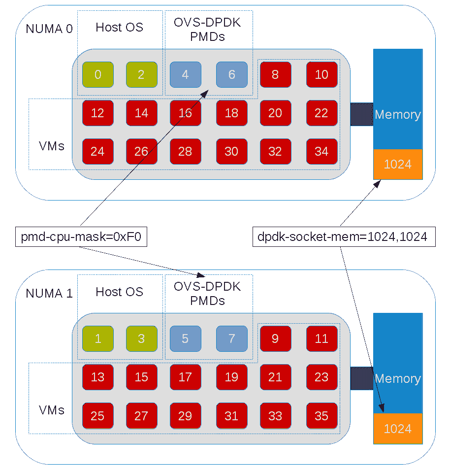

# OVS-DPDK 参数:处理多 NUMA

> 原文：<https://developers.redhat.com/blog/2017/06/28/ovs-dpdk-parameters-dealing-with-multi-numa>

在网络功能虚拟化中，需要跨多个 NUMA 节点扩展功能(VNFs)和基础架构(NFVi ),以便最大限度地提高资源利用率。

在这篇博客中，我们将展示如何使用 DPDK 数据路径(OVS-DPDK)参数为多个 NUMA 系统配置 Open vSwitch，基于 OVS 2.6/2.7，使用 DPDK 16.11 LTS。

OVS-DPDK 参数通过 OVSDB 设置，并提供默认值。使用默认值是以最小的努力运行基本设置的一个很好的方法，但是通常需要进行调整，并且需要利用多个 NUMA 系统。

通过 DPDK 接口访问的物理网卡或虚拟机有一个与之关联的 NUMA 节点。重要的是，它们的 NUMA 节点是已知的，并且在虚拟机的情况下设置正确，以便可以设置相应的 OVS-DPDK 参数。

对于物理网卡，可以通过 PCI 地址找到它们的 NUMA 节点:

```
# lspci -vmms 01:00.0 | grep NUMANode
NUMANode:	0
```

对于虚拟机，可以使用 libvirt 设置它们的 NUMA 节点，

```
<cputune>
    <vcpupin vcpu='0' cpuset='2'/>
    <vcpupin vcpu='1' cpuset='4'/>
    <vcpupin vcpu='2' cpuset='6'/>
    <emulatorpin cpuset='8'/>
  </cputune>
```

并用 numactl 标识:

```
# numactl -H
available: 2 nodes (0-1)
node 0 cpus: 0 2 4 6 8 10 12 14
node 1 cpus: 1 3 5 7 9 11 13 15
```

## dpdk-初始化

为了将 dpdk 接口与 OVS-DPDK 一起使用，需要 dpdk-init。在 OVS-DPDK 的旧版本中，不管用户是否需要 DPDK 接口，DPDK 总是被初始化。现在，用户可以通过设置 dpdk-init=true 来选择初始化 DPDK。这需要在设置任何 DPDK 接口(OVS 2.7)或启动 OVS-DPDK(OVS 2.6)之前进行设置。默认情况下，dpdk-init 将被解释为 false。

要初始化 DPDK

```
# ovs-vsctl --no-wait set Open_vSwitch . other_config:dpdk-init=true
```

### PMD-CPU-掩码

pmd-cpu-mask 是一个内核位掩码，用于设置 OVS-DPDK 使用哪些内核进行数据路径数据包处理。

如果设置了 pmd-cpu-mask，OVS-DPDK 将轮询 DPDK 接口，其核心与该接口位于同一 NUMA 节点上。如果特定 NUMA 节点的 pmd-cpu-mask 中没有核心，则该 NUMA 节点上的物理网卡或虚拟机将无法使用。

OVS-DPDK 性能通常随着内核数量的增加而提高，因此用户通常会设置 pmd-cpu-mask，但如果未设置，默认情况下，每个 NUMA 节点上最低的内核将用于数据路径数据包处理。

pmd-cpu-mask 直接在 OVS-DPDK 中使用，它可以在任何时候设置，甚至在流量已经在流动的时候。

作为双 NUMA 系统的例子，

```
# numactl -H
available: 2 nodes (0-1)
node 0 cpus: 0 2 4 6 8 10 12 14
node 1 cpus: 1 3 5 7 9 11 13 15
```

要在 NUMA 0 上添加核心 4 和 6，在 NUMA 1 上添加核心 5 和 7，用于数据路径数据包处理:

```
# ovs-vsctl set Open_vSwitch . other_config:pmd-cpu-mask=0xF0
```

## dpdk-插座-记忆

dpdk-socket-mem 设置如何在 NUMA 节点之间分配页面内存。将大页面内存分配给所有与 DPDK 接口相关联的 NUMA 节点非常重要。如果没有在与物理网卡或虚拟机关联的 NUMA 节点上分配内存，则无法使用它们。

不幸的是，DPDK 初始化传统上是不宽容的，试图将大页面内存分配给不存在的 NUMA 节点会导致 OVS-DPDK 退出。这个问题现在已经在 DPDK 中解决了，所以一旦 OVS-DPDK 更新为使用较新的 DPDK 版本，这个问题就会消失。目前，用户不应该尝试为系统中不存在的 NUMA 节点分配内存。

如果未设置 dpdk-socket-mem，将使用默认值 dpdk-socket-mem=1024，0，从而仅将大页面内存分配给 NUMA 0。如果用户想要设置 dpdk-socket-mem，应该在 dpdk-init 设置为 true (OVS 2.7)或 OVS-DPDK 启动(OVS 2.6)之前设置。

以双 NUMA 系统为例，其中 NUMA 0 和 NUMA 1 各分配了 1024 MB。

```
# ovs-vsctl --no-wait set Open_vSwitch . other_config:dpdk-socket-mem=1024,1024
```

注意，可以为 NUMA 节点设置 0 MB(无值也等同于 0 MB)，这不会用于 OVS-DPDK。


*一个 OVS-DPDK 配置为双 NUMA 系统的例子。*

## dpdk-lcore-掩码

dpdk-lcore-mask 是在 dpdk 初始化期间使用的核心位掩码，它是非数据路径 OVS-DPDK 线程(如处理程序和重新验证程序线程)运行的地方。由于这些都是非数据路径操作，dpdk-lcore-mask 对多 NUMA 系统没有任何显著的性能影响。当没有设置 dpdk-lcore-mask 时，有一个很好的默认选项，其中 OVS-DPDK CPU uset 将用于处理程序和重新验证器线程。这意味着 Linux 调度程序可以跨多个内核对它们进行调度。

对于 DPDK 初始化，要求与 dpdk-lcore-mask 中最低有效位相关联的 NUMA 节点(或默认情况下的 OVS-DPDK CPU uset)具有为其分配的大页面存储器。这可以通过 dpdk-socket-mem 参数来实现。如果用户想要设置 dpdk-lcore-mask，应该在 dpdk-init 设置为 true (OVS 2.7)或 OVS-DPDK 启动(OVS 2.6)之前设置。

作为为 dpdk 初始化设置 dpdk-lcore-mask 的示例，处理程序和重新验证程序线程在核心 2 上运行。

```
# ovs-vsctl --no-wait set Open_vSwitch . other_config:dpdk-lcore-mask=0x4
```

请务必记住，pmd-cpu-mask 和 dpdk-lcore-mask 是完全独立的。事实上，最好没有重叠，以便处理程序或重新验证器线程不会中断 OVS-DPDK 数据路径数据包处理。

## 最后的想法

我们已经看到，OVS-DPDK 参数使用户能够跨多个 NUMA 节点进行扩展，支持 NFV 系统资源的更多使用。

* * *

**Download [Red Hat Enterprise Linux Developer Suite](https://developers.redhat.com/products/developertoolset/download/?intcmp=7016000000124eAAAQ) for development use.***Last updated: June 23, 2017*