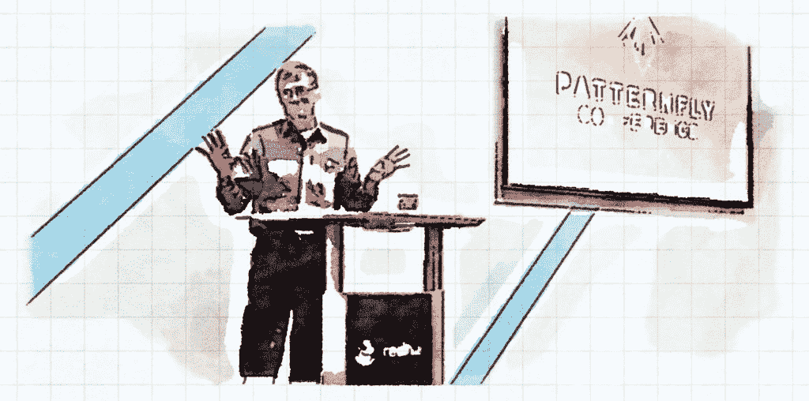

# 软件开发和设计过程中的技术进化:PatternFly 会议的启示

> 原文：<https://developers.redhat.com/blog/2017/06/26/the-evolution-of-technology-in-the-context-of-software-development-design-process-take-away-from-patternfly-conference>

上周日，我回到了印度的家，之前我在北卡罗来纳州罗利参加了一系列的合作会议，与 Red Hat 和开源社区的许多设计师和开发人员一起参加了 UX 峰会和 PatternFly 会议。整个经历鼓舞人心，信息丰富，同时也发人深省，其中最让我感兴趣的是，大会发言人所有鼓舞人心的讲话都含蓄地暗示了一条线索。我们解决现有技术解决方案的尝试如何影响现有工作流程，从而要求我们重新思考我们使用的流程块。

作为[红帽 UX 设计团队](https://twitter.com/redhatuxd)的一员，它一直在探索并赋予“设计”以“开放”的核心原则以价值——这类似于如何将“开放”视为“发展”的整体价值。

> “我们以开发产品的同样方式对待用户体验设计。一切都是为了开放。” *-*-**吉姆·怀特赫斯特，首席执行官&总裁，红帽**

那么，开放的设计有什么特别之处呢？这与我们在传统企业组织中的设计方式有所不同吗？当我们面对设计挑战的开放范例时，有这样的问题是很自然的——我也有类似的问题。这里要注意的一点是，为开源设计有其自身的挑战，需要重新审视现有的设计过程和框架，特别是在过去二十年中不断发展的软件开发场景中。重点是将以用户为中心的焦点引入到现有的软件开发生命周期(SDLC)中——这些主要是关于在我们已经习惯于看到 SDLC 的视角中提倡人的因素。

但是，随着每天主要企业都在开源，以便与社区进行越来越多的合作来开发软件，开源运动本身正在通过在技术增长和不断变化的市场需求的背景下通过不同的调料逐渐演变而变得成熟，这些市场需求正在推动 SDLCs 的形成。例如，随着过去几年创业公司的兴起，MVP 驱动的精益开发模型而不是传统的 SDLCs 的采用增加了，这表明了采用这种过程的不断发展的动力。

在传统企业中，设计流程或多或少会受到过去几十年发展起来的标准 UX 方法的影响。根据用户体验相关基准，考虑为实现组织最终目标而定义的 SDLC。许多人从设计思维和其他类似的 HCI 过程模型中采用不同的组件/工具和方法，并将它们整合到 SDLC 中，无论是敏捷、瀑布还是混合，并试图从工程的角度实现以用户为中心的软件开发(UCSD)。

有些组织会考虑用户需求相关的基准，并使现有的 SDLC 组件与之保持一致——无论是通过以用户为中心的设计(UCD)方法与迭代、敏捷或精益 SDLC 模型的一部分相结合，还是简单地遵循现成的精益 UX 模型。虽然每个人都试图解决 UX 方程，以提出在宣传用户需求方面最有效的最佳框架，但问题仍然没有解决——在多元化的合作开源文化中，什么样的 UX 方法最有效？

在本月 8 日举行的第一次 PatternFly 会议上，Red Hat 开源事务副总裁 Michael Tiemann 在他的主题演讲中提到了软件开发领域在设计环境中的持续发展。他所表达的观点，与可持续设计解决方案可以从有机设计过程发展而来的信念产生了共鸣，其中可重用性可以发挥重要作用。

*(Red Hat 开源事务副总裁 Michael Tiemann，于 2017 年 6 月 8 日在罗利 Red Hat Annex 举办的首届 PatternFly 大会上发表主题演讲)*

红帽支持的 [PatternFly](http://www.patternfly.org/) 社区项目就是在这样一个促进“设计通用性和改善用户体验”的方向上的尝试。达纳的博客文章， [*是 PatternFly 的未来“Web 组件”？*](https://developers.redhat.com/blog/2016/08/09/are-web-components-in-the-future-for-patternfly-2/) 从技术角度来看是一篇有趣的文章，他在文章中阐述了当有如此多的选择和对不同选择的强烈感受时，如何构建一个 UI 框架？虽然每个组织仍在努力寻找与 UI 开发相关的挑战的解决方案，以获得更好的体验，例如-如何在不断增长的复杂 UI 框架世界中构建和组织 CSS 代码以实现可重用性，如 Bootstrap、Angular & React 等。同样重要的是不要忘记，随着 UI 框架的每一次采用，对我们如何在产品中实现体验的影响也在不断发展，从而对运行 SDLC 的设计和开发测试阶段的流程块产生影响。

这让我们想到一个假设，随着新技术采用的发展，我们正在将变革催化剂带入我们的开发过程，这可以影响我们如何概念化和交付我们正在构建的任何产品的最佳体验。与此同时，由于“更快的上市时间”等需求以及为业务需求带来更可持续的解决方案，SDLCs 现在正在进行重组，因此相关的“设计”、“开发”和“测试”阶段也是如此。通过对持续集成(CI)和持续交付(CD)的关注，这些也越来越成熟；从而给传统的软件计划、设计、开发和测试方式带来了翻天覆地的变化。当我们添加“开放”方面到这个模型中时，它要求需要改进过程的动态性，以确保端到端的软件交付在未来是可持续的。Red Hat 最近宣布的 open initiative*open shift . io*是试图解决所有这些方面的尝试，至少这是一个“开始”,我们开始公开地重新思考我们认为已经拥有的解决方案。

Openshift.io 作为一个端到端的开发平台，试图解决多个领域或过程块，如规划、分析和创建，试图回答一个问题——在多元化的工作文化中，以最有效、无缝和一致的方式交付软件产品的最佳方式是什么，并尽可能提供价值和最佳体验。有趣的是，在开源社区的支持和协作下，这个平台将如何发展，以应对这些与流程相关的变革催化剂，由于技术变革日益复杂，这些催化剂正在进入工作实践。

在接下来的文章中，我将探索这种背景下现有的 UX 模型和方法，试图反映“开放[源]中的 UX”的思想。敬请关注。

* * *

**利用您的红帽开发者会员资格和** [**免费下载 RHEL**](http://developers.redhat.com/products/rhel/download/) **。**

*Last updated: June 19, 2018*