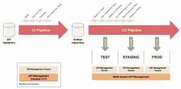

# 从 CI/CD 管道部署 API 的 5 个原则

> 原文：<https://developers.redhat.com/blog/2019/07/26/5-principles-for-deploying-your-api-from-a-ci-cd-pipeline>

随着公司通过他们的 API 获得越来越多的收入，这些 API 也变得更加重要。质量和可靠性是寻求大规模使用其 API 的公司所寻求的关键目标，这些目标通常通过精心制作的 DevOps 过程来支持。来自科技巨头的数字让我们眼花缭乱:[亚马逊每 11.7 秒就将代码部署到生产中，网飞每天部署数千次，富达通过他们的新发布框架每年节省 230 万美元](https://techbeacon.com/devops/10-companies-killing-it-devops)。因此，如果您有 API，您可能希望从 CI/CD 管道部署您的 API。

从 CI/CD 管道部署您的 API 是“完整 API 生命周期管理”的[关键活动位于“实现”和“安全”阶段之间的“部署”活动包含了将 API 从源代码引入生产环境所需的每个过程。更具体地说，它涵盖了持续集成和持续交付。](https://developers.redhat.com/blog/2019/02/25/full-api-lifecycle-management-a-primer/)

## API 不仅仅是“另一个软件”

在 Red Hat，我们坚信 API 不仅仅是“另一个软件”相反，我们认为 API 是一个软件组件，它结合了:

*   一个与它交流的接口。
*   一个与这个软件交流的消费者生态系统。
*   与使用该 API 的开发人员的关系。

API 的构建、部署和管理不仅仅是用通常的方法；因此，从 CI/CD 管道部署 API 需要额外的过程、工具和技能。

在本文中，我们将重点关注从 CI/CD 管道部署 API 的总体原则和关键步骤。

## 从 CI/CD 管道部署 API 的首要原则

### 1.使用契约优先的方法

尽管代码优先的方法不会阻止您从 CI/CD 管道部署 API，但是使用契约优先的方法会使您的过程更加可靠和简化。

在契约优先的方法中，API 契约(对于 REST APIs，该契约被命名为“OpenAPI 规范”)在实现阶段之前就已经制定好了。它是产品所有者、架构师、开发人员和早期客户之间的协作。Apicurio Studio 可以帮助您轻松协作地制定 OpenAPI 规范。

### 2.确保 API 的可测试性

为了以自动化的方式从 CI/CD 管道部署 API，需要进行测试。有不同种类的测试，需要一本完整的书来涵盖所有的测试。要从 CI/CD 管道部署 API，您至少需要:

*   单元测试:单独测试每个最小的软件组件。
*   集成测试:一起测试更大块的软件组件。
*   验收测试:确保满足业务期望(作为[验收测试驱动开发方法](https://en.wikipedia.org/wiki/Acceptance_test%E2%80%93driven_development)的一部分)
*   端到端测试:确保链中的每个软件组件在类似生产的环境中按预期工作。
*   性能测试:确保性能不会因修复或新特性而降低。

单元和集成测试是开发人员熟知的。下面重点说说后面几个的用法。

*   验收测试可以通过专门的工具来管理，比如 [Microcks、](https://microcks.github.io/)并由您的 CI/CD 管道来触发。
*   性能测试也可以自动化，如本博客系列文章所述:[利用 Kubernetes 和 OpenShift 进行自动化性能测试](https://developers.redhat.com/blog/2018/11/22/automated-performance-testing-kubernetes-openshift/)。

### 3.坚持语义版本化

当发布 API 的新版本时，坚持[语义版本](https://semver.org/)是至关重要的。它帮助您的 CI/CD 管道知道如何处理新版本:新的次要版本是向后兼容的，它们可以“就地”部署。为了让现有客户满意，主要版本需要“并行”部署。

### 4.幂等

当大规模管理软件时，所有的科技巨头都会告诉你:事情发生了。服务器故障、路由器丢包、硬盘丢失数据等。对这类事件有弹性的一个方法是成为[等幂](https://en.wikipedia.org/wiki/Idempotence)。不要在您的 API 管理解决方案中创建一个新的服务，而是声明这个服务必须存在。与其删除它，不如声明它必须不存在。这样，您的管道在断电或瞬时扰动的情况下将是可靠的。

[新 3scale CLI 的大多数操作都被设计成等幂](https://github.com/3scale/3scale_toolbox)。

### 5.应用 API 管理即代码原则

类似于“基础设施即代码”原则，“API 管理即代码”原则认为 API 管理解决方案的状态完全由 Git 存储库的内容决定。服务由它们的 OpenAPI 规范文件定义，在 Git 存储库中提交；应用程序计划在 artefact 文件中定义，也在您的 Git 存储库中；环境设置、API 文档等等。

## 从 CI/CD 管道部署 API 的步骤

### 1.准备发布

由于您应用了 API-managing-as-Code 原则，所以您的所有工件都被版本化并存储在 Git 存储库中。要从 CI/CD 管道部署您的 API，从**签出存储库开始。**

在您的 Git 存储库中是 API 契约。**阅读 OpenAPI 规范文件**并提取管道的相关信息:

*   字段“info.version”对于应用语义版本化很有用。
*   “info”对象中的供应商扩展字段(“x-*”字段)可用于保存元数据(负责的业务单位、目标渠道、状态等)。).

从 OpenAPI 规范中，**生成一个模拟**,它将向您的早期采用者公开。稍后，它将被您的所有 API 消费者用来开发他们的客户端实现。像 [Microcks](https://microcks.github.io/) 这样的工具可以从你的 OpenAPI 规范文件中生成一个 mock。

从这些数据中，您可以**计算 API 版本和状态**。

根据语义版本化，API 被 **版本化** 版本化:次要版本和补丁版本被连续发布以替代先前版本。现有消费者总是使用最新版本。主要版本并排发布，之前的 API 开始了弃用倒计时。

API **状态**可以从供应商扩展字段或自由形式的元数据中计算。它会经历这些连续的状态:

*   **Created**:API 处于工作状态，出现在开发者门户上，但只对早期采用者开放。
*   **发布**:API 是 GA，任何人都可以订阅。订阅通过选定的工作流程(批准或不批准)。
*   **已弃用**:API 被标记为已弃用。这反映在开发者门户中。没有新的第三方可以订阅此 API。启用 API 网关策略来传达退役日期(例如，通过报头或延迟)。
*   **退役**:从管理门户和开发者门户中移除 API。

### 2.部署 API

基于所有这些信息，您现在可以**在您的 API 管理解决方案**中发布 API。这将声明一个新的服务或更新现有的服务，并应用正确的配置。

如果您的 API 需要定制 API 网关策略，您将不得不**构建您的 API 网关的容器映像，包含定制策略**。策略代码也存储在您的 Git 存储库中。一旦构建完成，您就可以**触发 API 网关容器的新部署**。

### 3.测试您的 API

现在，您可以通过**运行验收测试**(来自[验收测试驱动开发方法](https://en.wikipedia.org/wiki/Acceptance_test%E2%80%93driven_development))来确保业务期望得到满足。像 [Microcks](https://microcks.github.io/) 这样的工具可以帮助你存储、管理和运行你的 API 测试。将所有 API 测试套件存储在一个地方非常方便:对于每个次要版本，您可以运行所有以前版本的测试套件。从而确保新版本实际上向后兼容以前的版本。

为了从 CI/CD 管道部署您的 API，您还必须从存储在 Git 存储库中的 artefact 文件中发布应用程序计划。那些分阶段的计划是你为 API 消费者提供的服务。他们持有每种方法的配额，货币化的定价规则，以及功能列表。应用程序计划被描述为 YAML 文件。它们可以由产品所有者手工制作或从 GUI 制作，并提交到您的 Git 存储库中。

一旦发布了应用程序计划，您将不得不**创建一个新的客户端应用程序**，用于端到端测试。这个客户端应用程序将保存一些凭证，您可以使用这些凭证来查询部署的 API。这些端到端测试确保了整个链(防火墙、反向代理、API 网关、管理门户、API 后端、负载平衡器等)。)都在工作。为了有意义，端到端测试必须测试新添加的 API 方法。

### 4.发布你的 API

您的新 API 版本已经部署！您现在可以**在您的开发者门户上发布 API 文档**。您必须注意更新 OpenAPI 规范文件以匹配目标环境。对于 OpenAPI 规范 2.0，这意味着更新*主机*、*基本路径*、*方案*，以及*安全定义*对象，以在目标环境中用它们的有效对应物替换*授权 Url* 和*令牌 Url* 。

从 CI/CD 管道部署 API 的最后一步是**通知您现有的 API 消费者**已经部署了一个新的次要版本。如果这是您的流程的一部分，您也可以向他们发送一份公开发行说明。

## 反转

如果在 CI/CD 管道中出现问题，您可能会对回滚到目前为止所做的任何修改感兴趣。如果您遵循我们的幂等性和 API-Management-as-Code 原则，这从来没有这么容易过:您可以**只触发先前次要版本的新管道运行**，系统的先前状态将被恢复。

## 环境

如果您的公司有多个环境(我们的大多数客户都有)，那么必须在每个环境中重复这些步骤。

尽管有一些微妙之处:

*   第一步(发布准备)一劳永逸。
*   API 网关容器映像也只构建一次，然后完全相同地部署在每个环境中。
*   验收测试在功能环境中运行，而端到端测试在类似生产的环境中运行(以及性能测试)。
*   API 消费者只在生产和类似生产的环境中得到通知。

您需要多少环境完全取决于您的内部流程。有些公司有三个环境就可以了，有些公司需要九个环境。

您可以利用 API 管理解决方案的多租户功能在一次安装中处理多个环境。但是，在应用更新之前，需要一个独立的沙箱(通常在开发环境中)来测试 API 管理解决方案的 N+1 版本。

## 结论

如您所见，从 CI/CD 管道部署 API 需要做大量的工作！选择一个带有 helper CLI 的解决方案来处理大部分这些操作是一个好主意。这样，您就可以关注最重要的事情:实现业务特性的代码。

了解 Red Hat Integration 的 API 管理功能如何帮助您从 CI/CD 管道部署 API:

*   [3 规模工具箱:从 CLI 部署 API](https://developers.redhat.com/blog/?p=611307)
*   [从 Jenkins 管道部署您的 API](https://developers.redhat.com/blog/?p=612387)
*   [使用 3scale 工具箱詹金斯共享库](https://developers.redhat.com/blog/?p=612407)

*Last updated: August 6, 2019*