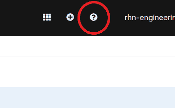
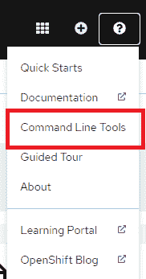
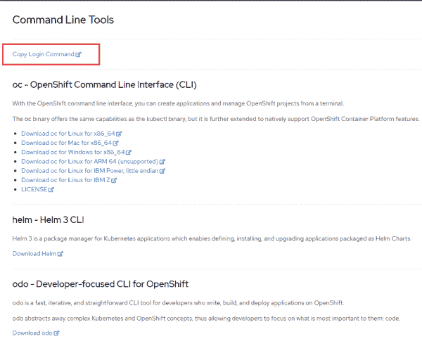

# 从命令行访问 Red Hat OpenShift 的开发人员沙箱

> 原文：<https://developers.redhat.com/blog/2021/04/21/access-your-developer-sandbox-for-red-hat-openshift-from-the-command-line>

现在，您已经在我们的[Red Hat OpenShift 开发者沙箱](https://developers.redhat.com/developer-sandbox)中拥有了自己的 Red Hat open shift 实例...

什么？你在免费沙盒里没有自己的位置？在那里你可以试验[容器](/topics/containers/)和 [Kubernetes](/topics/kubernetes/) 和 [Red Hat OpenShift](/products/openshift/overview) ？然后[赶紧到网站](/developer-sandbox)报名；我会等的。

好了，现在您已经在我们的 Red Hat OpenShift 开发人员沙盒中拥有了自己的 OpenShift 实例，您可以登录到仪表板并点击、浏览、启动应用程序—所有这些都很酷。但是如果你想从命令行运行呢？命令行是自动化(它是脚本，但是“自动化”听起来很酷)发生的地方。毕竟，构建可重复动作的结构是我们开发人员的工作。

你怎么进入？这篇短文将向你展示。让我们开始吧。

## 第一站:OpenShift 仪表盘

第一步是登录您的 OpenShift 仪表盘。在那里，点击右上角的小问号(见图 1)。出现的菜单是解锁命令行的关键。它还包含大量信息世界的链接；好好利用。

Figure 1: The OpenShift dashboard help icon.

在我们的例子中，我们想要点击**命令行工具**选项，如图 2 所示。

Figure 2: The OpenShift Help options menu.

您的仪表板的**命令行工具**部分装载了很棒的工具，您会想要安装其中的一些工具(在我看来，`oc`和`odo`是必备的)。但是现在我们将关注标有**复制登录命令**的第一个链接(参见图 3)。

Figure 3: The OpenShift command-line tools page.

此链接会在您的浏览器中打开一个新标签。当提示登录时，只需点击 **DevSandbox** 选项。你将登陆一个看起来相当不完整的网页。不是未完成；它只是尽可能保持简单。你有一个选项，**显示令牌**，所以点击它。

## 表示感谢

在您点击了**显示令牌**之后，您的登录令牌以及登录所需的命令将会出现(参见图 4)。

**注意:**你需要在你的机器上安装`oc`命令行工具。还记得我在**命令行工具**页面提到的所有好东西吗？

Figure 4: The API token and login command page.

将令牌复制到剪贴板，并粘贴到命令行。现在，您可以从命令行访问您的沙箱了(参见图 5)。

Figure 5: Logging in from the command line.

## 关闭并运行

想知道手头有什么吗？运行`oc new-app --list`命令，看看有哪些选项可用。为了满足您的需求，您可以安装:

*   MariaDB 的实例
*   。NET 示例代码
*   MySQL 的一个实例
*   Node.js 示例
*   Nginx

还有几十个。

有趣的事实:您也可以对您的集群使用`kubectl`命令行工具。

请自便。

*Last updated: April 20, 2021*