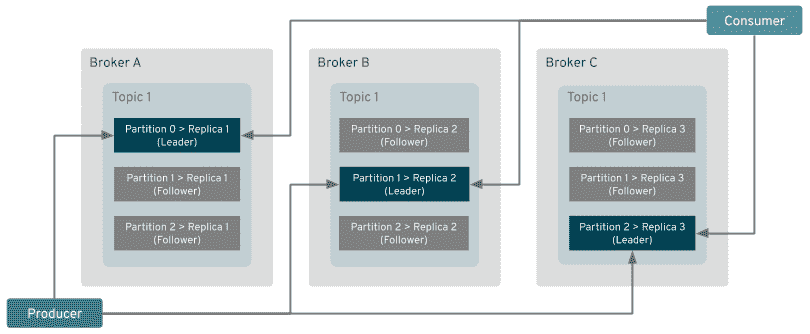
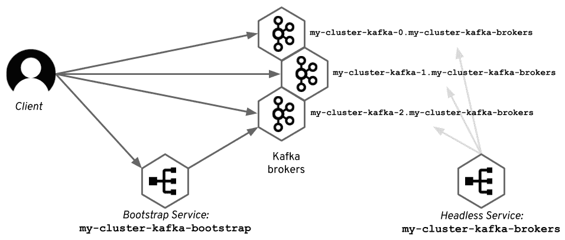

# 在 Strimzi 中访问 Apache Kafka:第 1 部分-简介

> 原文：<https://developers.redhat.com/blog/2019/06/06/accessing-apache-kafka-in-strimzi-part-1-introduction>

[Strimzi](https://strimzi.io/) 是一个开源项目，为在 [Kubernetes](https://developers.redhat.com/topics/kubernetes/) 和 [Red Hat OpenShift](https://developers.redhat.com/openshift/) 上运行 [Apache Kafka](https://developers.redhat.com/videos/youtube/CZhOJ_ysIiI/) 提供容器映像和操作符。可伸缩性是 Apache Kafka 的旗舰特性之一。这是通过对数据进行分区并将它们分布在多个代理上实现的。这种数据分割对 Kafka 客户与经纪人的联系方式也有很大影响。当 Kafka 在 Kubernetes 这样的平台内运行，但从该平台之外访问时，这一点尤其明显。

本系列文章将解释 Kafka 和它的客户是如何工作的，以及 Strimzi 如何让运行在 Kubernetes 之外的客户能够访问它。

**注:**strim zi 和 [Apache Kafka](http://kafka.apache.org/) 项目的产品化和支持版本作为[红帽 AMQ](https://www.redhat.com/en/technologies/jboss-middleware/amq) 产品的一部分提供。

当然，仅仅将数据分割成分区是不够的。入口和出口数据流量也需要正确处理。写入或读取给定分区的客户端必须直接连接到托管该分区的主代理。由于客户端直接连接到各个代理，代理不需要在客户端和其他代理之间转发任何数据。这有助于显著减少代理必须完成的工作量以及集群内流动的流量。

不同代理之间的唯一数据流量是由于复制，此时从代理从主代理获取给定分区的数据。这使得数据碎片相互独立，也使得 Kafka 的伸缩性如此之好。

客户端如何知道在哪里连接？

## 卡夫卡的发现协议

卡夫卡有自己的发现协议。当 Kafka 客户端连接到 Kafka 集群时，它首先连接到作为集群成员的任何代理，并向其请求一个或多个主题的*元数据*。*元数据*包含关于主题、其分区以及托管这些分区的代理的信息。所有代理都应该有整个集群的数据，因为它们都是通过 Zookeeper 同步的。因此，客户机首先连接到哪个代理并不重要——所有代理都会给它相同的响应。

一旦客户端获得了*元数据*，它将使用该数据来计算当它想要写入或读取给定分区时应该连接到哪里。在*元数据*中使用的代理地址将由代理自己根据运行代理的机器的主机名创建，或者可以由用户使用`advertised.listeners`选项进行配置。

客户端将使用来自*元数据*的地址来打开一个或多个到代理地址的新连接，这些代理托管它感兴趣的特定分区。即使当*元数据*指向客户端已经连接并从其接收*元数据*的同一个代理时，它仍然会打开第二个连接。并且，这些连接将被用于产生或消费数据。

注意，为了本文的目的，对 Kafka 协议的描述是有意简化的。

## 这对 Kubernetes 上的卡夫卡意味着什么？

那么，这一切对于在 Kubernetes 上运行卡夫卡意味着什么呢？如果您熟悉 Kubernetes，您可能知道公开一些应用程序的最常见方式是使用 Kubernetes `Service`。Kubernetes 服务作为第 4 层负载平衡器工作。它们提供一个稳定的 DNS 地址，客户端可以在此连接，并且它们将连接转发到支持该服务的一个 pod。

这种方法对于大多数无状态应用程序来说相当有效，这些应用程序只是想随机连接到服务背后的一个后端。但是，如果您的应用程序由于与特定 pod 相关联的某些状态而需要某种粘性，情况就变得更加棘手了。这可能是会话粘性，例如，由于 pod 已经具有的一些会话信息，客户端需要连接到与上次相同的 pod。也可能是数据粘性，客户端需要连接到特定的 pod，因为它包含一些特定的数据。

卡夫卡也是如此。Kubernetes 服务只能用于初始连接——它将把客户端带到集群中的一个代理处，在那里它可以获取元数据。然而，后续的连接不能通过该服务完成，因为它会将连接*随机*路由到集群中的一个代理，而不是将它引导到一个特定的代理。

Strimzi 是如何处理这个问题的？有两种解决这个问题的通用方法:

*   编写您自己的代理/负载平衡器，这将在应用层(第 7 层)进行更智能的路由。例如，这种代理可以从客户端抽象出 Kafka 集群的架构，并假装该集群只有一个大型代理在运行一切，只是将流量路由到后台的不同代理。Kubernetes 已经使用入口资源为 HTTP 流量完成了这项工作。
*   确保您在代理配置中使用的`advertised.listeners`选项允许客户端直接连接到代理。

在 Strimzi 中，我们目前支持第二个选项。

### 从同一个 Kubernetes 集群内部连接

对于运行在与 Kafka 集群相同的 Kubernetes 集群中的客户机来说，这样做非常简单。每个 pod 都有自己的 IP 地址，其他应用程序可以使用该地址直接连接到它。这通常不被常规的 Kubernetes 应用程序使用。其中一个原因是 Kubernetes 没有提供发现这些 IP 地址的好方法。要找出 IP 地址，您需要使用 Kubernetes API，然后找到正确的 pod 及其 IP 地址。您需要有适当的权限才能这样做。相反，Kubernetes 使用具有稳定 DNS 名称的服务作为主要发现机制。

对于 Kafka，这不是问题，因为它有自己的发现协议。我们不需要客户从 Kubernetes API 中找出 API 地址。我们只需要配置它和广告地址，然后客户端将通过 Kafka *元数据*发现它。

Strimzi 使用了一个更好的选项。对于 stateful sets(strim zi 使用它来运行 Kafka 代理)，您可以使用 Kubernetes headless 服务为每个 pod 提供一个稳定的 DNS 名称。Strimzi 使用这些 DNS 名称作为 Kafka 代理的广告地址。所以，对于 Strimzi 来说:

*   初始连接是使用常规的 Kubernetes 服务来获取*元数据*完成的。
*   随后的连接使用由另一个无头 Kubernetes 服务提供给 pod 的 DNS 名称打开。下图显示了名为`my-cluster`的 Kafka 集群示例。

这两种方法各有利弊。使用 DNS 有时会导致缓存的 DNS 信息出现问题。当 pod 的底层 IP 地址改变时(例如，在滚动更新期间)，连接到代理的客户端需要具有最新的 DNS 信息。然而，我们发现使用 IP 地址会导致更糟糕的问题，因为有时 Kubernetes 会非常积极地重复使用它们，一个新的 pod 会获得一个几秒钟前被其他 Kafka 节点使用的 IP 地址。

### 从外部连接

尽管在同一个 Kubernetes 集群中运行的客户机的访问相对简单，但从外部访问会变得有点困难。有一些工具可以将 Kubernetes 网络与 Kubernetes 外部的常规网络连接起来，但大多数 Kubernetes 集群都运行在自己的网络上，与外部世界相隔离。这意味着像 pod IP 地址或 DNS 名称这样的东西对于在群集外运行的任何客户端都是不可解析的。因此，很明显，我们需要使用单独的 Kafka 监听器从集群内部和外部进行访问，因为公布的地址需要不同。

Kubernetes 和 Red Hat OpenShift 有许多不同的方式来公开应用程序，例如节点端口、负载平衡器或路由。Strimzi 支持所有这些，让用户找到最适合他们用例的方法。我们将在本系列的后续文章中更详细地研究它们。

### 阅读更多

*   [在 Strimzi 中访问阿帕奇卡夫卡:第 1 部分-简介](https://developers.redhat.com/blog/?p=601077)
*   [访问 Strimzi 中的 Apache Kafka:第 2 部分-节点端口](https://developers.redhat.com/blog/?p=601137)
*   [在 Strimzi 中访问阿帕奇卡夫卡:第 3 部分-红帽 OpenShift 路线](https://developers.redhat.com/blog/?p=601277)
*   [在 Strimzi 中访问 Apache Kafka:第 4 部分-负载平衡器](https://developers.redhat.com/blog/?p=601357)
*   [在《斯特里姆齐:第五部分——入口》中访问阿帕奇卡夫卡](https://developers.redhat.com/blog/?p=601457)

*Last updated: March 18, 2020*