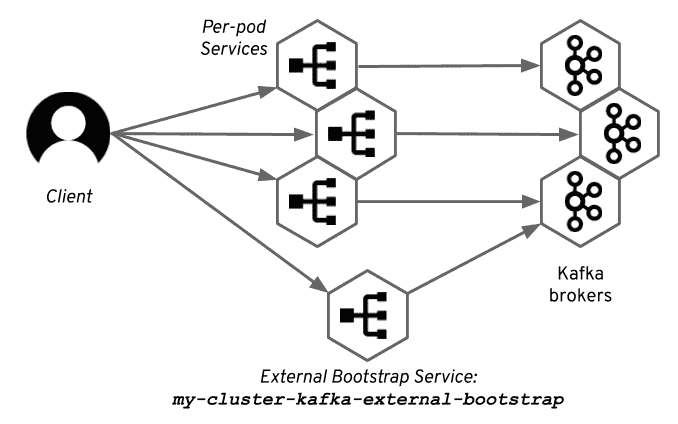
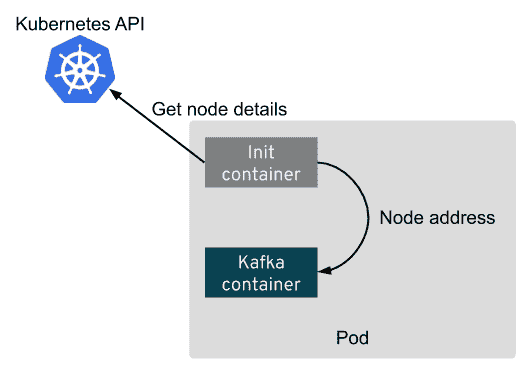
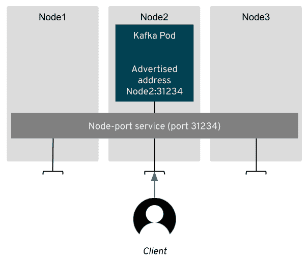
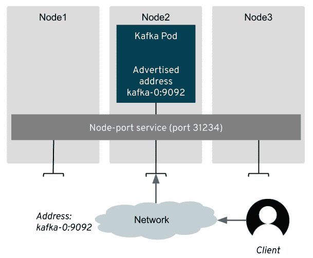
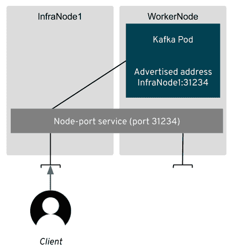

# 在 Strimzi 中访问 Apache Kafka:第 2 部分——节点端口

> 原文：<https://developers.redhat.com/blog/2019/06/07/accessing-apache-kafka-in-strimzi-part-2-node-ports>

本系列文章解释了 [Apache Kafka](https://developers.redhat.com/videos/youtube/CZhOJ_ysIiI/) 及其客户端如何工作，以及 [Strimzi](https://strimzi.io/) 如何让在 [Kubernetes](https://developers.redhat.com/topics/kubernetes/) 之外运行的客户端可以访问它。在第一篇文章中，我们提供了主题的[介绍，在这里我们将使用节点端口展示一个由 Strimzi 管理的 Apache Kafka 集群。](https://developers.redhat.com/blog/?p=601077)

具体来说，在本文中，我们将研究节点端口是如何工作的，以及它们如何与 Kafka 一起使用。我们还将介绍用户可以使用的不同配置选项，以及使用节点端口的利弊。

**注:**strim zi 和 Apache Kafka 项目的产品化和支持版本作为[红帽 AMQ](https://www.redhat.com/en/technologies/jboss-middleware/amq) 产品的一部分提供。

## 节点端口

A `NodePort`是一种特殊类型的 [Kubernetes 服务](https://kubernetes.io/docs/concepts/services-networking/service/#nodeport)。当创建这样一个服务时，Kubernetes 将在 Kubernetes 集群的所有节点上分配一个端口，并确保到该端口的所有流量都被路由到该服务，并最终被路由到该服务后面的 pods。

流量的路由由 kube-proxy Kubernetes 组件完成。您的 pod 运行在哪个节点上并不重要。所有节点上的节点端口都将打开，流量将始终到达您的 pod。因此，您的客户机需要连接到 Kubernetes 集群的任何节点上的节点端口，并让 Kubernetes 处理其余的工作。

默认情况下，从端口范围 30000-32767 中选择节点端口，但是可以在 Kubernetes 配置中更改该范围(有关配置节点端口范围的更多详细信息，请参见 [Kubernetes 文档](https://kubernetes.io/docs/concepts/services-networking/service/#nodeport))。

我们如何使用 Strimzi 中的`NodePort`服务来曝光阿帕奇卡夫卡？

## 使用节点端口公开 Kafka

作为用户，你可以使用节点端口轻松暴露 Kafka。您需要做的就是在 Kafka 自定义资源中配置它。

```
apiVersion: kafka.strimzi.io/v1beta1
kind: Kafka
metadata:
  name: my-cluster
spec:
  kafka:
    # ...
    listeners:
      # ...
      external:
        type: nodeport
        tls: false
    # ...

```

然而，配置之后发生的事情要稍微复杂一些。

我们需要解决的第一件事是客户将如何访问个人经纪人。正如在上一篇文章中所解释的那样，让一个服务在集群中的所有代理之间循环，对 Kafka 来说是不可行的。客户需要能够直接联系到每个经纪人。

在 Kubernetes 集群中，我们通过使用 pod DNS 名称作为广告地址来解决这个问题。然而，在 Kubernetes 之外不能识别 pod 主机名或 IP 地址，所以我们不能使用它们。Strimzi 如何解决这个问题？

相反，我们不使用 pod 主机名或 IP 地址，而是创建额外的服务——每个 Kafka 代理一个服务。因此，在有 N 个代理的 Kafka 集群中，我们将有 N+1 个节点端口服务:

*   Kafka 客户端可以使用其中一个作为初始连接的引导服务，并接收关于 Kafka 集群的元数据。
*   另外 N 个服务——每个代理一个服务——可以直接寻址代理。

所有这些服务都是用类型`NodePort`创建的。这些服务中的每一个都将被分配不同的节点端口，以便可以区分不同代理的流量。



从 Kubernetes 1.9 开始，有状态集合中的每个 pod 都自动标记为`statefulset.kubernetes.io/pod-name`，其中包含 pod 的名称。在 Kubernetes 服务定义内的 pod 选择器中使用这个标签，允许我们只针对单个 Kafka 代理，而不是整个 Kafka 集群。

下面的 YAML 代码片段展示了 Strimzi 创建的服务如何通过使用选择器中的`statefulset.kubernetes.io/pod-name`标签，只将有状态集中的一个 pod 作为目标:

```
apiVersion: v1
kind: Service
metadata:
  name: my-cluster-kafka-0
  # ...
spec:
  # ...
  selector:
    statefulset.kubernetes.io/pod-name: my-cluster-kafka-0
    strimzi.io/cluster: my-cluster
    strimzi.io/kind: Kafka
    strimzi.io/name: my-cluster-kafka
  type: NodePort
  # ...

```

节点端口服务只是将流量路由到代理的基础设施。我们仍然需要配置 Kafka 代理来通告正确的地址，以便客户端使用这个基础设施。对于节点端口，连接到代理的客户端需要连接到:

*   其中一个 Kubernetes 节点的地址
*   分配给服务的节点端口

Strimzi 需要收集这些信息，并在代理配置中将它们配置为广告地址。Strimzi 使用单独的侦听器进行外部和内部访问。这意味着在 Kubernetes 或 Red Hat OpenShift 集群中运行的任何应用程序仍将使用第一篇文章中描述的旧服务和 DNS 名称。

虽然节点端口服务可以将流量从所有 Kubernetes 节点路由到代理，但是我们只能使用一个地址，这个地址将被通告给客户机。使用运行代理的实际节点的地址意味着更少的转发，但是每次代理重新启动时，节点可能会改变。因此，Strimzi 使用一个 [init 容器](https://kubernetes.io/docs/concepts/workloads/pods/init-containers/)，它在每次 Kafka broker pod 启动时运行。它收集节点的地址，并使用它来配置广告地址。



要获得节点地址，init 容器必须与 Kubernetes API 对话并获得节点资源。在节点资源的状态中，地址通常列为下列之一:

*   外部 DNS
*   外部 IP
*   内部 DNS
*   内部 IP
*   主机名

有时，状态中只列出其中的一部分。init 容器将尝试按照上面列出的顺序获取其中一个，并将使用找到的第一个。

一旦配置了地址，客户端就可以使用引导节点端口服务进行初始连接。从那里，客户机将获得包含各个代理地址的元数据，并开始发送和接收消息。



在 Strimzi 配置了 Kubernetes 和 Kafka 集群中的所有内容之后，您只需要做两件事情:

*   获取外部引导服务的节点端口号(用集群的名称替换`my-cluster`):

```
kubectl get service my-cluster-kafka-external-bootstrap -o=jsonpath='{.spec.ports[0].nodePort}{"\n"}'

```

*   获取 Kubernetes 集群中一个节点的地址(用一个节点的名称替换`node-name`——使用`kubectl get nodes`列出所有节点):

```
kubectl get node node-name -o=jsonpath='{range .status.addresses[*]}{.type}{"\t"}{.address}{"\n"}'

```

节点地址和节点端口号为您提供了连接到集群所需的所有信息。以下示例使用了属于 Apache Kafka 的`kafka-console-producer.sh`实用程序:

```
bin/kafka-console-producer.sh --broker-list : --topic 

```

有关更多详情，请参见 [Strimzi 文档](https://strimzi.io/docs/latest/full.html#proc-accessing-kafka-using-loadbalancers-deployment-configuration-kafka)。

## 节点端口故障排除

节点端口的配置相当复杂。有很多事情可能会出错。

一个常见的问题是，Kubernetes API 在节点资源中提供给 Strimzi 的地址不能从外部访问。例如，这可能是因为所使用的 DNS 名称或 IP 地址仅供内部使用，客户端无法访问。生产级集群以及本地开发工具(如 Minikube 或 Minishift)都可能出现这种问题。在这种情况下，您的客户端可能会出现以下错误:

```
[2019-04-22 21:04:11,976] WARN [Consumer clientId=consumer-1, groupId=console-consumer-42133] Connection to node 1 (/10.0.2.15:31301) could not be established. Broker may not be available. (org.apache.kafka.clients.NetworkClient)

```

或者

```
[2019-04-22 21:11:37,295] WARN [Producer clientId=console-producer] Connection to node -1 (/10.0.2.15:31488) could not be established. Broker may not be available. (org.apache.kafka.clients.NetworkClient)

```

当您看到这些错误之一时，您可以比较以下地址:

*   您希望 Kafka 客户端可以到达的节点的地址(对于 Minikube，这应该是由`minikube ip`命令返回的 IP 地址)。
*   运行 Kafka pods 的节点的地址

```
kubectl get node <node-name> -o=jsonpath='{range .status.addresses[*]}{.type}{"\t"}{.address}{"\n"}'
```

*   卡夫卡经纪人广告上的地址

```
kubectl exec my-cluster-kafka-0 -c kafka -it -- cat /tmp/strimzi.properties | grep advertised

```

如果这些地址不同，可能就是它们导致了问题，但是 Strimzi 可以提供帮助。您可以使用覆盖选项来更改 Kafka pods 公布的地址。您可以在`Kafka`定制资源中配置它们，而不是从节点资源的 Kubernetes API 中读取地址。例如:

```
# ...
listeners:
  external:
    type: nodeport
    tls: false
    overrides:
      brokers:
      - broker: 0
        advertisedHost: XXX.XXX.XXX.XXX
      - broker: 1
        advertisedHost: XXX.XXX.XXX.XXX
      - broker: 2
        advertisedHost: XXX.XXX.XXX.XXX
# ...

```

覆盖可以指定 DNS 名称或 IP 地址。这种解决方案并不理想，因为您需要维护自定义资源中的地址，并且记得在每次升级 Kafka 集群时更新它们。然而，在许多情况下，您可能无法更改 Kubernetes APIs 报告的地址。所以，这种方法至少给了你一个让它工作的方法。

另一件可能使节点端口的使用变得复杂的事情是防火墙的存在。如果您的客户机无法连接，您应该使用简单的工具，如`telnet`或`ping`，检查 Kubernetes 节点和端口是否可达。在公共云中，比如 Amazon AWS，您还需要允许访问安全组中的节点/节点端口。

## TLS 支持

使用节点端口公开 Kafka 时，Strimzi 支持 TLS。由于历史原因，TLS 加密在默认情况下是启用的，但是如果您愿意，也可以禁用它。

```
# ...
listeners:
  external:
    type: nodeport
    tls: false
# ...

```

当使用带有 TLS 的节点端口公开 Kafka 时，Strimzi 目前不支持 TLS 主机名验证。主要原因是，对于节点端口，很难确定将要使用的地址并将它们添加到 TLS 证书中。这主要是因为:

*   每当 pod 或节点重新启动时，运行代理的节点可能会发生变化。
*   集群中的节点有时可能会频繁更改，每次添加或删除节点以及地址更改时，我们都需要刷新 TLS 证书。

## 自定义

Strimzi 的目标是让节点端口开箱即用，但是有几个选项可以用来定制 Kafka 集群及其节点端口服务。

### 预配置的节点端口号

默认情况下，节点端口号由 Kubernetes 控制器生成/分配。这意味着，每当您删除 Kafka 集群并部署新集群时，一组新的节点端口将被分配给 Strimzi 创建的 Kubernetes 服务。因此，在每次重新部署后，您必须使用引导服务的新节点端口重新配置使用节点端口的所有应用程序。

Strimzi 允许您在`Kafka`定制资源中定制节点端口:

```
# ...
listeners:
  external:
    type: nodeport
    tls: true
    authentication:
      type: tls
    overrides:
      bootstrap:
        nodePort: 32100
      brokers:
      - broker: 0
        nodePort: 32000
      - broker: 1
        nodePort: 32001
      - broker: 2
        nodePort: 32002
# ...

```

上面的例子为引导服务请求节点端口`32100`，为每个代理服务请求端口`32000`、`32001`和`32002`。这允许您重新部署集群，而无需更改所有应用程序中的节点端口号。

请注意，Strimzi 不会对请求的端口号进行任何验证，因此您必须确保它们:

*   在 Kubernetes 集群配置中为节点端口分配的范围内，以及
*   未被任何其他服务使用。

您不必配置所有节点端口。您可以决定只配置其中的一部分，例如，只为外部引导服务配置一个。

### 配置通告的主机和端口

Strimzi 还允许您自定义将在 Kafka pods 配置中使用的公布主机名和端口:

```
# ...
listeners:
  external:
    type: nodeport
    authentication:
      type: tls
    overrides:
      brokers:
      - broker: 0
        advertisedHost: example.hostname.0
        advertisedPort: 12340
      - broker: 1
        advertisedHost: example.hostname.1
        advertisedPort: 12341
      - broker: 2
        advertisedHost: example.hostname.2
        advertisedPort: 12342
# ...

```

`advertisedHost`字段可以包含 DNS 名称或 IP 地址。当然，您也可以决定只定制其中的一个。

更改通告端口只会更改 Kafka broker 配置中的通告端口。这对 Kubernetes 分配的节点端口没有影响。要配置 Kubernetes 服务使用的节点端口号，请使用上述的`nodePort`选项。

当 Kubernetes API 提供的节点地址不正确时，我们在上面的故障排除部分使用了覆盖通告的主机。它在其他情况下也很有用，例如当您的网络执行一些网络地址转换时:



另一个例子可能是当您不希望客户端直接连接到运行 Kafka pods 的节点时。您可以只将选定的 Kubernetes 节点暴露给客户端，并使用`advertisedHost`选项来配置 Kafka 代理以使用这些节点。



## 利弊

使用节点端口将 Kafka 集群暴露给外部可以给您带来很大的灵活性。它还可以提供非常好的性能。与其他解决方案(如负载平衡器、路由或入口)相比，没有中间人会成为瓶颈或增加延迟。你的客户关系将以最直接的方式传递给你的 Kafka 经纪人；然而，为此也要付出代价。节点端口是一种非常低级的解决方案。通常，您会在检测广告地址时遇到上述问题。此外，节点端口可能希望您向客户机公开 Kubernetes 节点，这通常被管理员视为安全风险。

### 阅读更多

*   [在 Strimzi 中访问阿帕奇卡夫卡:第 1 部分-简介](https://developers.redhat.com/blog/?p=601077)
*   [访问 Strimzi 中的 Apache Kafka:第 2 部分-节点端口](https://developers.redhat.com/blog/?p=601137)
*   [在 Strimzi 中访问阿帕奇卡夫卡:第 3 部分-红帽 OpenShift 路线](https://developers.redhat.com/blog/?p=601277)
*   [在 Strimzi 中访问 Apache Kafka:第 4 部分-负载平衡器](https://developers.redhat.com/blog/?p=601357)
*   [在《斯特里姆齐:第五部分——入口》中访问阿帕奇卡夫卡](https://developers.redhat.com/blog/?p=601457)

*Last updated: March 18, 2020*