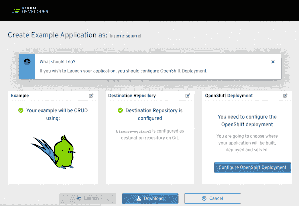

# 宣布 Thorntail 2.4 正式上市

> 原文：<https://developers.redhat.com/blog/2019/06/04/announcing-thorntail-2-4-general-availability>

在今年的[红帽峰会](https://www.redhat.com/en/summit/2019)上，红帽宣布通过订阅[红帽应用运行时](https://www.redhat.com/en/products/application-runtimes)为红帽客户提供 Thorntail 2.4 正式版。红帽应用运行时为应用开发者提供了多种运行在[红帽 OpenShift 容器平台](https://developers.redhat.com/openshift/)上的应用运行时。

## Thorntail 简介

[Thorntail](https://thorntail.io/) 是 WildFly Swarm 的新名称，它通过将服务器运行时库与您的应用程序代码打包在一起并与`java -jar`一起运行，捆绑了您开发和运行 [Thorntail](https://developers.redhat.com/blog/2018/08/23/eclipse-microprofile-and-red-hat-update-thorntail-and-smallrye/) 和 [MicroProfile](https://microprofile.io/) 应用程序所需的一切。它加速了从单片到微服务的转变，并利用了你现有的行业标准 Java EE 技术经验。

## 索恩泰尔有什么新消息？

该版本是 Thorntail 2.2 的增量版本，增加了对 [Java 11](https://openjdk.java.net/projects/jdk/11/) 和 [MicroProfile 2.2](https://github.com/eclipse/microprofile/releases/tag/2.2) (撰写本文时的最新版本)的支持，这是一个功能丰富的 API 集合，用于开发企业[微服务](https://developers.redhat.com/topics/microservices/)。MicroProfile 2.2(以及 Thorntail 2.4)中的增量更新包括:

*   [**Fault Tolerance 2.0**](https://microprofile.io/project/eclipse/microprofile-fault-tolerance):实现一组编程模式，如隔板、超时、断路器和回退，以监控潜在的故障情况并对其做出适当的反应。利用这些模式可以消除微服务架构中级联故障的可能性。
*   [**OpenTracing 1.3**](https://microprofile.io/project/eclipse/microprofile-opentracing) :当请求在微服务架构中遍历多个服务时，支持跟踪请求流。当 Thorntail 与 Jaeger(一种分布式跟踪服务)一起使用时，组织可以快速跟踪性能瓶颈。
*   [**Open API 1.1**](https://microprofile.io/project/eclipse/microprofile-open-api):Open API 规范的 Java 实现，公开了自定义开发的 RESTful 端点的机器可读格式。
*   [**Rest 客户端 1.2.0**](https://microprofile.io/project/eclipse/microprofile-rest-client) :调用 RESTful 服务的类型安全 API。

Thorntail 还包括许多特性，使得部署和管理 Thorntail 项目变得容易，比如集成数据源、支持 [Keycloak](https://www.keycloak.org/) 和 [Red Hat SSO](https://access.redhat.com/products/red-hat-single-sign-on) 等等。查阅[发行说明](https://access.redhat.com/documentation/en-us/red_hat_openshift_application_runtimes/1/html/red_hat_openshift_application_runtimes_release_notes/)获取完整列表。

## 为红帽 OpenShift 重新设计的发射器

[](/sites/default/files/blog/2019/05/Screen-Shot-2019-05-29-at-4.11.22-PM.png)

Redesigned launcher experience.

使用[developers.redhat.com/launch](https://developers.redhat.com/launch)，您可以立即创建一个 Thorntail 应用程序，并将其直接部署到 [OpenShift Online](http://openshift.com/) 或您自己的本地 OpenShift 集群。它提供了一种从零开始创建应用程序(从示例应用程序开始，或导入您自己的应用程序)的简单方法，以及一种将这些应用程序构建和部署到 Red Hat OpenShift 的简单方法。

有一些例子可以展示开发人员如何使用 Thorntail 来构建云原生应用和服务的基本构建块，例如创建安全的 RESTful APIs、实现健康检查、外部化配置或与基于 [Istio](https://developers.redhat.com/topics/service-mesh/) 项目的 OpenShift 服务网格集成。

## 使用 Thorntail 测试一个示例应用程序

Thorntail 是一个 Java 框架，因此，它可以使用 [OpenJDK](https://developers.redhat.com/products/openjdk/overview/) 运行。让我们在 OpenShift 上测试其中一个 Thorntail 助推器(这里我使用的是[红帽 CDK](https://developers.redhat.com/products/cdk/overview/) ，但是任何 OpenShift 集群都可以)。下面是一组命令，您可以使用这些命令将 OpenJDK 映像拖到本地系统，以便与 Thorntail 一起使用:

```
oc new-project thorntail
oc import-image java:8 --from=registry.access.redhat.com/redhat-openjdk-18/openjdk18-openshift --confirm
```

然后，可以使用以下命令来构建 Thorntail 应用程序并将其部署到 Red Hat OpenShift:

```
oc new-app --name rest-example 'java:8~https://github.com/thorntail-examples/rest-http-redhat#2.4.0-redhat-1'
oc expose svc/rest-example
```

您可以观看构建过程:

```
oc logs -f bc/rest-example
```

构建完成后，等待部署完成:

```
oc rollout status -w dc/rest-example
```

然后访问示例应用程序的用户界面:

```
open http://$(oc get route rest-example -o jsonpath='{.spec.host}{"\n"}')
```

使用带有 Thorntail 的 OpenJDK 发行版的 Red Hat 客户将能够获得最新的更新、安全建议，了解容器更新的时间和原因，并保持最新的可用标记图像。

## 证明文件

[Red Hat OpenShift 应用程序运行时(RHOAR)](https://developers.redhat.com/products/rhoar/overview/) 团队一直在不断添加和改进 Thorntail 的官方文档。这包括[发行说明](https://access.redhat.com/documentation/en-us/red_hat_openshift_application_runtimes/1/html/red_hat_openshift_application_runtimes_release_notes/)、[入门指南、](https://access.redhat.com/documentation/en-us/red_hat_openshift_application_runtimes/1/html/getting_started_with_red_hat_openshift_application_runtimes/)和新 [Thorntail 运行时指南](https://access.redhat.com/documentation/en-us/red_hat_openshift_application_runtimes/1/html/thorntail_runtime_guide/)的更新。

## 开发者互动学习场景

这些[自定进度的场景](https://learn.openshift.com/middleware/rhoar-getting-started-thorntail/)为您提供了一个预配置的 Red Hat OpenShift 实例，无需任何下载或配置即可从您的浏览器访问。用它来[试验 Thorntail](https://learn.openshift.com/middleware/rhoar-getting-started-thorntail/) 或者了解 RHOAR 中的其他技术，看看它如何帮助解决现实世界的问题。

[](/sites/default/files/blog/2018/10/Screen-Shot-2018-10-17-at-2.25.40-PM.png)Interactive Learning Scenario for Thorntail

Interactive Learning Scenario for Thorntail

## 获得对 Thorntail 的支持

Red Hat 客户可以通过订阅 Red Hat OpenShift 应用程序运行时来获得对 Thorntail 的支持。请联系您当地的 Red Hat 代表或 [Red Hat 销售人员](https://www.redhat.com/en/about/contact/sales)了解如何享受 Red Hat 及其全球合作伙伴网络提供的世界级支持。

展望未来，根据 [Red Hat 产品更新和支持生命周期](https://access.redhat.com/support/policy/updates/jboss_notes/)，客户可以期待对 Thorntail 和其他 RHOAR 运行时的支持。

## 荆棘谷的下一步是什么？

Thorntail 团队不断地从客户和更广泛的开源开发者社区获得反馈，同时跟踪上游 Thorntail 的发布(T2)。他们正在根据反馈对 RHOAR 运行时进行更新，并考虑支持来自 Red Hat 和大型 Java 社区的其他模块。Thorntail 社区也在继续跟踪 [Jakarta EE](https://developers.redhat.com/blog/2018/04/24/jakarta-ee-is-officially-out/) 以及 [MicroProfile 项目](https://microprofile.io)的进展并做出贡献。

红帽客户享受对 Thorntail 2.x 的[世界级支持](https://access.redhat.com/support/policy/updates/jboss_notes)(以及在[红帽应用运行时](https://www.redhat.com/en/products/application-runtimes)的所有其他运行时)。从长远来看，Thorntail 团队将期待[最近宣布的 Quarkus 项目](https://developers.redhat.com/blog/2019/03/07/quarkus-next-generation-kubernetes-native-java-framework/)提供更令人印象深刻的资源消耗和性能数字，以及利用 [SmallRye](https://smallrye.io/) 实现 [Eclipse MicroProfile](https://microprofile.io/) 规范的奇妙开发体验。要了解更多关于 Thorntail 和 Quarkus 的信息，请阅读这篇概述社区方向的博客文章。

## 索恩泰尔背后的人

这个版本是由 Red Hat 的 RHOAR 产品团队制作的，它涉及了许多小时的开发、测试、编写文档、测试以及与更广泛的 Red Hat 客户、合作伙伴和 Thorntail 开发人员社区合作，以整合大大小小的贡献。我们很高兴你选择使用它，并希望它达到或超过你的期望！

## 钍资源

*   [Red Hat OpenShift 应用程序运行时开发者](https://developers.redhat.com/products/rhoar/overview/)
*   [Eclipse MicroProfile 和 Red Hat 更新:Thorntail 和 SmallRye](https://developers.redhat.com/blog/2018/08/23/eclipse-microprofile-and-red-hat-update-thorntail-and-smallrye/)
*   [索恩泰尔博客](https://thorntail.io/archive/)
*   [索恩泰尔运行时指南](https://access.redhat.com/documentation/en-us/red_hat_openshift_application_runtimes/1/html/thorntail_runtime_guide/)
*   [索恩泰尔讨论组](https://groups.google.com/forum/#!forum/thorntail)
*   [推特上的索恩泰尔](http://twitter.com/thorntail_io)
*   [IRC 上的 thorn tail](http://webchat.freenode.net/?channels=thorntail)
*   [荆棘问题跟踪器](https://issues.jboss.org/projects/THORN/issues?filter=allopenissues)
*   [微文件](https://microprofile.io)

*Last updated: May 31, 2019*