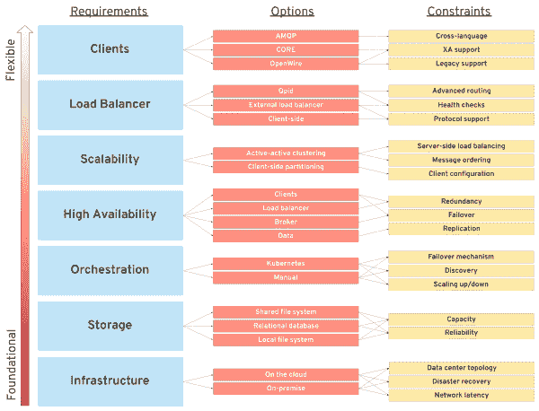
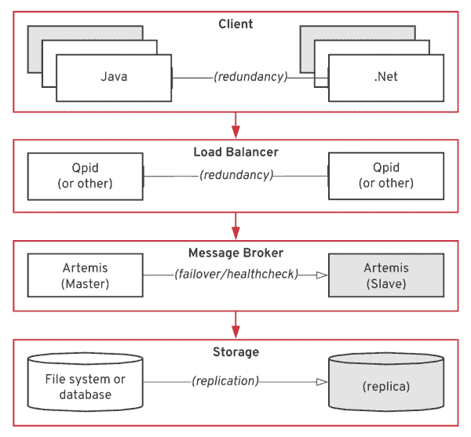
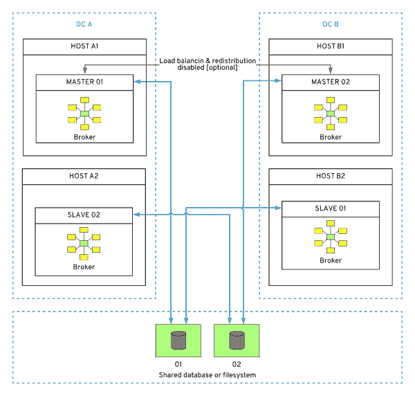
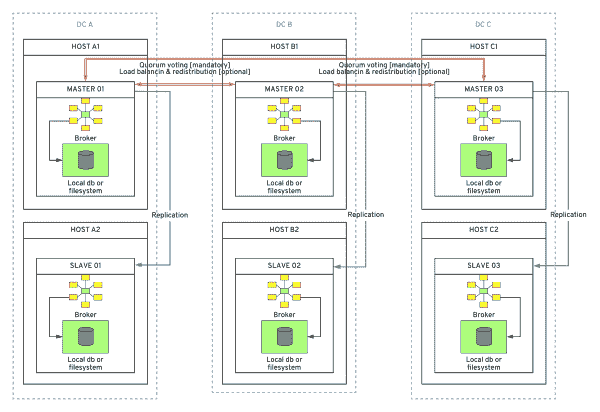
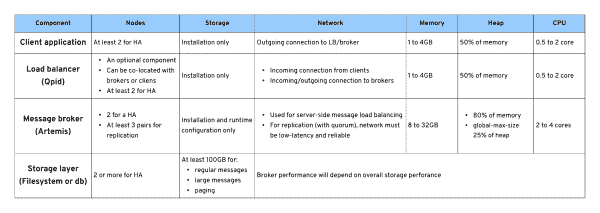

# 使用 Apache ActiveMQ Artemis 的架构消息传递解决方案

> 原文：<https://developers.redhat.com/blog/2020/01/10/architecting-messaging-solutions-with-apache-activemq-artemis>

作为 Red Hat 咨询团队的一名架构师，在过去的六年里，我已经帮助了无数客户解决了他们的集成挑战。最近，我在[Red Hat AMQ 7](https://developers.redhat.com/products/amq/overview)Broker([Apache ActiveMQ Artemis](https://activemq.apache.org/components/artemis/)的企业版)周围做了一些咨询工作，那里的需求和结果是相似的。这种相似性使我认为整个需求识别过程可以更加结构化和可重复。

本指南旨在分享我从这几个项目中学到的东西，试图使 AMQ 代理架构过程、最终的部署拓扑和预期的工作更可预测——至少对于常见的用例来说。因此，下面的内容对于负责为 Apache Artemis 和其他消息传递解决方案创建消息传递体系结构的消息传递和集成顾问和架构师来说非常有用。本文主要关注 Apache Artemis。它不包括 Apache Kafka、 [Strimzi](https://strimzi.io/) 、Apache Qpid、EnMasse 或 EAP 消息系统，这些都是我们[红帽 AMQ 7](https://developers.redhat.com/products/amq/overview) 产品的组成部分。

## 典型的客户要求

根据我的经验，一个典型的中间件用例有相当基本的消息传递需求和约束，这些需求和约束属于几个通用类别。基于这些领域的发现，有几种可能的解决方案，各有利弊，最终得到的架构相当常见。消息传递 SME 应该很好地理解设计、记录、传达约束和实现这些公共架构。与这些标准体系结构不同的任何东西都需要额外的努力，并导致定制的体系结构具有独特的非功能和操作特征。

本文涵盖了以下假设但常见的消息传递场景。这是一位客户描述的典型消息传递要求:

*   我们与 Spring Boot 和 Apache Camel 有大约 100 个微服务，它们广泛使用消息传递。
*   我们所有的服务都是可伸缩的和高可用性(HA)的，我们希望消息传递层也有类似的特征。
*   我们主要使用点对点，但也有一些发布-订阅交互。
*   我们的大多数消息都很小，在 KB 范围内，但也有一些消息相当大，在个位数的 MBs 范围内。
*   我们不知道我们当前的消息吞吐量，它会随着我们使用消息传递添加新服务而变化。
*   我们不使用任何外来的特性，但是我们有消息选择器、预定交付和 TTL 的用例。
*   无论有没有消息分组，我们都需要保持消息的顺序。
*   我们主要在基于 Java 的服务中使用 JMS，在少数情况下使用 AMQP。网络服务。
*   我们不喜欢 XA，但是在一些服务中，我们使用包含消息代理的分布式事务。
*   如果需要，我们可以重放消息，但是我们不能丢失任何消息，并且我们只使用持久消息。
*   我们将所有失败的消息放在 dlq 中，稍后丢弃。
*   我们想知道所有的最佳实践和命名约定。
*   所有经纪人对经纪人的通信和客户对经纪人的通信都必须受到保护。
*   我们希望控制谁可以创建队列、读取和写入消息以及浏览。

如果你听到以上这些需求，你是在熟悉的领域，这篇文章应该对你有用。如果没有，并且有特定的硬件、吞吐量、拓扑或其他需求，则克隆 Apache Artemis [repo](https://github.com/apache/activemq-artemis) 并更深入。而且不要忘了以后和别人分享你学到的东西。

## 约束识别方法

除了显而易见的客户需求和愿望之外，其他的硬性和软性约束将决定最终的架构。客户可能知道也可能不知道这些约束和依赖，而您的工作就是深入挖掘并发现它们。

我遵循的方法是从基本的和难以改变的需求开始，比如基础设施和存储，如图 1 所示。探索每种方法有哪些选择，并记录利弊限制。然后，对编排层进行同样的操作(如果有的话)。

基本的约束将决定上层的可能性，比如高可用性和可伸缩性的选项。在更高的层中，灵活性增加了，并且可以选择交换负载平衡器和不同的客户端实现，而不会影响下面的层。

Figure 1: Breaking down higher-level requirements into specific constraints.

找到这些问题的答案，并确定什么是最重要的，以及客户愿意在哪些方面做出妥协，将有助于您确定可行的架构。接下来，让我们更深入地了解一下基于 Apache Artemis 的解决方案的具体限制。

## 基础设施

这是客户灵活性最少的领域，您的目标是确定消息代理如何在可靠的配置中适应可用的基础设施。客户不太可能因其消息传递需求而更换其基础架构提供商，因此请尝试确定一个合适的解决方案。

通常，常见的消息基础设施基于内部基础设施，包括虚拟化器、NFS 存储和 F5 负载平衡器。这种基础设施可以在一个数据中心内，也可以分布在两个数据中心(不幸的是，不是三个)。在另一种情况下，客户可能会使用 AWS(或同等产品)，如 EC2、EBS、EFS、RDS 或 ELBs。通常，所有这些选项都分布在一个区域的三个 az 中。这是中小型集成用例最常见的 AWS 设置。

除了计算、存储和负载平衡器，在此阶段，我们还想确定数据中心的拓扑、网络延迟和吞吐量。客户端使用单个数据中心、两个数据中心还是任何其他奇数数据中心？它是主动-主动还是主动-被动数据中心拓扑？

最后但同样重要的是，什么是操作系统、JDK 和客户端堆栈？从 AMQ 7 支持的[配置](https://access.redhat.com/articles/2791941)页面可以很容易地验证这些信息，包括测试什么、支持什么、支持多长时间等等。

虽然内部部署和基于云的基础架构提供相似的资源，但区别通常在于数据中心的数量以及操作、故障转移和灾难恢复模式。影响这些基本模型是一个缓慢的过程，这就是为什么我们要首先确定这些约束。

## 储存；储备

一旦我们确定了更广泛的基础架构级别的细节，下一步就是关注存储。存储是基础架构层的一部分，但在这里需要单独考虑。当需要高可用性时(情况总是如此)，存储是消息传递体系结构的最关键和最具限制性的因素。请特别注意客户的基础架构提供了哪些选项，因为答案将极大地限制可能的部署拓扑。

### 存储容量

容量几乎不是一个真正的问题，因为在估计所需的确切存储容量时，通常会有许多未知因素。大多数客户:

*   使用消息代理作为他们的临时中转区，在这里消息以消费者能够处理的速度被消费。通常没有定义消费者服务 RPO，也不清楚消息可以累积多长时间。
*   将消息放入 dlq，但是不清楚以后如何处理这些消息。重放失败的消息取决于实际的业务需求，并不总是可取的。
*   预计如果邮件大小为 1MB，它将消耗 1MB 的磁盘空间。根据你们现在的经验，情况并非如此。根据消息交互风格、缓存和其他配置的类型，相同的消息最终可能会消耗多几倍的存储空间。

所有这些和其他场景都可能导致消息在代理中堆积，并消耗数百千兆字节的存储空间。如果客户对这些问题没有答案，那么估计所需存储大小的唯一行之有效的方法就是“空中手指”幸运的是，Artemis——像它的前辈一样——有[流量控制](https://activemq.apache.org/components/artemis/documentation/latest/flow-control.html),可以保护代理不会耗尽存储空间。这个问题通常归结为是抛出异常还是阻止生产者来保护代理。

### 存储类型

存储类型更加重要，它决定了以后需要什么样的高可用性选项。例如，如果代理在 Kubernetes 上，则没有主/从，因此，不需要带有分布式锁的共享文件系统，比如 NFSv4、GFS2 或 GlusterFS。但是，文件系统应该确保日志具有高可用性。

当代理在虚拟机上(而不是在 Kubernetes 上)时，实现和操作的更简单的选择是使用受支持的共享文件系统。注意，AWS EFS 服务不是一个完整的 NFSv4 规范，但它仍然作为 Artemis 的共享存储选项受到支持。如果没有共享文件系统，或者，您可以使用关系数据库作为存储，这可能会影响性能。检查支持哪些关系数据库(目前是 Oracle、DB2、MSSQL)。注意，在这里使用 AWS RDS 也是一个可行的选择。

如果没有共享文件系统或关系数据库，可以考虑复制。复制需要额外的考虑。复制的一大优势是消息传递和中间件团队不依赖任何存储团队来配置基础架构。此外，共享文件系统或关系数据库没有成本，代理执行其数据复制。有些客户喜欢这一方面，但是所有好的东西都是有代价的，例如一个可靠的复制至少需要三个主代理和三个从代理来避免裂脑的情况。

还有一种选择是使用[网络 pinger](https://access.redhat.com/documentation/en-us/red_hat_amq/7.4/html/configuring_amq_broker/setting-up-broker-cluster-configuring#configuring-high-availability-configuring) ，这是有风险的，在实践中不推荐。网络 ping 程序避免了对所有三个组件的需求，但是只有在无法使用三个或更多实时备份组的情况下，才应该使用网络 ping 程序。如果您使用复制高可用性策略，并且只有一个活动备份对，则配置网络 using 会减少(但不会消除)遇到网络隔离的机会。

另一个代价是可能发生裂脑，不仅是因为网络分区和服务器崩溃，还因为过载、CPU 饥饿、长时间 I/O 等待、长时间垃圾收集暂停以及其他原因。此外，复制只能在单个数据中心和局域网内进行，并且需要可靠的低延迟网络。同一地区的 AWS AZs 被视为不同的数据中心，因为 Amazon 也没有承诺网络延迟 SLA。最后，与共享存储选项相比，复制也会影响性能。

最后，关于存储的关键点是，虽然我们可以使代理进程和客户端进程具有高可用性，但数据存储本身也必须具有高可用性和持久性，这只有通过数据复制才有可能实现。作为 AMQ 体系结构的一部分，确定谁在复制数据(文件系统、数据库或通过复制的消息代理本身)以确保数据的高可用性非常重要。

## 管弦乐编曲

在这里，问题归结为检查客户是否会在 Kubernetes 和 [Red Hat OpenShift](http://developers.redhat.com/openshift/) 等容器编排器上运行消息代理，或者通过自主开发的 bash 脚本在裸机上运行消息代理，或者在 Red Hat Ansible [剧本上运行消息代理](https://github.com/redhat-cop/ansible-middleware-playbooks)。如果客户的目标不是 OpenShift，可以跳过本节中的问题。如果消息传递基础设施将在容器上运行，并由 Kubernetes 进行编排，那么需要考虑一些约束和架构含义。

例如，没有主/从故障转移(因此不存在热备份代理)。相反，每个代理实例都有一个 pod，由 Kubernetes 进行健康监控和重启，这确保了代理的高可用性。Kubernetes 的单 pod 故障转移流程不同于本地复制故障转移的主/从流程。因为没有主/从故障转移，所以也不需要主/从之间的消息复制。也不需要分布式文件锁定，这意味着不需要具有分布式锁定功能的共享文件系统，用户仍然可以使用这些文件系统将相同的存储挂载到不同的 Kubernetes 节点和 pod，但是文件系统的锁定功能不再是先决条件。

例如，在一个节点出现故障的情况下，Kubernetes 会在另一个节点上启动一个代理 pod，并提供相同的 PV 和数据。因为没有主/从，所以不需要 ReadWriteMany，而只需要 ReadWriteOnce 卷类型。也就是说，您可能仍然需要一个共享文件系统，在出现节点故障的情况下，它可以挂载到不同的节点上(比如 AWS EBS，它可以挂载到同一区域的不同 EC2 实例上)。

那么，有位于集群之外的消息客户端吗？通过 Kubernetes 服务从 OpenShift 集群内部连接到代理很简单，但是从 Kubernetes 集群外部连接到代理有一些限制。

接下来，外部客户端可以使用支持 SNI 的协议吗？最简单的选择通常是使用 SSL 并从[路由器](https://access.redhat.com/documentation/en-us/red_hat_amq/7.3/html-single/deploying_amq_broker_on_openshift_container_platform/index#creating-route-ocp_broker-ocp)访问代理。如果对客户机使用 TLS 是不可能的，考虑使用需要集群管理权限的节点端口[绑定](https://access.redhat.com/documentation/en-us/red_hat_amq/7.3/html-single/deploying_amq_broker_on_openshift_container_platform/index#basic_client_cluster_port_binding)。

最后，还有一个[缩减控制器](https://access.redhat.com/documentation/en-us/red_hat_amq/7.2/html-single/deploying_amq_broker_on_openshift_container_platform/index#journal-recovery-broker-ocp)，用于在集群中缩减代理单元时排出和迁移消息。

可能还有一些其他的区别，但是故障转移、发现和缩减是自动进行的，并且代理的基本原理在 Kubernetes 和 Openshift 上没有改变。

## 高可用性

当客户谈到“高可用性”时，他们指的是全栈、高可用性的消息传递层。这意味着高可用性存储、高可用性代理、高可用性客户端、高可用性负载平衡器，以及介于两者之间的任何其他高可用性产品。为了涵盖这个场景，您必须考虑堆栈中每个组件的可用性，如图 2 所示:

Figure 2: Redundancy at every layer.

### 储存；储备

确保数据高可用性的唯一方法是复制数据。您必须确定谁复制数据以及数据复制到哪里:本地、跨虚拟机、跨数据中心，等等。大多数客户都希望在单个数据中心停机时不丢失任何消息，这就需要一种跨数据中心的复制机制。最简单的方法是将日志复制委派给文件系统。此选项会影响成本和对基础架构团队的依赖。例如，如果您使用数据库复制数据，请考虑成本和性能影响。如果您使用 Artemis 日志复制来复制数据，但考虑到客户操作代理群集的成熟度，请考虑裂脑情形、数据中心延迟和性能影响。

### 经纪人

在 Kubernetes 上，代理 HA 是通过健康检查和容器重启实现的。在内部，通过主/从(共享存储或复制)实现代理高可用性。当使用复制时，从服务器已经将队列保存在内存中，因此为故障转移做好了准备。对于共享存储，当从设备获得锁时，需要在从设备接管之前从日志中读取队列。共享存储从设备接管的时间将取决于日志中消息的数量和大小。

当我们谈论代理 HA 时，它归结为一种主动-被动故障转移机制(Kubernetes 是个例外)。但是 Artemis 也有一个主动-主动集群机制，主要用于可伸缩性而不是 HA。在主动-主动集群中，每条消息只属于一个代理，失去一个主动代理也会使其消息不可访问——但是这个问题的一个积极的副作用是代理基础设施仍然在运行。客户端可以使用活动实例并交换消息，缺点是暂时不能访问失败代理中的消息。总之，主动-主动集群主要是为了可伸缩性，但它也部分提高了临时消息不可用的可用性。

### 负载平衡

如果有负载均衡器，最好是组织中已经有 HA 的，比如 F5s。如果使用 Qpid，您将需要两个或更多活动实例来实现高可用性。

### 客户

这可能是最容易的部分，因为大多数客户已经以冗余的 HA 方式运行客户端服务，这意味着大多数时候有两个或更多的消费者和生产者实例。运行多个使用者的一个副作用是不能保证消息的顺序。这就是可以使用消息组和独占消费者的地方。

## 可量测性

使用 Artemis 相对更容易实现可伸缩性。主要有两种方法来扩展消息代理。

### 主动-主动集群

创建一个从客户端透明扩展的逻辑代理集群。一开始可以有三个主服务器和三个从服务器(复制或共享存储无关紧要)，这意味着客户端可以使用任何一个主服务器来生成和使用消息。代理将执行负载平衡和消息分发。这样的消息传递基础设施是可伸缩的，并且支持许多具有不同消息传递模式的队列和主题。Artemis 可以有效地处理大消息和小消息，因此也不需要根据消息大小使用单独的代理集群。

主动-主动群集的一些后果是:

*   不保留消息顺序。
*   消息分组需要群集。
*   缩小规模需要排出消息。
*   浏览代理和队列不是集中的。

### 客户端分区

为不同的目的创建单独的、较小的主/从集群。您可以针对实时、批处理、小消息、大消息、每个业务域、关键程度、团队等拥有单独的主/从集群。当一个代理对达到其容量限制时，创建一个单独的代理对并重新配置客户机来使用它。

只要客户端可以选择连接到哪个集群，这种技术就可以工作(因此得名客户端分区)。这里还有一个 Apache Qpid 的用例，您可以添加新的代理并为其分配地址，而客户端不需要知道这些代理的位置，因此简化了客户端并使消息传递网络动态化。

### 负载平衡

虽然负载平衡器不是消息传递堆栈的强制组件，但是您是要使用客户端负载平衡还是外部负载平衡器，这是一个架构决定。借助外部负载平衡器，客户也喜欢使用 F5 等现有负载平衡器进行消息传递。另外，负载平衡器:

*   已经存在于许多组织中，它们已经是 HA，并且它们支持许多协议——因此将它们用于消息传递也是有意义的。
*   允许所有客户端使用同一个 IP。
*   可以对主代理进行健康检查和故障转移(即，尝试连接到相关接受者的探测器)。

有些客户端，如。使用 AMQP 协议的. NET 客户端不支持故障转移协议 OOTB(这里还有一个[示例](https://github.com/Azure/amqpnetlite/blob/master/Examples/Reconnect/ReconnectSender/ReconnectSender.cs)展示了如何减轻这种限制)。使用负载平衡器有助于这些客户端。

#### Apache Qpid

Apache Qpid 只能作为 AMQP 协议的智能负载平衡器。它支持最近、最低延迟和多播类型的分发。您将需要运行 Qpid 的多个实例来使它成为 HA。这意味着客户端必须配置为使用多个 IP。Qpid 还可以支持许多拓扑，并允许从更安全的方向连接到不太安全的方向，而不是相反。

Qpid 在地理上分散的网状消息中发挥了自己的作用，在这种消息中，客户端不知道彼此的位置，也不知道它们可能将消息发送到的任何代理，在防火墙之外进行双向消息传递，并建立冗余的消息传递网络路由。在不改变客户端的情况下，也可以很容易地扩展代理的数量，并且拓扑结构也可以在不改变客户端的情况下改变(动态消息传递基础设施)。

您还可以使用 Qpid 创建共享一个地址的多个代理，而不需要使用代理集群，但该功能仅在消息排序不太重要时有用，或者用作客户端连接连接器(特别适用于物联网场景)。

#### 客户端负载平衡

实际上并不需要使用负载平衡器。您可以将消息传递客户端配置为直接连接到代理集群。客户端可以连接到单个代理，发现所有其他代理，改变拓扑结构等。考虑一下，如果客户机试图连接的单个代理出现故障，会发生什么情况。为了回答这个问题，可以传递一个代理 IP 列表，并实现定制的负载平衡策略。

客户端负载平衡具有优势:客户端可以发布到多个代理并执行负载平衡。如果需要发布到单个代理，可以禁用此功能。缺点是客户端负载平衡是特定于客户端的实现，这里提到的选项因客户端而异。

## 客户

对于 Artemis，有多种客户端、协议和可能的组合。就协议而言，这里有几个高级指针。这里要考虑的另一件事是，当消费者和生产者使用不同的有线协议和客户端时，哪种协议可以被转换成哪种协议。协议和客户端选择不太可能影响代理架构，但是它们会影响客户端服务开发工作，并且这个问题很容易变得一团糟。

### AMQP 1.0

如果可能，AMQP 1.0 应该是默认的启动选项。这个选项是测试和使用最多的选项之一。它也是跨语言的，并且是。网络客户端。请记住，互连(Apache Qpid 的企业版)只支持 AMQP 1.0，如果互连在架构中，客户端必须使用 AMQP 与之交互。

AMQP 的一个局限是它不提供 XA 事务支持

### 核心

核心协议是 Artemis 最先进、功能最丰富、经过测试的协议之一。当使用 EAP 和嵌入式 Artemis 时，它是唯一支持的协议，当需要 XA 时，它是推荐的协议。

### 明火

此协议是出于与 AMQ 6 (Apache ActiveMQ broker)客户端的遗留兼容性原因。这在客户端代码无法更改的情况下非常有用，因此您只能使用 OpenWire。这个协议吸引人的一点是它支持 XA。

## 参考架构

确定了需求、依赖关系和特定的约束后，下一步是提出可能的部署架构。我坚信“现实世界没有参考架构”这句话因此，没有一个简单的过程来遵循和映射发现到目标架构。正是所有需求、约束和可能的折衷的组合导致了为客户确定最合适的体系结构。

出于演示目的，以下是 AWS 的常见 Artemis 部署拓扑，在裸虚拟机上而不是 Kubernetes 上。相同的拓扑也适用于存在类似替代基础架构服务的内部部署。适用于以下所有部署的注意事项是:

*   客户端负载平衡或负载平衡器可用于所有这些部署。
*   负载平衡器可以与代理、客户机位于同一位置，位于一个专用层中，或者位于这些层的组合中。
*   从代理可以保存在单独的主机中，如下所示，也可以与主代理放在一起。

### 具有共享存储的非集群 Apache Artemis

Artemis 最简单的 HA 架构是一个带有共享存储的主/从集群。下面的示例是一个可扩展版本，设置了两个独立的主/从集群。请注意，主机之间没有集群(服务器端消息分发或负载平衡)。因此，客户端需要决定使用哪个主/从集群。

#### 赞成的意见

这种方法的优点是:

*   这是一个简单但高度可用的 Artemis 配置和操作模型。
*   它与带有主/从的 Apache ActiveMQ 中的拓扑相同。
*   不存在裂脑的可能性，没有卡住的消息，并且消息顺序得到保证。

#### 骗局

缺点是这种方法需要一个共享的文件系统或数据库，这会增加额外的成本。通常，基于数据库的存储的性能会比基于文件的存储差。

#### 其他注释

其他注意事项包括日志高可用性是通过文件系统或数据库(AWS EFS 或 RDS)数据复制实现的。或者，可以将主服务器集群化，以实现消息分发、负载平衡和可伸缩性。主/从对的数量可以变化(图 3 中有两个)，通过添加更多的主/从对和使用客户端分区来实现扩展。

此外，在虚拟机或 DC 出现故障的情况下，它可以确保高可用性。

Figure 3: Apache Artemis with a shared file and database store.

### 具有共享存储的集群 Apache Artemis

在此拓扑中，我们有三个主/从对，确保高可用性。此外，所有主服务器都是集群的，并提供服务器端负载平衡和消息分发。在这种设置中，客户端可以连接到集群的任何成员并交换消息。这种集群还可以在不影响客户端配置的情况下扩展和更改拓扑。

#### 赞成的意见

此选项的优点是它提供了:

*   与 Apache ActiveMQ 中的拓扑相同，具有主/从和代理网络。
*   服务器端消息分发和负载平衡。
*   不可能出现大脑分裂的情况。

#### 骗局

缺点是它需要一个共享的文件系统或数据库，这会增加额外的成本。通常，基于数据库的存储的性能会比基于文件的存储差。

#### 其他注释

使用这种方法，日志高可用性是通过文件系统或数据库(AWS EFS/RDS)数据复制实现的。或者，主服务器可以是非集群的，以防止服务器端负载平衡。主/从对的数量可以变化(图 4 中有三个)，并且通过添加更多对客户端透明的主/从对来实现扩展。

最后，这种方法确保了在虚拟机或 DC 出现故障时的高可用性。

Figure 4: Apache Artemis with a shared file and database store.

### 带复制的集群 Apache Artemis

这种架构是前一种架构的变体，其中我们用复制取代了主设备和从设备之间的共享存储。因此，这种架构具有服务器端负载平衡和对客户端透明的所有好处。这种体系结构的另一个好处是，它不需要高度可用的共享存储层。相反，代理复制数据。

#### 赞成的意见

这种方法的优点是:

*   数据复制由代理执行，而不是由基础设施服务执行。
*   日志复制不需要额外的成本，也不依赖于基础架构。
*   它提供了可伸缩和高度可用的消息传递基础设施。

#### 骗局

缺点是:

*   复制对网络延迟很敏感，因此可能会出现裂脑情况。请注意，图 4 中的复制在同一个 DC 中。
*   与其他选项相比，此选项具有复杂的配置和操作模型。
*   它至少需要三个主代理和三个从代理(如下图所示)。

#### 其他注释

使用这种方法:

*   主/从对的数量可以不同(要求奇数)。
*   或者，可以禁用服务器端消息分发和负载平衡。
*   它可以在虚拟机出现故障时确保高可用性，但不能在 DC 出现故障时确保高可用性。
*   它需要法定人数和一定数量的经纪人才能存活。

Figure 5: Apache Artemis with replication.

## 容量规划

图 5 所示的数字和范围仅作为指导和起点。根据用例的不同，您可能需要放大或缩小您的单个架构组件。

Figure 5: Example sizing and considerations for the messaging components.

## 摘要

多年来，我几乎没有见过两种完全相同的消息传递架构。每个组织在管理基础设施和组织团队的方式上都有一些独特之处，这不可避免地会反映在最终的架构中。作为顾问或架构师，您的工作是在当前的约束条件下找到最合适的架构，并教育和指导客户实现最佳结果。架构没有对错之分，只有在特定环境下的权衡承诺。

在本文中，我试图从架构的角度尽可能多的介绍 Artemis。但这样做，我不得不固执己见，忽略其他领域，并强调我认为基于我的经验是重要的。希望你觉得有用，并从中有所收获。如果是这样的话，在 Twitter 上说点什么，并传播这个消息。

*Last updated: September 7, 2022*