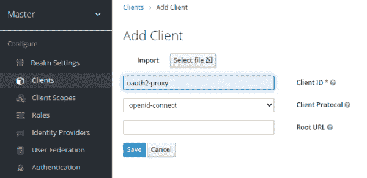
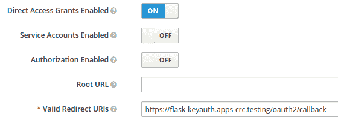
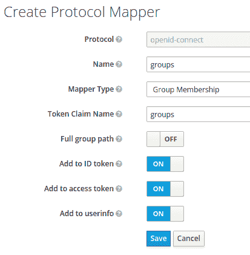
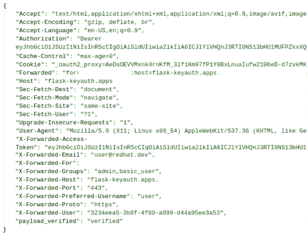

# 使用 oauth2-proxy 授权多语言微服务

> 原文：<https://developers.redhat.com/articles/2021/05/20/authorizing-multi-language-microservices-oauth2-proxy>

在 2020 年 8 月发表的文章[用 Louketo 代理](/blog/2020/08/03/authorizing-multi-language-microservices-with-louketo-proxy/)授权多语言微服务中，我解释了如何使用 Louketo 代理为你的[微服务](/topics/microservices)提供认证和授权。从那时起，Louketo 代理项目已经走到了它的生命尽头，开发人员推荐了 [oauth2-proxy](https://oauth2-proxy.github.io/oauth2-proxy/) 项目作为替代。

在本文中，我将概述如何使用 [Keycloak](https://www.keycloak.org/) 和 oauth2-proxy 来保护微服务。

## 使用键盘锁

以下部分描述了如何为本文中的场景在 [Red Hat OpenShift](/products/openshift/overview) 上设置 Keycloak。

### 测试和部署 Keycloak 服务器

首先测试 Keycloak 服务器。使用以下命令在 OpenShift 上部署 Keycloak 服务器:

```
$ export PROJECT="keyauth"

$ oc new-project ${PROJECT}
$ oc new-app --name sso \
   --docker-image=quay.io/keycloak/keycloak \
   -e KEYCLOAK_USER='admin' \
   -e KEYCLOAK_PASSWORD='oauth2-demo' \
   -e PROXY_ADDRESS_FORWARDING='true' \
   -n ${PROJECT}

$ oc create route edge --service=sso -n ${PROJECT}
```

我们现在需要向 Keycloak 添加一个客户端配置，以便它可以保护我们的应用程序。

### 创建并配置 oauth2 身份验证客户端

使用用户名`admin`和密码`oauth2-demo`登录 Keycloak。在键盘锁用户界面(UI)上，选择左侧导航栏上的**客户端**，并选择**创建**。在 **Add Client** 页面上，填写所有必需的字段，然后点击 **Save** 创建一个新的客户端，如图 1 所示。

[](/sites/default/files/blog/2020/12/01_create_client.png)

Figure 1: Add the required field values on the Add Client page on the Keycloak UI.

添加新客户端后，进入 **Oauth2-proxy** 页面，将客户端的**访问类型**字段从公开切换为保密，如图 2 所示。

[](/sites/default/files/blog/2020/12/02_confidential.png)

Figure 2: Switch the Access Type field (client protocol) from public to confidential on the Oauth2-proxy page.

接下来，为我们的 oauth2-proxy 设置一个有效的回调 URL 来保护我们的应用程序。在这个场景中，oauth2-proxy 保护一个 flask 应用程序。该 URL 类似于 Keycloak URL，尽管它没有使用前缀`sso`，而是使用了`flask`。例如，如果您的 Keycloak URL 是:

```
https://sso-keyauth.apps-crc.testing
```

您应该在**有效重定向 URIs** 字段中设置以下 URL:

```
https://flask-keyauth.apps-crc.testing/oauth2/callback
```

图 3 显示了创建重定向 URL 的对话框。

[](/sites/default/files/blog/2020/12/03_callback_url.png)

Figure 3: Set a valid redirect callback URL using flask and take note of the generated secret.

然后点击客户端协议上的**保存**的机密，页面显示一个新的标签，**凭证**。单击选项卡，记下生成的密码

### 配置映射器

Keycloak 支持将用户的组成员身份作为 **X-Forwarded-Groups** 传递给微服务。这可以通过配置组映射器来实现。这是一种在微服务中公开授权功能的有用方式。例如，我们可以将微服务的特权功能限制在管理组中的用户。

在**创建协议映射器**页面上选择**映射器**选项卡，添加新的映射器，并使用以下设置输入所有组:

*   **姓名** : `groups`
*   **映射器类型**:组成员
*   **令牌声明名称** : `groups`
*   **全组路径**:关

填写完字段后，点击**保存**。图 4 显示了所有字段都已完成的**创建协议映射器**页面。

[](/sites/default/files/blog/2020/12/04_groups_mapper.png)

Figure 4: Create a new mapper with all the necessary field values to the microservice for X-Forwarded-Groups.

### 配置用户组

现在从左侧导航栏中选择**组**并添加两个组:

*   管理
*   基本 _ 用户

### 配置用户

从左侧导航栏中选择**用户**并添加一个用户。输入新用户的电子邮件地址和密码，并将该用户添加到您刚刚创建的**基本用户**和**管理员**组中。现在，您已经准备好配置 oauth2-proxy 和示例应用程序了。

## 使用 oauth2-proxy sidecar 部署应用程序

现在让我们用一个 oauth2-proxy sidecar 部署我们的应用程序。为了让生活更简单，这里有一个 Git 存储库，包含所有的 OpenShift 模板。将存储库和`cd`克隆到文件夹中，并运行以下脚本来配置和部署所有模板，只需将 OpenShift 项目名作为`variable`传递即可:

```
$ git clone https://github.com/snowjet/demo-oauth2-proxy.git
$ cd demo-oauth2-proxy

# deploy flask with oauth2-proxy in project keyauth
$ ./create_app.sh keyauth
```

上面的脚本为应用程序部署了许多模板。然而，与 oauth2-proxy 相关的重要模板是配置图。

*   `Configmap_ssopubkey.yml`包含 Keycloak 公共证书，用于验证由 oauth2-proxy 传递的 JSON Web 令牌(JWT)
*   `Configmap-oauth.yml`包含配置 oauth2-proxy 所需的变量。其中包括:
    *   `oidc_issuer_url`
    *   `client_secret`
    *   `redirect_url`
    *   `cookie_secret`
    *   `whitelist_domains`
    *   `cookie_domains`

剩余的模板完成部署:

*   `DeploymentConfig`对于 oauth2-proxy 带边车的应用
*   指向 oauth2 代理的服务
*   指向 oauth2 代理服务的路由

## 测试配置

部署完成后，测试配置，然后浏览示例应用程序。请记住，在尝试登录 Keycloak web 应用程序之前，请先退出 Keycloak 的管理部分。然后，在**签到**界面，点击**键盘锁**签到，如图 5 所示。

[](/sites/default/files/blog/2020/12/05_sign_in.png)

Figure 5: Sign in to test the configuration and browse to the example application.

一旦重定向到 Keycloak 登录对话框，输入应用程序用户的用户名或电子邮件地址和密码，如图 6 所示。然后单击登录按钮完成输入。

[](/sites/default/files/blog/2020/12/06_login_sso.png)

Figure 6: On the Keycloak login dialog, type the username or email address and password for the application user.

成功通过身份验证后，您将被重定向到一个应用程序页面，该页面返回一个 JSON 文件，如图 7 所示。该文件公开了由 oauth2-proxy 传递的头:

[](/sites/default/files/blog/2020/12/07_json.png)

Figure 7: Redirects to an application page that returns a JSON file.

## 结论

本文是对 oauth2-proxy 的介绍，oauth 2-Proxy 是 Louketo Proxy 的替代品，它为您的应用程序提供身份验证，而无需您在微服务中编写 OpenID Connect 客户端。一如既往，我欢迎你的问题和任何反馈，以及你在评论中分享的细节。

*Last updated: August 26, 2022*