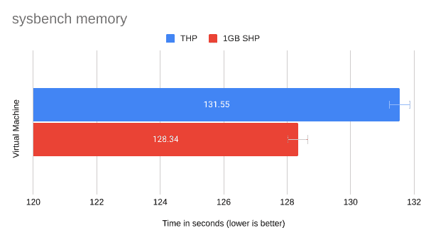
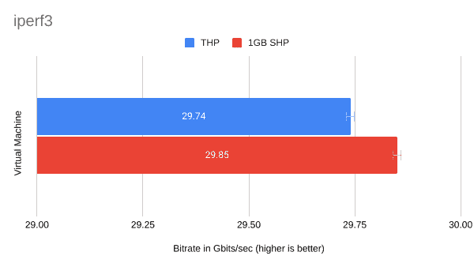
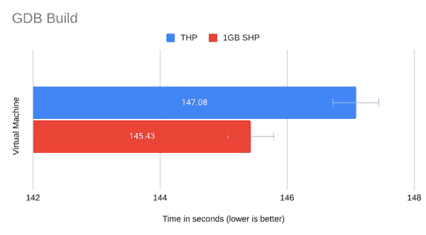
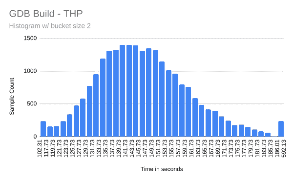
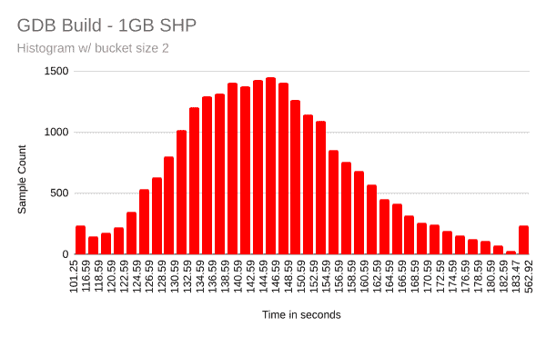

# Linux 虚拟机中透明与 1gb 静态大页面性能的基准测试

> 原文：<https://developers.redhat.com/blog/2021/04/27/benchmarking-transparent-versus-1gib-static-huge-page-performance-in-linux-virtual-machines>

在本文中，我研究了两个虚拟机(VM)在使用 [Linux](/topics/linux) 内核中的大页面时的性能。一个虚拟机被配置为使用透明的大页面(THP)，这是默认情况下发生的。另一个配置为使用 1gb 静态大页面(SHP)，这需要在虚拟化主机上和虚拟机定义中进行特殊配置。

## Linux 内核中的巨大页面

管理每个进程的虚拟和物理地址之间的转换是 Linux 内核的职责之一。记忆被组织成页；当执行虚拟到物理地址转换时，查询页表。为了避免重复遍历页表，使用了一个称为[转换后备缓冲器](https://en.wikipedia.org/wiki/Translation_lookaside_buffer) (TLB)的缓存来提高性能。TLB 的大小是有限的，因此在具有大量物理内存的机器上，使用较大的页面大小来减少 TLB 未命中的数量可能是有利的。

在 x86-64 架构上，默认的页面大小是 4kb，尽管也支持 2mb 和 1gb 的更大页面大小。1gb 大页面仅在带有`pdpe1gb` CPU 标志的处理器上受支持。

默认情况下，QEMU/KVM 尝试使用透明的大页面机制来分配虚拟机内存，该机制使用 2mb 页面。如果虚拟化主机和虚拟机都已配置为使用 1gb 页面，则可以将更大的 1gb 页面分配给虚拟机。这些 1gb 的大页面可以在引导时静态分配，也可以在运行时动态分配。我使用静态引导时间分配来运行我的实验。动态分配稍微复杂一些；[其他资源](https://wiki.archlinux.org/index.php/PCI_passthrough_via_OVMF#Dynamic_huge_pages)如果要使用动态、非透明的海量页面分配，应该咨询一下。还应该理解，2mb 页面可以被静态地分配，但是这样做并不令人信服，因为透明的巨大页面机制已经使用了这个页面大小。

## 虚拟化主机上的 1gb 静态大页面配置

在虚拟化主机上，通过向 Linux 内核命令行添加以下参数来保留 1gb 的大页面:

```
hugepagesz=1G hugepagesz=1G hugepages=*N*
```

当然，你可以用某个合适的数字来代替 *N* 。例如，在我的虚拟化主机上，我正在使用`hugepages=48`。这与其他命令行参数一起，分配 48GiB 内存用作 1gb 静态大页面。我的实验实际上并不需要这么多页纸。我想使用一个我可能在日常工作中使用的场景进行测试，在这个场景中，我经常使用几个虚拟机。

内核命令行参数可以使用`grubby`来设置，如针对[Red Hat Enterprise Linux](https://access.redhat.com/documentation/en-us/red_hat_enterprise_linux/8/html/managing_monitoring_and_updating_the_kernel/configuring-kernel-command-line-parameters_managing-monitoring-and-updating-the-kernel)(RHEL)或 [Fedora](https://docs.fedoraproject.org/en-US/Fedora/23/html/System_Administrators_Guide/sec-Configuring_GRUB_2_Using_the_grubby_Tool.html) 所述。内核命令行参数也可以添加到`/etc/default/grub`中的`GRUB_CMDLINE_LINUX`中，然后根据您的安装运行`grub2-mkconfig`来启用。在我的实验中，我使用后一种方法来配置虚拟化主机。

### 虚拟机的巨大页面配置

如前所述，QEMU 试图使用透明的大页面为虚拟机分配内存。非透明的大页面，无论是静态的还是动态的，都可以通过修改机器的 XML 定义来使用。您所要做的就是在定义机器的 libvirt 域中添加以下代码行:

```
<memoryBacking>
  <hugepages/>
</memoryBacking>

```

在我的实验中，我通过`virt-manager`中的 **XML** 选项卡进行了修改。也可以使用`virsh edit *vmname*`命令进行更改。

### 虚拟化主机

我在实验中使用的虚拟化主机有 128GiB 的内存，采用 16 核(32 线程)AMD 锐龙 Threadripper 2950X 处理器。该处理器的基本时钟速度为 3.5GHz，最大提升时钟速度为 4.4 GHz。L1、L2 和三级高速缓存的总大小分别为 1.5 兆字节、8 兆字节和 32 兆字节。处理器没有超频，但我确实使用了 RAM 的 XMP 配置文件(从技术上讲是一种超频)，以便利用 RAM 宣传的速度。表 1 总结了主机的规格。

**Table 1: Specifications for the virtualization host**

| 处理器 | AMD 锐龙 Threadripper 2950X |
| 存储容量 | 128 千兆字节 |
| 内存详细信息 | 8x416 GB corsair lpx 2666 MHz(PC 4 21300)报复 |
| 母板 | ASRock X399 专业游戏 |
| 操作系统（Operating System） | Fedora 32 |
| Linux 内核版本 | 200.fc32.x86_64 |
| QEMU 版本 | 4.2.1-1.fc32.x86_64 |

### 虚拟计算机

我创建了一个虚拟机，在其上安装了 Fedora 32 以及我的实验所需的所有包。接下来，我通过克隆第一个虚拟机的磁盘映像和机器定义创建了第二个虚拟机。最后，我更改了 1gb 大页面虚拟机的定义，使用以下代码作为机器定义的一部分:

```
<memoryBacking>
  <hugepages/>
</memoryBacking>

```

表 2 总结了测试虚拟机的配置。

**Table 2: Configuration of the virtual machines**

|   | 推进马力ˌ推力功率(thrust horsepower) | 吉布·SHP |
| 核心 | Fourteen | Fourteen |
| 存储容量 | 12GiB | 12GiB |
| 操作系统（Operating System） | Fedora 32 | Fedora 32 |
| Linux 内核版本 | 200.fc32.x86_64 | 200.fc32.x86_64 |
| 附加配置 | 没有人 | `<memoryBacking><hugepages/></memoryBacking>`添加到 XML |

我希望避免过度配置虚拟化主机，所以我只给每个虚拟机分配了 14 个内核。虚拟化主机提供 32 个虚拟核心。为每个虚拟机分配 14 个内核意味着它们共同使用 28 个内核，为虚拟化主机留出 4 个内核。

关于 RAM 大小，12GiB 对于我运行的每个基准测试来说都绰绰有余。提供了交换空间，但从来不需要。

## 基准

我在每台机器上运行了三个独立的基准测试。对于每个基准，我将时间或与基准相关的输出附加到一个特定于基准的文件中，稍后将对其进行分析。在这个测试之前，我对每个基准手工运行了 40 到 50 次测试，将结果记录在一个电子表格中。然而，从一次运行到下一次运行存在显著程度的可变性，这由这些早期试验的相当大的标准偏差所证实。因此，为了获得有统计学意义的结果，必须进行大量的试验。对 GNU 项目调试器(GDB)构建测试的粗略计算表明，至少需要 6000 个样本。最后，我在每台机器上进行了四次这样的尝试，使用 99.99%的置信区间得到了一个合适的小误差。

### 基准测试:Sysbench 内存

根据其手册页，Sysbench“是一个模块化、跨平台和多线程的基准测试工具，用于评估操作系统参数，这些参数对于在高负载下运行数据库的系统非常重要。”对于数据库测试，它可以测试 MySQL 和 PostgreSQL。但也可以测试更低级别的系统属性，包括`fileio`、`cpu`、`memory`、`threads`、`mutexes`。我对测试内存性能感兴趣，所以我使用了 Sysbench 的内存测试。

我用于测试的包名和版本是`sysbench-1.0.17-4.fc32.x86_64`。我试验了不同的命令行参数，决定将这个命令用作基准:

```
$ sysbench memory --memory-block-size=64M --memory-total-size=4096G --time=500 --threads=14 run
```

我在每个虚拟机上循环并发运行了这个基准测试。在我早期的调查中，我确实注意到，如果一次只有一台虚拟机运行基准测试，结果可能会快得多。虽然比较一次只在一台机器上运行基准测试的结果可能很有趣，但我更感兴趣的是当两台机器都有大量并发负载时会发生什么。表 3 总结了结果。

**Table 3: Sysbench memory use**

|   | 推进马力ˌ推力功率(thrust horsepower) | 吉布·SHP |
| 平均 | 131.55 秒 | 128.34 秒 |
| 样品 | Five thousand | Five thousand |
| 标准偏差 | 4.38 秒 | 4.2 秒 |
| 福建话 | 102.96 秒 | 101.99 秒 |
| 最大 | 148.28 秒 | 144.95 秒 |
| 可信度 | 99.99% | 99.99% |
| 误差幅度 | 0.24 秒 | 0.23 秒 |

平均而言，1gb SHP 虚拟机比 THP 虚拟机快 3.21 秒或 2.4%。还要注意，1gb SHP 虚拟机的最小和最大时间比 THP 虚拟机短。图 1 中的条形图总结了平均值的比较。误差条显示了 99.99%置信水平的误差幅度。

[](/sites/default/files/blog/2020/11/img_5fb43aab9583b.png)

Figure 1: Sysbench memory use in a comparison of VMs.

### 基准:iperf3

`iperf3`测试网络吞吐量。该工具通常用于网络中机器的不同物理接口之间；这不仅是为了测试机器之间的吞吐量，也是为了检查问题。例如，在我的本地网络上，我曾经使用`iperf3`来识别一个问题，当巨型帧在所有接口上(和网络交换机上)被启用时，一个特定的网络接口被锁定。

`iperf3`也可用于检查虚拟机与其虚拟化主机之间的吞吐量。如后所述，我在 NFS 进行了 GDB 构建基准测试，因此我认为了解网络性能对该基准测试的性能差异有多大影响会很有帮助。

我在虚拟化主机和每个虚拟机上都使用了`iperf3-3.7-3.fc32.x86_64`包。

在虚拟化主机上，运行以下命令；它作为一个服务器开始运行，直到被中断:

```
iperf3 -s
```

在每个虚拟机上，`iperf3`作为连接到服务器的客户端运行:

```
iperf3 -c *virtualization-host*
```

每次运行的输出都被附加到一个文件中，供以后分析。具体来说，发送者的带宽被提取出来进行分析。此外，与其他基准测试不同，`iperf3`测试一次只在一台虚拟机上运行。(如前所示启动服务器一次只允许一个客户机连接。)表 4 总结了结果。

**Table 4: iperf3 results**

|   | 推进马力ˌ推力功率(thrust horsepower) | 吉布·SHP |
| 平均 | 29.74 千兆位/秒 | 29.85 千兆位/秒 |
| 样品 | Thirty-seven thousand | Thirty-seven thousand |
| 标准偏差 | 1.58 千兆位/秒 | 1.4 千兆位/秒 |
| 福建话 | 16.2 千兆位/秒 | 18.7 千兆位/秒 |
| 最大 | 33 千兆位/秒 | 32.8 千兆位/秒 |
| 可信度 | 99.99% | 99.99% |
| 误差幅度 | 0.03 千兆位/秒 | 0.03 千兆位/秒 |

该基准测试显示的结果不如 Sysbench 内存基准测试令人信服，1gb SHP 虚拟机与 THP 虚拟机相比仅具有 0.11 千兆位/秒(或 0.4%)的优势。有趣的是，THP 虚拟机显示了明显更低的最小值(表明性能差)，但也显示了最高的最大值(表明性能更好)。然而，我要指出的是，33 千兆位每秒的最大值在测试过程中实现得有些晚。如果运行更多的测试，1gb SHP 虚拟机也能获得相同或更好的最大结果，我不会感到惊讶。

图 2 显示了平均值的差异，误差线代表 99.99%的置信水平。

[](/sites/default/files/blog/2020/11/img_5fb4429bc72b1.png)

Figure 2: iperf3 results in a VM comparison.

### 基准:GDB 建造

我白天在 GDB 工作，所以我对如何更快地构建这个软件项目感兴趣。我很好奇，想知道配置为使用 1gb 大页面的虚拟机构建 GDB 是否比使用透明大页面的虚拟机更快。

然而，我也对便利感兴趣:我将 GDB 源代码树保存在 NFS 挂载的存储上，并且几乎所有的构建都是在 NFS 挂载的存储上进行的。我知道一个事实，我可以通过构建“本地”存储来实现更快的构建时间。然而，我发现这不太方便，因为在本地存储上构建意味着构建树分布在许多机器的本地存储上，其中一些可能没有运行或者甚至不存在。所以在这种情况下，尽管使用本地存储构建和测试 GDB 更快，我还是选择将构建树集中在 NFS 服务器上。对于我运行的许多虚拟机，该服务器也是虚拟化主机。

考虑到这种配置，我设计了一个 GDB 构建基准，以密切模仿我作为 GDB 开发人员实际进行的构建:源代码和构建树都位于 NFS 挂载的文件系统上，其中虚拟化主机也是 NFS 服务器。

在运行了一个合适的顶级配置命令后，我将下面的`time`命令的输出定向到一个特定于主机的文件中，以供以后分析:

```
time make -j12
```

`time`命令为其计时的每个命令输出三个时间值。对于这个实验，我只对挂钟(实时)时间感兴趣，因为作为开发人员，这是我等待构建完成所需的时间。

表 5 总结了结果。

**Table 5: GDB build times**

|   | 推进马力ˌ推力功率(thrust horsepower) | 吉布·SHP |
| 平均 | 147.08 秒 | 145.43 秒 |
| 样品 | Twenty-four thousand | Twenty-four thousand |
| 标准偏差 | 14.53 秒 | 14.42 秒 |
| 福建话 | 102.31 秒 | 101.25 秒 |
| 最大 | 592.13 秒 | 562.92 秒 |
| 可信度 | 99.99% | 99.99% |
| 误差幅度 | 0.36 秒 | 0.36 秒 |

表 5 显示，1gb SHP 虚拟机完成 GDB 构建的时间平均比 THP 虚拟机快 1.65 秒或 1.1%。静态大页面虚拟机的最小和最大时间都比较好。尽管两台机器的最大时间都很长；稍后我会有更多的话要说。

图 3 总结了平均值的差异，以及 99.99%置信水平的误差线:

[](/sites/default/files/blog/2020/11/img_5fb451c0f0e60.png)

Figure 3: Time required for GDB builds in a comparison of VMs.

#### GDB 建造时间样本代表正态分布吗？

计算标准误差和误差幅度的统计公式假设收集的数据符合表示正态分布的钟形曲线形状。我开始担心 GDB 构建时间样本可能不“正常”，因为 GDB 构建的最大时间距离平均值超过 22σ(即 22 个标准差)。如果这些数据代表正态分布，这*极不*可能。对于 THP 测试，6 个样本距离平均值至少+6σ，139 个样本距离平均值至少+3σ。对于 1gb SHP 测试，11 个样本至少与平均值相差+6σ，131 个样本至少与平均值相差+3σ。我不太关心最小时间，因为它们都非常接近平均值的-3σ以内。

我想直观地看到数据的样子，所以我创建了显示每台机器数据的直方图。图 4 和图 5 显示了直方图。

[](/sites/default/files/blog/2020/11/img_5fb454151d9ec.png)

Figure 4: Times required for GDB builds on the THP VM.

[](/sites/default/files/blog/2020/11/img_5fb4543e6a5e5.png)

Figure 5: Times required for GDB builds on the 1GiB SHP VM.

除了两端的异常值，这些直方图对我来说相当“正常”。我没有足够的统计学知识来说明异常值是否会给使用统计公式计算误差带来问题。

#### 为什么标准差这么大？

Make 的`-j`标志使 GDB 构建的各个部分并行运行。我使用了`-j12`，这意味着多达 12 个不同的 Make 相关任务可以同时运行。我偶尔会在构建过程中观察`virt-manager`的 CPU 使用情况图，并注意到，尽管有一段时间所有的内核都被利用了，但大部分时间都没有。原因是 Make 必须等待各种依赖项完成，然后才能开始构建的另一个阶段。当 C 或 C++文件的编译在一组目标文件上运行链接器以形成可执行或共享对象之前完成时，这是最明显的。为各种子目录运行`configure`脚本也对构建产生序列化影响。

在快速构建期间，我认为很可能较长或较难的编译被偶然分配给了当时可以实现更高提升时钟的内核。如果一切都配合得恰到好处，Make 在启动链接器之前不需要等待很长时间。同样，缓慢的构建可能会适得其反。

我不知道为什么真正缓慢的构建——之前提到的离群值——会如此之慢。仅在 GDB 构建基准测试中，每台机器就收集了 24，000 个样本，耗时超过 40 天。`iperf3`和`sysbench memory`基准测试需要几个星期的额外测试。在整个过程中，虚拟化主机和每台虚拟机都完全用于基准测试，没有其他用途。也就是说，偶尔会有与系统相关的任务(如检查软件更新)定期发生。我没有禁用任何这些任务，也没有查看它们的资源消耗。我仍然感到惊讶的是，几个平均构建时间只有 1 分 20 秒的 GDB 构建用了 9 分多钟才完成！

在我早期的研究中，我试图通过改变 BIOS 来降低 CPU 的主频或超频。我认为这样做可能会导致所有内核以相同的速度运行，这反过来可能会导致更具确定性的构建行为。我试图禁用 CPU 加速，但没有成功，事后看来，这可能是最好的。

## 结论

每个基准测试都显示了使用 1gb 静态大页面时的性能提升。`iperf3`基准测试显示了 0.4%的微小提升，而`sysbench memory`显示了更大的 2.4%的性能提升。GDB 版本居中，性能提高了 1.1%。

对于一个每天进行几十次构建的软件开发人员来说，使用静态大页面带来的 1.1%的改进并不特别令人兴奋，因为对于一个 2 分 20 秒的构建来说，它只减少了大约 1.7 秒的构建时间。然而，致力于持续构建软件的服务器每天将完成更多的工作。使用本文中描述的硬件和软件配置，每天可以完成将近 7 个额外的 GDB 构建。对于积压的构建机器，这可以提供一个小的，但仍然受欢迎的性能改进。

在引导时分配静态大页面的一个缺点是它们不能用于非大页面分配。如果一个或多个虚拟机持续运行，这些巨大的页面可以得到有效的利用。另一方面，如果虚拟机(或其他可能使用大页面的应用程序)只是偶尔运行，保留和不使用大页面意味着这些内存不能用于其他目的。在这种情况下，使用透明的巨大页面机制可能会更好。

我开始这些实验是因为我在几本虚拟化指南的性能调优部分看到过静态的大页面。然而，我不清楚我可能会看到什么样的性能优势。既然我知道我的用例有轻微的性能优势，我计划为我计划持续运行的虚拟机分配静态的大页面。其余的将继续使用透明的大页面。

*Last updated: October 14, 2022*