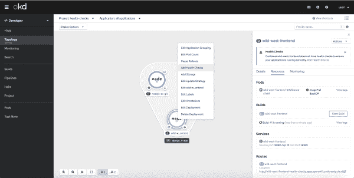
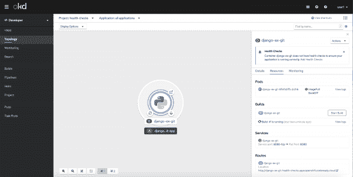

# 最佳实践:在 OpenShift 4.5 web 控制台中使用健康检查

> 原文：<https://developers.redhat.com/blog/2020/07/20/best-practices-using-health-checks-in-the-openshift-4-5-web-console>

对于一个成功的企业应用程序来说，您需要许多移动部件来正常工作。如果一个部件损坏，系统必须能够检测到问题，并在没有该部件的情况下运行，直到它被修复。理想情况下，所有这些都应该自动发生。在本文中，您将了解如何在 [Red Hat OpenShift 4.5](https://developers.redhat.com/products/openshift/getting-started) 中使用健康检查来提高应用程序的可靠性和运行时间。如果你想了解更多关于 OpenShift 4.5 中新增和更新的内容，请阅读[*open shift 4.5 控制台开发者体验中的新增内容*](https://developers.redhat.com/blog/2020/07/16/whats-new-in-the-openshift-4-5-console-developer-experience/) 。

## 健康检查

您可以使用健康检查来自动确定您的应用程序是否在工作。如果应用程序的一个实例不工作，其他服务应该停止访问它并向它发送请求。您需要将这些请求重新路由到应用程序的另一个实例，或者稍后重试。系统还应该将应用程序恢复到健康状态。OpenShift 已经可以在 pod 崩溃时重新启动它们，但是添加健康检查可以使您的部署更加健壮。

OpenShift 4.5 提供了三种类型的健康检查来支持应用程序的可靠性和正常运行时间:就绪性探测、活性探测和启动探测。

### 就绪探测

就绪探测器检查容器是否准备好处理请求。添加就绪探测器可以让您知道 pod 何时准备好开始接受流量。当一个 pod 的所有容器都准备好时，该 pod 被视为准备就绪。使用该信号的一种方式是控制哪些 pod 被用作服务后端。当一个单元未就绪时，它将从服务的负载平衡器中删除。系统停止向 pod 发送流量，直到它通过就绪探测。失败的就绪探测意味着容器不应该从代理接收任何流量，即使它正在运行。

### 活性探针

活性探测器检查容器是否仍在运行。添加活跃度探测器可以让您知道何时重新启动容器。例如，活跃度探测器可以捕获死锁，此时应用程序正在运行，但无法取得进展。在这种状态下重启容器有助于提高应用程序的可用性。如果活性探测失败，容器被终止。

### 启动探测器

启动探测器检查容器中的应用程序是否已经启动。系统将禁用活性和就绪性检查，直到启动探测成功。首先运行启动探测器可以确保活动和就绪探测器不会干扰应用程序的启动。您还可以设置一个启动探测器来对缓慢启动的容器进行活性检查，这将有助于避免您的容器在运行之前被 [Kubelet](https://developers.redhat.com/devnation/tech-talks/kubelet-no-masters) 杀死。如果启动探测器失败，那么容器被终止。

## 探针类型

除了三种类型的运行状况检查之外，还有三种类型的探测器。它们是 HTTP、command 和 TCP:

*   **HTTP 探测器**是最常见的自定义活性探测器类型。探测器探测到一条路径。如果它获得 200 或 300 范围内的 HTTP 响应，它会将该应用程序标记为健康。否则，它会将应用程序标记为不健康。
*   **命令探测器**在你的容器内部运行一个命令。如果命令返回退出代码 0，则探测器将容器标记为健康。否则，它会将其标记为不健康。
*   **TCP 探针**尝试在指定端口上进行 TCP 连接。如果连接成功，则认为容器是健康的；如果连接失败，则认为它不健康。对于 FTP 服务来说，TCP 探测可能会派上用场。

## 在 web 控制台中使用运行状况检查

OpenShift 3 web 控制台中提供了应用程序健康检查，我们收到了许多恢复它们的请求。在 OpenShift 4.5 中，健康检查再次对开发者可用。当您创建新的应用程序或服务时，您可以使用**高级选项**屏幕添加健康检查，或者您可以在以后添加或编辑它们。如果您还没有配置健康检查，您将在[新拓扑视图](https://developers.redhat.com/search?t=Topology+view)的侧面板中看到一个通知。这种导航使发现运行状况检查变得很容易，并且它包括一个用于补救的快速链接。

### 设置默认值

添加健康检查应该很容易，所以我们使用了一致的模式和流程，并为易用性提供了默认值。三个用户流可用于健康检查。无论选择哪种流程，您都可以添加三项健康检查中的任何一项(或全部)。三种探头类型也有默认设置，因此您也可以轻松地添加这些设置。以下是 HTTP 探测类型的默认设置示例:

*   探针类型:HTTP
*   端口:8080
*   失败阈值:三次，表示探针在放弃前尝试启动或重新启动的次数。
*   成功阈值:一次，表示在失败后，探测连续成功的次数。
*   周期:10 秒，表示执行探测的频率。
*   超时:一秒。

## 添加运行状况检查

您可以在创建新的应用程序或服务时添加运行状况检查，也可以在以后添加。您也可以在创建健康检查后对其进行编辑。

### 通过高级选项添加运行状况检查

当您从 Git 导入源代码、部署映像或从 docker 文件导入时，可以使用高级选项屏幕添加健康检查。图 1 显示了在高级选项屏幕上添加健康检查的流程。

Figure 1: Using the Advanced Options screen to add health checks.

### 在上下文中添加运行状况检查

创建新的应用程序或服务时，不必担心忘记添加健康检查。当您在新拓扑视图中选择一个对象时，侧面板将显示一个运行状况检查通知，说明尚未配置运行状况检查。然后，您可以使用通知中的链接或上下文菜单添加运行状况检查。图 2 显示了通过上下文菜单添加健康检查的屏幕。

Figure 2: Adding health checks in context.

### 编辑健康检查

对于已经配置了健康检查的工作负载，我们在上下文菜单和工作负载的**操作菜单**上添加了一个**编辑健康检查**菜单项。**编辑健康检查**表单使用与**添加健康检查**一致的模式和流程，如图 3 所示。

Figure 3: Editing health checks on a configured workload.

我们希望您能够探索 OpenShift 4.5 中新的健康检查功能。将健康检查纳入您的最佳实践将提高您的应用程序的可靠性和正常运行时间。

## 请给我们您的反馈！

OpenShift 开发人员体验流程的很大一部分是接收反馈并与我们的社区和客户合作。我们希望收到您的来信。我们希望您能在 [OpenShift 4.5 开发者体验反馈页面](https://forms.gle/zDd4tuWvjndCRVMD8)上分享您的想法。您还可以加入我们的 [OpenShift 开发者体验谷歌小组](https://groups.google.com/forum/#!forum/openshift-dev-users)，参与讨论并了解我们的办公时间会议，在那里您可以与我们合作，并提供关于您使用 OpenShift web 控制台的体验的反馈。

## 开始使用 OpenShift 4.5

你准备好开始使用新的 OpenShift 4.5 web 控制台了吗？[今天试试 open shift 4.5](http://www.openshift.com/try)。

*Last updated: October 25, 2021*