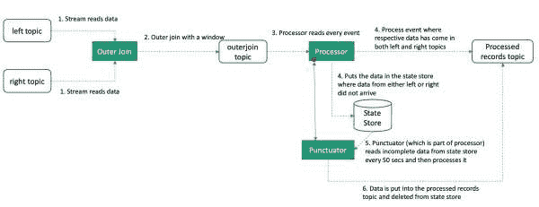
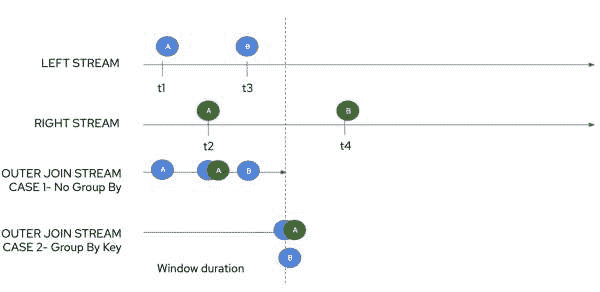
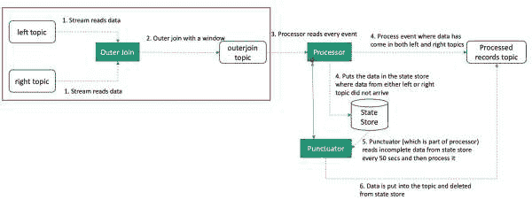
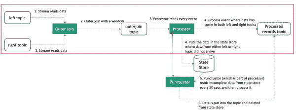
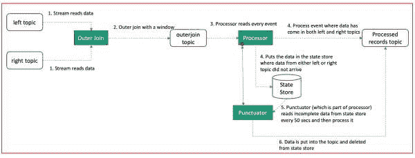

# 使用 kafka streams 和 quartus 构建数据流管道

> 原文：<https://developers.redhat.com/blog/2020/09/28/build-a-data-streaming-pipeline-using-kafka-streams-and-quarkus>

在典型的数据仓库系统中，[数据](https://developers.redhat.com/blog/category/big-data/)首先被累积，然后被处理。但是随着新技术的出现，现在有可能在数据到达时对其进行处理。我们称之为实时数据处理。在实时处理中，数据流通过管道；即从一个系统移动到另一个系统。数据从静态源(如数据库)或实时系统(如事务性应用程序)生成，然后经过过滤、转换，最后存储在数据库中或推送到其他几个系统进行进一步处理。然后，其他系统可以遵循相同的循环，即过滤、转换、存储或推送到其他系统。

在本文中，我们将构建一个使用 [Kafka Streams](https://kafka.apache.org/documentation/streams/) 实时传输和处理数据的 [Quarkus](https://developers.redhat.com/products/quarkus/getting-started) 应用程序。通过这个例子，你将学会如何应用 [Kafka 的概念](https://developers.redhat.com/topics/kafka-kubernetes)，比如连接、窗口、处理器、状态存储、标点符号和交互式查询。到本文结束时，您将拥有 Quarkus 中真实数据流管道的架构。

## 传统的消息传递系统

作为开发人员，我们的任务是更新最初使用关系数据库和传统消息代理构建的消息处理系统。以下是消息传递系统的数据流:

1.  来自两个不同系统的数据到达两个不同的消息队列。一个队列中的每个记录在另一个队列中都有对应的记录。每个记录都有一个唯一的键。
2.  当数据记录到达其中一个消息队列时，系统使用该记录的唯一键来确定数据库中是否已经有该记录的条目。如果没有找到具有该唯一关键字的记录，系统会将该记录插入数据库进行处理。
3.  如果相同的数据记录在几秒钟内到达第二个队列，应用程序将触发相同的逻辑。它检查数据库中是否存在具有相同关键字的记录。如果记录存在，应用程序检索数据并处理两个数据对象。
4.  如果数据记录在到达第一个队列后的 50 秒内没有到达第二个队列，那么另一个应用程序将处理数据库中的记录。

正如您可能想象的那样，这种场景在数据流出现之前工作得很好，但是在今天就不那么好了。

## 数据流管道

我们的任务是建立一个新的消息系统，用 Kafka 执行数据流操作。这种类型的应用程序能够实时处理数据，并且不需要为未处理的记录维护数据库。图 1 展示了新应用程序的数据流:

[](/sites/default/files/blog/2020/07/solution.jpg)

Figure 1: Architecture of the data streaming pipeline.

在接下来的部分中，我们将通过 Quarkus 中的 Kafka Streams 来完成构建数据流管道的过程。您可以从本文的 [GitHub 资源库](https://github.com/kgshukla/data-streaming-kafka-quarkus)中获得完整的源代码。在我们开始架构编码之前，让我们讨论 Kafka 流中的连接和窗口。

## 卡夫卡作品中的连接和窗口

Kafka 允许你将到达两个不同主题的[记录连接起来。您可能熟悉关系数据库中的*连接*的概念，其中数据是静态的，在两个表中可用。在 Kafka 中，连接的工作方式不同，因为数据总是流动的。](https://kafka.apache.org/20/documentation/streams/developer-guide/dsl-api.html#joining)

我们稍后将查看连接的类型，但是首先要注意的是，连接是针对在一段时间内收集的数据而发生的。卡夫卡称这种类型的集合为[开窗](https://kafka.apache.org/20/documentation/streams/developer-guide/dsl-api.html#windowing)。各种[类型的窗户](https://kafka.apache.org/20/documentation/streams/developer-guide/dsl-api.html#windowing)在卡夫卡中都有。对于我们的例子，我们将使用一个[滚动窗口](https://kafka.apache.org/20/documentation/streams/developer-guide/dsl-api.html#windowing-tumbling)。

### 内部联接

现在，让我们考虑一下内部连接是如何工作的。假设两个独立的数据流到达两个不同的 Kafka 主题，我们将其称为左主题和右主题。到达一个主题的记录有另一个相关的记录(具有相同的键但不同的值)也到达另一个主题。第二条记录在短暂的时间延迟后到达。如图 2 所示，我们为每个主题创建了一个 Kafka 流。

[](/sites/default/files/blog/2020/07/inner-join.jpg)

Figure 2: Diagram of an inner join.

左右流的内部连接创建了一个新的数据流。当 Kafka 在左流和右流上都找到匹配记录(具有相同的键)时，它在新流中的时间 *t2* 发出新记录。因为 B 记录没有在指定的时间窗口内到达正确的流，Kafka Streams 不会为 B 发出新的记录。

### 外部连接

接下来，让我们看看外部连接是如何工作的。图 3 显示了我们示例中外部连接的数据流:

[](/sites/default/files/blog/2020/07/outer-join.jpg)

Figure 3: Diagram of an outer join.

如果我们在 Kafka Streams 中联接两个流时不使用“group by”子句，那么联接操作将发出三条记录。卡夫卡笔下的溪流不会等待整个窗户；相反，只要外部连接的条件为真，它们就开始发出记录。因此，当左边流中的记录 A 在时间 *t1* 到达时，连接操作会立即发出一条新记录。在时间 t2，`outerjoin` Kafka 流从右流接收数据。join 操作会立即发出另一条记录，其中包含来自左侧和右侧记录的值。

如果对这些 Kafka 流使用`groupBy`和`reduce`函数，您会看到不同的输出。在这种情况下，流将等待窗口完成持续时间，执行连接，然后发出数据，如前面的图 3 所示。

理解 Kafka 流中内部和外部连接的工作方式有助于我们找到实现我们想要的数据流的最佳方式。在这种情况下，很明显我们需要执行一个外部连接。这种类型的连接允许我们检索出现在左侧和右侧主题中的记录，以及只出现在其中一个主题中的记录。

背景介绍完毕后，让我们开始构建基于 Kafka 的数据流管道。

**注意**:我们可以使用 Spring Web 的 Quarkus 扩展和 Spring DI(依赖注入)来使用基于 Spring 的注释以 [Spring Boot](https://developers.redhat.com/topics/spring-boot) 的风格编码。

## 步骤 1:执行外部连接

为了执行外部连接，我们首先创建一个名为`KafkaStreaming`的类，然后添加函数`startStreamStreamOuterJoin()`:

```
@RestController
public class KafkaStreaming {
    private KafkaStreams streamsOuterJoin;
    private final String LEFT_STREAM_TOPIC = "left-stream-topic";
    private final String RIGHT_STREAM_TOPIC = "right-stream-topic";
    private final String OUTER_JOIN_STREAM_OUT_TOPIC = "stream-stream-outerjoin";
    private final String PROCESSED_STREAM_OUT_TOPIC = "processed-topic";

    private final String KAFKA_APP_ID = "outerjoin";
    private final String KAFKA_SERVER_NAME = "localhost:9092";

    @RequestMapping("/startstream/")
    public void startStreamStreamOuterJoin() {
        Properties props = new Properties();
        props.put(StreamsConfig.APPLICATION_ID_CONFIG, KAFKA_APP_ID);
        props.put(StreamsConfig.BOOTSTRAP_SERVERS_CONFIG, KAFKA_SERVER_NAME);
        props.put(StreamsConfig.DEFAULT_KEY_SERDE_CLASS_CONFIG, Serdes.String().getClass());
        props.put(StreamsConfig.DEFAULT_VALUE_SERDE_CLASS_CONFIG, Serdes.String().getClass());

        final StreamsBuilder builder = new StreamsBuilder();

        KStream<String, String> leftSource = builder.stream(LEFT_STREAM_TOPIC);
        KStream<String, String> rightSource = builder.stream(RIGHT_STREAM_TOPIC);

        // TODO 1 - Add state store

        // do the outer join
        // change the value to be a mix of both streams value
        // have a moving window of 5 seconds
        // output the last value received for a specific key during the window
        // push the data to OUTER_JOIN_STREAM_OUT_TOPIC topic

        leftSource.outerJoin(rightSource,
                            (leftValue, rightValue) -> "left=" + leftValue + ", right=" + rightValue,
                            JoinWindows.of(Duration.ofSeconds(5)))
                        .groupByKey()
                        .reduce(((key, lastValue) -> lastValue))
                        .toStream()
                        .to(OUTER_JOIN_STREAM_OUT_TOPIC);

        // build the streams topology
        final Topology topology = builder.build();

        // TODO - 2: Add processor code later
        streamsOuterJoin = new KafkaStreams(topology, props);
        streamsOuterJoin.start();
    }
}

```

当我们进行连接时，我们创建了一个新值，它合并了左右主题中的数据。如果左侧或右侧主题中缺少任何带键的记录，那么新值将使用字符串`null`作为缺少的记录的值。此外，Kafka Stream `reduce`函数返回所有键的最后一个聚合值。

**注意**:注释`TODO 1 - Add state store`和`TODO - 2:  Add processor code later`是代码的占位符，我们将在接下来的部分中添加这些代码。

### 到目前为止的数据流

图 4 显示了以下数据流:

1.  当具有键 A 和值 V1 的记录在时间 t1 进入左流时，Kafka Streams 应用外部连接操作。此时，应用程序创建了一个新记录，带有键 A 和值 *left=V1，right=null* 。
2.  当具有键 A 和值 V2 的记录到达正确的主题时，Kafka Streams 再次应用外部连接操作。这创建了一个新的记录，带有键 A 和值*，左=V1，右=V2* 。
3.  当在持续时间窗口结束时对`reduce`函数求值时，Kafka Streams API 会根据唯一的记录键发出最后一次计算的值。在这种情况下，它发出一个带有键 A 和值*的记录，左=V1，右=V2* 到新的流中。
4.  新的流将记录推送到`outerjoin`主题。

[](/sites/default/files/blog/2020/09/join-to-topic-1.jpg)

图 4:到目前为止的数据流管道。">

接下来，我们将添加状态存储和处理器代码。

## 步骤 2:添加 Kafka 流处理器

我们需要处理由外部连接操作推送到`outerjoin`主题的记录。Kafka Streams 提供了一个[处理器 API](https://kafka.apache.org/10/documentation/streams/developer-guide/processor-api.html) ，我们可以用它来编写记录处理的定制逻辑。首先，我们定义一个定制处理器`DataProcessor`，并将其添加到`KafkaStreaming`类的流拓扑中:

```
public class DataProcessor implements Processor<String, String>{
    private ProcessorContext context;

    @Override
    public void init(ProcessorContext context) {
        this.context = context;
    }

    @Override
    public void process(String key, String value) {
        if(value.contains("null")) {
            // TODO 3: - let's process later
        } else {
            processRecord(key, value);

            //forward the processed data to processed-topic topic
            context.forward(key, value);
        }
        context.commit();
    }

    @Override
    public void close() {
    }

    private void processRecord (String key, String value) {
        // your own custom logic. I just print
        System.out.println("==== Record Processed ==== key: "+key+" and value: "+value);

    }
}

```

记录被处理，如果值不包含一个`null`字符串，它被转发到*接收器*主题(即`processed-topic`主题)。在下面的`KafkaStreaming`类的粗体部分，我们连接拓扑来定义源主题(即`outerjoin`主题)，添加处理器，最后添加接收器(即`processed-topic`主题)。完成后，我们可以将这段代码添加到`KafkaStreaming`类的`TODO - 2: Add processor code later`部分:

```
// add another stream that reads data from OUTER_JOIN_STREAM_OUT_TOPIC topic
            topology.addSource("Source", OUTER_JOIN_STREAM_OUT_TOPIC);

            // add a processor to the stream so that each record is processed
            topology.addProcessor("StateProcessor",
                                new ProcessorSupplier<String, String>()
                                        { public Processor<String, String> get() {
                                            return new DataProcessor();
                                        }},
                                "Source");

            topology.addSink("Sink", PROCESSED_STREAM_OUT_TOPIC, "StateProcessor");

```

注意，我们所做的就是定义源主题(`outerjoin`主题)，添加我们的自定义处理器类的实例，然后添加接收器主题(`processed-topic`主题)。定制处理器中的`context.forward()`方法将记录发送到接收器主题。

图 5 显示了我们到目前为止构建的架构。

[](/sites/default/files/blog/2020/09/processor.jpg)

Figure 5: The architecture with the Kafka Streams processor added.

## 步骤 3:添加标点符号和 StateStore

如果您仔细观察了`DataProcessor`类，您可能会注意到我们只处理同时具有必需的(左流和右流)键值的记录。我们还需要处理只有一个值的记录，但是我们希望在处理这些记录之前引入一个延迟。在某些情况下，另一个值将在稍后的时间窗口到达，我们不想过早地处理记录。

### 国营商店

为了延迟处理，我们需要将传入的记录保存在某种存储中，而不是外部数据库中。Kafka Streams 让我们将数据存储在一个[状态存储器](https://kafka.apache.org/10/documentation/streams/developer-guide/processor-api.html#state-stores)中。我们可以使用这种类型的存储来保存最近收到的输入记录、跟踪滚动聚合、删除重复的输入记录等等。

### 标点符号

一旦我们开始在状态存储中保存任何一个主题的缺失值的记录，我们就可以使用[标点符号](https://kafka.apache.org/10/documentation/streams/developer-guide/processor-api.html#defining-a-stream-processor)来处理它们。作为一个例子，我们可以给一个`processorcontext.schedule()`方法添加一个`punctuator`函数。我们可以设置调度来调用`punctuate()`方法。

### 添加状态存储

将下面的代码添加到`KafkaStreaming`类中会添加一个状态存储。将这段代码放在`KafkaStreaming`类中看到`TODO 1 - Add state store`注释的地方:

```
        // build the state store that will eventually store all unprocessed items
        Map<String, String> changelogConfig = newHashMap<>();

        StoreBuilder<KeyValueStore<String, String>> stateStore = Stores.keyValueStoreBuilder(
                                                                    Stores.persistentKeyValueStore(STORE_NAME),
                                                                    Serdes.String(),
                                                                    Serdes.String())
                                                                 .withLoggingEnabled(changelogConfig);
        .....
        .....
        .....
        .....
        // add the state store in the topology builder
        topology.addStateStore(stateStore, "StateProcessor");

```

我们已经定义了一个状态存储，它将键和值存储为一个字符串。我们还启用了日志记录，这在应用程序死亡和重启时非常有用。在这种情况下，州存储不会丢失数据。

我们将修改处理器的`process()`,将任何一个主题中缺少值的记录放入状态存储中，供以后处理。将下面的代码放在`KafkaStreaming`类中看到注释`TODO 3 - let's process later`的地方:

```
          if(value.contains("null")) {
            if (kvStore.get(key) != null) {
                // this means that the other value arrived first
                // you have both the values now and can process the record
                String newvalue = value.concat(" ").concat(kvStore.get(key));
                process(key, newvalue);

                // remove the entry from the statestore (if any left or right record came first as an event)
                kvStore.delete(key);
                context.forward(key, newvalue);
            } else {

                // add to state store as either left or right data is missing
                System.out.println("Incomplete value: "+value+" detected. Putting into statestore for later processing");
                kvStore.put(key, value);
            }
        }

```

### 添加标点符号

接下来，我们将标点符号添加到刚刚创建的定制处理器中。为此，我们将`DataProcessor`的`init()`方法更新如下:

```
    private KeyValueStore<String, String> kvStore;

    @Override
    public void init(ProcessorContext context) {
        this.context = context;
        kvStore = (KeyValueStore) context.getStateStore(STORE_NAME);

        // schedule a punctuate() method every 50 seconds based on stream-time
        this.context.schedule(Duration.ofSeconds(50), PunctuationType.WALL_CLOCK_TIME,
                                new Punctuator(){
                                    @Override
                                    public void punctuate(long timestamp) {
                                        System.out.println("Scheduled punctuator called at "+timestamp);
                                        KeyValueIterator<String, String> iter = kvStore.all();
                                        while (iter.hasNext()) {
                                            KeyValue<String, String> entry = iter.next();
                                            System.out.println("  Processed key: "+entry.key+" and value: "+entry.value+" and sending to processed-topic topic");
                                            context.forward(entry.key, entry.value.toString());
                                            kvStore.put(entry.key, null);
                                        }
                                        iter.close();
                                    // commit the current processing progress
                                    context.commit();
                                    }
                                }
        );
    }

```

我们已经将标点逻辑设置为每 50 秒调用一次。该代码检索状态存储中的条目并处理它们。然后，`forward()`函数将处理后的记录发送给`processed-topic`主题。最后，我们从状态存储中删除记录。

图 6 显示了完整的数据流架构:

[](/sites/default/files/blog/2020/09/complete-architecture.jpg)

Figure 6: The complete data streaming pipeline.

## 交互式查询

我们已经完成了基本的数据流管道，但是如果我们希望能够查询状态存储呢？在这种情况下，我们可以在 Kafka Streams API 中使用[交互式查询](https://kafka.apache.org/10/documentation/streams/developer-guide/interactive-queries.html)来使应用程序可查询。参见文章的 [GitHub 知识库](https://github.com/kgshukla/data-streaming-kafka-quarkus/blob/master/quarkus-kafka-streaming/src/main/java/org/acme/InteractiveQueries.java)了解更多关于 Kafka 流中的交互式查询。

## 摘要

您可以使用我们在本文中开发的流式管道来执行以下任何操作:

*   实时处理记录。
*   存储数据不依赖于数据库或缓存。
*   构建一个现代的、[事件驱动的架构](https://developers.redhat.com/topics/event-driven)。

我希望示例应用程序和说明能够帮助您构建和处理数据流管道。您可以从本文的 [GitHub 资源库](https://github.com/kgshukla/data-streaming-kafka-quarkus)中获得示例应用程序的源代码。

*Last updated: April 1, 2022*