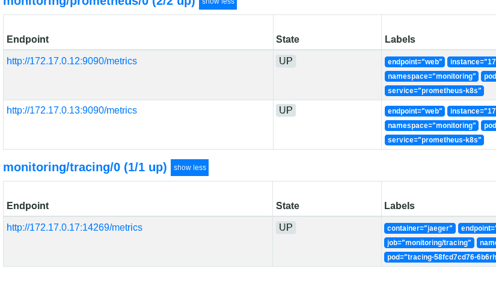
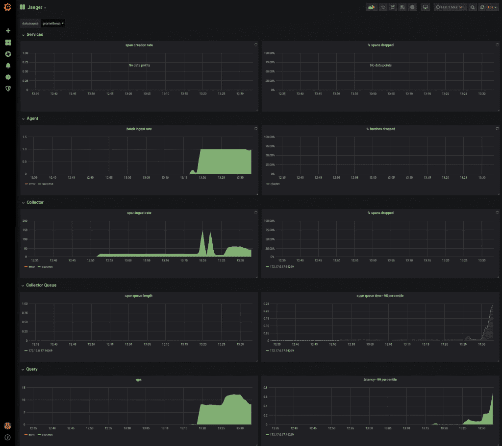

# 为您的 Jaeger 安装构建一个监控基础设施

> 原文：<https://developers.redhat.com/blog/2019/08/28/build-a-monitoring-infrastructure-for-your-jaeger-installation>

当您在生产配置中部署 [Jaeger](https://www.jaegertracing.io/) 时，关注您的 Jaeger 实例以查看它是否按预期执行是有意义的。毕竟，Jaeger 中的中断意味着跟踪数据丢失，这使得了解生产应用程序中可能发生的问题变得非常困难。

本文指导您为 Jaeger 安装构建监控基础设施。我们将首先为那些只想快速监控 Jaeger 的人提供现成资源的链接。

在第二部分中，我们将深入了解如何在一个 [Kubernetes](https://developers.redhat.com/topics/kubernetes/) 集群中安装所有工具，包括[普罗米修斯](https://prometheus.io/)、[格拉法纳](https://grafana.com/)和 Jaeger 本身，以及使用 Jaeger 官方监控 mixin 定制警报规则和仪表板所需的工具。

**TL；DR:** 如果您已经有一个包含 Grafana、Prometheus 和 Jaeger 的工作环境，您可能只需要知道基本仪表板和警报定义的位置。他们在这里:

*   [仪表板](https://github.com/jaegertracing/jaeger/blob/master/monitoring/jaeger-mixin/dashboard-for-grafana.json)
*   [警报](https://github.com/jaegertracing/jaeger/blob/master/monitoring/jaeger-mixin/prometheus_alerts.yml)

如果你已经熟悉 mixin，官方的 Jaeger 监控 mixin 可以在我们的主源代码库中找到。

## 先决条件

本指南假设您拥有 Kubernetes 集群的管理员权限。获得用于测试目的的 Kubernetes 集群的一个简单方法是通过 [Minikube](https://github.com/kubernetes/minikube) 在本地运行它。

本指南还要求您拥有 [jsonnet](https://github.com/google/go-jsonnet) 和 [jb (jsonnet-bundler)](https://github.com/jsonnet-bundler/jsonnet-bundler) 。可以使用 go get 将它们安装在您的本地计算机上，如下所示:

```
$ go get github.com/google/go-jsonnet/cmd/jsonnet
$ go get github.com/jsonnet-bundler/jsonnet-bundler/cmd/jb

```

## 安装 Prometheus、Alertmanager 和 Grafana

在 Kubernetes 上安装 Prometheus 有几种方法。安装它的一种方式是通过项目 [kube-prometheus](https://github.com/coreos/kube-prometheus) ，但是也可以直接使用 [prometheus 操作者](https://github.com/coreos/prometheus-operator)，以及用于 Prometheus 操作者的[社区掌舵图。在本指南中，我们将使用 kube-prometheus 来获取 prometheus、Alertmanager 和 Grafana 实例。](https://github.com/helm/charts/tree/master/stable/prometheus-operator)

首先，让我们使用`jb`生成一个描述我们的安装的基本`jsonnet`文件，添加`kube-prometheus`作为依赖项:

```
$ jb init
$ jb install \
  github.com/jaegertracing/jaeger/monitoring/jaeger-mixin@master \
  github.com/grafana/jsonnet-libs/grafana-builder@master \
  github.com/coreos/kube-prometheus/jsonnet/kube-prometheus@master

```

完成后，我们应该有一个名为`jsonnetfile.json`的清单文件，类似于下面这个:

```
{
    "dependencies": [
        {
            "name": "mixin",
            "source": {
                "git": {
                    "remote": "https://github.com/jpkrohling/jaeger",
                    "subdir": "monitoring/mixin"
                }
            },
            "version": "1668-Move-Jaeger-mixing-to-main-repo"
        },
        {
            "name": "grafana-builder",
            "source": {
                "git": {
                    "remote": "https://github.com/grafana/jsonnet-libs",
                    "subdir": "grafana-builder"
                }
            },
            "version": "master"
        },
        {
            "name": "kube-prometheus",
            "source": {
                "git": {
                    "remote": "https://github.com/coreos/kube-prometheus",
                    "subdir": "jsonnet/kube-prometheus"
                }
            },
            "version": "master"
        }
    ]
}

```

`install`命令也应该已经创建了包含所有`jsonnet`依赖项的`vendor`目录。我们现在只需要一个部署描述符:创建一个名为`monitoring-setup.jsonnet`的文件，内容如下。

```
local kp =
  (import 'kube-prometheus/kube-prometheus.libsonnet') +
  {
    _config+:: {
      namespace: 'monitoring',
    },
  };

{ ['00namespace-' + name + '.json']: kp.kubePrometheus[name] for name in std.objectFields(kp.kubePrometheus) } +
{ ['0prometheus-operator-' + name + '.json']: kp.prometheusOperator[name] for name in std.objectFields(kp.prometheusOperator) } +
{ ['node-exporter-' + name + '.json']: kp.nodeExporter[name] for name in std.objectFields(kp.nodeExporter) } +
{ ['kube-state-metrics-' + name + '.json']: kp.kubeStateMetrics[name] for name in std.objectFields(kp.kubeStateMetrics) } +
{ ['alertmanager-' + name + '.json']: kp.alertmanager[name] for name in std.objectFields(kp.alertmanager) } +
{ ['prometheus-' + name + '.json']: kp.prometheus[name] for name in std.objectFields(kp.prometheus) } +
{ ['prometheus-adapter-' + name + '.json']: kp.prometheusAdapter[name] for name in std.objectFields(kp.prometheusAdapter) } +
{ ['grafana-' + name + '.json']: kp.grafana[name] for name in std.objectFields(kp.grafana) }

```

这样，我们就可以生成部署清单并应用它们了:

```
$ jsonnet -J vendor -cm manifests/ monitoring-setup.jsonnet
$ kubectl apply -f manifests/

```

第一次使用自定义资源定义(CRD)时，它们可能没有准备好，从而导致出现如下消息:

```
no matches for kind "ServiceMonitor" in version "monitoring.coreos.com/v1"

```

在这种情况下，只需再次应用清单，因为它们是等幂的。

几分钟后，应该会有一些*部署*和*状态设置*资源可用:

```
$ kubectl get deployments -n monitoring 
NAME                  READY     UP-TO-DATE   AVAILABLE   AGE
grafana               1/1       1            1           56s
kube-state-metrics    1/1       1            1           56s
prometheus-adapter    1/1       1            1           56s
prometheus-operator   1/1       1            1           57s

$ kubectl get statefulsets -n monitoring
NAME                READY     AGE
alertmanager-main   3/3       60s
prometheus-k8s      2/2       50s

```

让我们通过直接连接到服务端口来检查 Prometheus 是否已启动:

```
$ kubectl port-forward -n monitoring service/prometheus-k8s 9090:9090
$ firefox http://localhost:9090

```

对 Grafana 执行同样的检查，其中用户名和密码的默认凭证都是 *admin* 。

```
$ kubectl port-forward -n monitoring service/grafana 3000:3000
$ firefox http://localhost:3000

```

## 安装 Jaeger

默认情况下，Jaeger 操作符安装在“observability”命名空间中。对于本指南，让我们将它与 Prometheus 和 Grafana 一起放在“monitoring”名称空间中。为此，我们将使用`curl`获取清单，并用`monitoring`替换`observability`，并将结果反馈给`kubectl`:

```
$ kubectl create -f https://raw.githubusercontent.com/jaegertracing/jaeger-operator/v1.13.1/deploy/crds/jaegertracing_v1_jaeger_crd.yaml
$ curl -s https://raw.githubusercontent.com/jaegertracing/jaeger-operator/v1.13.1/deploy/service_account.yaml | sed 's/observability/monitoring/gi' | kubectl apply -f -
$ curl -s https://raw.githubusercontent.com/jaegertracing/jaeger-operator/v1.13.1/deploy/role.yaml | sed 's/observability/monitoring/gi' | kubectl apply -f -
$ curl -s https://raw.githubusercontent.com/jaegertracing/jaeger-operator/v1.13.1/deploy/role_binding.yaml | sed 's/observability/monitoring/gi' | kubectl apply -f -
$ curl -s https://raw.githubusercontent.com/jaegertracing/jaeger-operator/v1.13.1/deploy/operator.yaml | sed 's/observability/monitoring/gi' | kubectl apply -f -

```

在撰写本文时，最新版本是 v1.13.1，所以请更改上面的 URL 以匹配所需的版本。过了一会儿，耶格操作员应该启动并运行了:

```
$ kubectl get deployment/jaeger-operator -n monitoring
NAME              READY     UP-TO-DATE   AVAILABLE   AGE
jaeger-operator   1/1       1            1           23s

```

一旦 Jaeger 操作符准备就绪，就该创建一个名为`tracing`的 Jaeger 实例了:

```
kubectl apply -f - <<EOF
apiVersion: jaegertracing.io/v1
kind: Jaeger
metadata:
  name: tracing
  namespace: monitoring
EOF

```

过一会儿，Jaeger 实例应该准备好了:

```
$ kubectl get deployment/tracing -n monitoring 
NAME      READY     UP-TO-DATE   AVAILABLE   AGE
tracing   1/1       1            1           17s

$ kubectl get ingress -n monitoring 
NAME            HOSTS     ADDRESS           PORTS     AGE
tracing-query   *         192.168.122.181   80        26s

```

我们可以通过在网络浏览器中打开给定的 IP 地址来访问 Jaeger UI。在本例中，它是 http://192.168.122.181/，但是您的 IP 地址可能会不同。

现在一切都运行了，让我们安装我们的业务应用程序，为它接收的每个 HTTP 请求创建 spans:

```
$ kubectl apply -n default -f https://raw.githubusercontent.com/jaegertracing/jaeger-operator/v1.13.1/deploy/examples/business-application-injected-sidecar.yaml

```

部署就绪后，我们可以打开与 Pod 的直接连接，并开始向它发送请求:

```
$ kubectl get -n default deployment/myapp 
NAME      READY     UP-TO-DATE   AVAILABLE   AGE
myapp     1/1       1            1           26s

$ kubectl port-forward deployment/myapp 8080:8080
$ watch -n 0.5 curl localhost:8080

```

这将每秒生成两个 HTTP 请求，对于每个 HTTP 请求，我们应该在 Jaeger UI 中看到一个新的跟踪。

## 创建 PodMonitor

至此，我们拥有了一套功能齐全的监控服务:Prometheus、Grafana、Alertmanager 和 Jaeger。然而，从我们的 Jaeger 部署中生成的指标不会被 Prometheus 抓取:我们需要创建一个`ServiceMonitor`或`PodMonitor`来告诉 Prometheus 从哪里获取我们的数据。

根据组件的不同，指标在不同的端口提供:

| 成分 | 港口 |
| --- | --- |
| 代理人 | Fourteen thousand two hundred and seventy-one |
| 收藏者 | Fourteen thousand two hundred and sixty-nine |
| 询问 | Sixteen thousand six hundred and eighty-seven |
| 多合一 | Fourteen thousand two hundred and sixty-nine |

由于我们创建的 Jaeger 实例没有指定一个[策略](https://www.jaegertracing.io/docs/1.13/operator/#deployment-strategies)，所以选择了默认策略`allInOne`。然后，我们的`PodMonitor`将告诉 Prometheus 从端口 14269 获取指标:

```
$ kubectl apply -f - <<EOF
apiVersion: monitoring.coreos.com/v1
kind: PodMonitor
metadata:
  name: tracing
  namespace: monitoring
spec:
  podMetricsEndpoints:
  - interval: 5s
    targetPort: 14269
  selector:
    matchLabels:
      app: jaeger
EOF

```

普罗米修斯可能需要几分钟才能看到这个新目标。检查`Targets`页面，寻找目标`monitoring/tracing/0`。一旦 Prometheus 抓取了 Jaeger 的指标端点，我们就可以在 Prometheus 图形视图中看到 Jaeger 特定的指标。例如，输入`jaeger_collector_traces_saved_by_svc_total`并点击`Execute`。图中显示的跟踪数量应该会随着时间的推移而增加，这反映了我们在前面的步骤中针对业务应用程序运行的 HTTP 请求的数量。



## 改编混音

现在，我们可以在 Prometheus 中获得来自 Jaeger 实例的指标，但是哪些指标应该显示在仪表板上，哪些警报应该在什么情况下生成？

虽然很难找到一个通用的、放之四海而皆准的答案来回答这些问题，但我们在 Grafana Labs 的朋友为 Jaeger 设计了一个 mixin，为您自己的仪表盘和警报提供了一个起点。mixin 已经被贡献给了 Jaeger 项目，可以在主库下获得。

让我们回到最初的`monitoring-setup.jsonnet`并添加特定于 Jaeger 的仪表板和警报规则:

```
local jaegerAlerts = (import 'jaeger-mixin/alerts.libsonnet').prometheusAlerts;
local jaegerDashboard = (import 'jaeger-mixin/mixin.libsonnet').grafanaDashboards;

local kp =
  (import 'kube-prometheus/kube-prometheus.libsonnet') +
  {
    _config+:: {
      namespace: 'monitoring',
    },
    grafanaDashboards+:: {
      'jaeger.json': jaegerDashboard['jaeger.json'],
    },
    prometheusAlerts+:: jaegerAlerts,
  };

{ ['00namespace-' + name + '.json']: kp.kubePrometheus[name] for name in std.objectFields(kp.kubePrometheus) } +
{ ['0prometheus-operator-' + name + '.json']: kp.prometheusOperator[name] for name in std.objectFields(kp.prometheusOperator) } +
{ ['node-exporter-' + name + '.json']: kp.nodeExporter[name] for name in std.objectFields(kp.nodeExporter) } +
{ ['kube-state-metrics-' + name + '.json']: kp.kubeStateMetrics[name] for name in std.objectFields(kp.kubeStateMetrics) } +
{ ['alertmanager-' + name + '.json']: kp.alertmanager[name] for name in std.objectFields(kp.alertmanager) } +
{ ['prometheus-' + name + '.json']: kp.prometheus[name] for name in std.objectFields(kp.prometheus) } +
{ ['prometheus-adapter-' + name + '.json']: kp.prometheusAdapter[name] for name in std.objectFields(kp.prometheusAdapter) } +
{ ['grafana-' + name + '.json']: kp.grafana[name] for name in std.objectFields(kp.grafana) }

```

让我们生成新的清单:

```
$ jsonnet -J vendor -cm manifests/ monitoring-setup.jsonnet

```

应该只更改了几个清单，但是再次应用所有清单是安全的:

```
$ kubectl apply -f manifests/

```

过了一会儿，Grafana 的新 pod 应该会取代之前的 pod:

```
$ kubectl get pods -n monitoring -l app=grafana
NAME                       READY     STATUS    RESTARTS   AGE
grafana-558647b59-fkmr4    1/1       Running   0          11m
grafana-7bcb7f5b9b-6rv2w   0/1       Pending   0          8s

```

**提示:**使用 Minikube 时，你的新 pod 可能会因为*CPU*不足而卡在*挂起*状态。可以通过运行`kubectl describe -n monitoring pod POD_NAME`检查原因，用`kubectl delete -n monitoring pod POD_NAME`手动杀死旧 pod，或者用标志`--cpus`更高的值启动`minikube`。

一旦新的 Grafana pod 启动并运行，您应该会看到 Grafana 有一个新的 Jaeger 仪表板可用，显示 Prometheus 提供的数据。同样的，普罗米修斯中应该会有新的警报规则:寻找名字中带有“Jaeger”的，比如`JaegerCollectorQueueNotDraining`。



## 包扎

在云原生微服务的世界中，部署可观察性工具以洞察您的业务应用是必要的，并且能够监控这些工具的行为是必不可少的。这篇博文展示了一种在 Kubernetes 中建立并运行完整堆栈的方法，最终目标是使用 Jaeger 自己的内部指标来监控 Jaeger。可以扩展相同的设置，让 Prometheus 从您的业务应用程序中抓取指标，Grafana 作为仪表板工具来可视化数据。

你已经在用 Grafana 来可视化从 Jaeger 那里收集的数据了吗？与我们分享您的仪表板，我们可能会在官方 Jaeger monitoring mixin 中为它们留有一席之地！

### 即将来临的

[Jura ci paix o krhling](https://twitter.com/jpkrohling)将介绍“我的微服务在做什么？”在红帽”发展。展开。持续交付。”虚拟活动，2019 年 10 月 10 日星期四。

*Last updated: January 5, 2022*