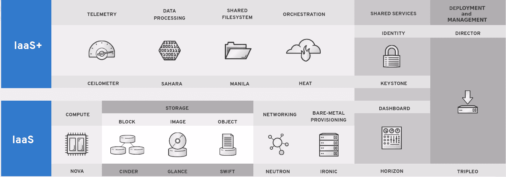
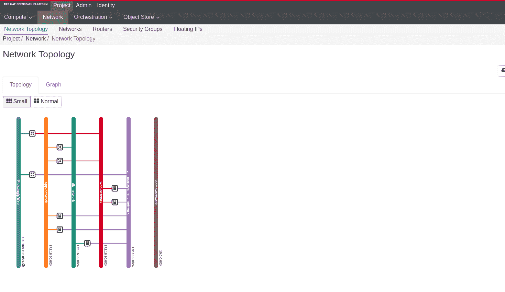
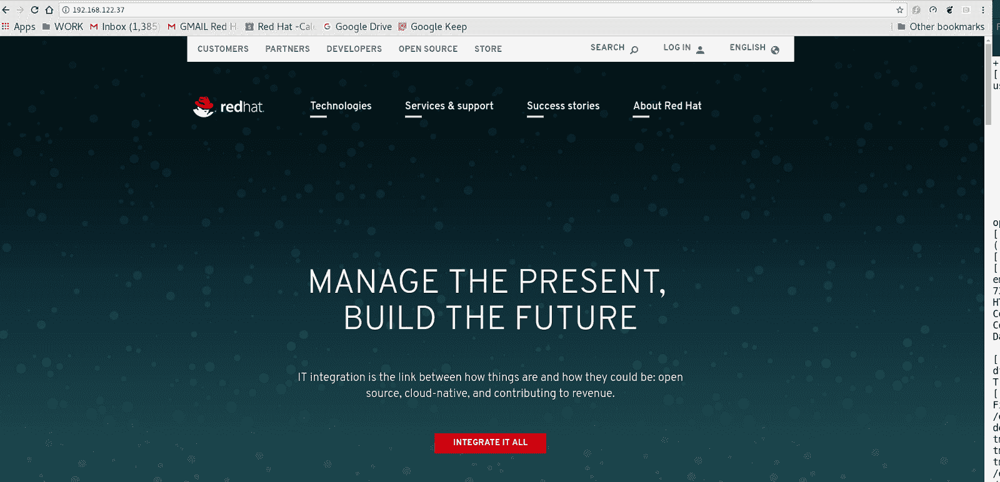

# 使用 Red Hat CloudForms 和 Openstack 构建您的软件定义的数据中心-第 1 部分

> 原文：<https://developers.redhat.com/blog/2017/11/02/build-software-defined-data-center-red-hat-cloudforms-openstack-2>

在这篇博客中，我将向您展示如何使用两款令人惊叹的红帽产品: **红帽 OpenStack 平台** 和 **红帽 CloudForms** 创建您的 **完全软件定义的数据中心** 。因为这篇文章的长度，我把它分成了两部分。

你可能知道，每个组织都需要将自己发展成为一家科技公司，利用自己的数字化转型，拥抱或增强现有流程，发展人们的思维模式、软硬技能，当然还需要使用新技术。

请记住，我们生活在一个数字时代，如果你不改变自己和你的组织，就会有人扰乱你的业务！

那么，我怎样才能在我的事业中变得具有颠覆性呢？

从纯技术的角度来说，一个好的方法应该考虑云技术。

这些技术可以成为您数字化转型战略的第一块砖，因为它们可以赋予业务和技术价值。

例如，您可以:

*   快速按需构建新服务
*   以自助方式进行
*   减少人工活动
*   扩展服务和工作负载
*   响应请求高峰
*   为您的客户提供服务质量和 SLA
*   快速响应客户需求
*   缩短上市时间
*   改善总体拥有成本
*   ...

在我作为解决方案架构师的经历中，我看到了许多不同的方法来构建您的云。

当然，你需要确定你的业务需求，然后评估你的使用案例，建立你的用户故事，然后开始思考科技产品及其影响。

记住，不要从技术角度开始接近这类项目。没有比这更糟的了。我的建议是，开始思考你想向你的客户/最终用户传递的价值。

通常，客户首先想到的技术问题是:

我想提供什么样的服务？

*   我需要管理哪些用例？
*   我需要公共云、私有云还是两者的混合(混合)？
*   我喜欢使用基于实例的环境(Iaas)还是基于容器的环境(Paas for friends)还是 Saas？
*   构建和管理云环境有多复杂？
*   哪些产品将帮助我的组织实现这些目标？
*   …

好消息是，Red Hat 可以为您提供令人惊叹的解决方案、人员和流程。

**动手部分 1**

现在让我们开始考虑基于实例/虚拟机概念的云环境。

在这里，我们说的是 **红帽 OpenStack 平台 11** ( RHOSP)。

现在我不想详细解释 RHOSP 11 中所有可用的模块，但基本上，只是给你一个简要的概述，你可以在下图中看到它们。

*图片 1*

为了以快速、完全自动化的方式构建 SDDC，在这篇博客中，您将看到如何使用几乎所有这些模块来实现目标，重点是流程编排引擎。

HEAT 是非常强大的编排引擎，它能够从单个实例构建到非常复杂的架构，该架构由实例、网络、路由器、负载平衡器、安全组、存储卷、浮动 IP、警报以及或多或少由 OpenStack 管理的所有对象组成。

你唯一要做的就是开始写一个用 yaml [ [1](https://docs.openstack.org/heat/latest/template_guide/index.html) 写的 HEAT 编排模板(HOT)，让 Heat 帮你执行。

HEAT 将成为我们构建软件定义的数据中心的驱动力，利用您的所有请求管理所有需要的 OpenStack 组件。

所以，第一件事是建立一个热模板对不对？好了，让我们开始克隆我的 git 回购:

[https://gitlab.com/miken/rhosp_heat_stack.git](https://gitlab.com/miken/rhosp_heat_stack.git)

该热堆栈将创建一个三层应用程序，其中包含 2 个 web 服务器、2 个应用服务器、1 个数据库、一些专用的私有网段和虚拟路由器，用于将私有网段与浮动 IP 互连并隔离网络。两个 lbaas v2(一个用于 FE，一个用于 APP 层)、自动扩展组、cinder-volumes(从卷引导)、临时安全组和 Aodh 警报扩展/缩减策略等等。

什么？是的，所有这些东西:-)

在本例中，web 服务器将运行 httpd 2.4，应用服务器将在端口 8080 上加载一个简单的 python http 服务器，而 db 服务器现在只是一个占位符。

当然，在现实世界中，您将使用 heat 或 ansible playbook 以自动、可重复和幂等的方式安装和配置您的应用服务器和数据库服务器。

在这个回购协议中，你会发现:

*   **stack-3tier.yaml**

    *   **lb-resource-stack-3 tier . YAML**
        *   配置 lbaas v2(负载平衡器即服务:基于名称空间的 HA 代理)的热模板。主热模板将通过 http 检索该文件。
*   **Run.sh**
    *   要执行的 Bash 脚本:
        *   OpenStack 项目创建
        *   用户管理
        *   在预先配置的 OpenStack 租户下创建热堆栈
        *   删除之前的点(如果你需要)

如同 **先决条件** 要构建你的环境，你需要准备:

搭载 RHEL 7 的笔记本电脑或英特尔 NUC。X + kvm 能够托管两个虚拟机(1 个一体化 OpenStack 虚拟机和 1 个 CloudForms 虚拟机)。

我建议使用 32 GB 内存和至少 250 GB 固态硬盘的服务器。

*   rhel 7.4 上的 OpenStack 11 all-in-one VM(与 packstack 一起安装可用 **仅** 用于测试/演示目的)与
    *   20 GB 内存
    *   4-8 个 vcpu 更好 8 :-)
    *   150 GB 的磁盘(将 cinder-volumes 存储为一个文件)
    *   1 个虚拟网卡(nat 可以)
    *   可用于所有项目的预配置外部共享网络

**open stack network create-share-external-provider-network-type flat \-provider-physical-network extent floating IP web \**

**open stack subnet create-subnet-range 192 . 168 . 122 . 0/24 \-allocation-pool start = 192 . 168 . 122 . 30，end = 192 . 168 . 122 . 50-no-DHCP-gateway 192 . 168 . 122 . 1-network floating ipweb-DNS-name server \ 192 . 168 . 122 . 1 floating ipweb subnet**

*   rhosp 虚拟机上的一个新的 Apache 虚拟主机来托管我们的负载平衡器 yaml 文件。

root @ OSP conf . d(keystone _ admin)]# cat/etc/httpd/conf/ports . conf | grep 8888

听着 8888

[root @ OSP conf . d(keystone _ admin)]# cat**/etc/httpd/conf . d/heat stack . conf**

**<虚拟主机*:8888 >**

**服务器名 osp.test.local**

**   ServerAlias 192.168.122.158**

**document root/var/www/html/heat-templates/**

**错误日志/var/日志/httpd/heat tack _ error . log**

**custom log/var/log/httpd/heat stack _ requests . log 组合**

**</虚拟主机>**

*   Iptables 防火墙规则允许网络流量流向 tcp 端口 8888。

**iptables -I 输入 13 -p tcp -m 多端口- dports 8888 -m 注释-注释“热栈 8888 端口检索”-j 接受**

就这些。

让我们克隆 git repo，做一些修改，然后开始。

*   修改 stack-3tier.yaml
    *   取消注释 **tenant_id** 行

如果您正在通过 bash 脚本 run.sh 执行热堆栈，请不要担心。Run.sh 将负责更新 tenant_id 参数。

否则，如果您通过 CloudForms 或通过 heat 手动执行，请根据您的环境配置更新 tenant_id。

稍后我们会看到为什么我用 str_replace 做了一些小的修改。:-)

让我们获取 keystonerc_admin(以 admin 身份)并在 rhosp 服务器上运行 bash 脚本:

**root @ OSP ~]# source/root/keystone RC _ admin**

**[root @ OSP heat-templates(keystone RC _ admin)]# bash-x run . sh create**

在自动创建租户(演示租户)之后，您将在输出中看到 heat 正在创建我们的资源。

2017-10-05 10:06:14Z[演示-租户]: CREATE_IN_PROGRESS 堆栈创建开始

2017-10-05 10:06:15Z[demo-tenant . web _ network]:CREATE _ IN _ PROGRESS 状态已更改

2017-10-05 10:06:16Z[demo-tenant . web _ network]:CREATE _ COMPLETE 状态已更改

2017-10-05 10:06:16Z[demo-tenant . boot _ volume _ db]:CREATE _ IN _ PROGRESS 状态已更改

2017-10-05 10:06:17Z[demo-tenant . web _ subnet]:CREATE _ IN _ PROGRESS 状态已更改

2017-10-05 10:06:18Z[demo-tenant . web _ subnet]:CREATE _ COMPLETE 状态已更改

2017-10-05 10:06:18Z[demo-tenant . web-to-provider-router]:CREATE _ IN _ PROGRESS 状态已更改

2017-10-05 10:06:19Z[demo-tenant . internal _ management _ network]:CREATE _ IN _ PROGRESS 状态已更改

2017-10-05 10:06:19Z[demo-tenant . internal _ management _ network]:创建 _ 完成状态已更改

2017-10-05 10:06:20Z[demo-tenant . web _ SG]:CREATE _ IN _ PROGRESS 状态已更改

2017-10-05 10:06:20Z[demo-tenant . web-to-provider-router]:CREATE _ COMPLETE 状态已更改

2017-10-05 10:06:20Z[demo-tenant . web _ SG]:CREATE _ COMPLETE 状态已更改

2017-10-05 10:06:21Z[demo-tenant . management _ subnet]:CREATE _ IN _ PROGRESS 状态已更改

…输出被截断

您还可以登录 Horizon dashboard，从 Orchestration - > Stack 查看热堆栈的状态

*画面二*

点击我们的堆栈名称，您还可以看到由 heat 管理的所有资源及其当前状态( *图 2)。*

*画面三*

10-12 分钟后，你的热堆就完成了。在生产环境中，您将在 2 分钟内达到相同的目标！是的，2 分钟就能拥有一个完全自动化的软件定义的数据中心！

让我们转到“Network Topology”选项卡，检查我们的堆栈部署了什么。

爽！一切都按预期部署。

*画面四*

现在，您可能想知道这种环境管理哪种服务。

让我们看看公开我们服务的 Lbaas 是否已经启动并运行:

**[root @ OSP ~(keystone _ admin)]# neutron LBA as-load balancer-list-c name-c VIP _ address-c provisioning _ status**

中子 CLI 已被弃用，将来会被删除。请改用 OpenStack CLI。

+-+-+

|姓名| vip _ 地址|供应 _ 状态|

+-+-+

| demo-3 tier-stack-app _ load balancer-kjkdiehsldkr | 172 . 16 . 30 . 4 | ACTIVE |

| demo-3 tier-stack-web _ load balancer-ht5 wirjwcof 3 | 172 . 16 . 10 . 12 | ACTIVE |

+-+-+

现在获取与我们的 web lbaas 关联的浮动 ip 地址。

**[root @ OSP ~(keystone _ admin)]# open stack 浮动 ip 列表-f 值-c“浮动 IP 地址”-c“固定 IP 地址”| grep 172.16.10.12**

192.168.122.37

所以，我们的外部浮动 IP 是 192.168.122.37。

让我们来看看什么是暴露:-)

哇，红帽公共网站托管了我们的 OpenStack！

*图片 5*

我已经将我们的 Red Hat 公司网站克隆为一个静态网站，因此我们的应用程序和数据库服务器并没有真正公开服务，但是当然，您可以扩展这个堆栈，安装在您的应用程序/数据库服务器上，以公开您的服务。

现在，我想向您展示这个网站确实是在我们的实例上运行的，所以让我们滚动页面直到页脚

*画面六*

在这里，您可以看到是哪个实例向您展示了网站:

**我是 web-eg4q.novalocal 创建于美国东部时间 2017 年 10 月 5 日星期四 12:11:33**

进行刷新时，我们的 Lbaas 将对其他 web 实例执行循环调度；

**我是 web-9hhm.novalocal 创建于美国东部时间 2017 年 10 月 5 日星期四 12:12:51**

这就是为什么我建议你修改 **str_replace** 以适应你想在网页上修改的内容。

在这种情况下，我已经更改了页脚，以便清楚地向您显示哪个服务器正在响应我们的 http 请求。

[https://docs . open stack . org/heat/latest/template _ guide/index . html](https://docs.openstack.org/heat/latest/template_guide/index.html)

* * *

**下载 Kubernetes** [**备忘单**](https://developers.redhat.com/promotions/kubernetes-cheatsheet/)****跨主机集群自动部署、扩展和操作应用容器，提供以容器为中心的基础设施。****

***Last updated: October 30, 2017***