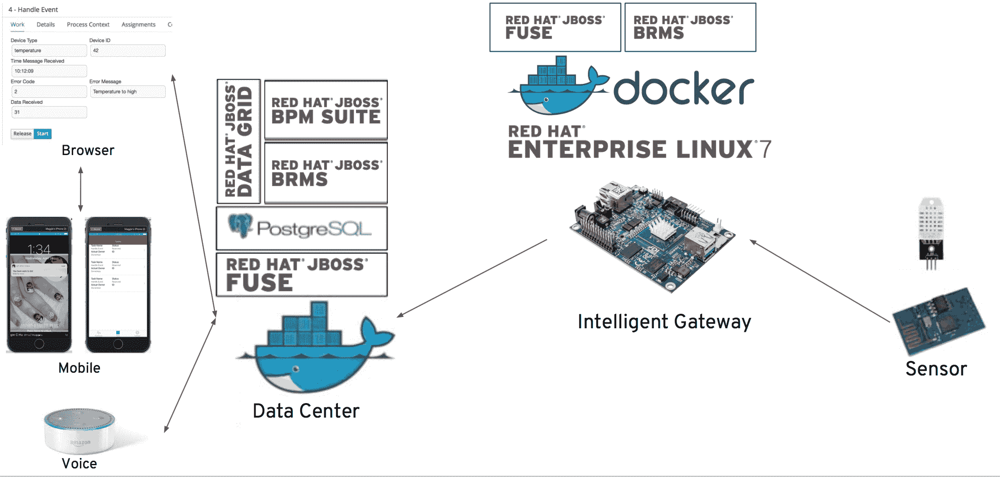

# 构建安全的物联网解决方案:2017 年峰会

> 原文：<https://developers.redhat.com/blog/2017/06/22/building-a-secure-iot-solution-summit-2017>

客户如何使用商用级开源产品构建端到端物联网解决方案？这是我们(帕特里克·斯坦纳、小麦和我)想在红帽子峰会上提出的问题。端到端解决方案基于三层 [企业物联网架构](https://www.redhat.com/cms/managed-files/is-intelligent-gateways-for-the-iot-technology-overview-us107776-201701-us.pdf) ，将物联网数据与现有业务流程和人的因素相集成。

为了真实起见， 我们不仅开出了处方，还通过互动演示展示了这一端到端解决方案。该用例设想了一个海上石油钻井平台，该平台配有数万个传感器，用于监控关键设备和人员。我们选择了 Red Hat 基础设施、中间件和移动产品的组合来展示使用企业级产品构建全面解决方案的简易性。智能物联网网关应对了从终端设备消费数据的挑战。建立在安全基础上的智能物联网网关(Red Hat Enterprise Linux)不仅可以转换和路由传感器数据(JBOSS A-MQ，JBOSS Fuse)，还可以提供实时决策(JBOSS BRMS)。网关将聚合数据发送到数据中心进行复杂事件处理(JBOSS BRMS)和内存数据库(JBOSS DataGrid)。如果数据表明出现故障，则会创建一个工作订单(JBOSS BPM)并将通知发送到员工的移动设备(Red Hat Mobile Application Platform)。

在现场演示中，当温度读数超过预定义的阈值时，系统会创建一个工作指令，并向移动设备发送警报。为了好玩，亚马逊的 Echo 被用于 Alexa 界面与 BPM 交互。问“Alexa 情况如何”很有趣并且它用“温度太高”的消息来响应。然后 Alexa 问我们是否想关闭工作订单，并继续这样做。每个人都是观众，享受着系统端到端的无缝运行。

我们收到了许多关于物联网网关功能的问题，例如，如何转换消息格式，传入的传感器数据使用 MQTT 协议，而发送到数据中心的数据使用 REST。还讨论了 message broker (JBOSS A-MQ)的多协议支持和部署模型，即在本地或云中部署的灵活性。还有一个关于数据速度的讨论，传入的数据(温度/湿度)每隔几秒钟就会收到一次，但是发送到后端应用程序的传出数据却很少，而且是以聚合形式发送的。网关本身是通过使用 Ansible playbook 提供的。

不讨论安全性，任何关于企业物联网解决方案的讨论都是不完整的。端到端解决方案需要在几个层次上整合安全性，从通过 SELinux 提供的系统级安全性，到通过 SSL 和加密实现的数据安全性。保护数据的另一个要素可以是通过 API 管理，其中监视对设备和应用 API 的访问以发现任何异常行为，从而防止对数据的未授权访问。

本次会议的演示材料可在:获取

[https://www . slide share . net/ishuverma 11/building-secure-IOT-solutions-with-red-hat](https://www.slideshare.net/IshuVerma11/building-secure-iot-solutions-with-red-hat)

你也可以在 YouTube 上观看这段视频，[https://www.youtube.com/watch?v=Nh-5XuwhExQ](https://www.youtube.com/watch?v=Nh-5XuwhExQ)。

* * *

**利用您的红帽开发者会员资格和** [**免费下载 RHEL**](http://developers.redhat.com/products/rhel/download/) **。**

*Last updated: June 23, 2017*