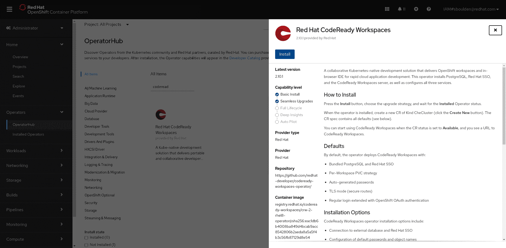
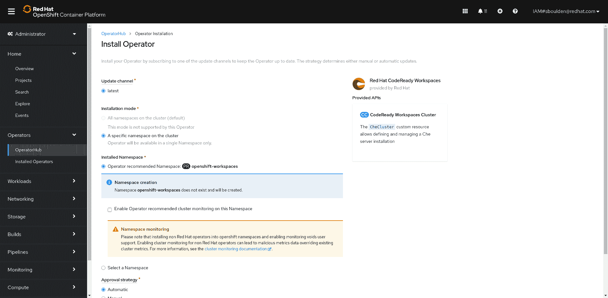
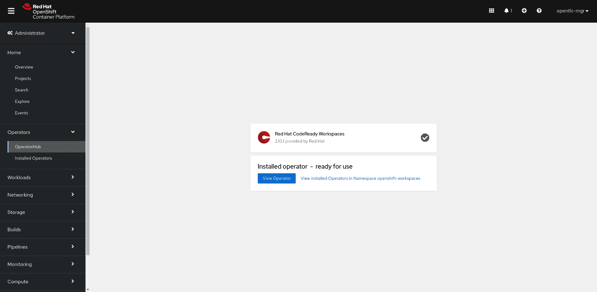
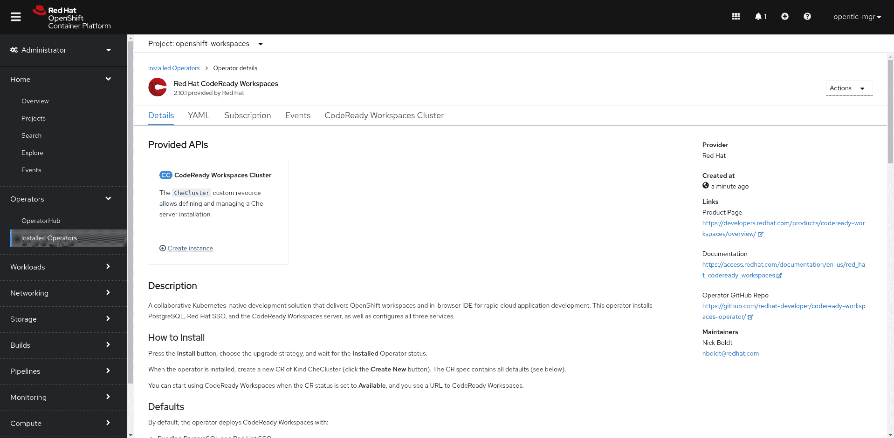
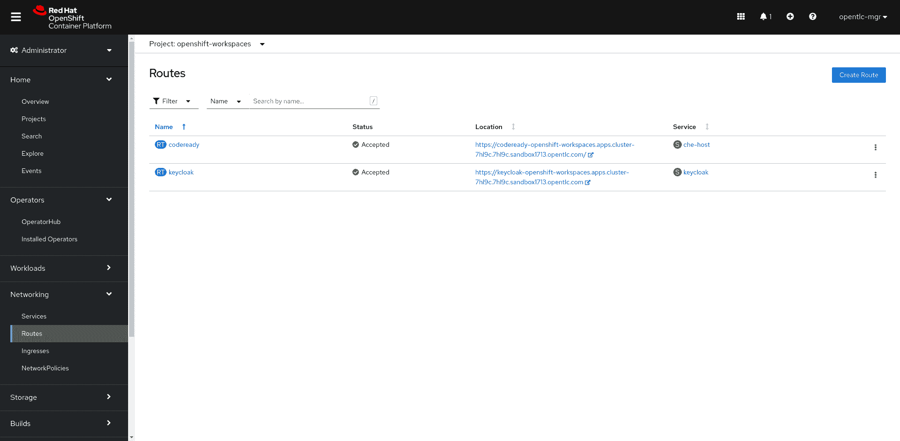
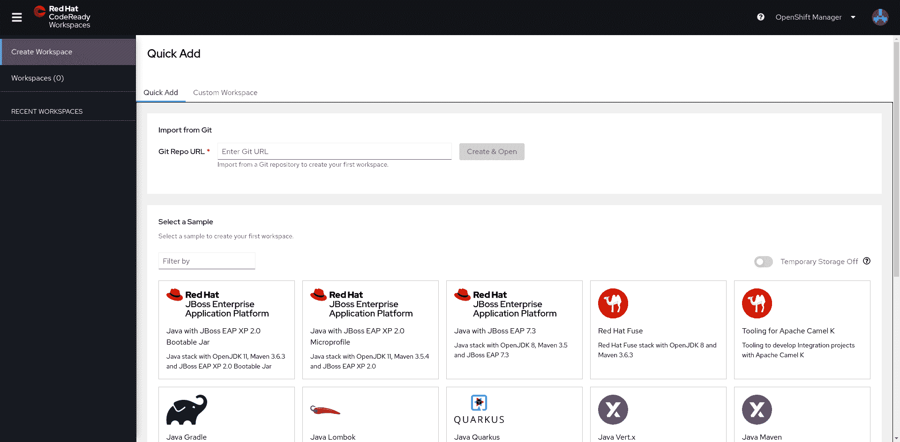
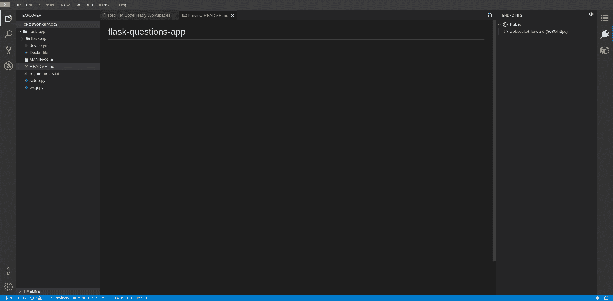
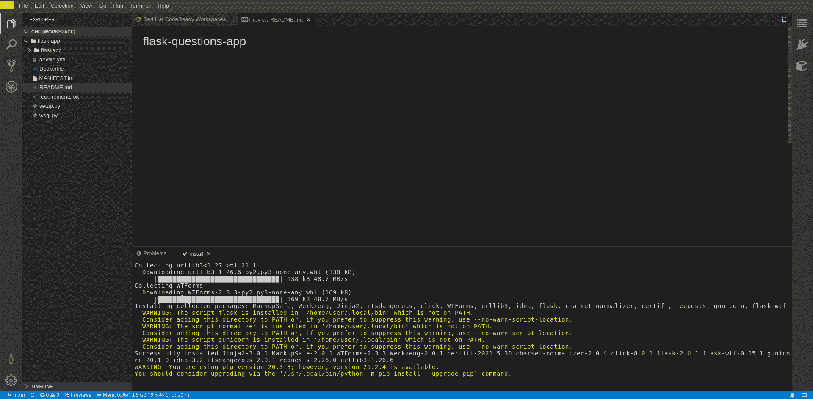
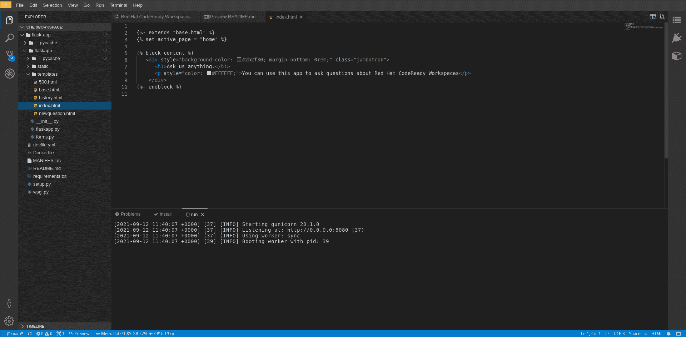

# Red Hat OpenShift 上的集装箱 Python 烧瓶开发

> 原文：<https://developers.redhat.com/blog/2019/02/18/containerized-python-flask-development-environment-red-hat-codeready-workspaces>

[Red Hat code ready work spaces](/products/codeready-workspaces/overview/)为开发者提供托管在 [Kubernetes](/topics/kubernetes/) 和 [Red Hat OpenShift](/openshift) 上的容器化开发环境。拥有一个为您选择的堆栈预先构建并为您的项目定制的托管开发环境，可以让新开发人员更容易入职，因为他们需要的一切都已经在容器化的工作区中运行。

在本文中，我将向您展示如何使用 CodeReady 工作区快速启动并运行一个基于 Flask 的 [Python](/topics/python) 项目。我们将设置环境，对应用程序进行一些修改，然后在容器化的开发环境中验证和检验这些变化。

## 针对 OpenShift 4 更新

按照本文中的例子，你需要 [OpenShift 4](/products/openshift/whats-new) 。您可以在 Windows、macOS 或 Linux 笔记本电脑上使用[Red Hat code ready Containers](/products/codeready-containers/overview)。或者，你可以在[红帽 OpenShift](/developer-sandbox) 开发者沙盒中免费访问托管的红帽 OpenShift 容器平台集群。

我们开始吧！

## 部署 CodeReady 工作区

CodeReady Workspaces 使用 Kubernetes 操作符进行部署。Kubernetes 操作符基本上是一种打包、部署和管理 Kubernetes 应用程序的方法。

**注意**:如果你想了解更多关于运营商框架的信息，请参阅 Brandon Philips 在 [OpenShift 博客](https://blog.openshift.com/introducing-the-operator-framework/)上的精彩文章。

CodeReady Workspaces 可通过 OpenShift 操作员中心获得。找到 CodeReady Workspaces 操作符后，如图 1 所示安装它。



Figure 1: Installing the CodeReady Workspaces Operator.

为这个安装选择缺省值，如图 2 所示。



Figure 2: The default configuration for the CodeReady Workspaces Operator.

当 CodeReady Workspaces 操作符安装完毕并可以使用时，您将看到如图 3 所示的通知。



Figure 3: The operator has been successfully installed.

一旦安装了操作器，您可以在**安装的操作器**下访问它。从这里，选择 **CodeReady 工作区集群**定制资源旁边的**创建实例**。接受所有默认设置，并选择 **Create** ，如图 4 所示。



Figure 4: Creating a CodeReady Workspaces cluster with the operator.

操作员现在将接管并创建 CodeReady 工作区集群的所有组件。一旦完成，您将看到几条新的路线，如图 5 所示。



Figure 5: New routes for CodeReady Workspaces created by the operator.

导航到 CodeReady 路径，按照提示使用单点登录(SSO)进行身份验证，您将被定向到图 6 所示的仪表板。



Figure 6: The CodeReady Workspaces dashboard.

接下来，我们将为 Python 项目设置 Flask 工作空间。

## 创建烧瓶工作空间

我们将使用一个 [devfile](/blog/2019/12/09/codeready-workspaces-devfile-demystified) 来为我们的应用程序创建工作空间。一个 *devfile* 是一种编码容器化工作空间的方式，通常与应用程序源代码存储在一起，这样它就可以与应用程序一起进行版本控制。下面是示例 Flask 应用程序的[开发文件:](https://github.com/shaneboulden/flask-questions-app/blob/main/devfile.yml)

```
apiVersion: 1.0.0
metadata:  
  generateName: flask-
projects:
  - name: flask-app
    source:
      type: git
      location: "https://github.com/shaneboulden/flask-questions-app"
components:
  - type: chePlugin
    id: ms-python/python/latest
  - type: dockerimage
    alias: python
    image: quay.io/eclipse/che-python-3.8:next
    memoryLimit: 512Mi
    mountSources: true
    env:
      - name: FLASK_SECRET
        value: 'you-will-never-guess'
    endpoints:
      - name: websocket-forward
        port: 8080
        attributes:
          protocol: http
          secure: 'false'
          public: 'true'
          discoverable: 'false'
commands:
  - name: run
    actions:
      - type: exec
        component: python
        command: '${HOME}/.local/bin/gunicorn wsgi:application -b 0.0.0.0:8080'
        workdir: '${CHE_PROJECTS_ROOT}/flask-app'
  - name: install
    actions:
      - type: exec
        component: python
        command: 'pip3 install -r requirements.txt'
        workdir: '${CHE_PROJECTS_ROOT}/flask-app'
```

让我们来分解这个开发文件:

*   新的工作区将以一个以`flask-`开头的名称生成。
*   这个项目的源代码托管在[https://github.com/shaneboulden/flask-questions-app](https://github.com/shaneboulden/flask-questions-app)并将被克隆到工作区。
*   我们使用的是 Quay.io 托管的 [Eclipse Che](https://www.eclipse.org/che/docs/che-7/hosted-che/hosted-che/) 项目中的一个基本 Python 环境。
*   我们已经将从这个 devfile 创建的工作区限制到 512 MB 内存。
*   我们为 Flask 跨站点请求伪造(CSRF)秘密创建了一个环境变量，确保秘密不存储在源中。
*   我们已经为开发中使用的 web 服务器创建了一个端点。这将允许我们在容器化的工作空间内测试 Flask 应用程序。
*   我们已经创建了两个命令，`install`和`run`。我们将使用这些来轻松地安装应用程序依赖项，运行 web 服务器，并查看我们对 Flask 应用程序的更改。

从 CodeReady 工作区仪表板中选择**自定义工作区**。然后，在下面表单的 **Devfile** 部分指定 devfile URL(图 7):

`https://raw.githubusercontent.com/shaneboulden/flask-questions-app/main/devfile.yml`


Figure 7: Specify the devfile URL in the custom workspace configuration.

选择**加载开发文件— >创建&打开**开始创建定制工作区。当它完成时，您将看到新的工作区，源代码浏览器打开，如图 8 所示。


Figure 8: The new custom workspace for Flask.

## 探索 Flask 工作区

既然我们的工作区已经创建好了，让我们来研究一下我们已经创建的一些配置。选择右边的电源线以查看端点(图 9)。



Figure 9: Viewing the devfile endpoints.

这里为端口 8080 创建了一个端点。当我们在工作区内运行 web 服务器时，这个端点将被激活，这样我们就可以查看应用程序了。

我们还有几个由 devfile 创建的命令。如果您选择**终端— >运行任务**，您将看到如图 10 所示的命令。


Figure 10: A list of runnable tasks.

让我们先运行**安装**。当您执行任务时，您应该看到一个终端输出窗口打开，如图 11 所示。



Figure 11: Run the Install task.

我们的依赖项现在已经安装好了，所以让我们运行应用程序。选择**终端— >运行任务**和**运行**命令。您将看到 web 服务器在新窗口的新终端输出中打开。CodeReady 工作区还将检测端点现在是否可用，并提示您在新的选项卡中打开它，或者在工作区中预览它。图 12 显示了端点提示。


Figure 12: Open or preview the endpoint in CodeReady Workspaces.

选择任一选项来查看 Flask 应用程序，如图 13 所示。


Figure 13: Viewing the Flask web application.

## 更新 Flask 应用程序

一切看起来都很好！我们已经为我们的应用程序开发环境创建了一个容器化的工作区，以及几个编码的命令和端点，我们可以使用它们来快速准备环境并让我们的应用程序运行起来。

让我们做一个改变，看看它是如何反映在工作空间中的。展开源代码浏览器并找到`index.html`文件，如图 14 所示。



Figure 14: The index template in code explorer.

更改线路:

`<h1>Ask us anything.</h1>`

阅读:

`<h1>Welcome.</h1>`

停止 web 服务器(在**运行**窗口中按 **Ctrl-C** ，选择**终端— >运行最后一个任务**重启 web 服务器。或者也可以按 **Ctrl-Shift-K** 。再次打开 preview 或 new 选项卡，验证页面现在是否包含新的问候语，如图 15 所示。


Figure 15: Verify the update.

## 使用 Python、Flask 和 OpenShift 做更多事情

现在，我们的 Flask 应用程序有了一个容器化的开发环境，它托管在 OpenShift 上，我们可以随时访问它。当新的开发人员加入团队时，我们可以简单地允许他们用 devfile 加载工作区，并快速实例化他们自己的开发环境。对 devfile 的所有更改都受应用程序源代码的版本控制，因此我们可以使我们的开发环境与 Flask 应用程序保持同步。

如果您想进一步学习本文中的内容，可以为机器学习工作流创建一个 Python 开发环境。Brian Nguyen 的[优秀文章](https://cloud.redhat.com/blog/configure-code-ready-workspace-for-developing-machine-learning-workflow)将带你入门。此外，参见[使用定制的 devfile 注册表和 C++与 Red Hat CodeReady 工作区](/blog/2021/04/14/using-a-custom-devfile-registry-and-c-with-red-hat-codeready-workspaces)和 [Devfiles 和 Kubernetes 集群支持 open shift Connector 0 . 2 . 0 extension for VS Code](/blog/2020/11/16/devfiles-and-kubernetes-cluster-support-in-openshift-connector-0-2-0-extension-for-vs-code)，了解关于示例中使用的技术的更多信息。访问 [CodeReady 工作区登录页面](/products/codeready-workspaces/overview)了解更多关于 CodeReady 工作区的信息。

*Last updated: September 27, 2021*