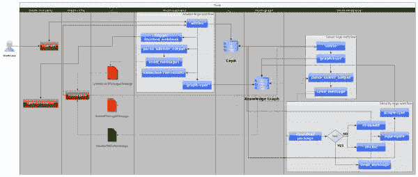
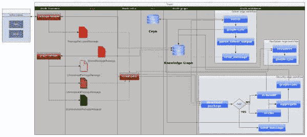

# 利用卡夫卡和阿尔戈在透特计划中持续学习

> 原文：<https://developers.redhat.com/blog/2021/04/26/continuous-learning-in-project-thoth-using-kafka-and-argo>

Thoth 项目为 [Python](https://developers.redhat.com/blog/category/python/) 程序员提供了关于他们所使用的包的支持、依赖性、性能和安全性的信息。现在它主要关注托管在 [Python 包索引(PyPI)](https://pypi.org/#:~:text=The%20Python%20Package%20Index%20(PyPI,shared%20by%20the%20Python%20community.&text=Package%20authors%20use%20PyPI%20to,your%20Python%20code%20for%20PyPI.) 和其他 Python 索引上的预构建二进制包。透特收集了如下指标:

*   [解算器](https://github.com/thoth-station/solver)表示一个包是否可以安装在一个特定的运行时环境上，比如运行 Python 3.6 的[红帽企业 Linux](https://developers.redhat.com/products/rhel/overview) 8。
*   [安全指示器](http://github.com/thoth-station/si-aggregator)通过优化软件堆栈来最小化我们计算的安全漏洞分数，从而发现漏洞并提供安全建议。
*   [项目元信息](https://github.com/thoth-station/mi)调查影响整个项目的项目维护状态和开发过程行为。
*   Amun 和[依赖猴子](https://github.com/thoth-station/adviser/blob/master/docs/source/dependency_monkey.rst)跨包寻找代码质量问题或性能问题。

Thoth 的主要角色是根据程序员指定的需求，为程序员提供关于不同软件栈的建议。组件`thoth-adviser`然后产生一个锁定的软件栈。

本文展示了一些工具和工作流，当 Thoth 找不到相关包或相关信息时，它们可以智能地响应程序员的请求。

## 透特如何更新其软件包知识

在理想的情况下，Thoth 应该完全了解所有 Python 包的所有版本。但在现实中，用户经常会请求 Thoth 没有见过的某个版本或包的建议。图 1 显示了每天发布的新版本的数量。仅 PyPI 每天就增长 500 到 2000 个包裹；这使得透特不太可能拥有完美的知识。

Figure 1: Python package version releases published to PyPI per day from Oct. 27 to Nov. 2, 2020.

透特接受训练，从寻找包裹的失败中吸取教训。当程序员请求 Thoth 不知道的包时，它调度`solvers`来添加它们。下一节描述 Thoth 如何使用消息和调查器来实现持续学习，向其数据库添加新包和版本的知识。

### 丢失包的事件和消息

使用消息/事件平台，Thoth 为每次找不到包生成一个事件。这些事件被发送到 [Kafka](https://kafka.apache.org) ，这是一个由 Apache Foundation 维护的高度可伸缩的消息平台。从那里，他们通过 [Argo](https://github.com/argoproj/argo) ，一个与 Kafka 一起工作的工作流管理器，被指引到试图找到丢失的包的消费者那里。

[透特消息](https://github.com/thoth-station/messaging)作为[融合卡夫卡(`confluent-kafka-python` )](https://github.com/confluentinc/confluent-kafka-python) 包的一层，创建透特特定的消息，并促进生产者或消费者的创建。来自合流的支持提供了对合流卡夫卡的长期可用性的信心。这个包又调用了一个流行的 C 扩展`librdkafka`。

### 调查人员和工作流程

透特持续学习的核心是[透特调查员](https://github.com/thoth-station/investigator)，一个 Kafka 消息消费者，处理所有由`thoth-messaging`图书馆通过汇合 Kafka 发送的消息订阅。每个消费者背后的逻辑可以像调度工作流的远程函数调用一样简单；它还可能涉及更复杂的逻辑，转换消息内容或打开不同 Git 服务上的问题和拉请求。

通过在一个名称空间中部署 [thoth-investigator](https://github.com/thoth-station/investigator) ，thoth 能够依赖一个可以访问其他名称空间的组件。这减少了使用角色绑定的需要，以便不同的组件可以访问不同的名称空间。

## 持续学习

本节描述了两个导致透特指标寻找新信息的常见故障。

### 顾问失败是因为缺乏提供建议所需的知识

当用户请求建议时，顾问工作流被触发，这取决于用于与透思交互的集成(参见[透思集成](https://github.com/thoth-station/adviser/blob/master/docs/source/integration.rst))。在这个例子中，我们将使用 Kebechet，GitHub 应用程序集成。当工作流结束时，Thoth 以特定于集成的形式向程序员提供建议:在这种情况下，在 GitHub pull 请求中显示一个检查运行，例如[这个例子](https://github.com/thoth-station/report-processing/pull/7/checks)。

当 Thoth 因为知识丢失而失败时，日志会指出哪个包丢失了。使用图 2 所示的工作流，Thoth 发现了丢失的信息，并生成建议返回给程序员。

Figure 2\. The workflow when an advisor has to discover missing information.

下面是工作流程的简化视图。

1.  顾问工作流向`thoth-investigator`发送`UnresolvedPackageMessage`消息。
2.  `thoth-investigator`使用事件消息和计划求解程序来了解缺失的信息。
3.  在求解器工作流程中，调查员会收到一条`SolvedPackageMessage`消息，指示调查员应安排下一个工作流程(即安全指示器)。
4.  求解器工作流发送`AdviserReRunMessages`，其中包含研究者重新安排失败建议的信息。

### Thoth 的安全指示器工作流失败，因为缺少一个包或源分发

如果 Thoth 没有执行安全指标(SI)分析，或者如果有新的软件包可用，它将生成警报。调查员使用这些信息并开始新的 SI 工作流程。当一个包的源代码对透特可用时，系统运行 SIs 并存储生成的数据。然而，有时 PyPI 只有二进制包版本。没有源代码发行版，Thoth 无法进行静态代码分析。

在这种情况下，系统会向调查人员发回一条消息，调查人员会在数据库中设置一个标记，指示安全信息缺失。Thoth 存储这些错误，以便工作流只失败一次。

类似地，调查员在收到一条表明一个包版本丢失的`MissingVersionMessage`消息后，更新 Thoth 数据库中相应的标志。透特在给出建议时将不再使用这个包版本。

图 3 显示了缺失安全信息的工作流。

Figure 3\. The workflow to handle missing security information.

## 结论

随着信息供应的不断变化，向用户提供保证是困难的。Thoth 通过使用事件流(在 Kafka 中)来触发复杂的容器工作流(在 Argo 中)，通过事件驱动的学习按需聚合信息。这两种技术都是高度可扩展的，所以新特性很容易添加。

*Last updated: October 14, 2022*