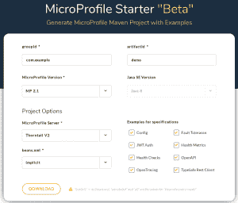

# 创建和部署 Java 8 运行时容器映像

> 原文：<https://developers.redhat.com/blog/2019/02/26/create-java-8-runtime-container-image>

Java 运行时环境应该能够运行编译后的源代码，而开发工具包，例如 OpenJDK，将包含所有的库/二进制文件来编译和运行源代码。本质上，后者是运行时环境的超集。关于 OpenJDK 支持和生命周期的更多细节可以在这里找到。

Red Hat 为 [Java](https://developers.redhat.com/blog/category/java/) 8 和 11 提供并支持带有 OpenJDK 的容器映像。更多详情请点击[这里](https://access.redhat.com/containers/#/search/openjdk)。如果您使用的是 Red Hat 中间件，那么发布的 s2i 映像也有助于部署，例如在 [Red Hat Openshift 容器平台](https://developers.redhat.com/products/openshift/overview/)上。

注意红帽只提供基于 OpenJDK 的 Java 8 和 11 镜像。也就是说，肯定会有开发人员想要创建自己的 Java 运行时映像的情况。例如，可能有诸如最小化存储以运行运行时映像之类的原因。另一方面，围绕 Jolokio 或 Hawkular 等库的大量手工工作，甚至安全参数也需要设置。如果您不想深入这些细节，我建议您使用 Red Hat 提供的 OpenJDK 的容器图像。

在本文中，我们将:

*   用 Docker 和 Buildah 建立一个图像。
*   我们将在本地主机上用 Docker 和 Podman 运行该映像。
*   我们将把我们的形象推向码头。
*   最后，我们将通过将流导入到 [OpenShift](http://openshift.com/) 来运行我们的应用程序。

本文是为 OpenShift 3.11 和 4.0 测试版编写的。让我们直接开始吧。

## 安装

为了使用我们的图像并了解它们是如何工作的，我们将使用一个 web 应用程序作为我们产品包的一部分。最近 Microprofile.io 发布了 [MicroProfile Starter beta](https://start.microprofile.io/) ，它通过创建一个可下载的包来帮助你开始使用 Microprofile。前往 [Microprofile.io](https://start.microprofile.io) ，用索恩泰尔 V2 获得 Microprofile 的软件包。

[](https://developers.redhat.com/blog/wp-content/uploads/2019/02/screenshot3.png)

单击下载按钮获取存档文件。

在我的[Red Hat Enterprise Linux](https://developers.redhat.com/products/rhel/overview/)(RHEL)机器上，我首先创建一个临时目录，例如`demoapp`，并将下载的工件解压到其中。

在我的临时目录中，我运行:

```
$ mvn clean compile package
```

现在我们应该有一个构建好的演示应用程序，带有一个胖罐子，我们可以调用它来运行 Thorntail。

让我们将`target/demo-thorntail.jar`复制到临时目录。

这里是每一层的注释。这个文件的源代码也可以在这里的 [GitHub 上找到。](https://github.com/sshaaf/rhel7-jre-image)

```
# A Java 8 runtime example
# The official Red Hat registry and the base image
FROM registry.access.redhat.com/rhel7-minimal
USER root
# Install Java runtime
RUN microdnf --enablerepo=rhel-7-server-rpms \
install java-1.8.0-openjdk --nodocs ;\
microdnf clean all
# Set the JAVA_HOME variable to make it clear where Java is located
ENV JAVA_HOME /etc/alternatives/jre
# Dir for my app
RUN mkdir -p /app
# Expose port to listen to
EXPOSE 8080
# Copy the MicroProfile starter app
COPY demo-thorntail.jar /app/
# Copy the script from the source; run-java.sh has specific parameters to run a Thorntail app from the command line in a container. More on the script can be found at https://github.com/sshaaf/rhel7-jre-image/blob/master/run-java.sh
COPY run-java.sh /app/
# Setting up permissions for the script to run
RUN chmod 755 /app/run-java.sh
# Finally, run the script
CMD [ "/app/run-java.sh" ]

```

现在我们已经有了`Dockerfile`的细节，让我们继续构建图像。

需要注意的重要一点是，OpenJDK Java 运行时打包为“Java-1 . 8 . 0-open JDK”；这不包括编译器和其他在`-devel`包中的开发库。

上面的`Dockerfile`是基于 RHEL 构建的，这意味着我不需要向`subscription-manager`注册，因为主机已经附加了订阅。

下面你会发现两种方法来建立这一点。如果您像我一样运行 RHEL，您可以从这两个二进制文件中选择任意一个进行部署。两个人应该都在`rhel7-server-extras-rpms`里。

您可以像这样启用`extras` repo:

`# subscription-manager repos --enable rhel-7-server-extras-rpms`

## 在本地构建和运行映像

使用`docker`构建图像:

`$ docker build -t quay.io/sshaaf/rhel7-jre8-mpdemo:latest .`

使用`docker`运行映像，并将 localhost:8080 指向容器端口 8080:

`$ docker run -d -t -p 8080:8080 -i quay.io/sshaaf/rhel7-jre8-mpdemo:latest`

我们还可以使用 buildah 命令，它有助于从工作容器、从`Dockerfile`或从头开始创建容器映像。生成的映像是 OCI 兼容的，因此它们可以在任何符合 OCI 运行时规范的运行时上工作(比如 Docker 和 CRI-O)。

建筑用`buildah`:

`$ buildah bud -t rhel7-jre8-mpdemo .`

使用`buildah`创建容器:

`$ buildah from rhel7-jre8-mpdemo`

现在我们也可以用 Podman 运行容器，它通过提供类似于 Docker 命令行的体验来补充 [Buildah](https://www.projectatomic.io/blog/2017/06/introducing-buildah/) 和 [Skopeo](https://www.projectatomic.io/blog/2016/07/working-with-containers-image-made-easy/) 的不足:允许用户运行独立的(非编排的)容器。Podman 不需要守护进程来运行容器和 pod。Podman 也是`extras`通道的一部分，下面的命令应该运行容器。

`$ podman run -d -t -p 8080:8080 -i quay.io/sshaaf/rhel7-jre8-mpdemo:latest`

关于 Podman 的更多细节可以在[没有守护进程的容器中找到:RHEL 7.6 和 RHEL 8 Beta](https://developers.redhat.com/blog/2018/11/20/buildah-podman-containers-without-daemons/) 中可用的 Podman 和 Buildah 以及 Docker 用户使用的 [Podman 和 Buildah](https://developers.redhat.com/blog/2019/02/21/podman-and-buildah-for-docker-users/)。

现在我们有了一个图像，我们还想将它部署到 OpenShift 并测试我们的应用程序。为此，我们需要`oc`客户端库。我有自己的集群设置；您可以选择使用[Red Hat Container Development Kit(CDK)](https://developers.redhat.com/products/cdk/overview/)/minishift、 [Red Hat OpenShift Online](https://www.openshift.com/) ，或者您自己的集群。程序应该是相同的。

## 部署到 OpenShift

要部署到 OpenShift，我们需要以下几个结构:

*   我们新创建的容器图像的图像流
*   OpenShift 的部署配置
*   服务和路由配置

### 图像流

为了创建图像流，我的 OpenShift 集群应该能够从某个地方提取容器图像。到目前为止，图像一直驻留在我自己的机器上。让我们把它推到码头。Red Hat Quay container and application registry 可在任何基础设施上提供集装箱的安全存储、分发和部署。它可作为独立组件使用，也可与 OpenShift 配合使用。

首先，我需要登录 Quay，我可以这样做:

`$ docker login -u="sshaaf" -p="XXXX" quay.io`

然后，我们将新创建的形象推向码头:

`$ docker push quay.io/sshaaf/rhel7-jre8-mpdemo`

在部署之前，让我们先来看看这些构造。对于焦虑的人，您可以跳过部署模板上的细节，直接进入项目创建。

现在我们有了图像，我们定义我们的流:

```
- apiVersion: v1
kind: ImageStream
metadata:
name: rhel7-jre8-mpdemo
spec:
dockerImageRepository: quay.io/sshaaf/rhel7-jre8-mpdemo

```

同样，你可以看到上面我们直接指向我们在 Quay.io 的图像库。

### 部署配置

接下来是部署配置，它设置了我们的 pod 和触发器，并指向我们新创建的流，等等。

如果你不熟悉[容器](https://developers.redhat.com/blog/category/containers/)和 OpenShift 部署，你可能想看看这本有用的[电子书](https://www.openshift.com/deploying-to-openshift/)。

```
- apiVersion: v1
kind: DeploymentConfig
metadata:
name: rhel7-jre8-mpdemo
spec:
template:
metadata:
labels:
name: rhel7-jre8-mpdemo
spec:
containers:
- image: quay.io/sshaaf/rhel7-jre8-mpdemo:latest
name: rhel7-jre8-mpdemo
ports:
- containerPort: 8080
protocol: TCP
replicas: 1
triggers:
- type: ConfigChange
- imageChangeParams:
automatic: true
containerNames:
- rhel7-jre8-mpdemo
from:
kind: ImageStreamTag
name: rhel7-jre8-mpdemo:latest
type: ImageChange

```

### 服务

现在有了我们的部署，我们还想定义一个服务来确保内部负载平衡、pod 的 IP 地址等。如果我们希望我们新创建的应用程序最终暴露给外部流量，服务是很重要的。

```
- apiVersion: v1
kind: Service
metadata:
name: rhel7-jre8-mpdemo
spec:
ports:
- name: 8080-tcp
port: 8080
protocol: TCP
targetPort: 8080
selector:
deploymentconfig: rhel7-jre8-mpdemo

```

### 路线

我们部署的最后一部分是路线。是时候我们用路线向外界曝光或者 app 了。我们可以定义这个路由指向哪个内部服务以及目标端口。OpenShift 将为它提供一个友好的 URL，我们将能够指向它，并看到我们在新创建的基于 Java 8 运行时的部署上运行的 MicroProfile 应用程序。

```
- apiVersion: v1
kind: Route
metadata:
name: rhel7-jre8-mpdemo
spec:
port:
targetPort: 8080-tcp
to:
kind: Service
name: rhel7-jre8-mpdemo
weight: 100

```

以上的完整模板可以在 GitHub 上找到[。](https://raw.githubusercontent.com/sshaaf/rhel7-jre-image/master/deployment.yaml)

让我们也像这样在 OpenShift 中创建一个项目:

`$ oc new-project jredemos`

现在我们处理模板，并在 OpenShift 上用 Java 8 运行时得到我们的演示。为此，请运行以下命令:

`$ oc process -f deployment.yaml  | oc create -f -`

这将创建整个部署，您应该能够看到如下内容:

[](https://developers.redhat.com/blog/wp-content/uploads/2019/02/screenshot1.png)

现在运行以下命令:

`$ oc get routes`

这将显示路线，如下所示:

[](https://developers.redhat.com/blog/wp-content/uploads/2019/02/screenshot2.png)

让我们将路线复制到我们的浏览器中，我们应该看到部署的 web 应用程序在 RHEL 7 上运行，运行时为 Java 8。(下面的地址专门用于测试集群，每个集群都不相同。)

`http://rhel7-jre8-mpdemo-jredemos.apps.cluster-1fda.1fda.openshiftworkshop.com/`

## 摘要

我们已经用 Docker 或 Buildah 成功构建并创建了一个 Java 8 运行时容器映像。请注意以下几点:

*   需要注意的是，这张图片展示了如何做到这一点；它不包括 Jolokio 或 Hawkular 之类的东西，这些东西可能是部署所必需的。
*   此外，它没有考虑在容器中运行 Java 应用程序所需的参数，这在 [Rafael Benevides](https://developers.redhat.com/blog/author/rafabene/) 的这篇[文章](https://developers.redhat.com/blog/2017/03/14/java-inside-docker/)中有很好的解释。
*   此外，当部署您自己的容器映像时，如果您运行的是 Red Hat 的 OpenJDK 版本，请始终记得在这里检查支持和生命周期策略[。](https://access.redhat.com/articles/1299013)

然后我们用来自 [MicroProfile Starter beta](https://start.microprofile.io/) 的基本 MicroProfile 演示应用程序将它部署到 OpenShift。

如果您正在考虑创建一个更全面的演示应用程序，以下是很好的资源:

*   [使用 Azure Open Service Broker 在 Microsoft Azure 上部署 MicroProfile 应用](https://developers.redhat.com/blog/2018/10/17/microprofile-apps-azure-open-service-broker/)
*   微档案电子书[这里](http://bit.ly/MP-ebook)

本文的全部参考资料可以在[这里](https://github.com/sshaaf/rhel7-jre-image.git)找到。

*Last updated: December 22, 2021*