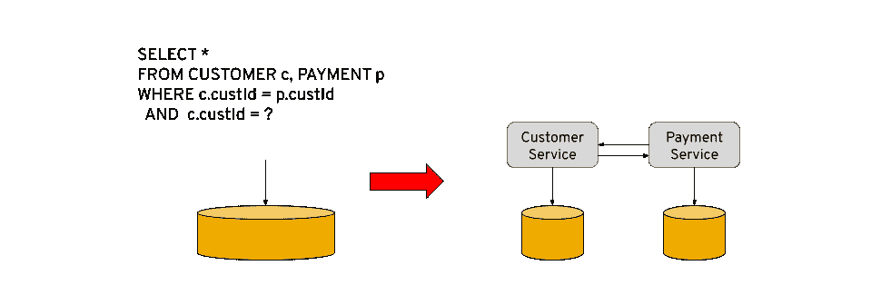
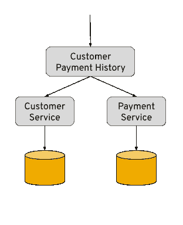
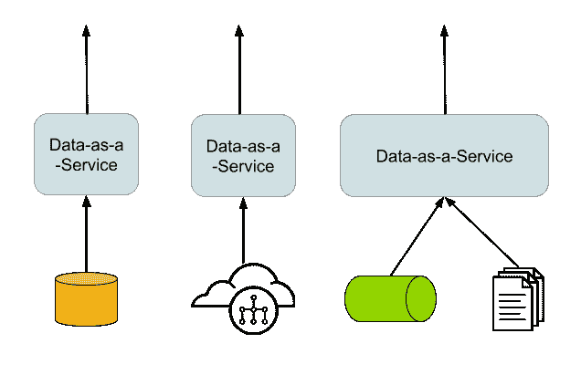

# 数据即微服务:以数据为中心的分布式集成

> 原文：<https://developers.redhat.com/blog/2019/05/23/data-as-a-microservice-distributed-data-focused-integration>

[微服务](https://developers.redhat.com/topics/microservices/)是新软件项目中青睐的架构设计；然而，要从这种方法中获得最大收益，需要克服前面的几个要求。随着从单一系统到分布式系统的演变不仅发生在应用程序空间，也发生在数据存储中，管理数据成为最大的挑战之一。本文分析了实现数据即服务的一些注意事项。

当遵循微服务设计指南时，我们会在几个方面找到数据处理的参考。这些共同的方向包括:

*   对于松散耦合，每个服务使用私有数据库。
*   拥抱最终的一致性。
*   为最终一致性事务实现 [saga 模式](https://developers.redhat.com/blog/2018/10/01/patterns-for-distributed-transactions-within-a-microservices-architecture/)。
*   使用[命令查询责任分离](https://martinfowler.com/bliki/CQRS.html) (CQRS)和 API 组合。

记住这几点，当把松散耦合作为架构中的一个重要部分时，共享数据库现在变成了一个反模式，增加了事务和查询的难度。每个服务使用数据存储需要封装的数据，而与架构的其他域的交互应该只发生在 API 级别，这鼓励我们隐藏数据实现细节。因此，使用像 Spring Boot 这样的轻量级框架只是微服务之旅的第一步。

## 查询挑战

因为我们每个服务都有数据存储，所以我们需要使它可供其他服务使用，成为这个域的入口点。由于所有数据调用都发生在服务级别，并且根据它们的域，当需要复合数据的视图时，传统的“表连接”不再是我们过去在共享数据库实现中使用的选项。此外，我们不能编写查询私有数据存储和聚合数据的服务，因为这违反了封装设计。

为了解决前面的挑战，我们需要将成熟的[企业集成模式(EIP)](https://www.enterpriseintegrationpatterns.com/) 的使用带回微服务架构，如[内容丰富](https://www.enterpriseintegrationpatterns.com/patterns/messaging/DataEnricher.html)和[聚合器](https://www.enterpriseintegrationpatterns.com/patterns/messaging/Aggregator.html)。大多数时候，这些模式被重新命名为 *API 组合模式*，并且通常在 API gateway 等组件中实现。

一般来说，API 组合模式包括添加另一个服务，该服务使用所需的信息调用底层数据服务来组合所需的数据视图。如下图所示，它将首先向客户服务查询基本信息，然后使用这些信息从支付服务中检索该客户的历史记录。

乍一看，这似乎是一个简单的构图任务；然而，企业通常需要越来越多的数据消费控制，并且更多的逻辑被添加到这类服务中。对要检索的数据量的限制、消费终端用户的权限等。是常见的业务需求，这使得实现这种类型的服务成为一项全职的维护任务。

另一方面，命令查询责任分离(CQRS)试图解决集中在维护从多个源事件聚集的一个或多个物化数据集的查询挑战。结果，由于现在需要事件总线，系统的复杂性增加了。我们将在以后的文章中讨论这种模式。

## 分布式数据集成

如前所述，微服务的分布式特性使得服务到服务的通信和服务组合对于成功实现至关重要。即使有可能，也不总是建议从头开始以特定的方式实现每一项服务，尤其是当专门的工具已经存在并帮助我们简化工作的时候。

事实上，通过服务使数据可供外部消费是避免从头开始编码的一个例子。我们可以公开不同存储中的数据，不仅是使用现有框架帮助我们实现 API 组合模式的关系数据库，还有简单的数据即微服务服务。

以数据为中心的分布式集成通过一个统一的 API 提供了对任何存储实现中的数据的集成访问。数据集成允许连接和联合数据，即使信息驻留在 SQL 或 JDBC 之外的多种类型的源中。与数据库管理系统相反，它不应该存储任何数据，而是作为一个“单点”接口，以最佳方式访问数据源。

显然，这种类型的框架应该与微服务的分布式特性相兼容。因此，引擎和实现应该是轻量级的，并且能够作为容器部署在云环境中。相应地，您应该能够灵活地在运行时(如 Spring Boot)独立执行组件，或者将其嵌入到您的应用程序中。

## 摘要

总的来说，除了在微服务架构中构建服务之外，还需要使用普遍建立的实践，如企业集成模式和数据集成技术。能够查询不同的数据源并连接它们以公开有意义的信息，同时以轻量级和分布式的方式提供安全的访问层，可以简化您的应用程序。而且，正如 Christian Posta 在他的文章中所说的[，“数据、数据集成、数据边界、企业使用模式、分布式系统理论、计时等，都是微服务的难点(因为微服务实际上只是分布式系统！)."](https://developers.redhat.com/blog/2016/08/02/the-hardest-part-about-microservices-your-data/)

*Last updated: January 17, 2022*