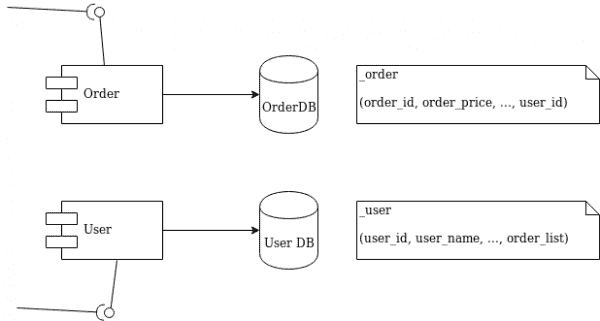

# Apache Camel 和 Debezium 的微服务解耦

> 原文：<https://developers.redhat.com/blog/2019/11/19/decoupling-microservices-with-apache-camel-and-debezium>

面向微服务的架构的兴起给我们带来了新的开发模式和关于独立开发和解耦的咒语。在这样的场景中，我们必须处理这样一种情况，我们的目标是独立性，但是我们仍然需要对不同企业域中的状态变化做出反应。

我将用一个简单而典型的例子来说明我们正在谈论的内容。想象一下两个独立微服务的开发:`Order`和`User`。我们将它们设计为公开一个 REST 接口，并各自使用一个独立的数据库，如图 1 所示:

[](/sites/default/files/blog/2019/11/diagram-1.png)Figure 1: Order and User microservices.">

我们必须将`Order`域中发生的任何变化通知给`User`域。为了在示例中做到这一点，我们需要更新`order_list`。出于这个原因，我们用`addOrder`和`deleteOrder`操作来建模用户休息服务。

## 解决方案 1:队列解耦

要考虑的第一个解决方案是在服务之间添加一个队列。`Order`将发布`User`最终将处理的事件，如图 2 所示:

[](/sites/default/files/blog/2019/11/diagram-2.png)Figure 2: Decoupling with a queue.">

这是一个公平的设计。然而，如果你没有使用正确的中间件，你将会在你的领域逻辑中混入大量的基础设施代码 T2。既然有了队列，就必须开发*生产者*和*消费者逻辑*。您还必须处理*事务。*问题是要确保每个事件都正确地出现在`Order`数据库和队列中。

## 解决方案 2:变更数据捕获解耦

让我来介绍一种替代解决方案，它可以处理所有这些工作，而无需接触任何一行微服务代码。我将使用 [Debezium](https://debezium.io/) 和 [Apache Camel](https://camel.apache.org/) 来捕获`Order`上的数据变化，并触发`User`上的某些动作。Debezium 是一个基于日志的数据变更捕获中间件。Camel 是一个集成框架，它简化了源(`Order`)和目的(`User`)之间的集成，如图 3 所示:

[](/sites/default/files/blog/2019/11/diagram-3.png)Figure 3: Decoupling with Debezium and Camel.">

Debezium 负责捕捉发生在`Order`域中的任何数据变化，并将其发布到*主题*。然后，Camel 消费者可以选择该事件，并对`User` API 进行 REST 调用，以执行其域所期望的必要操作(在我们的简单例子中，更新列表)。

## 与 Debezium 和 Camel 解耦

我准备了一个简单的演示，包含了运行上面的例子所需的所有组件。你可以在这个 GitHub repo 中找到这个演示[。我们需要开发的唯一部分由下面的源代码表示:](https://github.com/squakez/debezium-camel-demo)

```
public class MyRouteBuilder extends RouteBuilder {

    public void configure() {
        from("debezium:mysql?name=my-sql-connector"
        + "&databaseServerId=1"
        + "&databaseHostName=localhost"
        + "&databaseUser=debezium"
        + "&databasePassword=dbz"
        + "&databaseServerName=my-app-connector"
        + "&databaseHistoryFileName=/tmp/dbhistory.dat"
        + "&databaseWhitelist=debezium"
        + "&tableWhitelist=debezium._order"
        + "&offsetStorageFileName=/tmp/offset.dat")
        .choice()
        .when(header(DebeziumConstants.HEADER_OPERATION).isEqualTo("c"))
            .process(new AfterStructToOrderTranslator())
            .to("rest-swagger:http://localhost:8082/v2/api-docs#addOrderUsingPOST")
        .when(header(DebeziumConstants.HEADER_OPERATION).isEqualTo("d"))
            .process(new BeforeStructToOrderTranslator())
            .to("rest-swagger:http://localhost:8082/v2/api-docs#deleteOrderUsingDELETE")
        .log("Response : ${body}");
    }
}

```

就是这样。真的。我们不需要其他东西。

Apache Camel 有一个 [Debezium 组件](https://camel.apache.org/components/latest/debezium-mysql-component.html)，可以连接 MySQL 数据库并使用 [Debezium 嵌入式引擎](https://debezium.io/documentation/reference/0.9/operations/embedded.html)。源端点配置提供了 Debezium 记录`debezium._order`表中发生的任何变化所需的参数。Debezium 根据 JSON 定义的格式对事件进行流式处理，因此您知道期望什么样的[信息](https://debezium.io/documentation/reference/0.10/connectors/mysql.html#events)。对于每个事件，您将获得事件发生前*和事件发生后*的信息，以及一些有用的元信息。

多亏了 Camel 基于内容的路由器，我们既可以调用`addOrderUsingPOST`操作，也可以调用`deleteOrderUsingDELETE`操作。您只需要开发一个消息转换器，它可以转换来自 Debezium 的消息:

```
public class AfterStructToOrderTranslator implements Processor {

    private static final String EXPECTED_BODY_FORMAT = "{\"userId\":%d,\"orderId\":%d}";

    public void process(Exchange exchange) throws Exception {
        final Map value = exchange.getMessage().getBody(Map.class);
        // Convert and set body
        int userId = (int) value.get("user_id");
        int orderId = (int) value.get("order_id");

        exchange.getIn().setHeader("userId", userId);
        exchange.getIn().setHeader("orderId", orderId);
        exchange.getIn().setBody(String.format(EXPECTED_BODY_FORMAT, userId, orderId));
    }
}

```

请注意，我们没有触及`Order`或`User`的任何基础代码。现在，关闭 Debezium 进程来模拟停机时间。你会看到它一开机就能恢复所有事件！

您可以按照 GitHub repo 上的说明运行[提供的示例。](https://github.com/squakez/debezium-camel-demo)

## 警告

这里展示的例子使用了 Debezium 的嵌入式模式。为了获得更一致的解决方案，可以考虑使用 Kafka connect 模式，或者相应地调整嵌入式引擎。

*Last updated: July 1, 2020*