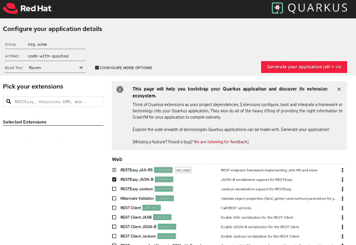
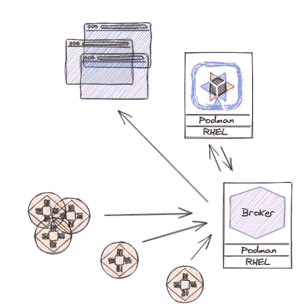
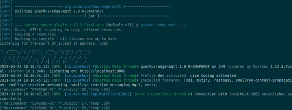
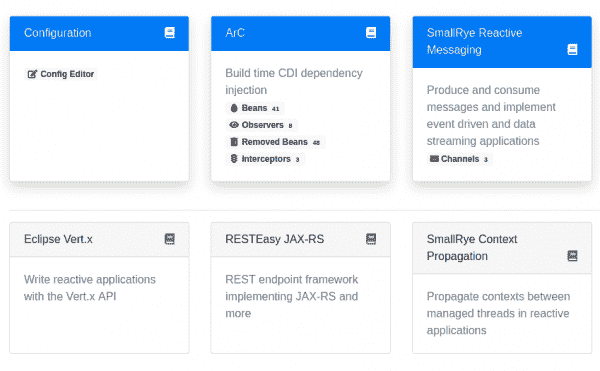

# 使用 Red Hat Enterprise Linux 在任何地方部署 Quarkus)

> 原文：<https://developers.redhat.com/blog/2021/04/07/deploy-quarkus-everywhere-with-red-hat-enterprise-linux-rhel>

Java 是世界上最流行的编程语言之一。在过去的二十年里，它一直是 T2 使用的三大语言之一。Java 支持许多垂直领域和平台上的数百万个应用程序。 [Linux](/topics/linux/) 被广泛部署在数据中心、边缘网络和云中。

[Quarkus](/products/quarkus/getting-started) 现在[对所有](https://www.redhat.com/en/blog/whats-new-quarkus-and-other-updates-red-hat-runtimes)[红帽企业 Linux (RHEL)](/products/rhel/overview) 客户可用。如果你运行的是 RHEL，你可以很容易地在你的 Java 应用程序中使用 Quarkus 的红帽版本。如果你在像 [Red Hat OpenShift](/products/openshift/overview) 这样的 [Kubernetes](/topics/kubernetes/) 平台上开发应用程序，你也可以在 2020 年 11 月之前使用 Quarkus [的 Red Hat build。](https://www.redhat.com/en/blog/introducing-quarkus-red-hat-openshift)

什么是 Quarkus，如何在 Red Hat Enterprise Linux 上开发和部署它？请继续阅读，了解更多信息。本文涵盖:

*   在 RHEL 使用红帽建造的夸库斯。
*   在开发模式下运行 Quarkus。
*   使用和不使用 Podman 创建 Java 本地可执行文件。
*   与 RHEL 的波德曼一起构建应用程序映像。

## 夸库斯的红帽是什么？

如果你不熟悉 Quarkus，它的口号是“超音速亚原子 Java”。是的，Java 非常快。有了 Quarkus，Java 对于开发人员来说更加轻量级和简单明了。

Quarkus 是一个 Kubernetes-native [Java 框架](https://www.redhat.com/en/topics/cloud-native-apps/what-is-a-Java-framework)，专为 Java 虚拟机(JVM)和带有 GraalVM 和 Mandrel 的原生编译而构建。Quarkus 专门为容器优化 Java 代码，使其成为像 Red Hat OpenShift 这样的[无服务器](/topics/serverless-architecture/)和[云](https://www.redhat.com/en/topics/cloud)环境的有效平台。Quarkus 旨在与流行的 Java 标准、框架和库一起工作，包括 Eclipse MicroProfile、Spring、Apache Kafka、RESTEasy (JAX-RS)、Hibernate ORM (JPA)、Infinispan、Apache Camel。

## 如何在 RHEL 上开始使用夸库

在 RHEL 使用夸库有多种方法。Quarkus 文档提供了不同方法的列表。你所需要做的就是从红帽的 Maven repo 中获取神器。

对于新手来说，使用 web 浏览器或 Maven 插件开始使用[项目生成器](https://code.quarkus.redhat.com)很简单，如图 1 所示。配置完成后，您可以下载 ZIP 文件或复制 Maven 命令在您的机器上运行 Quarkus。

[](/sites/default/files/blog/2021/04/img_6065a3eed7454.png)

Figure 1: The Quarkus project generator at code.quarkus.redhat.com.

图 1 显示了所有在[技术预览版](https://access.redhat.com/support/offerings/techpreview/)中支持并可供使用的扩展。Quarkus 有一个庞大的扩展生态系统，可以帮助开发人员编写应用程序，如 Kafka、Hibernate Reactive、Panache 和 Spring。

## 一个示例边缘应用

使用 CRUD 应用程序的例子很常见。然而，我们将看一个从设备获取数据的边缘应用。该示例展示了夸尔库斯和 RHEL 在网络边缘的典型使用案例。

我已经创建了一个基本的应用程序，它可以运行在轻量级、资源高效的 RHEL 服务器上。下面是从设备到前端的数据流的细分。图 2 还显示了高层架构。

*   这些设备向 MQTT 代理发送数据。
*   Quarkus 使用反应式消息和通道在基于浏览器的前端接收、处理和展示这些消息。数据通过一个通道实时传来。
*   前端使用 REST 和 JavaScript。

[](/sites/default/files/blog/2021/04/img_6065a47e734a7.png)

Figure 2: A high-level architecture diagram of Quarkus.

要跟进或尝试一下，请参见[示例存储库](https://github.com/sshaaf/quarkus-edge-mqtt-demo)中该应用程序的源代码。

让我们在 RHEL 服务器上部署这个应用程序。

### 用 Podman 启动 MQTT 代理

RHEL 有一个无垠的集装箱发动机。这是什么意思？RHEL 使用波德曼作为集装箱引擎。Podman 架构允许您在启动容器的用户(fork/exec 模型)下运行容器，并且该用户不需要 root 权限。因为 Podman 有一个无后台架构，所以运行 Podman 的用户只能看到和修改他们自己的容器。没有与命令行界面(CLI)工具通信的通用守护程序。

我们将在整个例子中使用 Podman。你可以在这篇关于 Red Hat Enterprise Linux 8 上的 Linux 容器的[指南中了解更多关于 Podman 的信息。](https://access.redhat.com/documentation/en-us/red_hat_enterprise_linux/8/html-single/building_running_and_managing_containers/index)

在这个演示中，我们将使用 Mosquitto 消息代理。Mosquitto 是轻量级的，适用于所有设备，从低功耗的单板计算机到完整的服务器。让我们使用 Podman 启动 Mosquitto 的一个实例:

```
podman run --name mosquitto \

--rm -p "9001:9001" -p "1883:1883" \

eclipse-mosquitto:1.6.2
```

### 用 quartus 构建我们的应用

**注意**:这个例子假设你有最新的 Red Hat 版本的 OpenJDK， [OpenJDK 11](https://developers.redhat.com/products/openjdk/download) 。

接下来，我们将加速我们的应用程序。您可以使用任何集成开发环境(IDE)来开发 Quarkus。大多数 ide 允许您使用 Quarkus 工具扩展，这使得开发人员可以轻松地创建 Quarkus 应用程序。

要在开发模式下运行 Quarkus，请按照下列步骤操作:

1.  从您的 RHEL 机器或任何 IDE 中打开一个终端。
2.  `cd`进入项目目录:`https://github.com/sshaaf/quarkus-edge-mqtt-demo`。
3.  运行这个命令:`mvn quarkus`。

输出应该类似于您在图 3 中看到的。

[](/sites/default/files/blog/2021/04/img_6065a4d958d3c.png)

Figure 3: Quarkus development mode output.

打开浏览器并导航至 [http://localhost:8080](http://localhost:8080) 。您应该会看到我们的应用程序的主页，它报告来自模拟设备的实时数据，如图 4 所示。在这种情况下，我们的模拟设备 ESP8266-01 以 JSON 格式将温度和热量测量值从设备发送到 MQTT 代理。然后，JSON 作为一个反应通道被拾取，并在处理后将数据抛出到流中。浏览器读取流并实时显示数据。您可以轻松地将仿真设备更改为真实设备；但是，抛出的数据必须是正确的 JSON 格式。

[](/sites/default/files/blog/2021/04/img_6065a4fc880e9.png)

Figure 4: Real-time data from the emulated device.

### 在开发模式中使用 Quarkus

现在，您在 RHEL 机器上有了一个处于开发模式的运行中的应用程序。开发者在开发模式下使用 Quarkus 有什么收获？好处包括:

*   零配置，活代码，眨眼间就能重新加载。如果您更改了任何 Java 文件，您不需要重新加载整个环境。夸库斯明白！
*   基于标准，但不限于。
*   统一配置。
*   针对 80%常见用法的简化代码，针对 20%的灵活代码。
*   轻松生成本机可执行文件。

Quarkus [1.11 版本](https://access.redhat.com/documentation/en-us/red_hat_build_of_quarkus/1.11/html/release_notes_for_red_hat_build_of_quarkus_1.11/index)的 Red Hat build 引入了一个名为 Quarkus Dev UI 的令人敬畏的开发者控制台。您可以通过导航到`http://localhost:8080/q/dev`在开发模式下访问 Quarkus 开发 UI。

在 Quarkus Dev UI 中，从图 5 所示的扩展中选择**small rye Reactive Messaging Channels**。

[](/sites/default/files/blog/2021/04/img_6065a53c7f6e1.png)

Figure 5: Extensions in the Quarkus Dev UI.

从那里，您将看到我们的边缘设备正在使用的反应流(参见图 6)。

[](/sites/default/files/blog/2021/04/img_6065a582a8ff3.png)

Figure 6: Reactive streams extensions and list of streams.

有关开发模式的更多详情，请参见[利用 Quarkus 远程开发增强开发循环](/blog/2021/02/11/enhancing-the-development-loop-with-quarkus-remote-development/)。

### 用 Podman 构建应用程序映像

通过使用 Maven 运行`-Pnative`指令，您可以为您的平台创建一个本地二进制文件。

然而，您可能还没有设置好整个编译环境——例如，您还没有安装 Mandrel 或 GraalVM。在这种情况下，您可以使用容器运行时来构建本机映像。最简单的方法是运行以下命令:

```
mvn package -Pnative -Dquarkus.native.container-build=true  -Dquarkus.native.container-runtime=podman
```

Quarkus 将选择默认的容器运行时(在本例中是 Podman)。

还可以指定`-Dquarkus.native.container-runtime=podman`来显式选择 Podman。通过死代码消除、类扫描、反射和构建代理，构建用于优化 Quarkus 应用程序的映像需要几分钟时间。Quarkus 将优化应用程序，不仅针对本机映像，还针对 JVM 模式。因此，您将看到快速的启动时间和低内存占用。图 7 显示了从编译到可执行文件的过程。更多细节，请看一下[夸尔库斯性能博客](https://quarkus.io/blog/tag/performance/)。

[](/sites/default/files/blog/2021/04/img_6065a5bfda0fc.png)

Figure 7: The Quarkus build process.

您还可以通过设置`quarkus.native.native-image-xmx`配置属性来限制本机编译期间使用的内存量。请注意，设置较低的内存限制可能会增加构建时间。您还可以使用 Podman 用我们的二进制文件创建一个容器映像。

在`src/main`下，Quarkus 为您的应用程序预生成不同的 docker 文件。这里，我们将使用本机 Dockerfile 文件，因为我们已经创建了一个本机二进制文件。在我们的项目主目录中执行以下命令:

```
podman build -f src/main/docker/Dockerfile.native -t sshaaf/quarkus-edge-mqtt .

```

最后，运行以下命令在您的 RHEL 机器上启动容器:

```
podman run -i --rm -p 8080:8080 sshaaf/quarkus-edge-mqtt

```

返回 [http://localhost:8080](http://localhost:8080) 。现在，您应该看到应用程序正在运行并显示来自我们设备的输入数据。

## quartus 资源

Quarkus 是一个适合多种用例的 Java 框架，无论您是在边缘网关上运行应用程序，创建无服务器功能，还是在 Kubernetes 和 Red Hat OpenShift 这样的云环境上部署。Quarkus 对开发人员来说很容易使用，也很愉快，它提高了云的 Java 应用程序性能。

如果您想了解更多关于 Quarkus 的信息，这里有一些有用的资源:

*   [quar kus 1.11 红帽版本发布说明](https://access.redhat.com/documentation/en-us/red_hat_build_of_quarkus/1.11/html/release_notes_for_red_hat_build_of_quarkus_1.11/index)
*   [quar kus 入门](https://access.redhat.com/documentation/en-us/red_hat_build_of_quarkus/1.11/html/getting_started_with_quarkus/index)
*   [quar kus 1.11 红帽版本的产品文档](https://access.redhat.com/documentation/en-us/red_hat_build_of_quarkus/)
*   [开发 Quarkus 课程](/courses/quarkus)
*   [练习夸夸其谈电子书](/books/practising-quarkus)
*   [了解夸尔库斯电子书](/books/understanding-quarkus)
*   [夸尔库斯备忘单](/cheat-sheets/quarkus-kubernetes-i)
*   [Quarkus DZone RefCard](https://dzone.com/refcardz/quarkus-1?chapter=1)
*   [介绍 Quarkus:下一代 Kubernetes 原生 Java 框架](https://developers.redhat.com/blog/2019/03/07/quarkus-next-generation-kubernetes-native-java-framework)

*Last updated: October 14, 2022*