# 大规模设计事件驱动的流程:第 2 部分

> 原文：<https://developers.redhat.com/blog/2020/02/20/designing-an-event-driven-process-at-scale-part-2>

在本系列的第一篇文章 [*大规模设计事件驱动的业务流程:健康管理示例，第 1 部分*](https://developers.redhat.com/blog/2020/02/19/designing-an-event-driven-business-process-at-scale-a-health-management-example-part-1/) 中，我们首先为健康管理行业的一个具体示例定义了业务用例及数据模型。然后，我们通过创建我们的触发流程，开始在 [jBPM](https://www.jbpm.org/) (一个开源业务自动化套件)中实现这个例子。

现在，在本系列的第二篇文章中，我们将重点关注创建任务子流程及其许多组件。在我们的案例中，这些是:

*   过期的？大门
*   被压制的？大门
*   人工任务
*   提醒子流程
*   “什么类型的结束？”大门
*   硬关闭嵌入式子流程
*   升级子流程

## 任务子流程

现在，您可以创建具有图 1 所示属性的任务子流程。

[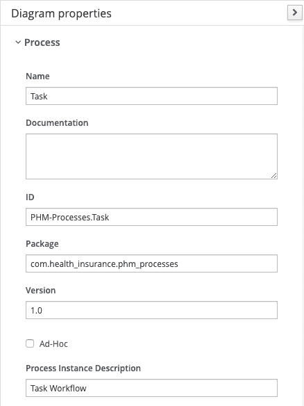](/sites/default/files/blog/2020/02/PHM-Processes-A490-1.png)

图 1:创建任务子流程。">

任务子流程需要定义如图 2 所示的变量。

[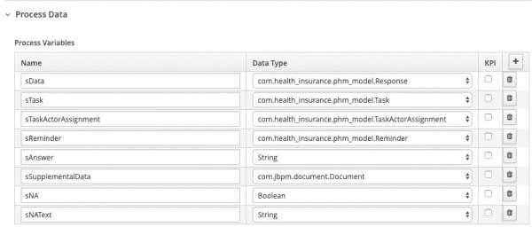](/sites/default/files/blog/2020/02/PHM-Processes-0001.jpg)

图 2:为您的任务子流程定义变量。">

**注意:**变量`sSupplementalData`的类型`com.jbpm.document.Document`是现成的。

现在，绘制任务子流程的图表，如图 3 所示。

[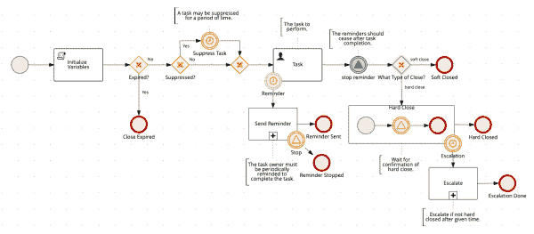](/sites/default/files/blog/2020/02/2020-03-01_09-09-44.png)Figure 3: Create your Task subprocess diagram.

图 3:创建您的任务子流程图。">

一旦在脚本任务中初始化了流程变量，就必须完成一个[用户任务](https://docs.jboss.org/jbpm/release/latest/jbpm-docs/html_single/#_user_task)。为用户任务的完成设置提醒，并定义升级。提醒和升级都是通过[定时器](https://docs.jboss.org/jbpm/release/latest/jbpm-docs/html_single/#_timers)实现的，这些定时器会引导到您需要实现的子流程。从可伸缩性的角度看，下面是关于定时器的说明。

**注意:**我们也使用定时器实现了任务抑制需求。

硬关闭需求被实现为一个简单地捕捉信号的嵌入式子流程。按照要求，升级是由于该子流程上的计时器而发生的。

### 过期的？大门

过期的？异或门应该有两个使用 Task 类的`expirationDate`属性配置的分支，如图 4 所示。

[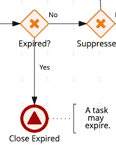](/sites/default/files/blog/2020/02/PHM-Processes-Fig-211.png)

图 4:检查任务是否过期。">

要配置 Yes 分支，设置如图 5 所示的条件表达式。

[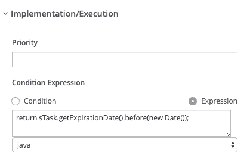](/sites/default/files/blog/2020/02/PHM-Processes-Fig-212.png)

图 5:定义任务到期时的行为。">

### 被压制的？大门

被压制的？异或门的两个分支应该使用任务类的`suppressed`布尔属性进行配置，如图 6 所示。

[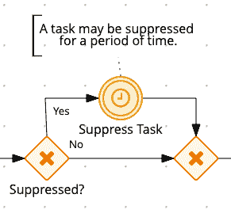](/sites/default/files/blog/2020/02/2020-02-23_10-02-09.png)Figure 6: Defining behavior depending on whether or not your task needs to be suppressed.

图 6:根据任务是否需要取消来定义行为。">

图 7 显示了 Yes 分支的配置。

[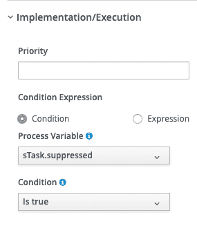](/sites/default/files/blog/2020/02/PHM-Processes-Fig-213.png)

图 7:进入 Yes 分支。">

任务的抑制是由定时器完成的。计时器使流程等待 Task 对象的`suppressionPeriod`属性中指定的时间段，如图 8 所示。

[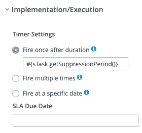](/sites/default/files/blog/2020/02/PHM-Processes-Fig-214.png)

图 8:定义抑制定时器。">

### 人工任务

现在，让我们关注人工任务，如图 9 所示。

[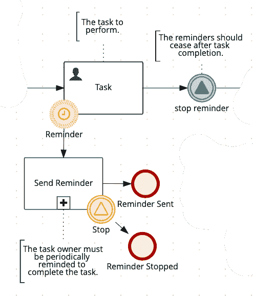](/sites/default/files/blog/2020/02/2020-03-01_09-12-25.png)Figure 9: Defining the human task.

图 9:定义人工任务。">

使用图 10 所示的设置配置人工任务。

[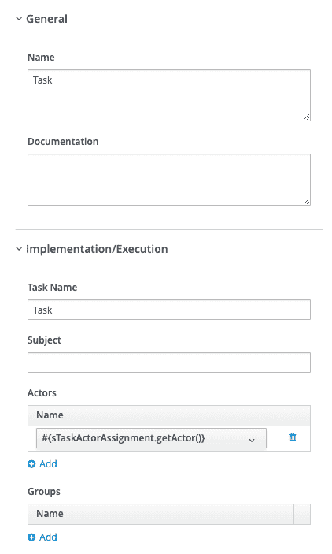](/sites/default/files/blog/2020/02/PHM-Processes-Task-1.png)

图 10:实现人工(参与者)任务。">

任务执行元从任务执行元分配流程变量中解析。

接下来，您将需要几项功能:捕获文本以及上传的补充文档，并使用不适用或不可用的响应来完成任务。这些需求可以通过配置任务参数来满足，如图 11 所示。

[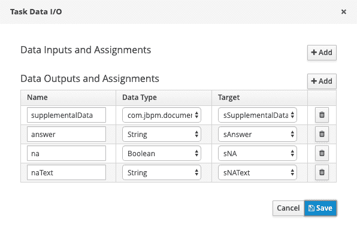](/sites/default/files/blog/2020/02/PHM-Processes-Task-2.png)

图 11:定义任务的参数来捕获您需要的数据类型。">

您还需要满足向任务参与者发送定期提醒的要求。jBPM 中有一个内置的[通知功能，允许发送电子邮件通知团队和个人完成任务。例如，您可以为任务活动配置通知，如图 12 所示。](https://docs.jboss.org/jbpm/release/latest/jbpm-docs/html_single/#_email_notifications)

[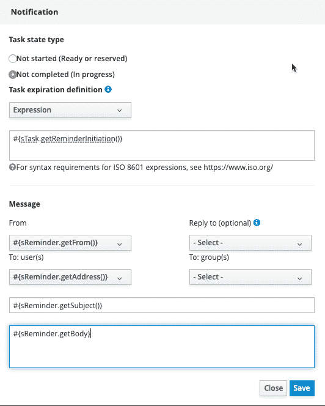](/sites/default/files/blog/2020/02/PHM-Processes-0003.png)Figure 13:Figure 12: Reminding your humans to complete their tasks.">

在许多情况下，内置的通知功能可能就足够了。然而，在某些情况下，人们需要对通知过程进行更多的控制。为此使用定时器的好处是允许你设计尽可能复杂的提醒过程。在本例中，您将实现基于计时器的提醒。在任务边界上配置定时器，它将在`Task`对象的`reminderInitiation`属性中定义的时间段后触发第一个提醒，如图 13 所示。

[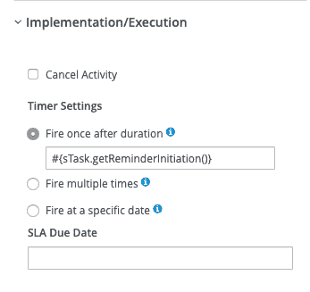](/sites/default/files/blog/2020/02/PHM-Processes-Fig-100.png)Figure 13: Triggering the first reminder.">

### 提醒子流程

现在您应该配置子流程`Reminder`，如图 14 所示。请注意，在选中“等待完成”时，必须取消选中“独立”和“中止父项”属性。如果不这样配置，提醒子流程将不会正常停止。

[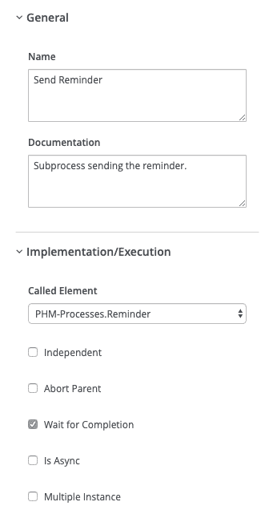](/sites/default/files/blog/2020/02/2020-03-01_07-42-47.png)Figure 14: Creating the Reminder subprocess.Figure 14: Creating the Reminder subprocess.">

将子流程参数设置为`Reminder`和`Task`对象，如图 15 所示。

[](/sites/default/files/blog/2020/02/PHM-Processes-Reminder-2.png)Figure 15: Configuring the subprocess.">

任务完成后，应该发送一个信号来停止提醒子流程，如图 16 所示。

[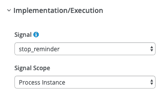](/sites/default/files/blog/2020/02/2020-03-01_08-18-38.png)Figure 16: Creating the stop signal.Figure 16: Creating the stop signal.">

### “什么类型的结束？”大门

一个异或门决定任务关闭状态应该是软的还是硬的。门的软关闭分支如图 17 所示。

[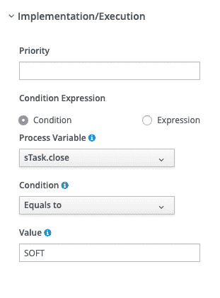](/sites/default/files/blog/2020/02/PHM-Processes-Fig-4.png)Figure 17: Configuring the soft-close branch.">

硬关闭分支如图 18 所示。

[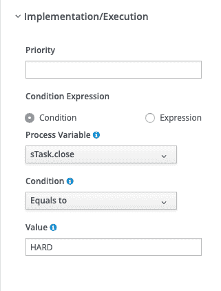](/sites/default/files/blog/2020/02/PHM-Processes-Fig-5.png)Figure 18: Configuring the hard-close branch.">

### 硬关闭嵌入式子流程

如果任务很难结束，流程必须等待来自外部系统的确认信号。由于升级要求，您必须在嵌入式子流程中进行配置。

这个子过程很简单。只有一个中间信号捕捉，如图 19 所示。

[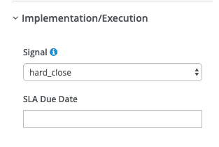](/sites/default/files/blog/2020/02/PHM-Processes-hard-close-signal.png)Figure 19: Catching the signal for a hard close.">

如果任务在给定时间内没有关闭，您还需要实施升级子流程。同样，jBPM 有一个内置的功能，可以在任务没有及时完成时重新分配任务。例如，您可以配置如何重新分配任务，如图 20 所示。

[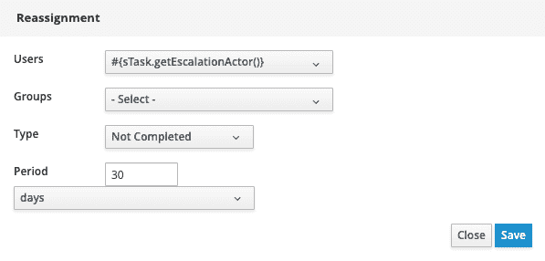](/sites/default/files/blog/2020/02/PHM-Processes-00004.png)Figure 20:Figure 20: Escalating (reassigning) a task that wasn't completed in a timely fashion.">

但是，您需要在从外部系统收到任务已关闭的确认后进行重新分配。此外，周期必须可配置为变量，因为该值取决于特定的任务。由于这些原因，您需要将升级实施为计时器触发的子流程。

边界计时器根据`Task`对象的`escalationTimer`属性值决定何时需要升级，如图 21 所示。

[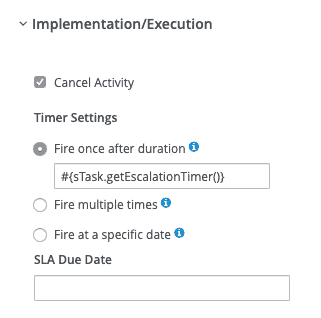](/sites/default/files/blog/2020/02/PHM-Processes-escalation-timer.png)Figure 21:Figure 21: Configuring the escalation border timer.">

还有另一种实现 SLA 升级的方法。 [`ProcessEventListener`接口](https://docs.jboss.org/drools/release/7.31.0.Final/kie-api-javadoc/org/kie/api/event/process/ProcessEventListener.html)有两个方法来捕获 SLA 违反事件，并且可以用自定义代码来实现，指定在这种事件中做什么，正如您在[这个示例实现](https://gist.github.com/mauriziocarioli/4a8dac4b85c6aed698a96b3b6a49ca6f)中看到的:

```
/** 
 * @param event
 */
public void beforeSLAViolated(SLAViolatedEvent event) {
    System.out.println(
           "Process <<"+
                   event.getProcessInstance().getProcessName()+
                   ">>-<"+
                   event.getProcessInstance().getId()+
                   "> ->SLA <<"+
                           event.getNodeInstance().getNodeName()+">>-<"+
                           event.getNodeInstance().getNodeId()+">-<"+
                           event.getNodeInstance().getId()+
                           "> SLA is about to be violated."
    );
}

/** 
 * @param event
 */
public void afterSLAViolated(SLAViolatedEvent event) {
    System.out.println(
            "Process <<"+
                    event.getProcessInstance().getProcessName()+
                    ">>-<"+
                    event.getProcessInstance().getId()+
                    "> ->SLA <<"+
                            event.getNodeInstance().getNodeName()+">>-<"+
                            event.getNodeInstance().getNodeId()+">-<"+
                            event.getNodeInstance().getId()+
                            "> SLA has been violated."
    );
}
```

### 升级子流程

现在，配置升级子流程，如图 22 所示。

[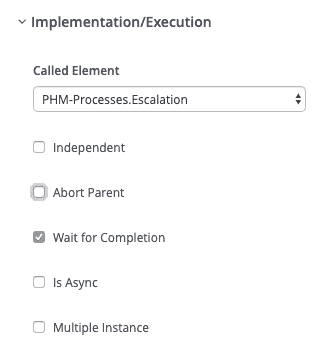](/sites/default/files/blog/2020/02/2020-03-01_07-44-09.png)Figure 22: Creating the Escalation subprocess.Figure 22: Creating the Escalation subprocess.">

然后定义子流程的参数。您需要传递`Task`和`TaskActorAssignment`对象，如图 23 所示。

[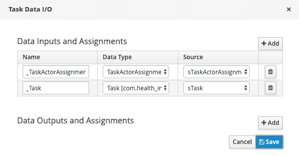](/sites/default/files/blog/2020/02/PHM-Processes-call-Escalate-2.png)Figure 23: Defining the data the Escalation subprocess uses.">

## 结论

到目前为止，我们已经为健康管理事件驱动的业务流程定义了业务用例，并创建了数据模型、触发流程和任务子流程及其所有组件。在下一期的[中，我们将完成我们的示例配置。](https://developers.redhat.com/blog/2020/02/21/designing-an-event-driven-process-at-scale-part-3/)

*Last updated: October 4, 2022*