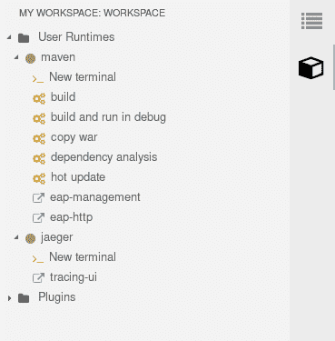
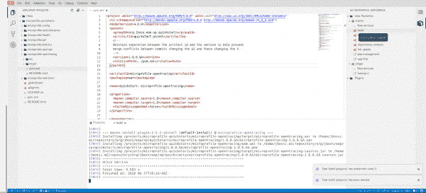
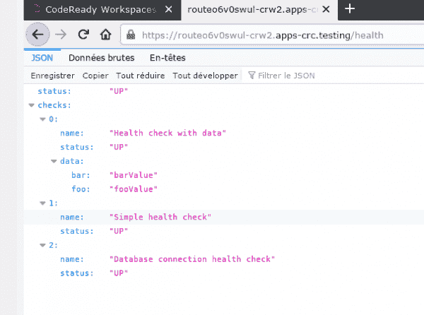

# 使用 Red Hat CodeReady 工作区在 Red Hat JBoss 企业应用程序平台扩展包 1.0 上开发 Eclipse MicroProfile 应用程序

> 原文：<https://developers.redhat.com/blog/2020/07/01/develop-eclipse-microprofile-applications-on-red-hat-jboss-enterprise-application-platform-expansion-pack-1-0-with-red-hat-codeready-workspaces>

本文基于我之前的教程 [*在 Red Hat JBoss Enterprise Application Platform 7.3*](https://developers.redhat.com/blog/2020/06/16/enable-eclipse-microprofile-applications-on-red-hat-jboss-enterprise-application-platform-7-3/)上启用 Eclipse MicroProfile 应用程序。要了解这些示例，您必须通过 [Red Hat CodeReady Studio](https://developers.redhat.com/products/codeready-studio/overview) 在您的[Red Hat JBoss Enterprise Application Platform Expansion Pack(JBoss EAP XP)1 . 0 . 0 . ga](https://developers.redhat.com/products/eap/download)安装中启用 [Eclipse MicroProfile](https://projects.eclipse.org/projects/technology.microprofile) 。有关安装说明，请参阅上一篇文章。

在本文中，我们将使用已安装的支持微概要文件的映像在[Red Hat code ready work spaces](https://developers.redhat.com/products/codeready-workspaces/overview)(CRW)中建立一个 JBoss EAP XP quickstart 项目。您还可以应用从本文中学到的知识，使用 CodeReady 工作区开发自己的应用程序。

**注:**更多例子，一定要看文末的视频演示。

## 步骤 1:创建一个新的开发文件

首先，打开 CodeReady 工作区并创建一个新的 [devfile](https://redhat-developer.github.io/devfile/) 。在接下来的部分中，我将描述配置和构建这个 devfile 的步骤，以便您可以在 CodeReady 工作区中构建和运行快速入门。你可以在这里下载示例开发文件[。](https://github.com/redhat-developer/rhd-article-extras)

## 步骤 2:定义编辑器插件

因为这是一个 Java 项目，所以我们使用了 [Java Che 插件:](https://github.com/eclipse/che-theia-java-plugin)

```
components: 
-
  type: chePlugin
  id: redhat/java11/latest
-

```

## 步骤 3:定义 Jaeger Docker 映像

本例使用 Jaeger 进行 [MicroProfile OpenTracing](https://github.com/eclipse/microprofile-opentracing) ，因此我们包含一个 Docker 映像来启动 Jaeger 服务器实例，并在端口 16686 上公开其 UI 端点:

```
components: 
- 
  alias: jaeger
  type: dockerimage
  image: jaegertracing/all-in-one
  memoryLimit: 128Mi
  endpoints:
      - name: 'tracing-ui'
        port: 16686
-

```

**注意:**你可以[在这里](https://github.com/redhat-developer/rhd-article-extras)找到完整的 eapxp-quickstarts.yaml 文件。

## 步骤 4:定义 JBoss EAP XP 组件

最后一个组件是 JBoss EAP XP 的源到映像(S2I) Docker 映像。这个映像提供了构建应用程序的 Apache Maven 和运行应用程序的 JBoss EAP XP 运行时的实例。

我们需要公开 HTTP 端点，以便能够访问端口 8080 上正在运行的应用程序。稍后，我们还需要能够公开端口 9990 上的管理端点，因为 JBoss EAP XP 在这个端点上公开了[微概要健康](https://github.com/eclipse/microprofile-health)和[微概要度量](https://github.com/eclipse/microprofile-metrics)API。

我们还为这个容器定义了环境变量。这将配置其各种元素，如下所示:

```
-
  type: dockerimage
  alias: maven
  image: 'registry.redhat.io/jboss-eap-7/eap-xp1-openjdk11-openshift-rhel8@sha256:bebc469f8b21d8132f7b0df62b90107e68e7a77c36d39270f349216557102787'
  env:
# Enabling Jaeger tracing
   - name: WILDFLY_TRACING_ENABLED
     value: 'true'
# Define the Jaeger service name 
   - name: JAEGER_SERVICE_NAME
     value: 'microprofile-opentracing'
# Configure Jaeger traces
   - name: JAEGER_REPORTER_LOG_SPANS 
     value: 'true'
   - name: JAEGER_SAMPLER_TYPE
     value: 'const'
   - name: JAEGER_SAMPLER_PARAM
     value: '1'
   -
    name: MAVEN_OPTS
    value: >-
     -Xmx200m -XX:MaxRAMPercentage=50.0 -XX:+UseParallelGC -XX:MinHeapFreeRatio=10 -XX:MaxHeapFreeRatio=20 -XX:GCTimeRatio=4
     -XX:AdaptiveSizePolicyWeight=90 -Dsun.zip.disableMemoryMapping=true -Xms20m -Djava.security.egd=file:/dev/./urandom -Duser.home=/home/jboss
  memoryLimit: 1024Mi
  endpoints:
   -
    name: eap-http
    port: 8080
   -
    name: eap-management
    port: 9990
  mountSources: true
  volumes:
   -
    name: m2
    containerPath: /home/jboss/.m2

```

首先，我们将环境变量`WILDFLY_TRACING_ENABLED`设置为`true`来启用 JBoss EAP XP 中的 MicroProfile OpenTracing。

其次，我们使用`JAEGER_SERVICE_NAME`、`JAEGER_REPORTER_LOG_SPANS`、`JAEGER_SAMPLER_TYPE`和`JAEGER_SAMPLER_PARAM`配置如何收集 Microprofile OpenTracing 跟踪并将其发送到 Jaeger 实例。

最后，我们需要使用`MAVEN_OPTS`配置 Apache Maven。

如图 1 所示，我们提供了几个命令。最值得注意的是从 Apache Maven `pom.xml`构建的一个`build`命令。(我们将在应用程序构建完成后使用`copy war`命令来部署它。)

[](/sites/default/files/blog/2020/06/user_tasks.png)

Figure 1: Build commands for the MicroProfile OpenTracing quickstart project.

## 步骤 5:构建项目

最后，我们为`microprofile-opentracing`快速启动选择`pom.xml`并构建文件。一旦构建完成，您就可以复制生成的 WAR 文件。使用`eap-http endpoint`命令生成端点轨迹，然后使用`tracing-ui`命令在 Jaeger 实例中查看它们，如图 2 所示。

[](/sites/default/files/blog/2020/06/building_opentracing_example.png)

Figure 2: Build the MicroProfile OpenTracing quickstart project.

## 后续步骤

您可以按照这些说明和本文末尾的视频演示，在您的工作区中构建并安装`microprofile-health`和`microprofile-metrics` quickstart 项目。您将使用`eap-management endpoint`来访问 MicroProfile 健康内容，如图 3 所示。

[](/sites/default/files/blog/2020/06/mp_health_endpoint.png)

Figure 3: Database connection for a MicroProfile application health check.

### 视频演示:查看更多正在运行的 MicroProfile 快速入门

此视频演示了如何设置 CodeReady 工作区，以便在 JBoss EAP XP 1.0 上构建和运行 MicroProfile quickstarts。现在开始播放视频，看看 Eclipse MicroProfile OpenTracing、Eclipse MicroProfile Health 和 Eclipse MicroProfile Metrics 的运行情况。

[https://www.youtube.com/embed/mG7SY05hvIk?autoplay=0&start=0&rel=0](https://www.youtube.com/embed/mG7SY05hvIk?autoplay=0&start=0&rel=0)

## 结论

在我的上一篇文章中，我向您展示了如何安装 JBoss EAP XP 1.0 并在该平台上启用 Eclipse MicroProfile 支持。在本文中，我向您展示了如何使用 CodeReady 工作区来配置和运行 MicroProfile quickstart 项目。要了解更多细节，请务必查看两篇文章中包含的视频演示。