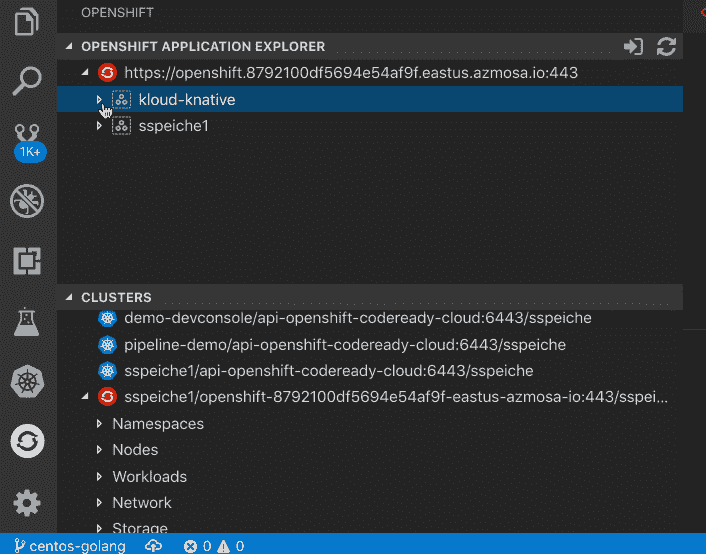

# Red Hat OpenShift 4.2 中的新开发工具

> 原文：<https://developers.redhat.com/blog/2019/10/16/developer-tools-openshift>

今天[发布的](https://www.redhat.com/en/about/press-releases/red-hat-expands-kubernetes-developer-experience-newest-version-red-hat-openshift-4) [Red Hat OpenShift](https://developers.redhat.com/openshift/) 4.2 的对于使用 OpenShift 和 Kubernetes 的开发者来说是一个重大的发布。有一个新的以应用程序开发为中心的用户界面、新的工具和插件，用于容器构建、CI/CD 管道和无服务器架构。

*开发者视角下的应用拓扑视图。*

新功能包括:

*   **全新的开发者视角**让您可以专注于应用。这个视图关注开发人员需要知道的信息和配置。应用程序拓扑和应用程序构建有一个增强的 UI，使开发人员能够更轻松地构建、部署和可视化容器化的应用程序和集群资源。
    [参见](https://developers.redhat.com/blog/2019/10/16/openshift-developer-perspective/)的深入评论。
*   **odo** ，一个面向开发者的命令行界面，简化了 OpenShift 上的应用开发。这个 CLI 使用“git push”风格的交互，帮助开发人员在 OpenShift 上开发应用程序，而不需要了解 Kubernetes 操作的细节。
    奥多入门。
*   **Red Hat OpenShift Connector** 面向微软 Visual Studio 代码、JetBrains IDE(包括 IntelliJ)和 Eclipse 桌面 IDE，更容易插入现有的开发者管道**。**您可以在 OpenShift 上开发、构建、调试和部署应用，而无需离开您喜爱的 IDE。
    [为您的 IDE 获取 Red Hat OpenShift 连接器。](https://developers.redhat.com/products/openshift-ide-extensions)
*   用于 Microsoft Azure DevOps 的 Red Hat OpenShift 部署扩展。 该 DevOps 工具链的用户可以直接从微软 Azure DevOps 将其应用部署到 Azure Red Hat OpenShift 或任何其他 OpenShift 集群。

*Visual Studio 代码中的 Red Hat OpenShift 连接器插件视图。*

[Red Hat code ready Containers](https://developers.redhat.com/products/codeready-containers)是一种在本地机器上尝试或开发 Red Hat OpenShift 的简单方法。预配置的 OpenShift 集群是为笔记本电脑或台式机开发量身定制的，可以更容易地快速使用个人集群。这是按照我们的 OpenShift 教程获取集群的最简单的方法。

[查看概述视频，了解如何在您的操作系统上安装和使用 CodeReady 容器](https://developers.redhat.com/blog/2019/10/16/local-openshift/)。

## 服务网格

OpenShift 服务网格基于 Istio 以及 Kiali 和 Jaeger 项目，通过运营商交付。OpenShift 服务网格通过作为集装箱边车运行，为一组服务提供流量监控、访问控制、发现、安全、弹性、跟踪和报告。您无需任何定制代码即可获得这些特性；不需要对您的任何服务的代码进行任何更改。

## 预览:OpenShift 无服务器和 OpenShift 管道

**无服务器:** OpenShift 无服务器允许您部署可以扩展到零的应用程序。基于 Knative 项目，OpenShift Serverless 为您提供 Knative 工具集，但可以通过运营商轻松安装。OpenShift Serverless 在每个 OpenShift 4 集群上都可以作为操作员使用。OpenShift Serverless 结合了 OpenShift 中可用的开发人员视角，提供了常见工作流的选项，如从 Git 导入或部署映像，允许用户直接从控制台创建无服务器应用程序。

**基于 Tekton 的持续集成和持续交付:**在 OpenShift 中，你有了一个针对 CI/CD 的 Jenkins 的替代品，叫做 OpenShift Pipelines。Pipelines 基于 Tekton 项目，并使用操作符作为自动化中的组件。OpenShift Pipelines 采用 GitOps 思维模式，支持将整个管道配置为代码。每个步骤都在它自己的容器中执行，所以资源只在步骤运行时使用。这消除了对 CI/CD 服务器的需求，并将管道控制权交给了开发团队。OpenShift Pipelines 是 OpenShift 操作中心的一个操作器。

在 developers.redhat.com/openshift 了解如何使用这些新工具以及利用 OpenShift 进行[应用开发。](https://developers.redhat.com/openshift/)

*Last updated: July 1, 2020*