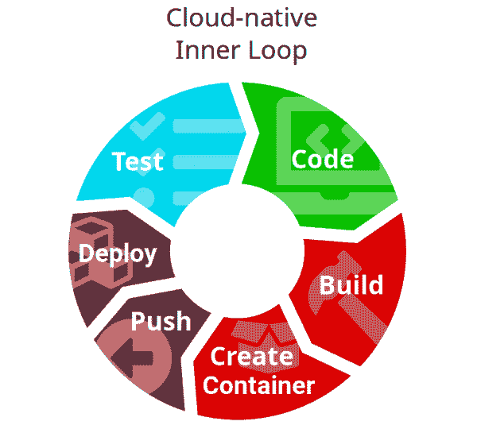

# 使用 Kubernetes 和 Istio Workspace 开发和测试产品

> 原文：<https://developers.redhat.com/blog/2020/07/14/developing-and-testing-on-production-with-kubernetes-and-istio-workspace>

由于[容器](https://developers.redhat.com/topics/containers/)-编排平台，如 [Kubernetes](https://developers.redhat.com/topics/kubernetes/) 和 [Red Hat OpenShift](https://developers.redhat.com/products/openshift) ，开发人员在部署和管理分布式和容器化应用程序方面变得非常高效。但是我们能对应用程序开发和测试说同样的话吗？

在本文中，我简要讨论了云原生开发如何改变编码、构建和测试的传统开发周期。然后我介绍了生产测试的概念，不是作为一个迷因，而是作为一种需要。最后，我介绍一下 [Istio Workspace](https://github.com/maistra/istio-workspace) ，这是一个为开发人员提供的工具，用于运行在 Kubernetes 或 OpenShift 上的分布式系统。

**注意**:本文包括一个使用 Istio Workspace 进行生产测试的视频演示，您可以在最后找到它。

## 云原生重新定义了开发的内部循环

我们这些来自自包含系统(也称为 monoliths)传统工作背景的人习惯了某些事情:本地运行我们的应用程序，即时访问整个代码库，并且能够轻松地调试和推理应用程序。我们被不受干扰的、内部循环的编码、构建和测试开发周期宠坏了，以至于我们认为这是理所当然的。图 1 展示了传统开发周期的内部循环。

Figure 1\. The inner loop of a traditional development cycle.">

如今，当拥抱容器化、云原生应用程序的新世界时，我们希望内循环开发的传统活动能够开箱即用。但是，除了方便之外，这些技术也带来了复杂性。云原生内部循环必须适应构建和推送映像以及部署新服务等活动，如图 2 所示。

Figure 2: The cloud-native inner loop includes new activities.">

这些新活动都增加了开发过程的时间。大多数开发人员宁愿花时间做有趣的事情，而不是等待构建过程。幸运的是，我们有大量的工具来缩短开发周期，提高生产率，并提供更快的反馈。微服务并不新鲜，容器及其编排平台也不新鲜。其中一些工具需要改变传统的应用程序基础设施，采用新技术需要一个学习过程，但这是令人兴奋的部分。

## 本地测试的挑战

在新功能投入生产之前对其进行测试总是很困难，但是从单片到微服务的转变带来了规模，这增加了本地测试的挑战。我们看到开发人员试图使用像[Red Hat code ready Containers](https://developers.redhat.com/products/codeready-containers/)或 [Minikube](https://kubernetes.io/docs/tutorials/hello-minikube/) 这样的工具来构建由多个服务组成的整个应用程序。虽然这种方法在项目相对较小时效果很好，但是当您引入更细粒度的服务时就不那么容易了，并且图表开始增长。在您自己的机器上运行一个中等规模的分布式系统是不可行的。

使用复制的环境，如登台或质量工程(QE)提供了一些信心，但在成本和维护方面都很昂贵。尽管努力将基础设施定义为代码，但目标机器的配置仍然存在潜在的差异；它们只是出现在操作系统和硬件层面。在测试系统上获得与实际系统中相同的负载和数据量通常也是不可能的。因此，生产测试不再是一个迷因:它是一个现实和必要的。

我们需要的是一种方法，使用您最喜欢的工具在本地开发、构建和调试您的代码，但让您的应用程序像在生产集群中运行一样运行。

## 使用 Istio Workspace 进行生产测试

生产测试听起来可怕又危险，因为很多事情都可能出错。需要担心的一点是对常规应用程序用户的影响。幸运的是， [Istio Workspace](https://github.com/maistra/istio-workspace) 以一种不引人注目的方式支持生产测试。它可以让你测试你的改变，而不会让用户注意到小故障。

在下面的视频中，我们将介绍 Istio Workspace 作为一种工具，用于开发和测试运行在 Kubernetes 或 OpenShift 上的分布式系统，同时利用一个[服务网格](https://developers.redhat.com/topics/service-mesh/)。正如您将看到的，Istio Workspace 允许您在本地运行您正在处理的服务，同时与集群中运行的其他服务进行交互。你需要做的就是调用`ike develop`。听起来很有趣？观看演示，了解如何使用 Istio Workspace。

[https://www.youtube.com/embed/iPBfSFOHWEI?autoplay=0&start=0&rel=0](https://www.youtube.com/embed/iPBfSFOHWEI?autoplay=0&start=0&rel=0)