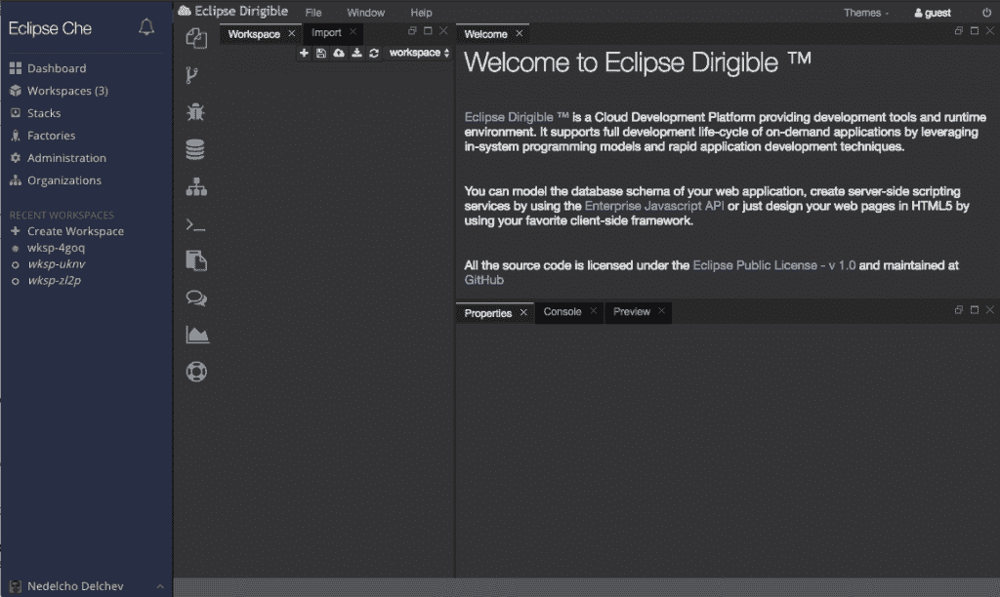

# 月食 Che 7 要来了真的很热(1/4)

> 原文：<https://developers.redhat.com/blog/2018/12/18/eclipse-che-7-coming-part-1>

更好的插件模型、新的 IDE 和 Kubenative 工作区——Eclipse Che 火了！

通过这篇文章，我开始了一系列文章，强调 Eclipse Che 7 将引入的新功能。本文概述了 Eclipse Che 7 的重点领域，以及它的新 IDE 和使用不同 IDE(如 Jupyter)的能力。

### 介绍

多好的一年啊！一个版本接一个版本，由于社区的参与和您的反馈，Eclipse Che 变得越来越好。

作为一个开源项目，Eclipse Che 的核心价值是:

*   **加速项目和开发人员的入职:**作为一个在浏览器中运行的零安装开发环境，Eclipse Che 使人们可以很容易地加入您的团队并为项目做出贡献。
*   **消除开发者环境之间的不一致**:不再:“但是它在我的机器上工作……”您的代码在每个人的环境中都以完全相同的方式工作(或不工作)。
*   **提供内置的安全性和企业就绪性:**随着 Eclipse Che 成为 VDI 解决方案的可行替代品，它必须是安全的，并且必须支持企业需求，例如基于角色的访问控制(RBAC)和从开发人员机器上删除所有源代码的能力。

2018 年初，我们发布了 Eclipse Che 版本。这是一个重要的里程碑，为那些希望从共享和合理化的开发环境中获益的开发团队和企业增加了所需的功能。你可以在 Eclipse Che 6.0 的[发布说明中了解更多信息。](https://che.eclipse.org/release-notes-eclipse-che-6-0-43feff5797e5)

几个月前，我们在 CheConf 18.1 期间宣布了**新旅程的开始和 Eclipse Che 版本 7** 的新篇章。看到已经在使用 Eclipse Che 的企业和正在构建云原生应用程序的社区的兴趣，我们将 Che 路线图组织成 4 个主要领域:

*   **IDE.next** :更新编辑器，增加开发乐趣。
*   **插件**:推动 Che 生态系统进一步发展的特性。
*   **Workspace.next** :在容器中作为微服务运行的 IDE 工具，以提高开发人员工作区和生产环境之间的保真度。
*   **企业**:支持大规模使用 Che 的特性。

### IDE。然后

我们已经将 Eclipse 忒伊亚集成到 Che 中，取代了基于 GWT 的 IDE。Eclipse 忒伊亚拥有帮助我们丰富 Eclipse Che 所需的基础。

下面是一个展示新 IDE 的小视频:

https://youtu.be/zDvmghmfPZQ

本视频中仅展示了一些功能，还有更多功能即将推出。最激动人心的是:

*   **摩纳哥编辑器:**反应极快的编辑器、codelens 等
*   **命令面板:**做任何事情，手都不要离开键盘
*   **任务支持:**来自 VS 代码的任务被扩展，支持 Che 命令
*   **嵌入式预览:**直接从 IDE 中预览你的应用，包括 Markdown 预览。
*   **可定制的布局:**使用拖放来调整布局。
*   **和更多:**大纲视图、搜索、Git

然而，在 Eclipse 忒伊亚和我们当前的 Che IDE 之间有一个实质性的特性差距。今年的大部分时间都花在了为忒伊亚添加所需的功能上，这样它就可以完全取代当前的 IDE。Eclipse Che 贡献者已经花了五年多的时间在云中构建 web IDEs。因此，当我们决定切换到 Eclipse 忒伊亚时，我们自然希望很好地利用这种体验，使新的 IDE 变得真正充实。和企业级。

我们一直在努力带来:

*   调试适配器协议
*   语言服务器协议
*   命令
*   偏好；喜好；优先；参数选择
*   按键
*   Textmate 支持
*   安全性

在接下来的几个月中，这个新的 IDE 将成为您的工作区的默认 IDE。

#### 不同用例使用不同的 ide

还有一件事。Che 仍然会为工作区提供默认的 web ide，但是我们也做了一些重要的工作来分离 IDE，这样就可以将不同的 IDE 插入到 Che 工作区中。在很多情况下，默认的 IDE 将不会覆盖您的受众的用例，或者您可能有利益相关者正在使用一个专用的工具来覆盖他们的需求，而不是使用一个 IDE。在传统的 Eclipse IDE 世界中，这是通过 RCP 应用程序完成的。

有了 Eclipse Che 7，您可以将任何想要的工具插入到 Che 工作区中:

*   它可以基于 Eclipse 忒伊亚(这是一个构建 web IDE 的框架)，比如 web 上流行的 Sirius:[见 youtube 视频](https://www.youtube.com/watch?v=B6aCqywKpyY&t=2s)。
*   或者也可以是完全不同的解决方案，像[木星](https://jupyter.org/)或[日蚀飞船](https://www.dirigible.io/)

以下示例显示了 Che 工作区中的 [Jupyter](https://jupyter.org/) :

https://youtu.be/VooNzKxRFgw

来自 Eclipse Dirigible 的团队实际上也正在将他们的 web IDE 集成到 Che 工作区中:

你可以在这篇关于 dirigible.io 的文章中阅读更多关于 Eclipse 工作区[的内容。](https://www.dirigible.io/blogs/2018/11/12/blogs_dirigible_ide_on_che_workspaces.html)

### 那只是开始！

介绍 Eclipse Che 7 的第一篇文章到此为止。

## 我关于 Eclipse Che 7 的文章:

*   第 1 部分— [Eclipse Che 7 概述，并介绍新的 IDE](https://che.eclipse.org/eclipse-che-7-is-coming-and-its-really-hot-1-4-64d79b75ca02) (本文)
*   第 2 部分— [介绍插件模型](https://che.eclipse.org/eclipse-che-7-is-coming-and-its-really-hot-2-4-2e2c6accbff4)
*   第 3 部分—[Kube-本地开发人员工作区](https://developers.redhat.com/blog/2018/12/20/eclipse-che-7-is-coming-and-its-really-hot-3-4/)
*   第 4 部分— [企业开发团队的功能和发布时间](https://developers.redhat.com/blog/2018/12/21/eclipse-che-7-is-coming-and-its-really-hot-4-4/)

### 参与进来！

[Eclipse Che](http://www.eclipse.org/che/docs/#getting-started)快速入门。

加入社区:

*   **支持**:你可以使用 [GitHub issues](https://github.com/eclipse/che/issues) 提出问题，报告 bug，请求特性。
*   **公共聊天**:加入公共 [eclipse-che](https://mattermost.eclipse.org/eclipse/channels/eclipse-che) Mattermost 频道，与社区和贡献者讨论。
*   **每周例会**:每周二周一参加[车社区例会](https://github.com/eclipse/che/wiki/Che-Dev-Meetings)。
*   邮寄名单:che-dev@eclipse.org

## 查看 Red Hat OpenShift (Beta)的 Red Hat CodeReady 工作区

Red Hat CodeReady Workspaces 建立在开源 Eclipse Che 项目的基础上，提供了开发人员工作区，其中包括编码、构建、测试、运行和调试应用程序所需的所有工具和依赖项。整个产品在本地或云中托管的 OpenShift 集群中运行，无需在本地机器上安装任何东西。

参见文章[***open shift(Beta)的 CodeReady Workspaces 它在他们的机器上也能工作***](https://developers.redhat.com/blog/2018/12/11/codeready-workspaces-openshift/)

*Last updated: September 3, 2019*