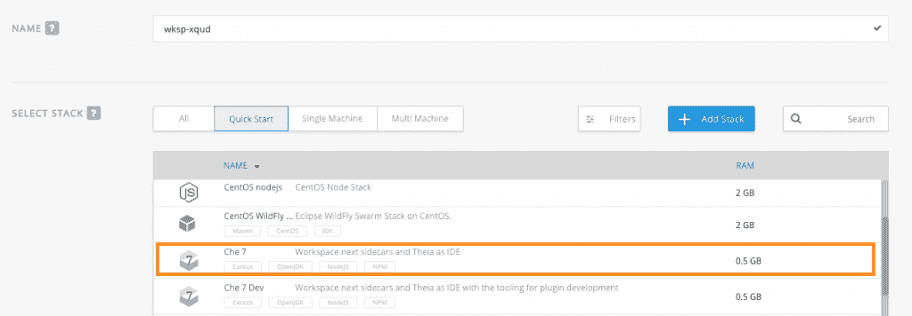

# 月食 Che 7 要来了真的很热(2/4)

> 原文：<https://developers.redhat.com/blog/2018/12/19/eclipse-che-7-is-coming-and-its-really-hot-2-4>

有了新的插件模型和与 VSCode 扩展的兼容性，Eclipse Che 火了！在我的上一篇博文中，我们强调了 Eclipse Che 7 的[主要关注领域。这篇博客文章深入探讨了 Eclipse Che 7 的新插件模型。](https://developers.redhat.com/blog/2018/12/18/eclipse-che-7-coming-part-1/)

### 新插件模型

Eclipse Che 是构建云原生工具的一个很好的平台。为了使 Eclipse Che 成功完成任务，它需要一个强大的可扩展性模型，并为贡献者提供愉快的开发体验。

在过去，Eclipse Che 的可扩展性集中在白标用例上。ISV 能够定制 Eclipse Che，通过完全定制并分发给他们自己的受众来构建他们自己的版本。虽然这种可扩展性方法对许多合作伙伴来说都很棒，但它总是被认为是复杂的，具有技术堆栈(尤其是 IDE 中的 GWT ),这导致了非最佳的开发人员体验。动态可扩展性的缺乏也迫使一个 Che 插件被打包在一个“Che 组件”中，以便最终用户可以使用它。没有办法快速构建一个插件，打包它以便它可以安装在一个运行的 Che 中，并且在不重新构建所有 Che 的情况下使它可用。

为了解决这些问题，我们将逐步淘汰基于 GWT 的 IDE，支持另一个开放的 Eclipse Foundation IDE 项目: [Eclipse 忒伊亚](https://github.com/theia-ide/theia)。如前所述，Eclipse 忒伊亚是一个构建 web IDEs 的框架。它内置于 TypeScript 中，将为贡献者提供一个更灵活、更易于使用的编程模型，并使其更快地交付新插件。

我们的主要目标是提供一个动态插件模型。在 Che 中，用户不需要担心在他们的工作空间中运行的工具所需要的依赖关系。这意味着一个 Che 插件提供了它的依赖项，它的后端服务(可以在一个连接到用户工作区的 sidecar 容器中运行)，以及 IDE UI 扩展。通过将所有这些元素打包在一起，用户的印象是 Che“神奇地”提供了他们工作空间所需的语言服务和开发人员工具。

#### VSCode 扩展性兼容性

插件模型还有一个更重要的方面——我们希望为那些愿意构建插件并分发给不同开发者社区和工具的贡献者合理化努力。为此，我们在 Eclipse 忒伊亚插件 API 中引入了与 VS 代码的扩展点兼容的功能。因此，将现有插件从 VS 代码移植到 Eclipse Che 上变得容易多了。主要的区别在于插件的打包方式。在 Eclipse Che 上，插件在它们自己的容器中有它们自己的依赖项。

查看 SonarSource VSCode 插件上的视频:

https://youtu.be/HbTKDlOL1eo

为了公开这些插件并使它们可消费，我们将建立一个插件市场。这将对社区开放，但也允许私有 Che 安装在防火墙后创建他们自己的内部市场，只使用适合他们用户的插件。今天，这些插件在 github 库的插件注册表下

#### 自托管

为 Che 构建插件也必须是一种有趣的体验，并且在开发人员内循环中周转必须尽可能快(从引入一个变化到看到/调试结果所花费的时间)。我们需要从以前基于 GWT 的 IDE 中改进这一点，所以我们构建了一个完整的托管模式，允许 Che 贡献者直接从 Che 构建 Che。它提供了完整的生命周期——从创建新插件，到编码和调试。构建这一新功能的团队已经在使用它，他们很喜欢它。他们也觉得比过去更有生产力；)

请看这个关于 Eclipse Che 插件开发的视频:

https://youtu.be/1V1jLHqqsH4

### 现在就试试 Eclipse Che 7 吧！

想试试新版 Eclipse Che 7 吗？尝试以下方法:

**点击**以下工厂网址:

[https://che.openshift.io/f?id=factoryvbwekkducozn3jsn](https://che.openshift.io/f?id=factoryvbwekkducozn3jsn)

**或者在 [che.openshift.io](https://che.openshift.io/) 、**上创建自己的账户**创建一个新的工作区**选择“Che 7”栈。

您也可以通过安装最新版本的 Eclipse Che 在您的本地机器上进行尝试:参见[Eclipse Che 快速入门](http://www.eclipse.org/che/docs/#getting-started)了解更多信息。

介绍 Eclipse Che 7 的第二篇博文到此为止。下一篇博客文章将介绍新的**工作区功能**。

有关在 Red Hat OpenShift 上运行的 Che 的信息，请参见 OpenShift 的[CodeReady WorkSpaces](https://developers.redhat.com/products/codeready-workspaces/overview)(目前处于测试阶段)和道格·蒂德威尔的文章和视频，[*open shift 的 CodeReady work spaces(测试版)——它在他们的机器上也能工作*](https://developers.redhat.com/blog/2018/12/11/codeready-workspaces-openshift/) 。Doug 介绍了堆栈、工作区和工厂，以帮助您开始使用 Che。

### 参与进来！

[Eclipse Che](http://www.eclipse.org/che/docs/#getting-started)快速入门。

加入社区:

*   **支持**:你可以使用 [GitHub issues](https://github.com/eclipse/che/issues) 提出问题，报告 bug，请求特性。
*   **公共聊天**:加入公共 [eclipse-che](https://mattermost.eclipse.org/eclipse/channels/eclipse-che) Mattermost 频道，与社区和贡献者讨论。
*   **每周例会**:每周二周一参加[车社区例会](https://github.com/eclipse/che/wiki/Che-Dev-Meetings)。
*   邮寄名单:che-dev@eclipse.org

## 我关于 Eclipse Che 7 的文章:

*   第 1 部分— [Eclipse Che 7 概述，并介绍新的 IDE](https://che.eclipse.org/eclipse-che-7-is-coming-and-its-really-hot-1-4-64d79b75ca02)
*   第 2 部分— [介绍插件模型](https://che.eclipse.org/eclipse-che-7-is-coming-and-its-really-hot-2-4-2e2c6accbff4)(本文)
*   第 3 部分—[Kube-本地开发人员工作区](https://developers.redhat.com/blog/2018/12/20/eclipse-che-7-is-coming-and-its-really-hot-3-4/)
*   第 4 部分— [企业开发团队的功能和发布时间](https://developers.redhat.com/blog/2018/12/21/eclipse-che-7-is-coming-and-its-really-hot-4-4/)

*Last updated: September 3, 2019*