# 事件流和数据联邦:一个公民集成者的故事

> 原文：<https://developers.redhat.com/blog/2020/06/12/event-streaming-and-data-federation-a-citizen-integrators-story>

企业希望通过实时个性化体验从每次客户互动中获益。针对每一个客户进行相关优惠，可以大大提高客户忠诚度，但首先要了解客户。我们必须能够利用来自不同系统的数据和其他资源，如营销、客户服务、欺诈和业务运营。随着现代技术和敏捷方法的出现，我们还希望能够[授权公民集成商](https://www.computerweekly.com/microscope/opinion/In-pursuit-of-agility-empowering-the-citizen-integrator)(通常是了解业务和客户需求的业务用户)创建定制软件。我们需要的是一个单一的功能域，其中的信息以同质的方式进行协调。

在本文中，我将向您展示如何使用 [Red Hat Integration](https://www.redhat.com/en/products/integration) 来创建个性化的客户体验。图 1 显示了我们将在示例中使用的集成架构的高级概述。

[](/sites/default/files/blog/2020/06/high_level_arch.jpg)Figure 1: Loyalty Management Application">

让我们从忠诚度管理应用程序的用例开始；然后，我将介绍我们将用于集成的技术。

## 忠诚度管理用例

我们的示例应用程序实现了向客户实时发送报价的用例。当客户执行交易时，它进入事件流。对于每个事件，我们获取客户上下文并执行两个简单的检查:

*   客户是`PLATINUM`还是`GOLD`用户？
*   客户的预测忠诚度细分是`HIGH`还是`MEDIUM`？

然后，我们将使用这些信息来决定是否向给定的客户提供优惠。

## 架构概述

[Red Hat Integration](https://www.redhat.com/en/products/integration) 是一组集成和消息传递产品，提供 API 连接、数据转换、服务组合等等。对于示例应用程序，我们将使用 Red Hata 数据虚拟化、Red Hat Fuse Online 和 Red Hat AMQ 流。图 2 显示了我们的架构所使用的架构和技术。

[](/sites/default/files/blog/2020/06/tech_stack.jpg)Figure 2\. Architectural Overview">

我们将使用 Red Hat 集成来实现其事件流基础设施和所需的集成功能。该架构的主干是 [Red Hat AMQ 流](https://developers.redhat.com/blog/2019/12/04/understanding-red-hat-amq-streams-components-for-openshift-and-kubernetes-part-1/)，这是一个基于 Apache Kafka 的大规模可扩展、分布式和高性能的数据流平台。

我们还将使用 [Red Hat Data Virtualization](https://developers.redhat.com/blog/2020/01/21/first-steps-with-the-data-virtualization-operator-for-red-hat-openshift/) 的开发者预览版，这是一个容器本地服务，提供对不同数据源的集成访问。我们将使用数据虚拟化从不同的数据源收集数据。我们将使用这些数据来创建客户环境。

最后，我们将使用 [Red Hat Fuse Online](https://developers.redhat.com/products/fuse/getting-started) 来创建集成和数据服务。Fuse Online 是一个集成平台即服务(iPaaS)，使业务用户可以轻松地与集成专家和应用程序开发人员进行协作。借助 Fuse Online 的低代码工具，集成专家可以快速创建数据服务和集成。

### 集成流程

图 3 显示了示例集成所需的步骤序列。

[](/sites/default/files/blog/2020/05/integ_map.jpeg)

Figure 3\. A preview of the complete integration stack.

当系统从事务主题中读取事件时，集成就开始了。系统查找客户的背景和客户分类。然后，系统会进行检查，以确保只有符合所需筛选标准的用户才会收到聘用通知。最后，如果顾客有资格，系统在第二 Kafka 主题中发布报价。

## 准备环境

现在您已经对示例集成有了一个概述，让我们来设置我们的演示环境。我们将使用 [Red Hat OpenShift](https://developers.redhat.com/products/openshift/overview) 来安装我们需要的组件。OpenShift 支持高效的容器编排，允许开发人员快速供应、部署、扩展和管理基于容器的应用程序。我们将使用 OpenShift 上的 Red Hat 集成来快速轻松地创建和管理 web 级的云原生集成。

### 步骤 1:部署 AMQ 流

首先，我们将从 OpenShift OperatorHub 安装 AMQ 流。首先登录到 OpenShift 控制台并创建一个新项目。图 4 显示了从 OperatorHub 安装 AMQ 流操作器的选择。

[](/sites/default/files/blog/2020/06/fuse_online_operator.png)Figure 4\. AMQ Streams Operator">

接下来，使用 AMQ 流操作符提供的默认设置创建一个 Kafka 集群，如图 5 所示。

[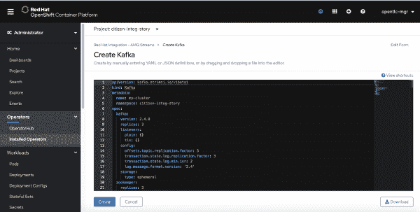](/sites/default/files/blog/2020/06/fuse_online_operator_2.png)Figure 5\. Kafka Configuration">

你现在应该有一个短暂的卡夫卡集群。

### 步骤 2:在线部署 Fuse

现在我们将使用 OperatorHub 在线部署 Fuse，如图 6 所示。

[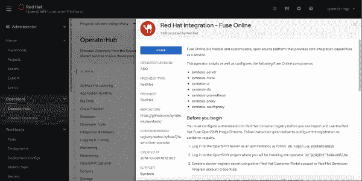](/sites/default/files/blog/2020/05/fuse_online_operator_3.png)

Figure 6\. Fuse Online Operator

### 第三步:准备数据

在开始演示之前，最后一步是创建数据库表，用于保存应用程序的客户和交易数据。我们将需要设置一个模拟事件发射器，模拟流经系统的真实客户事件的行为。我们还需要为预测服务设置一个模拟端点，我们将从集成服务中使用它。该过程的这一部分有点复杂，所以请按照这里描述的[步骤](https://github.com/snandakumar87/citizen-integrator-story-assets/blob/master/prepare_data.adoc)来完成设置。

## 具有在线熔丝的低代码工具

一旦设置好基础设施，我们就可以登录 Fuse 在线控制台。您可以在 routes 下找到控制台的 URL。您应该能够使用您的 OpenShift 控制台凭证登录。

### 步骤 1:创建连接

首先，我们需要建立两个连接:一个用于 PostgreSQL 数据库，另一个用于 MySQL。从 Fuse Online 的**连接**选项卡，点击**创建连接**并选择**数据库**，如图 7 所示。为 Postgres 数据库设置连接凭据。

[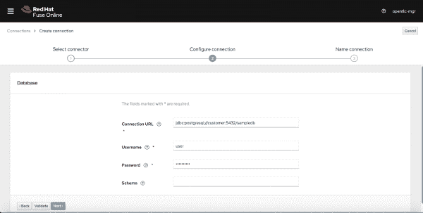](/sites/default/files/blog/2020/05/fuse_online_operator_4.png)

Figure 7\. Create a database connection for PostgreSQL.

使用图 8 所示的连接参数，按照相同的过程为 MySQL 数据库创建连接字符串。

[](/sites/default/files/blog/2020/05/fuse_online_operator_5.png)

Figure 8\. Create a database connection for MySQL.

#### 卡夫卡连接器

接下来，我们将创建一个 Kafka 连接器，以便我们可以读取事件并将事件发布到客户事件流。在**创建连接**下选择 **Kafka 消息代理**连接类型，然后添加之前创建的 Kafka 集群的 URL，如图 9 所示。

[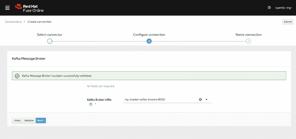](/sites/default/files/blog/2020/05/fuse_online_operator_6.png)

Figure 9\. Add the URL of the Kafka cluster.

#### API 客户端连接

最后，我们将建立一个 API 客户端连接来模拟预测 API。[上传这个 JSON 文件](https://github.com/snandakumar87/citizen-integrator-story-assets/blob/master/api_json.json)来创建预测服务连接器，如图 10 所示。

[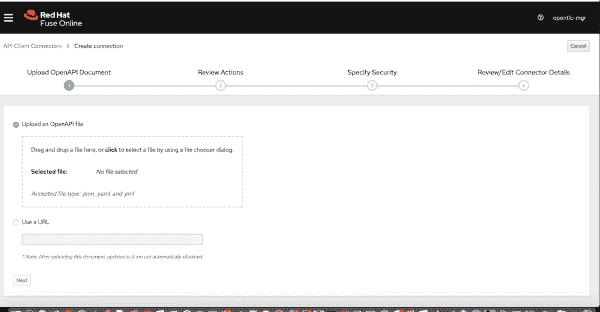](/sites/default/files/blog/2020/05/fuse_online_operator_7.png)

Figure 10\. Upload the JSON file in the API client connector wizard.

完成后，按照说明保存 API 客户机连接器。

现在我们准备开始创建集成。我们将从数据服务开始。

### 步骤 2:创建数据服务

首先从 Fuse Online 的左侧窗格中选择**数据**选项，然后点击**创建数据虚拟化**。

#### 创建视图

我们所有的连接都出现在视图编辑器中。选择**交易**和**客户**表，如图 11 所示。

[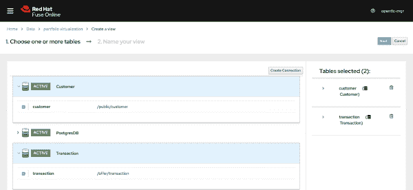](/sites/default/files/blog/2020/05/fuse_online_operator_8.png)

Figure 11\. Select the Transaction and Customer tables.

我们还可以使用视图编辑器创建一个带有整合的客户上下文的虚拟数据库表，如图 12 所示。

[](/sites/default/files/blog/2020/05/fuse_online_operator_9.png)

Figure 12\. Create a Virtual Database table to host the customer context.

视图编辑器还提供了一个数据部分，我们可以在其中测试查询的结果。

#### 发布和访问数据服务

现在我们已经准备好发布数据服务了。一旦发布，我们可以使用 [Java 数据库连接(JDBC) API](https://docs.oracle.com/javase/tutorial/jdbc/basics/index.html) 或 [OData 端点](https://www.odata.org)来访问虚拟数据库。选择 OData 端点，如图 13 所示。

[](/sites/default/files/blog/2020/05/fuse_onliner_1.png)

Figure 13\. Select the OData endpoint to access the virtual database.

如图 14 所示，我们可以使用 URL 格式**<odata-link>/OData/<virtual ization-name>/<view-name>**来访问 OData 端点。

[](/sites/default/files/blog/2020/05/fuse_onliner_2.png)

Figure 14\. Access the virtual database via its OData endpoint.

### 步骤 3:创建集成服务

现在我们将创建一个集成服务。

#### 订阅并发布到卡夫卡

在 Fuse 在线控制台中，进入**集成**选项卡，点击**创建集成**。如图 15 所示，我们可以从创建客户事件的 Kafka 主题中读取。

[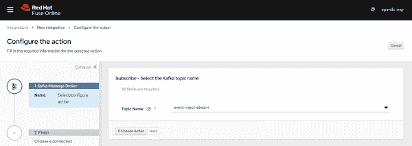](/sites/default/files/blog/2020/05/fuse_onliner_3.png)

Figure 15\. Configure the Kafka Subscribe Step.

我们将使用 JSON 实例来定义消息的数据结构:

```
{"eventValue": "MERCHANDISE", "eventSource": "POS","custId":"CUST898920"}

```

如图 16 所示，我们将定义集成的最后一步，在这里我们将把报价结果写回到 Kafka 主题。我们将为客户的报价数据定义 JSON 实例，如下所示:

```
{"offer": "value", "custId":"id","customerClass":"class","customersegmentation":"segment"}

```

[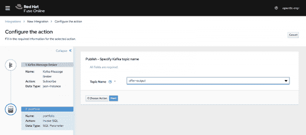](/sites/default/files/blog/2020/05/fuse_onliner_4.png)

Figure 16\. Configure the Kafka Publish Step.

#### 获取客户数据

接下来，我们从虚拟数据库中获取客户数据。在 Fuse 在线控制台中，选择我们之前配置的**虚拟数据库**连接，然后选择**调用 SQL** 选项。

接下来，我们将定义到达终点之前的中间步骤。对于每个客户记录，我们将获取客户的虚拟数据上下文，这是我们之前创建的。图 17 显示了获取虚拟数据上下文的对话框。

[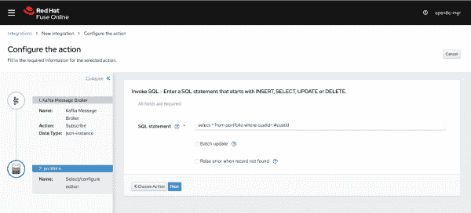](/sites/default/files/blog/2020/05/fuse_onliner_6.png)

Figure 17\. Fetch the virtual data context.

图 18 是到目前为止集成的屏幕截图。

[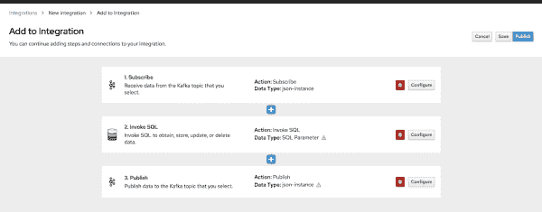](/sites/default/files/blog/2020/05/fuse_onliner_7.png)

Figure 18\. A screenshot of the integration in progress.

#### 获取预测数据

接下来，我们将添加一个步骤来从模拟预测服务中获取预测数据。在步骤 2 之后单击加号(+)并选择我们之前创建的预测服务连接。这个步骤如图 19 所示。

[](/sites/default/files/blog/2020/05/fuse_onliner_8.png)

Figure 19\. Fetch the prediction data.

#### 为每个连接定义一个数据映射器

在每个连接步骤之后，您将会看到一个警告，要求您定义数据映射器。数据映射器将客户的输入值映射到正确的输出值。要开始定义数据映射器，请在步骤 1 之后立即单击加号(+)。如图 20 所示，这将为您提供定义目标步骤的选项。

[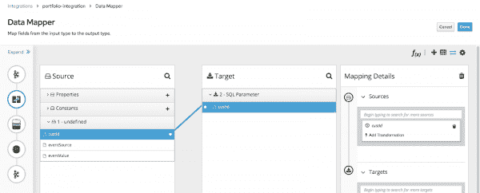](/sites/default/files/blog/2020/05/fuse_onliner_9.png)

Figure 20\. Mapping the Source and Target steps.

遵循相同的过程来定义当我们调用预测服务时将被调用的映射器，然后定义在我们发布到 Kafka 主题之前将被调用的映射器。

如图 21 所示，我们使用数据映射器对话框来映射每个步骤的值，以便我们可以为客户选择正确的产品。另外，请注意，我们使用此对话框向报价文本添加转换。

[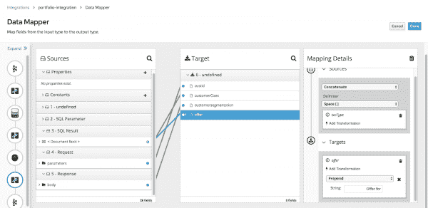](/sites/default/files/blog/2020/05/fuse_onliner_10.png)

Figure 21\. Mapper before publish.

### 步骤 4:应用过滤标准

我们使用 Fuse Online 来连接我们集成的所有部分。然而，你可能已经注意到我们遗漏了一个重要的部分。在发布我们的整合之前，我们需要确保我们只向拥有白金或黄金身份的客户提供优惠，并且他们的预测忠诚度细分被标记为高或中。为此，我们将配置图 22 所示的**基本过滤器**选项。

[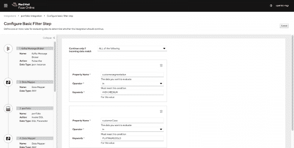](/sites/default/files/blog/2020/05/fuse_onliner_11.png)

Figure 22\. Configure the Basic Filter option for customer status and predictive loyalty segmentation.

### 步骤 5:发布和监控集成

现在，我们已经完成了所有部件的组装，是时候发布了。只需保存集成并发布它。发布之后，集成堆栈应该如图 23 所示。

[](/sites/default/files/blog/2020/05/fuse_onliner_12.png)

Figure 23\. The complete stack for the Loyalty Management Application.

#### 监控集成

我们可以使用 **Activity** 选项卡来查看正在处理的事件，如图 24 所示。

[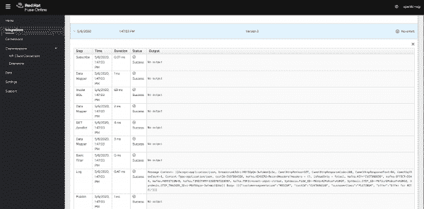](/sites/default/files/blog/2020/05/fuse_onliner_13.png)

Figure 24\. Use the Activity tab to view events as they are being processed.

我们可以使用 **Metrics** 选项卡来查看已处理消息的整体指标，如图 25 所示。

[](/sites/default/files/blog/2020/05/fuse_onliner_14.png)

Figure 25\. Use the Metrics tab to view the overall metrics for received and processed Kafka messages.

访问我的 GitHub 库[下载完整的集成代码](https://github.com/snandakumar87/citizen-integrator-story-assets/blob/master/portfolio-integration-export.zip)。如果你想在线导入代码到 Fuse，导航到**集成**选项卡，点击**导入**。

## 摘要

使用数据优先的方法，我们现在能够快速可视化我们的近实时处理要求所需的上下文信息。通过提供低代码工具，我们能够让公民集成商和数据专家以云原生方式快速创建这些集成解决方案。

*Last updated: June 25, 2020*