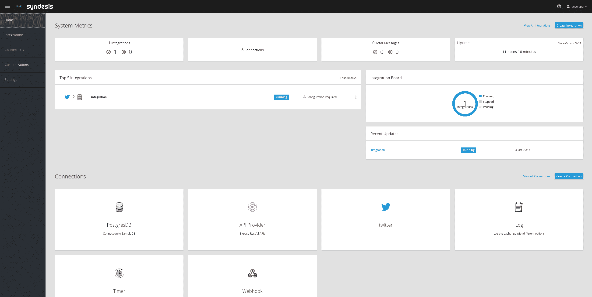

# 使用 Groovy 定制 Maven 构建过程

> 原文：<https://developers.redhat.com/blog/2018/10/10/groovy-customize-maven-build>

Apache Maven 是一个流行的构建自动化工具，主要用于 Java 项目(尽管它也可以用于构建和管理用其他语言编写的项目)。Maven 使用一个`pom.xml`文件来集中管理项目的构建及其依赖项。如果你曾经在接近 [Java 生态系统](https://developers.redhat.com/blog/category/java/)的地方工作过，不管是好是坏，你都有机会接触到这个工具的使用。

Maven 插件用于增强和定制 Maven 构建过程；虽然现有插件的[列表相当广泛，但通常需要实现一些小的改变或稍微调整一下构建，这使得编写整个插件感觉有些矫枉过正。](https://maven.apache.org/plugins/)

这篇文章描述了一个可能的解决方案:GMaven Plus 插件。

GMaven Plus 是一个用 Maven 管理 Groovy 项目的 Maven 插件。在其他特性中，它有一个可以轻松配置的执行脚本目标，如下面的代码片段所示:

```
<build>
  <plugins>
    <plugin>
      <groupId>org.codehaus.gmavenplus</groupId>
      <artifactId>gmavenplus-plugin</artifactId>
      <version>1.6.1</version>
      <executions>
        <execution>
          <goals>
            <goal>execute</goal>
          </goals>
        </execution>
      </executions>
      <configuration>
        <properties>
          <property>
            <name>someProp</name>
            <value>${someProp}</value>
          </property>
        </properties>
        <scripts>
          //your Groovy code goes here
        </scripts> 
      </configuration> 
      <dependencies> 
        <dependency> 
          <groupId>org.codehaus.groovy</groupId> 
          <artifactId>groovy-all</artifactId> 
          <version>2.5.0</version> 
          <type>pom</type> 
          <scope>runtime</scope> 
        </dependency> 
      </dependencies> 
    </plugin> 
  </plugins> 
</build>

```

Groovy 脚本的执行可以绑定到任何 Maven 阶段；此外，在脚本内部，对象`session`和`project`可以用来与 Maven 构建进行交互。例如，可以用`log.info "$project.name"`记录项目名称。(Groovy 脚本中还有其他有用的 Maven 对象，以及其他有用的东西，比如使用`@Grab`下载脚本可能有的外部依赖项；查看[示例](https://github.com/groovy/GMavenPlus/wiki/Examples#execute-scripts)。由于这两种能力的结合，用直接放在`pom.xml`文件中的内联 Groovy 脚本直接扩展 Maven 构建过程非常容易，如上所示。

## 现实世界的例子

与其用一个虚构的例子来展示如何使用 GMaven Plus 插件来达到我们的目的，我认为看一个真实世界的例子是有益的。该示例摘自 Syndesis 项目。

Syndesis 是一个集成平台即服务(iPaaS)，旨在简化业务用户、集成专家和应用程序开发人员之间的协作。它是一个云原生工具链和运行时，可以直接从浏览器获得。这是一个开源项目， [Red Hat Fuse Online](https://developers.redhat.com/products/fuse/overview/) 就基于此。

[](https://developers.redhat.com/blog/wp-content/uploads/2018/10/Screenshot-from-2018-10-04-11-45-47.png)
Syndesis dashboard

仅使用 Syndesis web UI，就可以定义、运行和管理集成，例如，从 Twitter 获取数据并将其保存在数据库中，或者向 Apache Kafka 或 Apache ActiveMQ 等消息传递系统发送消息。这些任务过去需要集成专家和开发人员一起工作，有时需要几天，但是使用 Syndesis，这些任务可以由业务用户直接以无代码的方式完成。

[](https://developers.redhat.com/blog/wp-content/uploads/2018/10/Screenshot-from-2018-10-04-12-31-34.png)
Syndesis integration editor

该平台可以通过扩展来覆盖不太标准和更特殊的情况(一些扩展收集在它们自己的 [GitHub 库](https://github.com/syndesisio/syndesis-extensions)中)。通常，开发人员负责创建这样的扩展并构建它。为了做到这一点，必须根据将要加载扩展的 Syndesis 平台的版本来构建扩展。在 syndesis-extension 项目中手动检索和设置 Syndesis 版本是一项繁琐且容易出错的工作。如果可以将 Syndesis 平台 URL 传递给构建过程，Maven 会自动获得正确的版本并使用它，那就更好了。

## 解释解决方案

[syndesis-extension 项目 pom.xml](https://github.com/syndesisio/syndesis-extensions/blob/af61fb81c74ce02cc4cd63451eca4620e8718c46/pom.xml#L114-L180) 中的 Groovy 脚本实现了以下逻辑:URL 在名为`syndesisServerUrl`的属性中传递，该属性用于动态检索 syndesis 版本，并在 Maven 项目中将其设置为`syndesis.version`。如果没有提供 URL，Maven 将回退到使用`pom.xml`文件中的`syndesis.version`。

`pom.xml`文件的相关部分如下所示:

```
<plugin>
  <groupId>org.codehaus.gmavenplus</groupId>
  <artifactId>gmavenplus-plugin</artifactId>
  <version>1.6</version>
  <executions>
    <execution>
      <id>get-syndesis-version</id>
      <phase>initialize</phase>
      <goals>
        <goal>execute</goal>
      </goals>
    </execution>
  </executions>
  <configuration>
    <scripts>
      <script>
        [...]
        log.debug "START getting syndesis version from a running Syndesis server."

        def syndesisServerUrl = getPropertyValue('syndesisServerUrl')
        log.debug "syndesisServerUrl value = $syndesisServerUrl"

        if( syndesisServerUrl != null ) {
        [...]

        String syndesisVersionUrl = syndesisServerUrl+"/api/v1/version"
        log.info "About to call GET on $syndesisVersionUrl" 
        def version = null
          try {
            version = new URL(syndesisVersionUrl).getText(requestProperties: [Accept: 'text/plain'])
            String syndesisVesrion = new String(version)
            project.properties.setProperty('syndesis.version', syndesisVesrion)
            log.info "syndesis.version set to: $syndesisVesrion"
          } catch(Exception ex) {
            log.error "Error during syndesis version GET from $syndesisVersionUrl"
            ex.printStackTrace()
            throw ex
          } finally {
            log.info "Called GET on $syndesisVersionUrl with result $version"
          }
        } else {
         log.info "syndesisServerUrl property not set, the syndesis.version from pom.xml will be used."
        }

        [...]

        String getPropertyValue(String name) {
          def value = session.userProperties[name]
          if (value != null) return value //property was defined from command line e.g.: -DpropertyName=value
          return project.properties[name]
        }

        log.debug "END getting syndesis version from a running Syndesis server."
      </script>
    </scripts>
  </configuration>
  <dependencies>
     <dependency>
        <groupId>org.codehaus.groovy</groupId>
        <artifactId>groovy-all</artifactId>
        <version>2.4.12</version>
        <scope>runtime</scope>
     </dependency>
  </dependencies>
</plugin>

```

上面的片段突出了关键的几行。首先，行`<phase>initialize</phase>`将脚本执行绑定到初始化阶段；因此，它将在每个 Maven 构建的开始执行。脚本的其余部分是本节开始时描述的逻辑的自解释 Groovy 代码实现。也许最关键的一行是`project.properties.setProperty('syndesis.version', syndesisVersion`，它在 Maven `project`对象中设置了`syndesis.version`属性。这样，如果用户使用`mvn clean install -DsyndesisServerUrl=https://your.syndesis.server.url`调用构建，Syndesis 版本将从提供的 URL 中动态获取。

## 结论

本文介绍了一种使用 GMaven Plus 插件进入 Maven 构建并与之交互的方法，而无需编写整个 Maven 插件。此外，它还介绍并评论了该技术的实际应用，以便为讨论提供一些背景。

*Last updated: October 9, 2018*