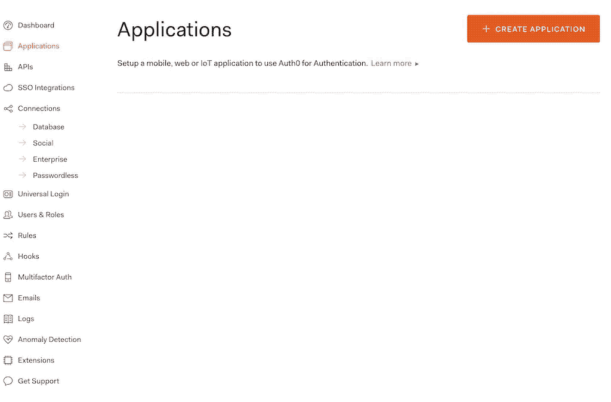
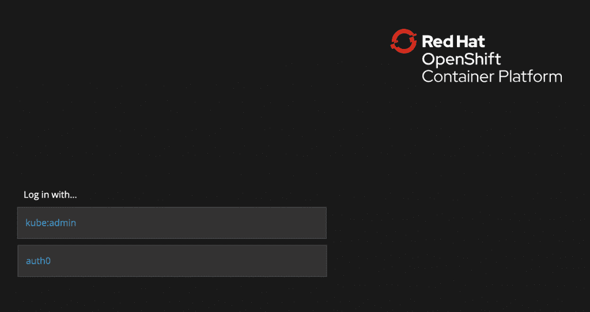

# 如何配置红帽 OpenShift 4 使用 Auth0

> 原文：<https://developers.redhat.com/blog/2019/10/09/how-to-configure-red-hat-openshift-4-to-use-auth0>

我和我的同事最近不得不为一个客户搭建一个 [Red Hat OpenShift 4](https://developers.redhat.com/openshift/) 集群，以确定他们移植应用程序的难度。虽然他们可以用 [CodeReady Containers](https://developers.redhat.com/blog/2019/09/05/red-hat-openshift-4-on-your-laptop-introducing-red-hat-codeready-containers/) 获得类似的结果，但他们的本地开发机器没有足够的资源(最低 8GB RAM，这是在平板电脑上开发的一个问题)。

为了减少试验期间在项目中添加和删除用户的开销，我们决定跳过简单的 HTPasswd 提供程序，使用由 Auth0 支持的 OAuth 提供程序。我们还想发布我们的指南，让其他人更容易采用类似的部署。

本文概述了如何配置 Red Hat OpenShift 4.x 以使用 Auth0 作为 OAuth2 提供者。它假设您已经有一个正在运行的 OpenShift 集群和一个 Auth0 帐户。

## Auth0 步骤

*   登录到 Auth0 管理控制台。
*   从侧面菜单中选择*应用*。
*   选择*创建*应用，选择*常规 Web 应用*。
*   单击设置:
    *   记录客户机密。
    *   记录客户 id。
    *   记录域。
    *   设置 OpenShift 集群的回调 URL。末尾的名称命名为您在 OpenShift 中提供的身份提供者，然后单击提交。例如:https://oauth-open shift . apps . OCP . example . com/oath 2 callback/auth 0

### 例子

### OpenShift 步骤

现在您可以配置 Red Hat OpenShift:

*   用 **kubeadmin** 账号登录 OpenShift。
*   选择*管理>集群设置*。
*   选择*全局配置> Oauth。*
*   向下滚动到*身份提供商*并选择*添加> OpenID 连接*
*   如下完成表格。如果您更改了名称，请确保在 Auth0:
    *   名称:auth0
    *   客户端 ID:
    *   客户机密:
    *   发行人 URL:
    *   首选用户名:电子邮件
    *   姓名:昵称
    *   电子邮件:邮件
    *   额外范围:电子邮件，个人资料，昵称
*   单击添加

现在，当您浏览到 OpenShift 登录页面时，您将看到 Auth0 作为登录提供者。

感谢詹姆斯·赖尔斯对这一配置的帮助。

*Last updated: July 1, 2020*