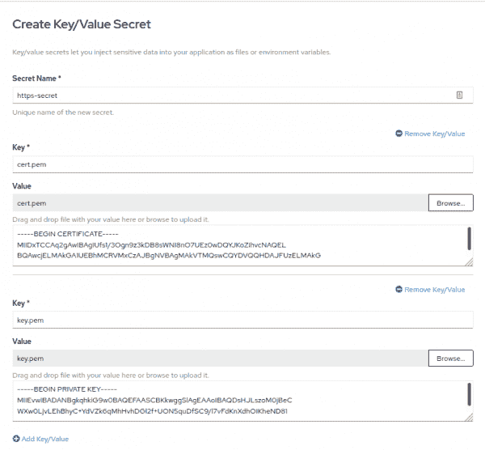
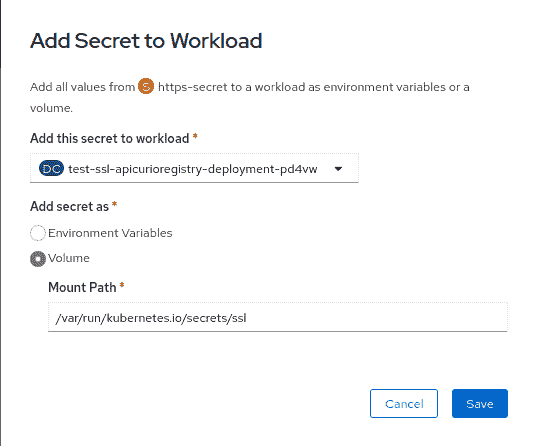

# 如何在 Quarkus 应用中启用 HTTPS 和 SSL 终止

> 原文：<https://developers.redhat.com/blog/2021/01/06/how-to-enable-https-and-ssl-termination-in-a-quarkus-app>

说到[容器](https://developers.redhat.com/topics/containers/)世界，将应用程序部署到需要保护的集群是很常见的。在本文中，我将向您展示如何为运行在 [Red Hat OpenShift](https://www.openshift.com/) 中的 [Quarkus](https://quarkus.io/) 应用程序启用 HTTPS 和 SSL 终止。

## 创造秘密

首先，我们需要一个配对的密钥和证书。如果您没有任何可用的密钥和证书，您可以使用以下命令来创建仅用于开发的密钥和证书:

```
~ openssl req -newkey rsa:2048 -new -nodes -x509 -days 3650 -keyout key.pem -out cert.pem
```

这将创建两个文件(key.pem 和 cert.pem ),我们需要将它们注入到我们的 pods 中，使它们对 Quarkus 应用程序可用。这可以通过以下步骤使用机密和卷轻松实现:

[](/sites/default/files/blog/2020/10/create-secret.png)

Figure 1: First, create your key/value secret in OpenShift.

创建之后，将秘密添加到应用程序的工作负载中，如图 2 所示。

[](/sites/default/files/blog/2020/10/add-secret.png)

Figure 2: Second, add the secret to your workload.

现在，我们使用我们选择的挂载路径将它添加为一个卷。这将把证书和密钥文件装载并添加到所有应用程序窗格中。

## 启用 HTTPS

一旦这个秘密被添加到工作负载中，我们将需要设置一些环境变量，以便使 HTTPS 和 Quarkus 能够公开正确的端口。配置中最重要的部分是引用 SSL 证书的环境变量。有关在 Quarkus 中配置 SSL 时可用选项的更多信息，请参见 Quarkus HTTP 参考指南的本节内容。

图 3 显示了最终配置的示例。

[](/sites/default/files/blog/2020/10/environment-variables.png)

Figure 3: Third, set up your environment variables, especially for your SSL certificate.

有了这个配置，我们将重定向所有不安全的请求，并告诉 Quarkus 使用密钥和证书(我们在上一步中已经安装了)进入 pod。

现在我们的 Quarkus 应用程序应该向 HTTPS 公开端口 8443。如果我们转到应用程序日志，我们应该会看到如下消息:

[](/sites/default/files/blog/2020/10/quarkus-log.png)

Figure 4: And finally, make sure that your Quarkus application is exposing port 8443 for HTTPS.

## 将应用程序展示给现实世界

很好，Quarkus 应用程序现在公开了正确的端口，并通过 HTTPS 接受连接。在这一点上，我们可以认为 Quarkus 的工作已经完成。但是，如果我们不把自己的 app 暴露给外界，这是没有用的。

为了让我们的应用程序对外可用，我们需要一个*服务*和一个*路线*。服务充当内部负载平衡器。它识别一组复制的 pod，以便代理它接收到的到它们的连接。服务被分配一个 IP 地址和端口，当被访问时，代理到适当的后备 pod。

服务使用标签选择器来查找在特定端口上提供特定网络服务的所有正在运行的容器。下面是一个服务示例:

```
apiVersion: v1
kind: Service
metadata:
  generateName: test-ssl-apicurioregistry-service-
  namespace: default
spec:
 selector:
  app: test-ssl-apicurioregistry
 ports:
  - protocol: TCP
  port: 8443
  targetPort: 8443

```

OpenShift 路由是一种通过给服务一个外部可达的主机名来公开服务的方法。有关如何创建或管理安全路线的更多信息，请参见 OpenShift 文档的[安全路线部分。](https://docs.openshift.com/container-platform/4.6/networking/routes/secured-routes.html)

下面是一个安全路由示例:

```
apiVersion: v1
kind: Route
metadata:
  name: secured-registry
  namespace: default
spec:
  to:
   kind: Service
   name: test-ssl-apicurioregistry-service-mjdzd
   weight: 100
  port:
   targetPort: 8443
  tls:
   termination: passthrough
   insecureEdgeTerminationPolicy: Redirect
   wildcardPolicy: None

```

## 检查配置

我们可以使用 OpenShift 客户端轻松检查我们的配置:

```
➜  ~ oc get routes
NAME                                            HOST/PORT                                                          PATH   SERVICES                                  PORT    TERMINATION            WILDCARD
secured-registry                                secured-registry-default.apps.carnalca.ipt.integrations.rhmw.io           test-ssl-apicurioregistry-service-mjdzd   8443    passthrough/Redirect   None  

```

```
➜  ~ oc get svc test-ssl-apicurioregistry-service-mjdzd
NAME                                      TYPE        CLUSTER-IP      EXTERNAL-IP   PORT(S)    AGE
test-ssl-apicurioregistry-service-mjdzd   ClusterIP   172.30.122.25           8443/TCP   21h

```

## 结论

在本文中，我向您展示了如何保护一个 [Quarkus](https://developers.redhat.com/topics/quarkus/) 应用程序的流量。从 Quarkus 属性到 OpenShift 资源，您已经看到了实现这个目标的最简单的方法。虽然我使用了一些默认设置，但还有许多其他功能和配置有待探索。在这里，我只是讲述了如何在保持一切尽可能简单的同时，在 OpenShift 中保护 Quarkus 应用程序的基础知识。希望分享这个经验对别人有帮助。

*Last updated: October 7, 2022*