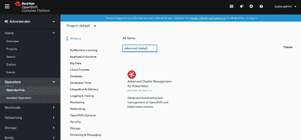
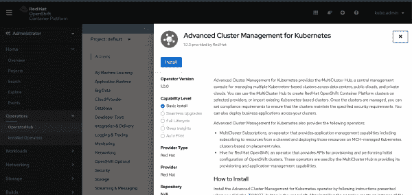
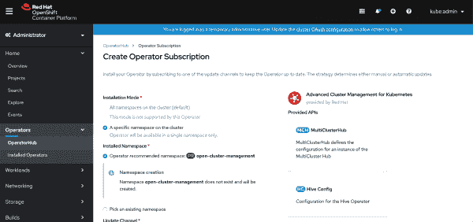
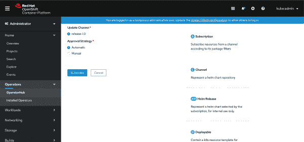
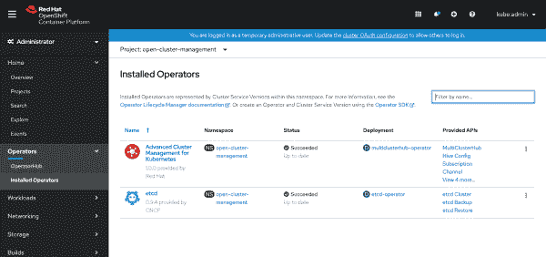
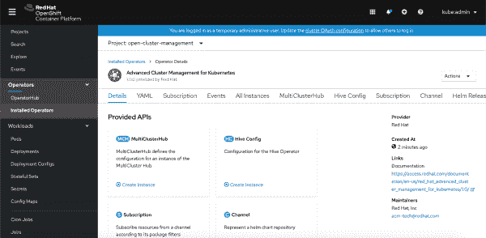
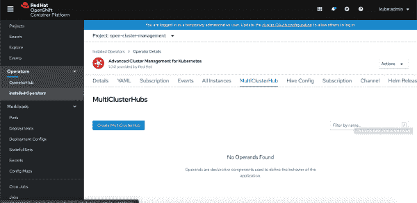
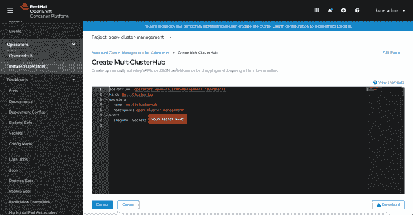
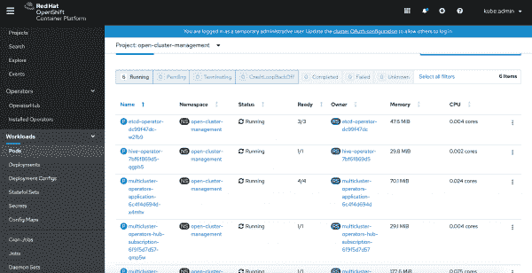

# 为 Kubernetes 安装 Red Hat 高级集群管理(ACM)

> 原文：<https://developers.redhat.com/blog/2020/07/23/installing-red-hat-advanced-cluster-management-acm-for-kubernetes>

[Red Hat Advanced Cluster Management(ACM)for Kubernetes](https://www.redhat.com/en/resources/advanced-cluster-management-kubernetes-faq)为管理您的集群和应用生命周期提供端到端的可见性和控制。在其他功能中，它可以确保您的整个 [Kubernetes](https://developers.redhat.com/topics/kubernetes) 域跨多个数据中心和公共云的安全性和合规性。

本文指导您为 ACM 安装设置您的 [Red Hat OpenShift 4](https://developers.redhat.com/products/openshift/overview) 环境，然后安装 ACM。出于我将解释的原因，我们将使用命令行界面(CLI)来设置安装环境。一旦设置好环境，我将向您展示如何使用 CLI 或 OpenShift web 控制台完成安装，并提供两种方法的示例。

注意，我不会演示如何在受限环境中安装 ACM。此外，我的示例基于 Kubernetes 1.0 的[高级集群管理。技术预告](https://www.redhat.com/en/blog/red-hat-introduces-advanced-cluster-management-kubernetes)。对于较新版本的 ACM，您可能需要更新一些安装步骤。

**注**:参见[*Red Hat Advanced Cluster Management for Kubernetes*](https://www.redhat.com/en/resources/advanced-cluster-management-kubernetes-datasheet)了解 ACM 的更多特性和优势。

## ACM 安装概述

您可以使用 OpenShift 4 web 控制台的内置 [OperatorHub](https://developers.redhat.com/topics/kubernetes/operators) 或 OpenShift CLI 来安装 ACM。安装分为六个步骤:

1.  为 ACM 安装准备环境。
2.  创建一个新的 OpenShift 项目和名称空间。
3.  创建一个图像提取秘密。
4.  安装 ACM，订阅 ACM [操作员](https://developers.redhat.com/topics/kubernetes/operators/)群。
5.  创建 MultiClusterHub 资源。
6.  验证 ACM 安装。

我们将在前几个步骤中使用 OpenShift 命令行；然后，我将向您展示如何使用命令行或 OpenShift 4 web 控制台。

## 步骤 1:为 ACM 安装准备环境

在开始安装过程之前，确保您的开发环境中安装了正确版本的 OpenShift 和其他资源。在开始为 ACM 设置开发环境之前，请确保在 Linux x86_64 和[Red Hat Enterprise Linux](https://developers.redhat.com/topics/linux)(RHEL)7.6 或更高版本上安装了 OpenShift 4.3 或更高版本。

在继续之前，有许多重要的细节需要考虑。一个是每个节点的豆荚数量。您需要的 pod 数量取决于应用程序类型以及您如何配置工作节点。每个节点的最大 pod 是 500，每个 CPU 核心的最大 pod 是 10。

另一个原因是集群的大小取决于工作节点的数量。如果您的群集只有几个工作节点，请考虑增加工作节点的数量，同时减小每个节点的大小，以获得足够的空间、效率、移动性和弹性。

**注意** : [了解有关最小和最大节点配置以及 pod 资源规模的更多信息](https://www.openshift.com/blog/500_pods_per_node)。

您还需要考虑将要运行的特定类型的工作负载所需的内存，以及环境中其他应用程序框架所需的内存。而且，您必须准备好适应工作负载移动性。

例如，如果您的 OpenShift 安装运行在 Amazon Web Services (AWS)上，建议您使用 m5.2xlarge 或更大的节点大小。图 1 显示了运行在 AWS 上的 ACM 集群的配置选项。

[](/sites/default/files/blog/2020/06/1.png)

Figure 1: Cluster maximums for running ACM on Amazon Web Services.

如果您是集群管理员，您可以使用`machineset`调整操作来增加工作节点的大小。要升级到 m 5.2x 大的节点大小:

1.  列出机器组:

```
$ oc get machinesets -n openshift-machine-api
```

2.  接下来，将 CLUSTER_NAME 的实例类型升级到 m5.2xlarge:

```
$ oc patch machineset CLUSTER_NAME --type='merge' --patch='{&quot;spec&quot;: { &quot;template&quot;: { &quot;spec&quot;: { &quot;providerSpec&quot;: { &quot;value&quot;: { &quot;instanceType&quot;: &quot;m5.2xlarge&quot;}}}}}}' -n openshift-machine-api&lt;/pre&gt;
```

3.  将 CLUSTER_NAME 缩减为零:

```
$ oc scale machineset CLUSTER_NAME --replicas=0 -n openshift-machine-api
```

4.  再次将 CLUSTER_NAME 扩展回 1:

```
$ oc scale machineset CLUSTER_NAME --replicas=1 -n openshift-machine-api

```

在这个实例中，`CLUSTER_NAME`是您的一个集群(或工作)节点的名称。您可以对所有工作节点重复该命令。运行第一个命令(`oc get machinesets`)来查看所有 worker 节点的列表，如图 2 所示。

[](/sites/default/files/blog/2020/06/Screen-Shot-2020-05-25-at-1.11.21-PM.png)

Figure 2: View a listing of all of your worker nodes.

## 步骤 2:创建一个新的 OpenShift 项目名称空间

如果您通过 OpenShift OperatorHub 安装 ACM，将会自动创建一个新的 OpenShift 项目。然而，我建议在安装 ACM 之前创建新的 OpenShift 项目名称空间。将 ACM 部署到 OpenShift 所需的映像托管在远程注册中心，因此您仍然可以预见额外的身份验证问题。通过提供您确信有效的身份验证，您可以确保避免图像拉取错误并成功运行。此外，首先创建 OpenShift 项目将允许您在安装 ACM 之前创建一个图像提取秘密。

**注意**:如果在受限环境下安装 ACM，在安装 ACM 之前创建一个新的 OpenShift 项目尤为重要。这样做有助于避免安装过程中的错误。

要在 CLI 中创建新的 OpenShift 项目，您需要创建一个新的名称空间，然后切换到该项目。对于此示例，运行以下命令创建一个名为 open-cluster-management 的新 OpenShift 命名空间:

```
$ oc new-project open-cluster-management
```

然后，运行以下命令切换到项目:

```
$ oc project open-cluster-management
```

## 第三步:创建一个图像提取秘密

虽然 ACM 操作员能够确定从 Red Hat 注册表中提取图像所需的凭证，但我建议您自己创建图像提取秘密。有两个原因:

1.  手动创建图像拉取秘密消除了认证图像拉取的潜在问题。
2.  如果您最终在一个受限的环境中工作，您将不得不从一个私有的映像注册中心而不是 Red Hat 注册中心获取 ACM 映像。

要在 CLI 中创建新的 OpenShift secret，请使用以下命令创建新的 OpenShift secret，该 secret 将通过托管 ACM 的 Red Hat Tech Preview 注册表进行身份验证:

```
$ oc create secret docker-registry <strong>YOUR_SECRET_NAME</strong> --docker-server=registry.access.redhat.com/rhacm1-tech-preview --docker-username=<strong>YOUR_REDHAT_USERNAME</strong> --docker-password=<strong>YOUR_REDHAT_PASSWORD</strong>

```

对于`YOUR_SECRET_NAME`，提供您将用于从 Red Hat 注册表中提取图像的 OpenShift secret 名称。稍后创建 MultiClusterHub 时会用到该名称。对于`YOUR_REDHAT_USERNAME`和`YOUR_REDHAT_PASSWORD`，使用您的 Red Hat 订阅凭证。

## 步骤 4:安装 ACM 并订阅 ACM 操作员组

在这一节中，我将向您展示如何使用 CLI 和 OpenShift web 控制台安装 ACM 和订阅 ACM 操作员组。

## 使用 CLI 安装和订阅

如果您正在使用 CLI，则需要手动创建一个 ACM 操作员组，然后才能订阅它。首先，创建一个名为`acm-operator.yaml`的 YAML 文件:

```
apiVersion: operators.coreos.com/v1
kind: OperatorGroup
metadata:
  name: acm-operator
spec:
  targetNamespaces:
  - open-cluster-management

```

在这种情况下，`acm-operator`是您想要调用的操作员组的名称，`open-cluster-management`是您在步骤 2 中创建的 OpenShift 项目的名称。

您现在可以运行以下命令来应用刚刚创建的`OperatorGroup`:

```
$ oc apply -f acm-operator.yaml

```

接下来，为 ACM 订阅创建另一个 YAML 文件。我正在调用订阅文件`acm-subscription.yaml`:

```
apiVersion: operators.coreos.com/v1alpha1
kind: Subscription
metadata:
  name: acm-operator-subscription
spec:
  sourceNamespace: openshift-marketplace
  source: redhat-operators
  channel: release-1.0
  installPlanApproval: Automatic
  name: advanced-cluster-management
```

运行以下命令安装订阅:

```
$ oc apply -f acm-subscription.yaml

```

### 使用 OpenShift web 控制台安装 ACM 并订阅

要从 OpenShift web 控制台安装和订阅 ACM 操作员组，首先需要做的是打开 web 控制台并选择 OperatorHub。搜索“高级集群”，就会弹出 Kubernetes 的高级集群管理。选择它，如图 2 所示。

[](/sites/default/files/blog/2020/06/2.png)

Figure 2: Searching for 'advanced cluster' brings up Advanced Cluster Management for Kubernetes.

您将看到 Kubernetes 高级集群管理的简要描述。点击**安装**按钮，如图 3 所示。

[](/sites/default/files/blog/2020/06/3.png)

Figure 3: Install Advanced Cluster Management for Kubernetes.

接下来，设置 ACM 订阅。选择您之前创建的**open-cluster-management**open shift 名称空间。如图 4 所示，ACM 将尝试默认安装这个名称空间。

[](/sites/default/files/blog/2020/06/4.png)

Figure 4: Create the Operator subscription with your project namespace as the default.

一旦选择了名称空间，向下滚动并单击 **Subscribe** ，如图 5 所示。

[](/sites/default/files/blog/2020/06/5.png)

Figure 5: Click Subscribe to complete the installation and subscription.

如果您仍在 web 控制台中，您将看到正在安装 ACM Operator。如果一切顺利，您将看到如图 6 所示的状态。

[](/sites/default/files/blog/2020/06/6.png)

Figure 6: The success page shows your installed Operators, including the ACM Operator.

此时，如果您在 web 控制台中单击**Advanced Cluster Management for Kubernetes**，您最初不会看到任何东西。您必须继续安装 MultiClusterHub 才能看到正在运行的 ACM 应用程序。

## 步骤 5:创建 MultiClusterHub 资源

我将再次向您介绍如何通过命令行和 web 控制台创建 MultiClusterHub。添加通过自定义资源定义(CRD)定义和管理的 [MultiClusterHub 操作符](https://operatorhub.io/operator/multicluster-operators-subscription)，可以让您管理集群类型、策略、监控、集群拓扑等。

### 从 CLI 创建 MultiClusterHub

要使用命令行安装 MultiClusterHub，首先创建一个名为`multicluster-acm.yaml`的 YAML 文件:

```
apiVersion: operators.open-cluster-management.io/v1beta1
kind: MultiClusterHub
metadata:
  name: multiclusterhub
  namespace: open-cluster-management
spec:
  imagePullSecret: YOUR_SECRET_NAME

```

在这种情况下，`open-cluster-management`是 OpenShift 项目名称，`YOUR_SECRET_NAME`是 OpenShift secret，它包含您在步骤 3 中创建的图像提取机密。

运行以下命令安装 MultiClusterHub:

```
$ oc apply -f multicluster-acm.yaml

```

运行以下命令获取应用程序 URL，您将使用该 URL 来访问应用程序:

```
$ oc get route

```

### 使用 web 控制台创建 MultiClusterHub

现在，让我们使用 web 控制台遵循相同的步骤。首先，打开 ACM 菜单，然后单击图 7 所示的 **MultiClusterHub** 选项卡。

[](/sites/default/files/blog/2020/06/7.png)

Figure 7: Open the MultiClusterHub tab.

从**MultiClusterHub**部分，点击**创建 MultiClusterHub** ，如图 8 所示。

[](/sites/default/files/blog/2020/06/8.png)

Figure 8: Create the MultiClusterHub.

接下来，将要求您在 **imagePullSecret** 字段中提供一个值。输入您在步骤 3 中创建的 OpenShift secret 名称，然后点击 **Create** (如图 9 所示)。

[](/sites/default/files/blog/2020/06/9.png)

Figure 9: Enter the OpenShift secret name, then click Create.

**注意**:一些 ACM 用户报告说，将图 9 所示的`spec`字段留空(如`spec: {}`)并成功安装 MutiClusterHub 是可能的。我建议使用正确的凭证提供 OpenShift secret，您将使用它来提取所需的 ACM 图像。

## 步骤 6:验证 ACM 安装

作为最后一步，让我们确保已经成功安装了 ACM。首先，确认 MultiClusterHub 事件日志在 web 控制台中没有报告任何问题，如图 10 所示。

[](/sites/default/files/blog/2020/06/10.png)

Figure 10: Check the MultiClusterHub events log.

接下来，检查 pod 以确保它们都成功运行，如图 11 所示。

[](/sites/default/files/blog/2020/06/11.png)

Figure 11: Confirm that the pods are all running.

**注意**:由于`cert-manager`错误导致`mcmapi-server`出现已知问题。执行`oc get helmreleases`，然后执行`grep cert-manager`，验证`cert-manager`的版本并修正。

最后，您可以访问 ACM URL(通过应用程序路由公开)来确认安装成功，如图 12 所示。

[](/sites/default/files/blog/2020/06/12.png)

Figure 12: The ACM welcome page confirms the successful installation.

## 结论

您现在可以通过 Red Hat Openshift 安装高级集群管理。下一步是学习如何使用这些工具来管理多个集群。下一次，我将介绍 ACM 的特性和技巧。

*Last updated: July 22, 2020*