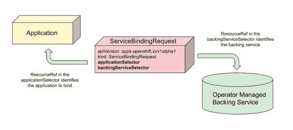
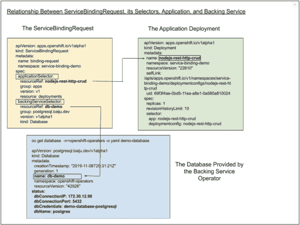
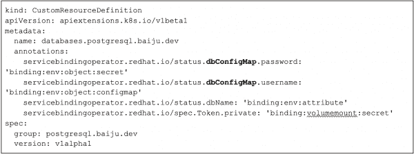

# 服务绑定操作符简介

> 原文：<https://developers.redhat.com/blog/2019/12/19/introducing-the-service-binding-operator>

将应用程序连接到支持它们的服务——例如，在一个 [Java](https://developers.redhat.com/developer-tools/java) 应用程序和它需要的数据库之间建立凭证交换——被称为*绑定*。应用程序和后台服务的这种绑定的配置和维护可能是一个乏味且低效的过程。手动编辑 YAML 文件来定义绑定信息容易出错，并且会导致难以调试的故障。

**注意:**自本文发表以来，服务绑定操作符发生了重大变化，这些信息现在已经过时。请阅读[How to use service binding with rabbit MQ](https://developers.redhat.com/articles/2021/11/03/how-use-service-binding-rabbitmq)获取关于这项技术的最新信息。

## 服务绑定简介

[服务绑定操作符](https://github.com/redhat-developer/service-binding-operator)的目标就是解决这个绑定问题。通过使应用程序开发人员更容易将应用程序与所需的支持服务绑定，服务绑定运营商还帮助运营商提供商推广和扩大其运营商的采用。本文介绍了服务绑定操作符，并描述了它的工作原理。在下一篇文章中，我们将通过一个真实的例子来演示它的用法。

### 托管绑定的情况

服务绑定操作符通过自动收集和共享绑定信息(凭证、连接细节、卷安装、秘密等)使应用程序能够使用外部服务。)与应用程序。实际上，服务绑定操作符在“可绑定的”后台服务(例如，数据库操作符)和需要该后台服务的应用程序之间定义了一个契约。

注意，除了绑定信息的初始共享之外，绑定还由服务绑定操作者“管理”。这意味着，如果凭据或 URL 被后台服务操作员修改，这些更改将自动反映在应用程序中。

这份合同有两部分。第一部分涉及使后台服务可绑定，第二部分涉及将应用程序和服务绑定在一起。这两个部分都由一个新的定制资源`ServiceBindingRequest`支持。

### `ServiceBindingRequest`自定义资源

服务绑定操作符使应用程序开发人员能够更容易地将应用程序与操作符管理的支持服务(如数据库)绑定在一起，而不必手动配置机密、配置映射等。服务绑定操作者通过自动收集绑定信息并将其与应用程序和操作者管理的支持服务共享来完成该任务。这个绑定是通过一个名为`ServiceBindingRequest`的新定制资源来执行的。

> ```
> apiVersion: apps.openshift.io/v1alpha1
> kind: ServiceBindingRequest
> metadata:
>  name: binding-request
>  namespace: service-binding-demo
> spec:
>  applicationSelector:
>  resourceRef: nodejs-rest-http-crud
>  group: apps
>  version: v1
>  resource: deployments
>  backingServiceSelector:
>  group: postgresql.baiju.dev
>  version: v1alpha1
>  kind: Database
>  resourceRef: db-demo
> ```

[](/sites/default/files/blog/2019/12/ServiceBindingRequest.png)

图 1:一个`ServiceBindingRequest`中的选择器。">

A `ServiceBindingRequest`包括以下两个选择器。第一个是`applicationSelector`，它标识要与后台服务绑定的应用程序。这里定义的`ResourceRef`标志着申请绑定。第二个是`backingServiceSelector`，它标识了应用程序将绑定的后台服务，如图 1 所示:

`ServiceBindingRequest`中的附加数据可以包含敏感信息(如用户名和密码)和非敏感信息(如端口号)的组合。为了将现有的操作符配置为可绑定的，操作符提供者必须向操作符的清单中添加一个`ServiceBindingRequest`描述符。清单中的`statusDescriptors`将包含服务绑定操作符将应用程序与后台服务操作符绑定在一起所需的信息。

**注意:**已经可以绑定的样本后台服务操作符在这里有[。](https://github.com/operator-backing-service-samples)

图 2 展示了`ServiceBindingRequest`、它的选择器、被绑定的应用程序和后台服务之间的关系。注意，对于`applicationSelector`，相关属性是应用的组、版本、资源和`resourceRef`，对于`backingServiceSelector`，相关属性是版本、种类和`resourceRef`:

[](/sites/default/files/blog/2019/11/img_5ddf544c61c13.png)

Figure 2: The relationship between the ServiceBindingRequest and related components.

### 使运营商管理的支持服务可绑定

为了使服务可绑定，操作者提供者需要表达应用程序所需的信息，以便与操作者提供的服务绑定。换句话说，运营商必须表达应用程序感兴趣的信息。

绑定信息作为管理支持服务的运营商的自定义资源定义(CRD)中的注释提供。服务绑定操作符提取注释，将应用程序与后台服务绑定在一起。

例如，图 3 显示了一个 PostgreSQL 数据库后台操作符的 CRD 中的一个*可绑定的*操作符的注释。注意突出显示的文本，以及`status.dbConfigMap`是一个`ConfigMap`，其中用户名和密码是*感兴趣的*用于绑定:

[](/sites/default/files/blog/2019/11/img_5ddf5491e2deb.png)

Figure 3: A bindable operator's CRD annotations.

使服务可绑定的另一种方法使管理后台服务但在 CSV 中没有任何元数据的操作者能够使用服务绑定操作者将服务和应用程序绑定在一起。服务绑定操作符通过用来自路由、服务、`ConfigMaps`和后台服务 CR 所拥有的秘密的信息填充绑定秘密来绑定后台服务 CR 中定义的所有子资源。

**注意:** [这就是 Kubernetes 中资源和子资源关系的设置](https://kubernetes.io/docs/concepts/workloads/controllers/garbage-collection/#owners-and-dependents)。

绑定本身是通过在后台服务 CR 中引入 API 选项来启动的(如图 4 所示):

[](/sites/default/files/blog/2019/11/img_5ddf54e187f02.png)

Figure 4: Binding initiation.

当此 API 选项设置为`true`时，服务绑定操作符自动检测路由、服务、`ConfigMaps`和后台服务 CR 拥有的秘密。

### 将应用程序与后台服务绑定在一起

在没有服务绑定操作符的情况下，将应用程序与后台服务手动绑定在一起是一个耗时且容易出错的过程。执行绑定所需的步骤包括:

1.  在后台服务的资源中定位绑定信息。
2.  创建和引用任何必要的秘密。
3.  手动编辑应用程序的`DeploymentConfig`、`Deployment`、`Replicaset`、`KnativeService`或任何其他使用标准`PodSpec`来引用绑定请求的内容。

相比之下，通过使用服务绑定操作符，应用程序开发人员在应用程序导入期间必须做的唯一动作是弄清楚必须执行绑定的*意图*。这个任务是通过创建`ServiceBindingRequest`来完成的。服务绑定操作者理解这一意图，并代表应用程序开发人员执行绑定。

总之，应用程序开发人员必须执行两个步骤。首先，它们必须通过向应用程序添加标签来表明将应用程序绑定到后台服务的意图。其次，他们必须创建一个新的引用后台服务的`ServiceBindingRequest`。

当`ServiceBindingRequest`被创建时，服务绑定操作者的控制器将绑定信息收集到一个中间秘密中，并通过环境变量与应用程序共享。

请注意，可用于提供绑定信息的可选方法是通过自定义环境变量。在下一篇文章中，我们将提供更多关于这个主题的内容，以及一个真实的例子。

## 资源

*   [服务绑定运营商 GitHub repo](https://github.com/redhat-developer/service-binding-operator) 。
*   [一组示例](https://github.com/redhat-developer/service-binding-operator/blob/master/README.md#example-scenarios)，每个示例都说明了服务绑定操作符的一个使用场景，正在与操作符并行开发。每个示例都包含文档，可以通过 OpenShift web 控制台或命令行客户端运行。
*   示例后台服务操作员[可在此处](https://github.com/operator-backing-service-samples)获得。

*Last updated: November 5, 2021*