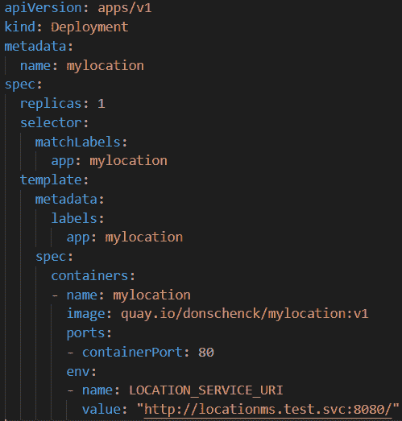

# Kubernetes 简介:从容器到容器

> 原文：<https://developers.redhat.com/blog/2019/04/16/introduction-to-kubernetes-from-container-to-containers>

在介绍了 Linux [容器](https://developers.redhat.com/topics/containers/)并运行了一个简单的应用程序之后，下一步似乎很明显:如何让多个容器运行起来，以便组装成一个完整的系统。虽然有多种解决方案，但明显的赢家是 [Kubernetes](https://developers.redhat.com/topics/kubernetes/) 。在本文中，我们将了解 Kubernetes 如何在一个系统中运行多个容器。

*   [使用 Java 构建你的“Hello World”容器](https://developers.redhat.com/articles/java-container/)
*   [使用 Node.js 构建你的“Hello World”容器](https://developers.redhat.com/articles/nodejs-container/)
*   [使用 Ruby 构建你的“Hello World”容器](https://developers.redhat.com/articles/ruby-container/)
*   [使用 Go](https://developers.redhat.com/articles/go-container/) 构建你的“Hello World”容器
*   [使用 Python 构建你的“Hello World”容器](https://developers.redhat.com/articles/csharp-container/)
*   [使用 C#](https://developers.redhat.com/articles/c-containers/) 构建你的“Hello World”容器

对于本文，我们将运行一个 web 应用程序，它使用一个服务来根据您的 IP 地址确定您的位置。我们将使用 Kubernetes 在容器中运行这两个应用程序，我们将了解如何在集群中从一个服务(web 应用程序)到另一个服务(位置应用程序)进行 RESTful 调用。

## 先决条件

在 MacOS 中设置您的 Kubernetes 环境在“[如何在 MacOS 上设置您的第一个 Kubernetes 环境](https://developers.redhat.com/blog/?p=574447)”中有详细介绍

在 Windows 中设置您的 Kubernetes 环境在“[如何在 Windows 上设置您的第一个 Kubernetes 环境](https://developers.redhat.com/blog/?p=580387)”中有详细介绍

## 编码员们，启动引擎

在命令行中，运行以下命令来启动 [Minishift](https://www.okd.io/minishift/) 并在您的本地机器上获得一个 Kubernetes 集群:

```
minishift start
```

...我们出发了。

接下来，我们将建立一个用户帐户，并给它一个工作的名称空间。我们不使用更复杂的 Kubernetes 方法，而是稍微欺骗一下，使用 [Red Hat OpenShift](https://www.redhat.com/en/technologies/cloud-computing/openshift) 来实现:

```
oc login $(minishift ip):8443 -u admin -p admin
```

```
oc new-project test
```

运行 Windows？请改用以下命令:

```
$m = minishift ip
```

```
oc login $m:8443 -u admin -p admin
```

```
oc new-project test
```

## 启动微服务“locationms”

使用以下命令获取创建并运行的第一个微服务 *locationms* :

```
kubectl run locationms --image=quay.io/donschenck/locationms:v1 --label="app=locationms" --port=8080
```

这将需要几分钟时间来运行(基于您的机器和互联网速度)。您可以通过运行命令`kubectl get pods`来检查它，直到您看到它正在运行。


现在它已经在我们的 Kubernetes 集群中运行，我们需要将它变成一个可以被调度、发现并最终被我们使用的服务。

```
kubectl --namespace=test expose deployment locationms --port=8080 --type=ClusterIP
```

这将获取希望在端口 8080 上运行的微服务，并将其映射到集群节点上的一个端口。它创建了一个 Kubernetes 服务。这允许多个 pod 运行您的映像，但共享同一个端口。您可以通过运行命令`kubectl get services`来查看服务和分配的端口号:


在这个例子中，我们的应用程序的端口 8080 被映射到端口 31482。

*没有*在命令行运行`kubectl proxy`，我们需要能够访问这个服务。因此，我们需要运行该服务的节点的 IP 地址和该服务所在的端口。服务的好处是，我们可以扩大和缩小 pod，删除它们并创建新的，但 IP 地址:端口组合将保持不变。那很好；这就是我们在集群内部连接到它的方式。

但是我们不想在代码中包含 IP 地址。我们想要一个名字。我们有一个。运行命令`kubectl describe service locationms`将为我们提供所需的信息:


为了获得 Kubernetes 集群内部的可解析名称，我们遵循`<service-name>`的格式。在这个特殊的例子中，我们以`locationms.test.svc`结束。这就是我们在 web 应用程序中需要的 URI。我们仍然需要指定 *locationms* 服务的端口，即 8080。鉴于这一切，这里是我们的 URI:

```
locationms.test.svc:8080/
```

注意,*我们不需要担心实际的端口——*31482——因为 Kubernetes 足够好来处理映射。不管实际端口是否改变，名称保持不变。

## 网络应用

在这一点上，事情会变得更加复杂和有点深入，但我们也会找到一条简单的道路。继续读。

为了部署 web 应用程序，我们将使用一个描述部署的 YAML 文件。这个文件将包含我们在上一节中发现的 URI。听过人们谈论“基础设施即代码”吗？这是一个例子。这个(以及其他)配置文件应该存储在版本控制系统中，并且应该被视为代码。这是 DevOps。

[提示:现在就把这一点添加到你的简历中。 ]

以下是 mylocation-deployment.yaml 的内容:



两件事:

1.  最后一行是指向我们 Kubernetes 集群中的 *locationms* 服务的 URI。你需要改变它来匹配你的情况。
2.  我打赌你不想把这些都打出来。这也是我把所有代码放在 GitHub repo 中的原因:[https://GitHub . com/red hat-developer-demos/container-to-containers . git](https://github.com/redhat-developer-demos/container-to-containers.git)。你可以下载/分支/克隆它。
3.  好吧，我撒谎了:三件事。如果你是一个有才华的前端设计师，请随意更新 web 应用程序的外观，并提出一个拉请求。毕竟，它是开源的。

## 还剩下什么？

我们需要部署该应用程序，并以某种方式将其公开，以便您可以在 web 浏览器中打开它。虽然这将在我们的 Kubernetes 集群内部运行，但是我们需要能够在我们的集群外部访问它——在本例中，从我们的主机访问它。

## 部署 web 应用程序

因此，我们将使用 YAML 文件(如上)来创建这个部署，而不是使用`kubectl run...`命令来启动 pod 中的映像。它包括我们需要的环境变量( *locationms_url* )来为我们的位置微服务提供合适的 URI。

事实是，使用 YAML 文件几乎是您一直想要管理 Kubernetes 集群的方式。

运行以下命令创建部署并启动包含 web 应用程序的 pod:

```
kubectl apply -f mylocation-deployment.yaml
```

接下来，我们可以将 web 应用程序变成一项服务，就像我们对位置微服务所做的那样:

```
kubectl expose deployment mylocation --port=80 --type=LoadBalancer
```

然后，我们通过运行以下命令来获取 web 应用程序的端口:

```
kubectl get services mylocation
```


在这种情况下，应用程序的端口 80 映射到端口 32437。

最后，我们可以通过运行以下命令来获取 web 应用程序的公共 IP 地址:

```
kubectl cluster-info
```


我们可以打开浏览器查看 IP 地址和端口，而不是像以前一样运行 curl(但是如果您愿意，也可以这样做)。在本例中，http://172.25.112.134:32437。那并不容易。

所以，现在我们正在运行 web 应用程序，并在我们的浏览器中使用它，但这看起来确实工作量很大。回报是什么？嗯，扩展、自我修复和滚动更新立即浮现在脑海中。

## 缩放它

Kubernetes 使得在 pods 中运行同一个应用程序的多个实例变得很简单。运行此命令以运行两个*位置的单元*:

```
kubectl scale deployment/locationms --replicas=2
```

然后看第二个实例用`kubectl get pods`运行


当然，这对于网页是完全透明的。如果您返回并通过多个周期运行 web 应用程序，您将看不到任何变化。

现在把它缩小到 1:`kubectl scale deployment/locationms --replicas=1`

## 删除它

通过运行以下命令删除 web 应用程序:

```
kubectl get pods
```

(获取 mylocation-* pod 的名称，您将在下一个命令中使用它。)

```
kubectl delete pod/<pod-name>
```

现在你可以刷新你的浏览器，看到网站关闭。但是保持刷新，同样，取决于你的机器的速度，你会看到它回来。当您有几个 pod 运行同一个微服务时，这种自我修复功能最有帮助。如果他们中的一个死了，它会被取代，你将永远看不到变化。

## 更新它

这很酷:我们将对“locationms”微服务进行滚动更新。我们将从 locationms:v1 切换到 locationms:v2。我们所要做的就是告诉 Kubernetes 使用不同的图像，使用以下命令:

```
kubectl set image deployment/locationms locationms=quay.io/donschenck/locationms:v2
```

当您返回并运行 web 应用程序时，很快您就会看到新的结果。版本 2 将“版本:v2”属性附加到 JSON 输出中:


## 更简单的方法？

有没有更简单的方法来做到这一切？确实有，包括让 OpenShift 来做繁重的工作。我们将在接下来的文章中讨论这个问题。

*   [使用 Java 构建你的“Hello World”容器](https://developers.redhat.com/articles/java-container/)
*   [使用 Node.js 构建你的“Hello World”容器](https://developers.redhat.com/articles/nodejs-container/)
*   [使用 Ruby 构建你的“Hello World”容器](https://developers.redhat.com/articles/ruby-container/)
*   [使用 Go](https://developers.redhat.com/articles/go-container/) 构建你的“Hello World”容器
*   [使用 Python 构建你的“Hello World”容器](https://developers.redhat.com/articles/csharp-container/)
*   [使用 C#](https://developers.redhat.com/articles/c-containers/) 构建你的“Hello World”容器

*Last updated: September 3, 2019*