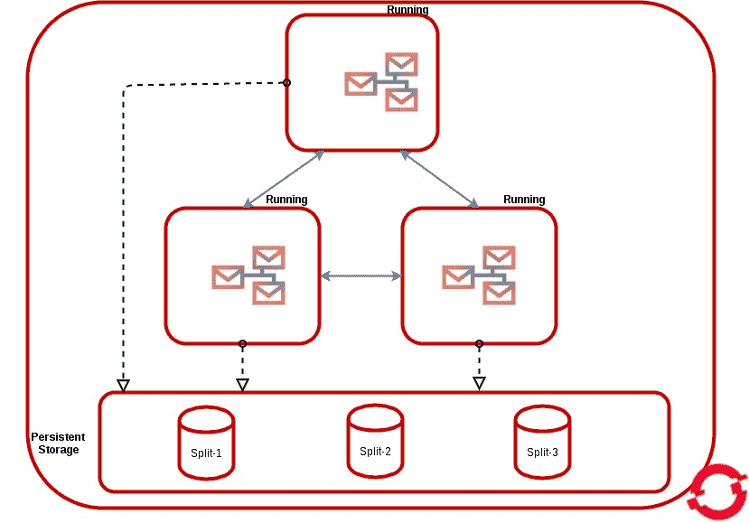
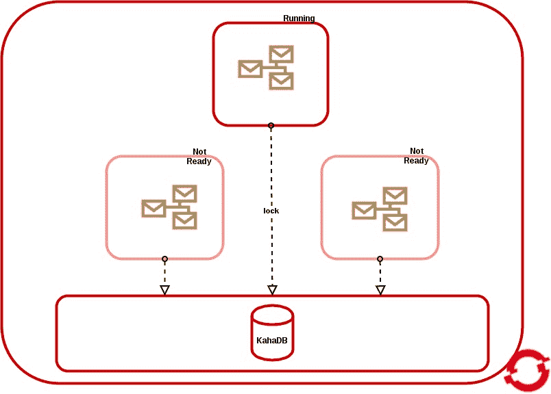

# OpenShift 备忘单上的 JBoss A-MQ

> 原文：<https://developers.redhat.com/blog/2017/10/10/jboss-mq-openshift-cheat-sheet>

如今我们经常听说**微服务**。它的实施要求我们应对新的挑战。使用微服务带来的一个关键问题是如何以异步方式处理交互。答案是**消息**。

除此之外，*消息传递*具有以下特点:

*   松耦合，因为它将客户端与服务分离。
*   提高了可用性，因为消息代理会缓冲消息，直到使用者能够处理它们。
*   支持多种通信模式，包括请求/回复、通知、请求/异步响应、发布/订阅、发布/异步响应等等。

消息传递中最著名的产品之一是 **JBoss A-MQ** 。我从客户那里收到的问题之一是，是否有可能在 Red Hat OpenShift 上运行 Red Hat JBoss A-MQ。答案是肯定的，Red Hat JBoss A-MQ (A-MQ)是一个容器化的映像，是为 OpenShift 设计的。它允许开发人员在混合云环境中快速部署 A-MQ 消息代理。

代理的配置有两种方式:

*   使用**S2I**(**S**source-**to**-**I**mage)工具。这里有一个完整的例子，你可以一步一步的跟随: [amq62-basic-s2i](https://github.com/abouchama/amq62-basic-s2i) 。
*   使用 [A-MQ 应用模板](https://github.com/jboss-openshift/application-templates/tree/master/amq)中指定的**参数**。

在我们继续讨论如何在 OpenShift 上部署 A-MQ 之前，让我们看一下高可用性环境中不同的 A-MQ 架构。

## **高可用性环境中的 A-MQ**

### **水平扩展:** **负载均衡**

我们可以通过扩展持久性或非持久性存储中的 pod 来获得这种高可用性体系结构。在非持久模式下，所有实例都没有 persistentVolumeClaim，但它们共享相同的服务。

在持久模式下，所有实例共享相同的服务，并且它们具有绑定到可用持久卷的持久卷声明。

在这两种模式中，消息将被分派给活动的消费者，生产者将分布在所有可用的代理中，所有代理将被发现并自动以网状配置的方式联网在一起，发现基于 Kubernetes 服务抽象，您也可以从环境变量 **MESH_SERVICE_NAME** 中配置该抽象。所有单元都处于“运行状态”并分担负载。

要实现这种 HA 架构，只需在配置中指定参数“**AMQ _ 斯普利特=真**”。这将导致服务器为持久卷内的每个实例创建独立的**split-*n***目录，然后这些目录可以用作它们的数据存储。这是所有持久性模板中的默认设置。



### **垂直缩放:主/从**

主/从设置只能通过在配置中设置参数“ **AMQ_SPLIT=false** 来实现，并且只能在持久模式下实现。

“主”实例获得文件锁，如果我们向上扩展，所有新的单元将处于“**未就绪**状态，它们的代理将成为“从”并进行轮询，直到锁被释放。



## **在 OpenShift 上部署 A-MQ**

本文的其余部分将基于 A-MQ 应用程序模板，尤其是基于 **amq-persistent-ssl** 模板，因为这是外部客户端通过 ssl 传输访问代理的方式。

在我们开始之前，您必须在 OpenShfit 中创建一个持久卷，并且它应该处于可用状态。

### 安装 A-MQ 图像流:

要更新到最新的 xPaaS 映像，请运行以下步骤来获取内容:

1.在您的主控主机上，确保您以集群管理员或对全局“openshift”项目具有项目管理员访问权限的用户身份登录 CLI。例如:

```
$ oc login -u system:admin
```

2.运行以下命令来更新“OpenShift”项目中的核心 AMQ OpenShift 图像流，请注意，在发出 create 命令时，看到一些图像流已经存在的错误消息是正常的:

```
$ oc create -n openshift -f \
 https://raw.githubusercontent.com/jboss-openshift/application-templates/ose-v1.4.5/jboss-image-streams.json

$ oc replace -n openshift -f \
 https://raw.githubusercontent.com/jboss-openshift/application-templates/ose-v1.4.5/jboss-image-streams.json

$ oc -n openshift import-image jboss-amq-62
$ oc -n openshift import-image jboss-amq-63
```

3.运行以下命令来更新 AMQ 模板:

```
$ for template in amq62-basic.json \
 amq62-ssl.json \
 amq63-persistent-ssl.json \
 amq62-persistent.json \
 amq63-basic.json \
 amq63-ssl.json \
 amq62-persistent-ssl.json \
 amq63-persistent.json;
 do
 oc replace -n openshift -f \
 https://raw.githubusercontent.com/jboss-openshift/application-templates/ose-v1.4.5/amq/${template}
 done
```

### 部署 A-MQ:

您可以通过使用 URL(添加后缀 [/console/create？template = amq 63-persistent-SSL](https://mojo.redhat.com/external-link.jspa?url=https%3A%2F%2Fopenshift.amqocp.quicklab.pnq2.cee.redhat.com%2Fconsole%2Fcreate%3Ftemplate%3Damq62-persistent)):

例如；

```
https://openshift.amqocp.redhat.com/console/create?template=amq63-persistent-ssl
```

或者可以用**oc**(**o**penshift**c**lient):

```
 oc project amq-demo

 echo '{"kind": "ServiceAccount", "apiVersion": "v1", "metadata": {"name": "amq-service-account"}}' | oc create -f -

 oc policy add-role-to-user view system:serviceaccount:amq-demo:amq-service-account
```

您必须创建一组密钥来在 Openshift 中运行 A-MQ。如果没有企业级的，可以按照下面的步骤创建一组 SSL 密钥。
其余命令用于创建 secret、amq 服务帐户、创建代理和创建路由，以将传输连接器公开给外部客户端:

```
keytool -genkey -noprompt -trustcacerts -alias broker -keyalg RSA -keystore broker.ks -keypass password -storepass password -dname "cn=Abel, ou=engineering, o=company, c=US"
keytool -export -noprompt -alias broker -keystore broker.ks -file broker_cert -storepass password
keytool -genkey -noprompt -trustcacerts -alias client -keyalg RSA -keystore client.ks -keypass password -storepass password -dname "cn=Abel, ou=engineering, o=company, c=US"
keytool -import -noprompt -trustcacerts -alias broker -keystore client.ts -file broker_cert -storepass password

oc secrets new amq-app-secret broker.ks
oc secrets add sa/amq-service-account secret/amq-app-secret

oc process amq63-persistent-ssl -p APPLICATION_NAME=amq63 -p MQ_USERNAME=admin -p MQ_PASSWORD=admin -p AMQ_STORAGE_USAGE_LIMIT=1gb -p IMAGE_STREAM_NAMESPACE=openshift -p AMQ_TRUSTSTORE_PASSWORD=password -p AMQ_KEYSTORE_PASSWORD=password -p AMQ_SECRET=amq-app-secret -p AMQ_KEYSTORE=broker.ks -p AMQ_TRUSTSTORE=broker.ks -n amq-demo | oc create -f -

oc create route passthrough --service amq63-amq-tcp-ssl
oc create route passthrough --service amq63-amq-stomp-ssl
oc create route passthrough --service amq63-amq-amqp-ssl
oc create route passthrough --service amq63-amq-mqtt-ssl
```

最后，您应该运行(**观看 oc 获取 pod**)直到 2 个 pod 处于运行状态，如下所示:

```
[cloud-user@master-0 ~]$ oc get pods
NAME                    READY     STATUS    RESTARTS   AGE
amq63-amq-2-m8fdh       1/1       Running   0          2m
amq63-drainer-1-3rpgx   1/1       Running   0          8m
```

从 Web 控制台，您应该看到以下内容:


***NB:*** 如果你想知道为什么要 2 荚？这个新的排水舱有什么作用？答案就在这里:[第四章。入门-红帽客户门户](https://mojo.redhat.com/external-link.jspa?url=https%3A%2F%2Faccess.redhat.com%2Fdocumentation%2Fen-us%2Fred_hat_jboss_a-mq%2F6.3%2Fhtml%2Fred_hat_jboss_a-mq_for_openshift%2Fget_started%23scaling_down_and_message_migration)

### 客户对经纪人的访问

您的客户端需要使用 SSL 传输。要配置本地 JMS 客户机与 OpenShift 上的 A-MQ 代理实例对话:

**1。**连接 OpenShift，查询 OpenShift 路由的地址。

```
$ oc get routes
 NAME                HOST/PORT                                                                 PATH      SERVICES            PORT      TERMINATION   WILDCARD
 amq63-amq-tcp-ssl   amq63-amq-tcp-ssl-amq-demo.apps.redhat.com             amq63-amq-tcp-ssl   <all>     passthrough   None
```

注意路由的主机，在本例中:*amq63-amq-tcp-ssl-amq-demo.apps.redhat.com*。

**2。**您应该将三个文件 broker.ks、client.ks 和 client.ts 复制到您的本地计算机上。

**3** 。将 JMS 客户机配置为使用步骤 1 中获得的代理 URL，并使用步骤 2 中获得的 SSL 密钥库 client.ks 和 trustore client.ts。

例如

**brokerUrl:**

```
failover:(ssl://amq63-amq-tcp-ssl-amq-demo.apps.redhat.com:443)
```

**SSL 选项:**

```
-Djavax.net.ssl.keyStore=./client.ks

-Djavax.net.ssl.keyStorePassword=password

-Djavax.net.ssl.trustStore=./client.ts

-Djavax.net.ssl.trustStorePassword=password
```

仅此而已！！

享受；-)

*Last updated: October 5, 2017*