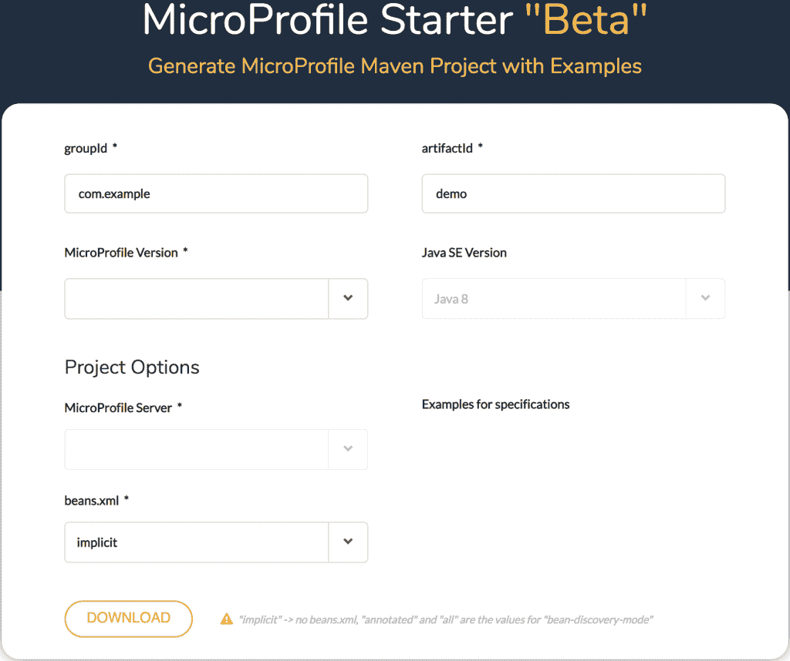
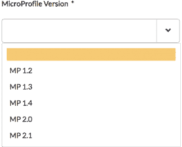
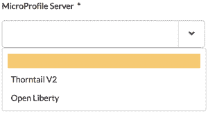
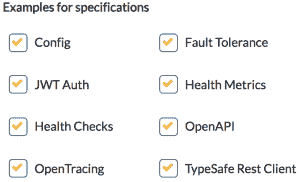
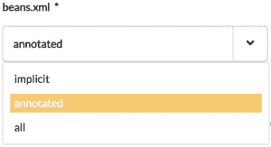
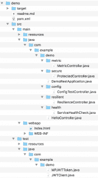

# 使用 MicroProfile Starter(测试版)快速启动您的微服务开发

> 原文：<https://developers.redhat.com/blog/2019/02/28/jumpstart-microservices-microprofile-starter-beta>

在本文中，我将带您快速浏览一下如何使用新的[MicroProfile Starter(Beta)](https://start.microprofile.io/)站点来生成、下载和构建一个基于 Maven 的 micro profile 项目，只需点击几下鼠标。使用这个在线项目生成器，您可以选择您的项目所基于的 MicroProfile 版本和服务器(比如 Thorntail)。然后，您将能够选择在您的项目中包含什么样的示例代码，以了解如何使用 API，这些 API 是 MicroProfile 规范的一部分，如 Config、Health Check、Metrics、CDI 等等。

## 介绍

2019 年 2 月 6 日，MicroProfile 社区[宣布](https://microprofile.io/2019/02/06/eclipse-microprofile-starter-beta-available/)发布 Eclipse micro profile Starter(Beta)，其目标是通过在 Maven 项目中生成工作样本代码，帮助开发人员快速开始使用和开发企业 [Java](https://developers.redhat.com/blog/category/java/) [微服务](https://developers.redhat.com/blog/category/microservices/)Eclipse micro profile 的社区驱动开源规范的功能。

自 2016 年年中项目创建以来，拥有微文件启动器的想法就一直存在，并在 devo xx BE 2016(2016 年 11 月 7 日的那一周)上[公开讨论过](https://www.youtube.com/watch?v=iG-XvoIfKtg&feature=youtu.be&t=3667)。在发布的前两周，世界各地的开发者已经通过 MicroProfile Starter (Beta)创建了超过 1200 个项目，这是一个很好的积极的[迹象，表明它已经在全球范围内被采用。](https://twitter.com/rmehmandarov/status/1098649776189566976)

在撰写本文时，市场上有 12 个子项目/API 在 MicroProfile 的保护伞下，有 8 个开源实现，这证明了这个真正由社区主导的开源项目的协作和合作性质。每个星期，个人、社区和供应商都会利用过去在企业 Java 微服务相关的所有领域学到的经验教训和最佳实践，共同开发和发展该规范。

[](https://developers.redhat.com/blog/wp-content/uploads/2019/02/MicroProfile2.2.png)

## MicroProfile Starter(测试版)快速浏览

1.  当您转到 MicroProfile Starter (Beta)页面时，您将看到以下登录页面:

[](https://developers.redhat.com/blog/wp-content/uploads/2019/02/Starter-landing-page.png)

1.  您可以接受与 [Maven 相关的参数](https://maven.apache.org/guides/mini/guide-naming-conventions.html) `groupId`和`artifactId`的默认值，或者根据您的喜好进行更改。`groupId`参数在所有项目中惟一地标识您的项目，而`artifactId`是没有版本的 JAR 的名称。对于本教程，接受默认值。
2.  从下拉列表中选择 MicroProfile 版本:

[](https://developers.redhat.com/blog/wp-content/uploads/2019/02/MicroProfile-versions.png)

对于本教程，选择 MicroProfile 版本“MP 2.1”请注意，根据您选择的 MicroProfile 版本,“规格示例”一节中列出的规格数量会有所不同。这个数字取决于每个 MicroProfile umbrella 版本中包含了多少 API。要了解每个版本中包含哪些 API，请参考 MicroProfile 社区[演示文稿](https://docs.google.com/presentation/d/1BYfVqnBIffh-QDIrPyromwc9YSwIbsawGUECSsrSQB0/edit#slide=id.g4ef35057a0_6_205)。

1.  从下拉列表中选择微文件服务器:

[](https://developers.redhat.com/blog/wp-content/uploads/2019/02/MicroProfile-server.png)

在这次旅行中，选择“索恩泰尔 V2”，这是 Red Hat 用来实现 Eclipse MicroProfile 规范的开源项目。顺便说一下，Red Hat 提供的包含 Eclipse MicroProfile 的产品是 [Red Hat OpenShift 应用程序运行时](https://developers.redhat.com/products/rhoar/overview)。

1.  保持选中所有“规格示例”复选框(不要取消选中任何复选框):

[](https://developers.redhat.com/blog/wp-content/uploads/2019/02/Examples-of-specifications.png)

这将为 MicroProfile 2.1 中包含的所有 API 生成示例工作代码。

1.  为“beans.xml”选择“带注释的”:

[](https://developers.redhat.com/blog/wp-content/uploads/2019/02/annotated-beansXML.png)

该选项在 web 应用程序的`WEB-INF`目录下生成一个[bean 归档描述符](https://github.com/cdi-spec/cdi-spec.org/blob/master/_faq/intro/4-what-is-beans-xml-and-why-do-i-need-it.asciidoc)、`beans.xml`。

1.  最后一步是单击下载按钮，这将创建一个 zip 存档。
2.  确保将`demo.zip`文件保存到本地驱动器。
3.  在本地驱动器中解压缩 demo.zip。内容应该是这样的:

[](https://developers.redhat.com/blog/wp-content/uploads/2019/02/demoZipContents.png)

1.  注意，在生成的目录内容中有一个`readme.md`文件。该文件包含如何编译和运行生成的代码的说明，其中包括一个示例 web 应用程序，它使用 MicroProfile 的不同功能。
2.  将目录更改为解压演示项目的位置。在我的例子中，我把它放在我的`Downloads`目录中:

    ```
    $ cd Downloads/demo
    ```

3.  通过输入以下命令编译生成的示例代码:

    ```
    $ mvn clean package
    ```

4.  Run the microservice:

    ```
    $ java -jar target/demo-thorntail.jar
    ```

    几秒钟后，您将看到以下消息:

    ```
    INFO  [org.wildfly.swarm] (main) WFSWARM99999: Thorntail is Ready
    ```

    这表明微服务已经启动并正在运行。

5.  打开你最喜欢的网页浏览器，指向`http://localhost:8080/index.html`。这将打开示例 web 应用程序，如下所示:

[](https://developers.redhat.com/blog/wp-content/uploads/2019/02/GeneratedWebAppLandingPage.png)

1.  要查看微配置文件配置的功能，请单击链接“注入的配置值”将打开一个窗口选项卡，显示如下:

[](https://developers.redhat.com/blog/wp-content/uploads/2019/02/InjectedConfigValue.png)

同样，如果您单击“通过查找配置值”链接，将显示另一个窗口选项卡:

[](https://developers.redhat.com/blog/wp-content/uploads/2019/02/LookupConfigValue.png)

您在上面看到的参数值“注入值”和“查找值”在文件`./demo/src/main/resources/META-INF/microprofile-config.properties`中定义如下:

```
$ cat ./src/main/resources/META-INF/microprofile-config.properties
injected.value=Injected value
value=lookup value
```

假设您需要在开发和系统测试之间使用不同的参数“值”。您可以通过在启动微服务时在命令行中传递一个参数来实现，如下所示:

```
$ java -jar target/demo-thorntail.jar -Dvalue=hola
```

现在，当您单击“通过查找配置值”链接时，将显示另一个窗口选项卡:

[](https://developers.redhat.com/blog/wp-content/uploads/2019/02/HolaLookupConfigValue.png)

顺便说一下，执行这个逻辑的源代码位于生成的文件`./src/main/java/com/example/demo/config/ConfigTestController.java`中。

另外，要了解更多关于 MicroProfile Config API 的信息，请查看它的[文档](https://github.com/eclipse/microprofile-config/releases/download/1.3/microprofile-config-spec-1.3.pdf)。

1.  要查看 MicroProfile 容错功能，请单击链接“超时后回退”将打开一个窗口选项卡，显示如下:

[](https://developers.redhat.com/blog/wp-content/uploads/2019/02/FallbackAfterTimeout.png)

示例代码结合使用了`@Fallback`注释和`@Timeout`。下面是示例代码:

```
    @Fallback(fallbackMethod = "fallback") // fallback handler
    @Timeout(500)
    @GET
    public String checkTimeout() {
        try {
            Thread.sleep(700L);
        } catch (InterruptedException e) {
            //
        }
        return "Never from normal processing";
    }
    public String fallback() {
        return "Fallback answer due to timeout";
    }

```

`@Timeout`注释指出，如果方法执行时间超过 500 毫秒，应该抛出超时异常。这个注释可以和`@Fallback`一起使用，在这种情况下，当超时异常发生时，它调用名为`fallback`的回退处理程序。在上面生成的示例代码中，超时异常总是会发生，因为方法正在执行—也就是说，休眠 700 毫秒，这比 500 毫秒长。

顺便说一下，执行这个逻辑的源代码位于生成的文件`./src/main/java/com/example/demo/resilient/ResilienceController.java`中。

另外，要了解更多关于 MicroProfile 容错 API 的信息，请查看它的[文档](https://github.com/eclipse/microprofile-opentracing/releases/download/1.2/microprofile-opentracing-spec-1.2.pdf)。

## 结论

您可以通过单击示例 web 应用程序的其他链接，以自己的速度探索 MicroProfile 示例代码的其余部分。MicroProfile 社区希望得到您的反馈以及对 MicroProfile Starter 的持续开发的合作/贡献。要提供反馈，请点击[micro profile Starter(Beta)](https://start.microprofile.io/)登录页面右上角的“提供反馈”按钮，并创建一个问题。我建议您先查看未解决的问题，以确保您的请求尚未被其他人创建。一些悬而未决的请求是:

*   为新的 MicroProfile 实现在 MicroProfile Starter 上记录入职流程
*   梯度支持
*   添加对 Dockerfile 的支持
*   从命令行运行微文件启动器的能力
*   使 JWT 传播代码示例的依赖关系特定于相应的服务器实现

MicroProfile Starter 项目对里程碑中的请求项和修复进行分组和优先级排序，目标是持续发布。MicroProfile Starter 工作组定期召开会议，如果您想帮助我们提高您的开发技能，请发送电子邮件至`microprofile@googlegroups.com`，或者您也可以加入其 [Gitter 频道](https://gitter.im/eclipse/microprofile-starter?utm_source=badge&utm_medium=badge&utm_campaign=pr-badge&utm_content=badge)的讨论。项目信息，包括其源代码的位置，可以在[这里](https://wiki.eclipse.org/MicroProfile/StarterPage)找到。

最后，如果你想使用 Docker、Buildah、Podman 和 Quay 在 [OpenShift](http://openshift.com/) 上部署和运行你的 MicroProfile 项目，我推荐我的同事 Syed Shaaf 的这篇[帖子](https://developers.redhat.com/blog/2019/02/26/create-java-8-runtime-container-image/)。

享受微档案！

有关更多信息，请访问以下社区网站:

*   [微文件启动器(测试版)](https://start.microprofile.io/)
*   [MicroProfile.io](https://microprofile.io/)
*   [Thorntail.io](https://thorntail.io/)

要了解更多关于 MicroProfile 的信息，请参阅 Red Hat Developers 博客上的其他 MicroProfile 文章，例如:

*   [Eclipse MicroProfile 和 Red Hat 更新:Thorntail 和 SmallRye](https://developers.redhat.com/blog/2018/08/23/eclipse-microprofile-and-red-hat-update-thorntail-and-smallrye/)
*   [使用 Azure Open Service Broker 在 Microsoft Azure 上部署 MicroProfile 应用](https://developers.redhat.com/blog/2018/10/17/microprofile-apps-azure-open-service-broker/)
*   [面向 Spring Boot 开发者的 Eclipse MicroProfile】](https://developers.redhat.com/blog/2018/11/21/eclipse-microprofile-for-spring-boot-developers/)