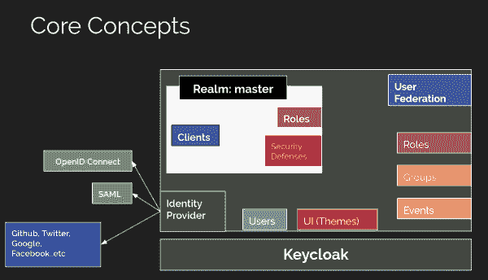
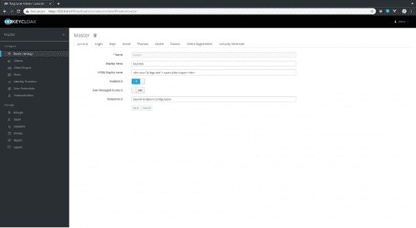
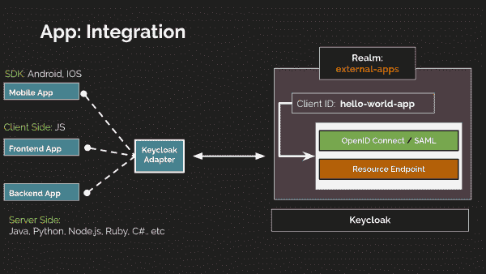

# Keycloak:开源身份和访问管理的核心概念

> 原文：<https://developers.redhat.com/blog/2019/12/11/keycloak-core-concepts-of-open-source-identity-and-access-management>

[Keycloak](https://developers.redhat.com/blog/2018/03/19/sso-made-easy-keycloak-rhsso/) 提供了轻松导出和导入配置的灵活性，使用单一视图管理一切。总之，这些技术让您能够将前端、移动和单片应用集成到一个[微服务](https://developers.redhat.com/topics/microservices/)架构中。在本文中，我们将讨论[键盘锁](https://www.keycloak.org)的核心概念和特性及其应用集成机制。你会在最后找到实现细节的链接。

## 核心概念

让我们从 Keycloak 的核心概念开始，如图 1 所示:

[](/sites/default/files/blog/2019/11/keycloak1.png)

图 1: Keycloak 的核心概念。">

Keycloak *realm* 就像一个名称空间，允许您管理所有的元数据和配置。根据您的需求，您可以拥有多个领域。一般来说，建议避免使用*主领域*，它仅用于管理目的。

在图 1 中，您可以看到 Keycloak 让您管理的信息，即:

*   客户端(每个应用程序)
*   结构管理
*   自定义主题(用户界面)
*   事件
*   联盟
*   LDAP 或活动目录集成
*   用户管理(用户和组)

**注意:**您可以拥有一个包含单个应用程序配置信息的客户端，比如 URL、协议和重定向 URI。

图 2 展示了 Keycloak 如何让您在一个视图中访问所有这些信息:

[](/sites/default/files/blog/2019/11/keycloak2.png)Keycloak's UI offers access to many settings.

图 2: Keycloak 的用户界面提供了许多设置。">

## 为什么应该使用 Keycloak？

除了可以在一个视图中完成大量的管理工作之外，让我们来看看你为什么会选择 Keycloak。

### Keycloak 是可靠的

Keycloak 是一个可靠的解决方案，按照标准安全协议设计，提供动态单点登录解决方案。红帽运行在红帽产品上，红帽产品包括单点登录(SSO)，红帽信任上游产品 Keycloak 为其下游产品[红帽 SSO](https://access.redhat.com/products/red-hat-single-sign-on) 。Red Hat SSO 处理 Red Hat 的整个认证和授权系统。此外，Keycloak 获得了 Apache License 版的许可，并且拥有一个强大而活跃的开源社区。

### Keycloak 支持标准协议

Keycloak 支持以下标准协议:

*   OAuth 2.0
*   OpenID 连接
*   SAML 2.0

这种支持意味着任何支持与上述协议集成的工具或应用程序都可以插入 Keycloak(例如，像 [Red Hat Ansible Tower](https://access.redhat.com/products/ansible-tower-red-hat) 或 SAP Business Intelligence Platform 这样的企业应用程序)。

### Keycloak 已准备好投入生产

如前所述，Keycloak 已经在生产中使用。在您自己这样做之前，请确保通读生产准备文档。

## 启动钥匙锁

要使用 Docker 启动 Keycloak，请使用:

```
$ docker pull jboss/keycloak
$ docker run -d -e KEYCLOAK_USER=<USERNAME> -e KEYCLOAK_PASSWORD=<PASSWORD> -p 8081:8080 jboss/keycloak
```

但是，在这种情况下，您的配置信息(如领域设置、客户端或证书)将是临时的。因此，在实例化新容器之前，每次都要导出配置并重新导入。换句话说，使用持久性卷来存储状态。

要使用 JBoss WildFly 进行独立的 Keycloak 启动([https://www.keycloak.org/downloads.html](https://www.keycloak.org/downloads.html))，请使用:

```
$ keycloak-x.x.x.Final/bin>./standalone.sh
```

## 准备与 Keycloak 集成

一旦您准备好将您的应用、工具和服务与 Keycloak 集成，您就要做出决定了(参见图 3):

[](/sites/default/files/blog/2019/11/keycloak3.png)

图 3: Keycloak 集成图。">

首先，您需要决定打算使用哪种协议，例如:

*   OAuth2
*   OpenID 连接
*   安全声明标记语言(SAML)。

是找*认证*还是*授权*？

```
OAuth 2 *!= Authentication*, only Authorization 

OpenID Connect = Identity + Authentication + Authorization
```

现在，关于应用程序:

*   它是在容器(无状态)上运行还是在遗留集群(共享状态)环境中运行？
*   架构由什么组成，比如单页应用(SPA)、微服务、无服务器还是 MVC？
*   确定要保护的资源和端点。是您在客户端和服务器、服务到服务或 API 端点之间的集成。
*   确定哪种适配器适合您的架构。

## 与 Keycloak 集成

若要将您的应用程序与 Keycloak 集成:

1.  创造一个境界。您可以将`master`用于开发环境，或者基于您的业务领域(例如，`external-apps`或`internal-apps`)。
2.  为您的应用程序创建一个客户端(例如，`hello-world-app`)。客户端配置需要如下详细信息:
    *   **协议:**哪个协议，比如 SAML 或者 OpenID。
    *   **资源端点:**应用程序主机名或 REST 端点。
    *   **重定向 URI:** 当授权认证时，将用户重定向到哪里。
3.  将客户端配置作为输入提供给应用程序，例如:
    *   clientId(即`hello-world-app`)
    *   境界(即`external-apps`)
    *   Keycloak 服务器的 URL。

为了用 Keycloak 配置您的应用程序，这就是您需要做的全部工作。

## 包扎

总之，当您自己使用 Keycloak 时，可以参考以下集成模式:

*   视图
*   [角度](https://medium.com/keycloak/secure-angular-app-with-keycloak-63ec934e5093)
*   [反应](https://medium.com/keycloak/secure-react-app-with-keycloak-4a65614f7be2)
*   [弹簧靴 2](https://medium.com/keycloak/secure-spring-boot-2-using-keycloak-f755bc255b68)
*   [夸库和反应](https://medium.com/keycloak/quarkus-and-react-integration-with-keycloak-e03eb82d8cd)

### 参考

*   [键盘锁文档](https://www.keycloak.org/documentation.html)
*   [安全应用和服务指南](https://www.keycloak.org/docs/latest/securing_apps/index.html)

安全编码快乐！

*Last updated: December 23, 2021*