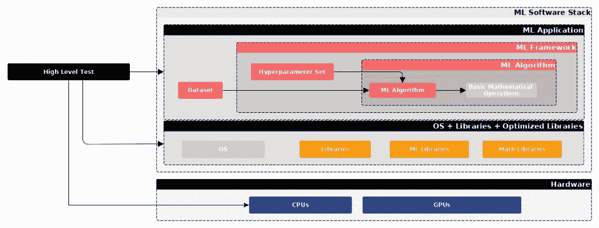
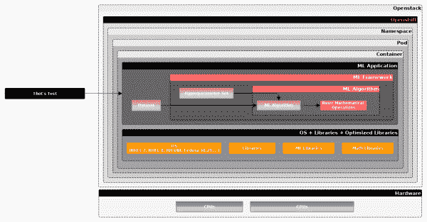
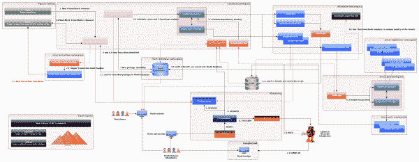
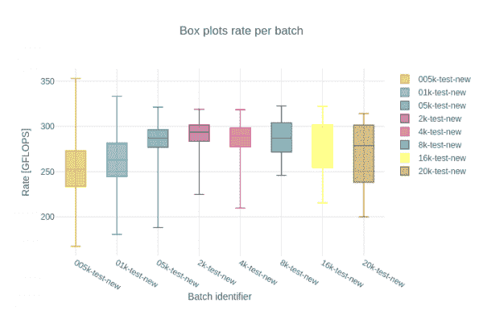
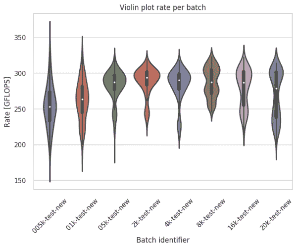
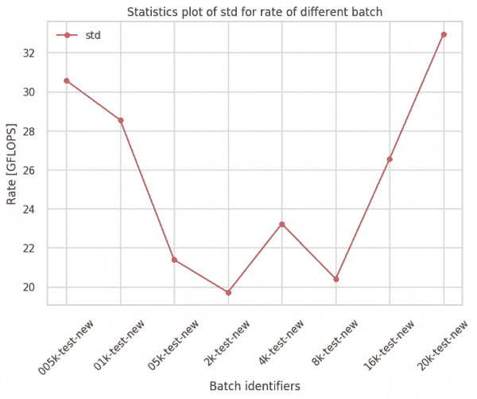
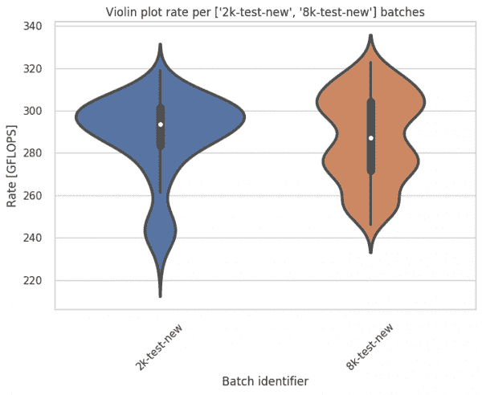
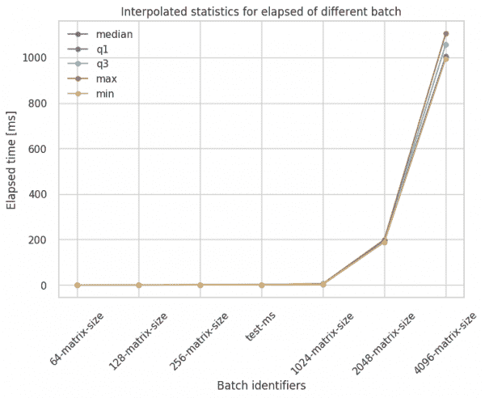
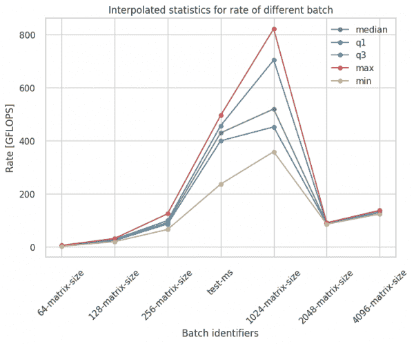
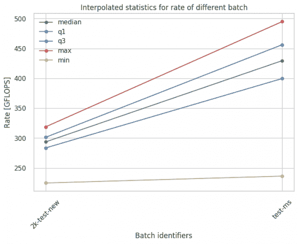

# Thoth 项目中在 PSI 上使用 Red Hat OpenShift 的 AI 应用程序的微基准

> 原文：<https://developers.redhat.com/blog/2019/10/28/microbenchmarks-for-ai-applications-using-red-hat-openshift-on-psi-in-project-thoth>

[Project Thoth](https://github.com/thoth-station) 是一个人工智能(AI) R & D 红帽研究项目，是首席技术官办公室和[人工智能卓越中心(CoE)](https://github.com/AICoE) 的一部分。该项目旨在基于收集到的知识，为应用栈建立知识图和推荐系统，例如依赖于流行的开源 ML 框架和库(TensorFlow、PyTorch、MXNet 等)的机器学习(ML)应用。).在本文中，我们考察了 project Thoth 的基础设施在 [Red Hat Openshift](https://developers.redhat.com/openshift/) 中运行的潜力，并探索它如何收集性能观察。

从不同的领域收集了几种类型的观察结果(比如构建时、运行时和性能，以及应用程序二进制接口(ABI))。这些观察通过 [Thoth 系统](https://github.com/thoth-station/core)收集，并自动丰富知识图。然后，知识图用于从观察中学习。项目[透思架构](https://github.com/thoth-station/core)需要在 OpenShift 环境中进行多名称空间部署，运行在 PnT DevOps 共享基础设施(PSI)上，这是一个共享的多租户 OpenShift 集群。

Thoth 推荐是通过一个 [Thamos CLI](https://github.com/thoth-station/thamos) 提供的，这是一个用于与 Thoth 后端通信的工具和库。透特项目的推荐引擎叫做[顾问](https://github.com/thoth-station/adviser)。

[顾问](https://github.com/thoth-station/adviser)(截至目前)的主要目标有:

1.  提供一个工具，可以计算项目[到](https://thoth-station.ninja/)中的建议。
2.  [检查已安装软件包的出处](https://github.com/thoth-station/adviser/blob/master/docs/source/provenance_checks.rst)(使用了哪些软件包源索引 pip 和 Pipenv 都不保证这一点)。
3.  一个叫做[依赖猴子](https://github.com/thoth-station/adviser/blob/master/docs/source/dependency_monkey.rst)的工具，它为一个关于依赖解析的项目生成所有可能的软件栈。

人工智能软件栈的建议需要收集软件栈中大量库组合的性能观察。为了捕捉这些性能差异，Thoth 依赖于专门为 Thoth 需求创建的微基准，称为[性能指标(PIs)](https://github.com/thoth-station/performance) 。

为了定义这些新类型的基准，我们分析了 ML 基准(例如， [MLPerf](https://mlperf.org/) ，[百度 DeepBench](https://github.com/baidu-research/DeepBench) ，[斯坦福黎明深度学习基准(DAWNBench)](https://dawn.cs.stanford.edu/benchmark/) ，[深度学习食谱](https://developer.hpe.com/platform/hpe-deep-learning-cookbook/home))，并将它们分为两类:

*   高级测试，也称为宏基准，在应用程序级别执行，因此是一个真实的应用程序，考虑不同的数据集、模型、超参数调整、操作系统库、硬件等。，因此考虑整个 ML 工作负载(例如 ML Perf)。

图 1:高级测试模式。

*   低级测试，也称为微基准测试，侧重于构成 ML 算法主干的基本操作。(例如 DeepBench)。

图 2:低级测试模式。

我们还分析了 ML 应用程序和它们的算法，通过它们在基本组件中的分解，我们得出了 PI 的定义。下表描述了 Thoth PI 相对于现有 ML 基准的情况。我们可以立即看到，透特是唯一专注于软件栈；因此，它不会与其他现有的工作重叠。整个分析对于保证 Thoth 的需求是重要的:低评估时间，软件栈集中，ML 框架集中，用于训练和推理。

|   | **Benchmark ****(高级测试)** | **透特皮** | **Microbenchmark****(低级测试)** |
| **目标** | 测量从移动设备到云服务的训练和推理的系统性能。 | 评估可用于推荐 AI 软件堆栈的性能指标。 | 在不同硬件平台上对深度学习重要的操作进行基准测试。 |
| **指标** | 

*   time
*   one-sided
*   cost

 | 

*   one-sided

 | 

*   one-sided

 |
| **基准测试所需的时间** | ~小时、天 | ~分钟，(小时？) | ~秒，分钟 |
| **使用 ML 框架** | 是 | 是 | 不 |
| **ML 工作流程的阶段** | 训练/推理 | 训练/推理 | 训练/推理 |

我们现在可以将 pi 定义为:*脚本运行以收集关于 AI 软件栈的性能观察，用于训练和推理，从而最小化评估时间。*

根据对 ML 应用和算法的分析，为每个 ML 框架定义 pi。每个 PI 都有特定的参数，需要对其进行调整和测试，以识别约束条件，从而最大限度地减少因运行共享基础设施而产生的误差。

接下来的部分将展示如何使用 [Red Hat OpenShift](http://developers.redhat.com/openshift/) 来评估 pi，以及一旦 ML 库的新版本发布时触发的自动化过程。此外，他们将显示初步的结果，以保证透特用户的透明度，可靠性和准确性。这些结果将表明，我们能够识别软件堆栈性能的差异，因此我们可以使用这些观察来推荐具有更高性能的软件堆栈。

## 我们如何为人工智能应用运行这些基准测试？

软件堆栈的性能取决于许多参数。有必要考虑整个软件堆栈的各个层，以便了解它们的行为以及影响它们性能的不同因素。

Amun 是在所请求的环境中执行应用堆栈的服务，使用应该安装的软件包列表以及运行应用所请求的硬件。它的主要目的是充当 Thoth 的执行引擎，在这里构建和测试应用程序(应用程序是根据软件的需求自动生成的)。

输入通过一个 JSON 文件给出，该文件允许选择软件堆栈各层中的所有组件，例如:

*   基础图像(例如，`rhel8`、`ubi8`、`thoth-ubi8-python36`)
*   rpm 或 Debian 包列表
*   固定的软件堆栈(`Pipfile`和`Pipfile.lock`)
*   硬件要求(例如，仅 CPU、GPU)
*   PIs 和参数

Amun 可以直接通过 CLI 运行，也可以通过[依赖猴子](https://github.com/thoth-station/adviser/blob/master/docs/source/dependency_monkey.rst)运行，后者生成软件栈，随后使用具有特定 PI 的 Amun 服务对其进行验证和评分。通过这种方式，我们可以了解不同软件堆栈和硬件的性能差异。

每个 PI 都有特定的输入参数，但是每个 PI 都收集不同类型的数据，例如硬件信息、资源使用情况等。

有两个特别关注性能的结果。一个结果是 Flops(每秒浮点运算)或 GigaFlops(或 GFLOPS)，也就是十亿次 FLOPS。另一个结果是执行特定操作所花费的时间，以秒或毫秒为单位。第二个结果也称为*经过时间。*

我们可以根据希望从 PI 运行中获取的内容来扩展结果。

## 我们在哪里运行 AI 应用程序的微基准？

ML 应用程序受软件堆栈所有层的影响，因此评估性能需要使用 PIs，它可以高度可信地近似应用程序的行为。同时，ML 应用程序需要一个测试平台来提供评估和分析结果所需的所有信息，以保证结果的可靠性、透明性和准确性。

由于需要分析大量的软件堆栈，因此需要收集大量的观察数据，因此对可扩展性、自动化、可靠性和可监控性的需求通过使用在 PSI 上运行的 OpenShift 得以满足。

*图 3:透特性能指标测试环境。*>

图 3 显示了我们选择来运行 Thoth PIs 的测试环境。此图突出显示了在所有可能的情况下可以提供的用于评估软件堆栈性能的输入(如前一节所示):

如果我们看一下图 4，可以看出 Thoth 核心架构中关注 PIs 运行的部分(称为*检查运行*):

*图 4:透特核心架构。*>

检查运行可以直接通过 Amun API 或通过 Dependency Monkey 提交，后者生成要检查的软件栈的组合。涉及两到三个名称空间:Amun 在 Amun API 名称空间中运行，并在 Amun Inspection 名称空间中生成检查构建和检查作业。一旦作业完成，图形同步作业将结果文档存储在 Ceph 中，并将其同步到 Thoth 知识库中。

## 我们什么时候为人工智能应用运行微基准测试？

Thoth 内部的许多服务都是自动化的。由于 Prometheus Alerts 和 Grafana，支持开发团队的机器人依赖于 OpenShift 可监控性功能。所有的结果质量分析都是通过运行 Thoth [模板笔记本](https://github.com/thoth-station/notebooks/tree/master/notebooks/templates)自动触发的。这样，我们可以减少工作量，并专注于测试约束的定义，以达到最佳的准确性。我们使用的方法是数据驱动的，这有助于团队内部和促进改进，以保证对外部透思用户的可靠性和质量。

让我们假设 TensorFlow 的新版本在 [PyPI 指数](https://pypi.org/)发布。Thoth 内部触发的典型工作流如图 5 所示:

图 5:发布新 TensorFlow 时典型的 Thoth 工作流。>

该工作流程分为以下几部分:

1.  Google 在 PyPI 上发布了 TensorFlow 的新版本。
2.  [包发布作业](https://github.com/thoth-station/package-releases-job):
    1.  标识新的 TensorFlow 版本。
    2.  同步 Thoth 数据库中的新包。
    3.  重新触发 [TensorFlow 构建](https://github.com/thoth-station/tensorflow-build-s2i)管道。
3.  [图形刷新作业](https://github.com/thoth-station/graph-refresh-job):
    1.  识别新包并请求作业调度。
    2.  通过`operator-workload`安排[解算器作业](https://github.com/thoth-station/solver)。
    3.  安排一个[包分析器作业](https://github.com/thoth-station/analyzer)到`operator-workload`。
4.  两件事同时发生。首先，结果是:
    1.  从作业中创建。
    2.  通过`[graph-sync-job](https://github.com/thoth-station/graph-sync-job)`存储在透特知识图中。
    3.  通过`[graph-sync-job](https://github.com/thoth-station/graph-sync-job)`存储在 Ceph 中。

同时，`tensorflow-wheels-build-jobs`完成，TensorFlow 新的优化版本发布在 [AICoE index](https://tensorflow.pypi.thoth-station.ninja/) 上，该指数经过上述所有相同点。

5.  Prometheus 从 Pushegateway 和`metrics-exporter`那里收集数据，并对 Thoth 团队正在发生的事情提供见解。
6.  普罗米修斯根据透特团队定义的结果触发警报。
7.  Thoth 的机器人团队成员 Sesheta 在 Thoth DevOps 聊天上发送反馈和状态。根据逻辑和规则，可以直接通过[依赖猴子](https://github.com/thoth-station/adviser/blob/master/docs/source/dependency_monkey.rst)或[阿蒙](https://github.com/thoth-station/amun-api)决定触发检验分析评估 PI。
8.  Dependency Monkey 生成软件栈，并开始通过 Amun API 安排检查，或者直接从 Sesheta 触发 Amun，并将检查发送给工作负载操作员。
9.  所有结果都存储在 Thoth 知识图和 Ceph 中。
10.  当每个检验批次完成时，使用 Thoth 模板笔记本触发检验工作的质量分析，并将结果提供给团队内外。

## 测试和结果

这些测试主要针对 TensorFlow 的 [matmul](https://github.com/thoth-station/performance/blob/master/tensorflow/matmul.py) 微基准测试。该 PI 的输入参数为:

*   矩阵尺度
*   数据类型
*   操作重复次数

### 测试 1

测试 1 旨在确定减少速率误差的重复次数、固定数据类型和矩阵大小。输入参数是:

*   来自皮帕的张量流 1.13
*   Fedora 基础图像
*   matmul(张量流，矩阵大小=512，{重复次数}，data_type=float32)
*   300 次检查
*   仅限 CPU

测试 1 的结果如图 6 至图 9 所示:

*图 6:测试 1 的方框图绘制了每批的比率。*>

*图 7:测试 1 的每批小提琴出图率。*>

*图 8:不同*批次*的*比率*测试 1 的标准差统计图。*>

*图 9:测试 1 对*不同*批次的*比率*的插值统计。*>

根据从矩阵 512 获得的结果，我们可以对两个特定批次进行更详细的调查，其中结果的变化较低，如图 10 和 11 所示:

*图 10:测试 1 的方框图显示了每个指定批次的比率。*>

*图 11:按指定批次测试 1 的小提琴曲线速率。*>

根据这些结果，我们决定最初使用 2，000 次重复来运行 matmul PIs，因为 matmul 具有最低的变化率(这是对软件包评分的基础，因此也是 Thoth 给出的建议质量的基础)。

### 测试 2

测试 2 旨在确定结果的质量，用测试 1 中确定的最佳解决方案固定重复次数，但改变矩阵大小。在本测试中，我们将每批的检验次数减少到 100 次(在测试 1 中，我们对每批检验进行了 300 次检验)。在这个测试中，我们还有一个新版本的 TensorFlow 和基本图像。该测试的输入参数包括:

*   来自 pypi 的张量 Flow 1.14.0
*   `s2i-Thoth-ubi8-python36`基础图像
*   matmul (TensorFlow，{matrix size}，重复次数=2k，data_type=float32)
*   100 次检查
*   仅限 CPU

矩阵大小为 64、128、256、512、1024、2048、4096。

测试 2 的结果如图 12 和 13 所示:

*图 12:测试 2 对不同批次的*经过的*时间的插值统计。*>

*图 13:测试 2 对*不同*批次的*比率*的插值统计。*>

从结果中我们可以看到，当矩阵变大时，底层硬件使用了优化，同时我们可以看到结果在速率上的变化增加，但在经过的时间上没有增加。Thoth 能够捕捉这些行为，并向用户提供建议，以便他们能够在最佳条件下运行 AI 应用程序。

## 确定的绩效变化

让我们关注两个测试中的两个特定的检查批次，以展示 Thoth 获得的更多见解和性能观察。

| 测试 1 | 测试 2 |
| 输入参数:

*   张量流 1。13 .来自 PyPI 的 0
*   Fedora 基础图像
*   matmul(张量流，矩阵大小=512,重复次数=2k，数据类型=浮点 32)
*   300 inspection
*   CPU dedicated

 | 输入参数:

*   张量流 1。14 .来自 PyPI 的 0
*   `s2i-Thoth-ubi8-python36`基础图像
*   matmul(张量流，矩阵大小=512,重复次数=2k，数据类型=浮点 32)
*   100 inspections
*   CPU dedicated

 |

图 14 比较了速率[GFLOPS]的结果:

*图 14:不同批次比率的插值统计(GFLOPS)。*>

从 PyPI 结果分析中我们可以看到，从 TensorFlow 1.13.0 ( `2k-test-new`检验批)到 TensorFlow 1.14.0 ( `test-ms`检验批)，考虑到 matmul 使用 512 矩阵大小和仅使用 CPU 得出的速率(GFLOPS)结果的中值，性能提高了约 1.46 倍。我们还需要考虑进一步测试结果的变化，还需要考虑运行检测次数的优化，以保证较低的结果误差。

总的来说，这些结果显示了 Thoth 的基础设施在 PSI 上的 Openshift 中运行的潜力，以及它如何收集性能观察。他们对如何进行测试给出了很好的见解，但需要进行进一步的分析以减少误差的变化，从而避免误导性的建议。

## 后续步骤

接下来，我们计划:

*   在同一 PI 上执行其他类型的测试。
*   综合考虑不同 pi 的其他结果。
*   为 ML 应用程序创建新 PI。

*Last updated: October 4, 2022*