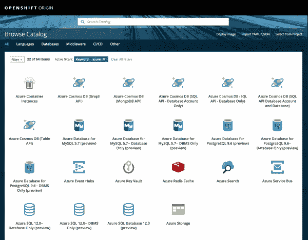
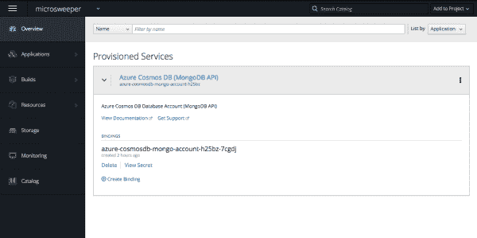
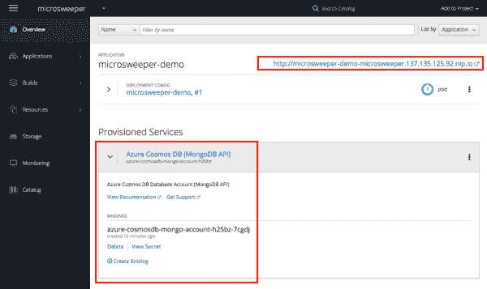
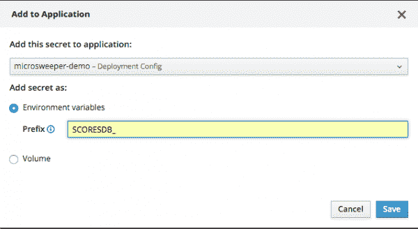
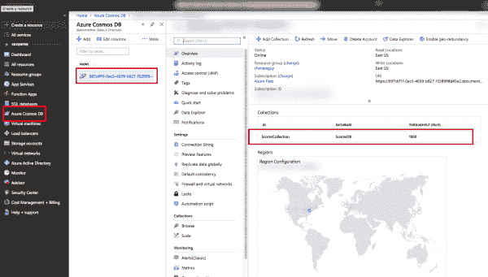
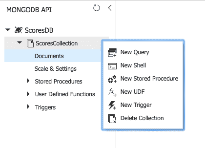

# 使用 Azure Open Service Broker 在 Microsoft Azure 上部署 MicroProfile 应用程序

> 原文：<https://developers.redhat.com/blog/2018/10/17/microprofile-apps-azure-open-service-broker>

在最近结束的奥兰多[微软 Ignite 2018](https://www.redhat.com/en/events/red-hat-microsoft-ignite-2018) 大会上，我有幸向一群渴望学习如何将他们的 Java 技能用于在 Azure 上构建下一代应用的 Java 开发人员和 Azure 专业人员做了介绍。当然，这意味着展示来自流行的 [MicroProfile](https://microprofile.io) 社区的技术，Red Hat 在其中发挥了重要作用(并通过 [Thorntail](https://thorntail.io) ，Red Hat OpenShift 应用运行时的一部分，实现了完全支持的、产品化的 MicroProfile 实现)。

我们也做了一个演示，这也是这篇博文的主题，展示了通过[Open Service Broker for Azure](https://github.com/Azure/open-service-broker-azure)(开源、[Open Service Broker](https://www.openservicebrokerapi.org/)-兼容 API 服务器，在微软 Azure 公共云中提供托管服务)和 [OpenShift 的服务目录](https://github.com/openshift/service-catalog)，将您的 Java MicroProfile 应用链接到 Azure 服务是多么容易。

以下是如何重现演示。

## 演示

来自 Red Hat(MicroProfile 和 Red Hat 的技术营销)的 [Cesar Saavedra](https://twitter.com/cesar_saavedr) 和 [Brian Benz](http://twitter.com/bbenz) (微软的开发倡导者)和我一起站在台上，我们介绍了 micro profile 的起源、目标、社区构成、路线图和其他一些项目。

然后是演示时间。您可以[观看会话](https://www.youtube.com/watch?v=-nAjEsBjkLA)的视频。

https://www.youtube.com/watch?v=-nAjEsBjkLA

演示应用程序对您来说应该很熟悉:

[](/sites/default/files/blog/2018/10/Screen-Shot-2018-09-20-at-2.07.12-PM.png)MicroSweeper Screenshot

MicroSweeper screenshot

这款游戏是经典的[扫雷](https://en.wikipedia.org/wiki/Microsoft_Minesweeper)，于 1992 年随着 Windows 3.1 首次引入 Windows 世界，并受到了观众中各种白发苍苍的人的赞赏(向[尼克·阿罗乔](http://www.nickarocho.com/)大喊，因为他出色的 JavaScript 实现！).

在这个游戏中，我添加了一个由数据库支持的简单记分牌，我们在演示中的工作是使用[微配置 API](https://github.com/eclipse/microprofile-config) 将这个应用程序连接到 Azure 的 [Cosmos DB](https://azure.microsoft.com/en-us/services/cosmos-db/) 服务，并使用简单的[微配置健康 API](https://github.com/eclipse/microprofile-health)与 OpenShift 的[健康探测器](https://docs.okd.io/latest/dev_guide/application_health.html)集成。

以下部分描述了如何重现演示。

## 重新创建演示

如果你只是想要源代码，[这里是](https://github.com/jamesfalkner/microsweeper-demo)，还有一个*解决方案*分支，添加必要的更改，将应用程序链接到 Cosmos DB 和 OpenShift。但是如果你想合作，请遵循以下步骤:

### 第一步:获得一个 Azure 帐户

我们的第一项工作是[获得一个 Azure 帐户和一些信用点数](https://azure.microsoft.com/en-us/free/)，所有这些都是免费的。很简单，对吧？由于我们使用 OpenShift，这可以很容易地部署到您选择的云，但 Azure 非常容易使用，并且 [OpenShift 在 Azure Marketplace](https://azuremarketplace.microsoft.com/en-us/marketplace/apps/redhat.openshift-container-platform?tab=Overview) 中可以用于生产就绪的多节点 OpenShift 部署。还有一个很好的[参考架构](https://access.redhat.com/documentation/en-us/reference_architectures/2018/html/deploying_and_managing_openshift_3.9_on_azure/index)供所有建筑师使用。

### 步骤 2:部署 OpenShift

既然这是一个演示，我们可以走捷径，对不对？在这种情况下，我们不需要完全武装的、可操作的和产品化的多节点 OpenShift 部署的全部功能，所以我使用了 Cesar 创建的一个不错的“All in One”Azure 部署。要进行部署，只需点击这里的。

作为安装的一部分，您需要填写一些信息。稍后您将使用这些值，所以不要忘记它们:

*   **资源组**:创建一个新的资源组来容纳所有组件(虚拟机、网卡、存储等)。资源组是 Azure 将相关资源组合在一起的方式。如果指定的组不存在，将为您创建一个。
*   **地点**:选一个离你近的部署。
*   **管理员用户名/管理员密码**:这将是您登录 OpenShift Web 控制台时使用的用户名和密码。
*   **Ssh 密钥数据**:如果您想使用`ssh`访问生成的虚拟机，您需要[生成一个 Ssh 密钥对](https://docs.microsoft.com/en-us/azure/virtual-machines/linux/mac-create-ssh-keys)。创建公钥文件后，粘贴它的内容。
*   **虚拟机大小**:指定虚拟机大小。提供了默认值。如果需要其他大小或类型的虚拟机，请确保该位置包含该实例类型。

同意条款和条件，并点击**购买**按钮。然后拿一杯咖啡；大约需要 15 分钟完成，你将开始消耗你的点数。(对于默认的机器类型，您每周将花费 20 美元到 30 美元！)点击**部署进度**通知观看进度。

完成后，点击**输出**选项卡，显示新 OpenShift 控制台的 URL。把它加入书签，因为你以后会用到它。还有，不要忘记你提供的用户名/密码；你以后也会需要的。

如果您没有得到任何*输出*，您可以通过点击 Azure 门户最左侧的**虚拟机**链接，然后点击虚拟机名称(与您指定的资源组同名)，然后查找 *DNS 名称*，打开一个新的浏览器选项卡并导航到`https://[THE_DNS_NAME]:8443`，来发现您的新 OpenShift 部署的公共 DNS 主机名。

### 步骤 2a:授予自己集群管理员权限

虽然 OpenShift 中的用户是使用您提供的凭据创建的，但是该用户没有安装 service broker 组件所需的`cluster-admin`权限。为了给我们自己这种能力，我们需要使用`ssh`访问机器并运行一个命令(你*保存了前面创建的 SSH 公共和私有密钥，对吗？).*

首先，登录到运行 OpenShift 的虚拟机:

```
ssh -i [PRIVATE_KEY_PATH] [ADMIN_USERNAME]@[VM HOSTNAME]

```

其中:

*   `[PRIVATE_KEY_PATH]`是包含私钥的文件的路径，该私钥对应于您在 Azure 上设置 OpenShift 时使用的公钥。
*   `[ADMIN_USERNAME]`是您指定的 OpenShift 用户的名称。
*   `[VM HOSTNAME]`是 Azure 上运行的虚拟机的 DNS 主机名。

通过`ssh`登录后，运行以下命令:

```
sudo oc adm policy add-cluster-role-to-user cluster-admin [ADMIN_USERNAME]
```

`[ADMIN_USERNAME]`与您在`ssh`命令中使用的相同。这将为您提供在接下来的步骤中安装 service broker 所需的权限。你现在可以退出`ssh`会话了。

### 步骤 3:部署 Azure 服务代理

开箱即用的 OpenShift 一体化部署包括对 OpenShift 服务目录(我们的 Open Service Broker API 实现)的支持，所以剩下要做的就是安装[Open Service Broker for Azure](https://github.com/Azure/open-service-broker-azure)以在 OpenShift 服务目录中公开 Azure 服务。

这可以通过使用 [Helm](https://www.helm.sh/) 最容易地安装(这里是[安装说明](https://docs.helm.sh/using_helm/#installing-helm))，并且使用 Helm 你还可以选择哪个版本的代理。微软[已经暂时从代理的 GA 版本中去掉了实验服务](https://github.com/Azure/open-service-broker-azure/releases/tag/v1.0.0)，并且正在慢慢地将它们添加回来，所以你需要指定一个今年早些时候的版本，包括这些实验服务，比如演示使用的 Cosmos DB 的 MongoDB API。

让我们首先以管理员用户的身份使用`oc`命令登录到我们新部署的 OpenShift 部署(如果您没有这个命令，请从[这里](https://www.okd.io/download.html)安装*客户端工具*):

```
oc login [URL] -u [ADMIN_USERNAME] -p [PASSWORD]
```

这里，您需要指定新的 OpenShift 实例的 URL(包括端口号 8443 ),以及之前在 Azure 上设置它时使用的用户名/密码。

登录后，让我们用 Helm 部署代理(注意，这使用 Helm 2.x 和它的 Tiller-full 实现)。

```
oc create -f https://raw.githubusercontent.com/Azure/helm-charts/master/docs/prerequisities/helm-rbac-config.yaml
helm init --service-account tiller
helm repo add azure https://kubernetescharts.blob.core.windows.net/azure
```

随着 Helm 的设置和 Azure Helm 图表的添加，是时候为 Azure 安装[开放服务代理](https://github.com/Azure/open-service-broker-azure)了，但你需要*四个特殊值*，它们将通过所谓的*服务主体*将代理与你的个人 Azure 账户关联起来。服务主体是具有代表应用程序创建和编辑资源的身份和权限的实体。[您需要首先按照这里的说明](https://docs.microsoft.com/en-us/azure/azure-resource-manager/resource-group-create-service-principal-portal)创建一个服务主体，在创建它并为它分配对新资源组的权限时，收集以下值:

*   **AZURE_SUBSCRIPTION_ID** :这与你的 AZURE 账户相关联，可以在 [Azure 门户](https://portal.azure.com)(登录后)上找到，方法是点击**资源组**，然后点击你使用一体化部署部署 OpenShift 时创建的资源组的名称。示例:`6ac2eb01-3342-4727-9dfa-48f54bba9726`
*   **AZURE_TENANT_ID** :当创建服务主体时，您会看到一个对*租户 ID* 的引用，也称为*目录 ID* 。它看起来也有点像订阅 ID，但它们是不同的！它与您帐户中的 Active Directory 实例相关联。
*   **AZURE_CLIENT_ID** :您在创建服务主体时创建的客户端(应用)的 ID，有时也称为*应用 ID* ，在结构上也与上述 ID 类似，但有所不同！
*   **AZURE_CLIENT_SECRET** :在创建服务主体时为您创建的客户端(应用程序)设置的秘密值。这将是一个较长的 base64 编码字符串。

哇，真有趣。有了这些值，我们现在可以发出神奇的`helm`命令来完成任务并安装 Open Service Broker for Azure:

```
helm install azure/open-service-broker-azure --name osba --namespace osba \
--version 0.11.0 \
--set azure.subscriptionId=[AZURE_SUBSCRIPTION_ID] \
--set azure.tenantId=[AZURE_TENANT_ID] \
--set azure.clientId=[AZURE_CLIENT_ID] \
--set azure.clientSecret=[AZURE_CLIENT_SECRET] \
--set modules.minStability=EXPERIMENTAL
```

不幸的是，它使用的是 Redis 的旧版本，所以让我们使用一个更新的版本，为了简化，让我们去掉对持久卷的需求(并且永远不要在生产中使用它！):

```
oc set volume -n osba deployment/osba-redis --remove --name=redis-data
oc patch -n osba deployment/osba-redis -p '{"spec": {"template": {"spec": {"containers":[{"name": "osba-redis", "image": "bitnami/redis:4.0.9"}]}}}}'
```

这将在`osba` Kubernetes 名称空间中安装 Open Service Broker for Azure，并启用实验性特性(如 Cosmos DB)。提取代理和 Redis(它使用的默认数据库)的映像可能需要一些时间，并且代理 pod 在尝试访问 Redis 时可能会进入崩溃循环，但最终它应该会出现。如果您搞砸了并得到错误，您可以通过删除`osba`名称空间并再次尝试来重新开始(使用`helm del --purge osba; oc delete project osba`并等待一段时间，直到它真正消失并且不出现在`oc get projects`输出中)。

运行以下命令验证一切正常:

```
oc get pods -n osba
```

您应该看到以下内容(查找两者的*运行*状态):

```
NAME                                              READY     STATUS    RESTARTS   AGE
osba-open-service-broker-azure-846688c998-p86bv   1/1       Running   4          1h
osba-redis-5c7f85fcdf-s9xqk                       1/1       Running   0          1h

```

现在已经安装好了，浏览到 OpenShift Web 控制台(可以通过运行`oc status`找到 URL)。使用与之前相同的凭证登录，您应该会看到许多 Azure 服务及其图标(OpenShift 可能需要一两分钟来轮询代理并发现它所提供的所有内容):

[](/sites/default/files/blog/2018/10/osb.png)

Azure Services exposed through Open Service Broker in OpenShift

在顶部的搜索框中键入`azure`以查看列表。呜！别紧张，皮斯。

### 步骤 4:部署 Cosmos DB

在我们部署应用程序之前，让我们部署我们将使用的数据库。(在演示中，我在没有数据库的情况下开始，并进行一些现场编码来部署数据库并更改应用程序以使用它。对于这篇博文，我假设您只想运行最终的代码。)

为了部署 Cosmos DB，我们将使用 OpenShift Web 控制台。在主屏幕上，双击**Azure Cosmos DB(MongoDB API)**图标。这将带您浏览几个屏幕。在第一个屏幕上点击**下一个**。在第二个屏幕上，选择将 Cosmos DB 部署到一个新项目，并将该项目命名为`microsweeper`。在此之下，您可以保留所有默认设置，但以下设置除外:

*   将**默认一致性级别**设置为**会话**。
*   在第一个**允许范围**框中输入`0.0.0.0/0`，点击**添加**按钮。然后点击第二个 **allowedIPRanges** 框旁边的 **X** 按钮(不要问为什么)。
*   在**位置**框中输入有效的 Azure 区域标识符，例如`eastus`。
*   在**资源组**框中，输入您之前在步骤 2 中创建的资源组的名称。
*   点击**下一个**。

在最后一个屏幕上，选择**在 microsweeper 中创建一个稍后使用的密码**选项。这将稍后从应用程序中引用。最后，点击**创建**按钮，然后 OpenShift 就会自动运行，这大约需要 5-10 分钟。

点击**继续到项目概述**查看 Azure 服务的状态。在此期间，如果您在一个单独的选项卡中访问 Azure 门户，您将看到几个资源正在被创建(最显著的是一个 Cosmos DB 实例)。一旦全部完成，OpenShift 控制台的项目总览屏幕的 Provisioned Services 部分将显示 Cosmos DB 已准备就绪，包括一个我们稍后将使用的绑定。

[](/sites/default/files/blog/2018/10/Screen-Shot-2018-10-05-at-5.59.05-PM.png)

Cosmos DB is ready for use

### 步骤 5:添加微配置文件健康检查和配置

该应用程序使用了[众多微配置 API](https://microprofile.io/projects/)中的两个: [`HealthCheck`](https://microprofile.io/project/eclipse/microprofile-health) 和 [`Config`](https://microprofile.io/project/eclipse/microprofile-config) 。

#### 微文件健康检查

对于 [`RestApplication`](https://github.com/jamesfalkner/microsweeper-demo/blob/master/src/main/java/com/example/microsweeper/rest/RestApplication.java) 类，我们添加了一个简单的`@Health`注释和一个新方法:

```
@Health
@ApplicationPath("/api")
public class RestApplication extends Application implements HealthCheck {

  @Override
  public HealthCheckResponse call() {
    return HealthCheckResponse.named("successful-check").up().build();
  }
}

```

简单吧？您可以根据需要添加任意多的这些内容，健康检查可以做它需要做的任何事情，并且可以根据您的需要尽可能复杂(但不要太复杂！).

#### 微配置文件配置

我认为更有趣的是增加了 Cosmos DB 配置。因为我们通过环境变量公开了 Cosmos DB，所以我们能够在 [`ScoreboardServiceCosmos`](https://github.com/jamesfalkner/microsweeper-demo/blob/master/src/main/java/com/example/microsweeper/service/ScoreboardServiceCosmos.java) 类中使用 MicroProfile 自动注入它们的值:

```
@Inject
@ConfigProperty(name = "SCORESDB_uri")
private String uri;

...

mongoClient = new MongoClient(new MongoClientURI(uri));

```

`@Inject @ConfigProperty` MicroProfile 注释指导 Thorntail 根据指定的名称为`uri`字段寻找并动态注入值。微文件`Config` API 指定了一个定义良好的优先表来查找这些值，因此有很多方法可以将这些值公开给应用程序。我们将在这个演示中使用一个环境变量，但是你也可以使用属性文件、 [ConfigMaps](https://docs.okd.io/latest/dev_guide/configmaps.html) 等等。

### 步骤 6:部署应用程序

示例应用程序使用红帽完全支持的[微概要](https://microprofile.io)实现 [Thorntail](https://thorntail.io) 。这是一个 Java 框架，所以你首先需要将 [Red Hat 的 OpenJDK](https://developers.redhat.com/products/openjdk/overview/) 安装到 OpenShift，这样就可以用它来构建和运行应用程序:

```
oc create -n openshift -f https://raw.githubusercontent.com/jboss-openshift/application-templates/a1ea009fac7adf0ca34f8ab7dbe5aa0468fe5246/openjdk/openjdk18-image-stream.json
```

这使用了引用了 [Red Hat 容器目录](https://access.redhat.com/containers/)的先前版本的图像流。

接下来，让我们将应用程序部署到我们新创建的项目中:

```
oc project microsweeper
oc new-app 'redhat-openjdk18-openshift:1.3~https://github.com/jamesfalkner/microsweeper-demo#solution' \
  -e GC_MAX_METASPACE_SIZE=500 \
  -e ENVIRONMENT=DEVELOPMENT
oc expose svc/microsweeper-demo

```

这将为应用程序创建一个新的[基于 S2I 的构建](https://docs.okd.io/latest/architecture/core_concepts/builds_and_image_streams.html#source-build)，用 Maven 和 OpenJDK 构建它，并部署应用程序。最初，该应用程序将使用内部数据库(H2)。部署可能需要几分钟时间。完成后，您应该会看到以下输出:

```
% oc get pods -n microsweeper
NAME                        READY     STATUS      RESTARTS   AGE
microsweeper-demo-1-build   0/1       Completed   0          1h
microsweeper-demo-3-x8bdg   1/1       Running     0          1h

```

您可以看到构建应用程序的已完成构建窗格和正在运行的应用程序窗格。

[](/sites/default/files/blog/2018/10/azure.png)MicroProfile App deployed to OpenShift

MicroProfile app deployed to OpenShift

部署完成后，您可以在 OpenShift Web 控制台中点击`microsweeper-demo`服务旁边的 Route URL 并玩游戏。您也可以通过以下方式获得 URL:

```
echo http://$(oc get route microsweeper-demo -o jsonpath='{.spec.host}{"\n"}' -n microsweeper)
```

注意，它还没有使用 MicroProfile 或 Cosmos DB！在游戏中，输入你的名字(或使用默认)，玩几次游戏，确保你赢了或输了，记分牌都会更新。要重置记分板，请单击右上角的 X。若要重新开始游戏，请点按笑脸或悲伤的面孔。美好时光，对吧？让我们把它连接到宇宙数据库！

### 步骤 7:将 Cosmos DB 绑定到应用程序

在前面的步骤中，您将 Cosmos DB 服务部署到您的项目中，因此现在可以说它已经被“供应”并绑定到项目中。此时，您可以对应用程序逻辑进行硬编码，以使用所提供服务的 URI、用户名、密码等。，但这是一个可怕的长期方法。最好使用 OpenShift 动态公开服务的凭证，然后通过该动态机制更改应用程序以使用这些值。

有两种简单的方法来公开服务的配置:通过 [Kubernetes Secrets](https://kubernetes.io/docs/concepts/configuration/secret/) (凭证通过文件系统上的一个普通文件公开，该文件通过 pod 中的一个卷安全地传输和挂载)或者通过环境变量。我使用环境变量是因为它很简单，但是 Thorntail/MicroProfile 可以使用这两种变量。

首先，点击**查看秘密**查看我们需要绑定到 Cosmos DB 的秘密内容，然后点击**添加到应用**。这将允许您选择将哪个应用程序的环境变量添加到该应用程序的 DeploymentConfig 中。在下拉列表中选择`microsweeper-demo`应用程序，然后选择**环境变量**选项并指定前缀`SCORESDB_`。(别忘了下划线！)一旦重新部署应用程序以添加新的环境变量，这将改变应用程序的环境，每个环境变量都以`SCORESDB_`开始(例如，Cosmos DB 的 URI 将是`SCORESDB_uri`环境变量的值)。

[](/sites/default/files/blog/2018/10/Screen-Shot-2018-10-05-at-4.45.14-PM.png)Values to use when Adding secrets to the app

Values to use when adding secrets to the app

点击**保存**。

现在我们准备切换到 Cosmos DB。要进行这种切换，只需更改环境变量`ENVIRONMENT`的值，在应用程序中从 H2 数据库切换到 Cosmos DB:

```
oc set env dc/microsweeper-demo ENVIRONMENT=PRODUCTION --overwrite
```

此时，应用程序将被重新部署，并开始使用 Cosmos DB！多玩几次这个游戏，然后去 Azure 门户验证数据是否被正确持久化。在门户中导航到 Azure Cosmos DB，然后单击代表数据库 ID 的单个长字符串。您应该会看到一个名为 *ScoresCollection* 的集合:

[](/sites/default/files/blog/2018/10/Screen-Shot-2018-10-05-at-5.00.10-PM.png)

A collection called ScoresCollection

点击**分数收集**，然后点击**数据浏览器**。此工具让您可以查看数据库中的数据记录(文档)。使用小“**...**收藏名称旁边的菜单，点击**新增查询**:

[](/sites/default/files/blog/2018/10/Screen-Shot-2018-10-05-at-5.32.44-PM.png)

Selecting the New Query menu item

在查询框中输入最简单的查询:`{}`。然后点击**执行查询**查看结果。多玩几次这个游戏，重新发出查询以确认数据是否被正确持久化。干得好！

[](/sites/default/files/blog/2018/10/Screen-Shot-2018-10-05-at-5.33.00-PM.png)

Confirming data is being persisted properly

### 后续步骤

在这个演示中，我们使用了两个有助于开发 Java 微服务的 micro profile API(`HealthCheck`和`Config`)，通过 Open Service Broker API 将 MicroProfile/Thorntail 应用程序链接到 Azure 服务。

您可以使用许多其他的 MicroProfile APIs，我鼓励您查看完整的规范和最新版本(MicroProfile 2.1)。MicroProfile 非常棒，是使用真正开放的、社区驱动的创新来构建 Java 微服务的好方法。

也可以看这些关于[现代应用开发](https://developers.redhat.com/blog/category/modern-app-dev/)、[微服务](https://developers.redhat.com/topics/microservices/)、[容器](https://developers.redhat.com/blog/category/containers/)和 [Java](https://developers.redhat.com/blog/category/java/) 的帖子。

编码快乐！

*Last updated: April 1, 2021*