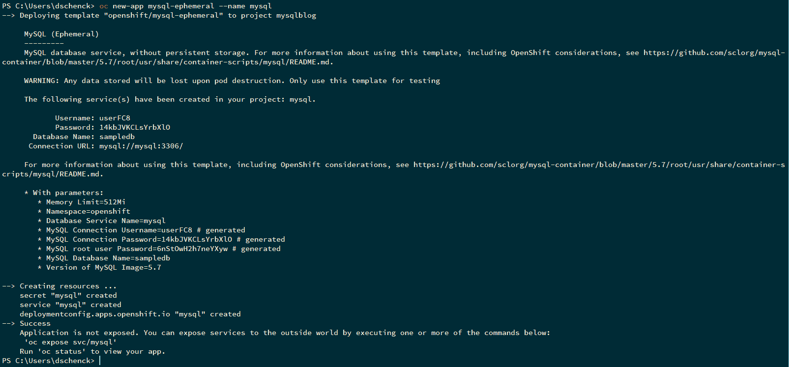

# 面向 Red Hat OpenShift 开发人员的 MySQL

> 原文：<https://developers.redhat.com/blog/2019/07/18/mysql-for-developers-in-red-hat-openshift>

作为一名软件开发人员，经常需要访问一个关系数据库——或者任何类型的数据库。如果您遇到了这种情况，需要运营部门的人为您提供数据库，那么本文将帮助您摆脱这种情况。我将向您展示如何使用 [Red Hat OpenShift](https://developers.redhat.com/openshift/) 在几秒钟内启动(并清除)一个 MySQL 数据库。

说实话，有几个数据库可以在 OpenShift 中托管，包括 Microsoft SQL Server、Couchbase、MongoDB 等等。对于本文，我们将使用 [MySQL](https://www.mysql.com/) 。然而，这些概念对于其他数据库来说是相同的。所以，让我们获取一些知识，并利用它。

## MySQL，你在哪里？

因为 MySQL 是开源的并且非常受欢迎，我们可以很容易地在网上找到它，下载并安装它。您可以在下载网页的[上找到社区版。](https://www.mysql.com/products/community/)

等等:这是 OpenShift。一定有更简单的方法。不出意外，是有的。(面对它；如果没有更简单的方法，我还会写这篇文章吗？我一直希望事情变得简单。)

## 到命令行

假设您已经启动并运行了 OpenShift 4.x，并且已经登录，那么您的第一步(只有两步)是访问命令行以获得 OpenShift 中包含的模板列表。模板基本上是安装应用程序所需的步骤——都在一个漂亮的 YAML 文件中。使用此命令查看列表:

```
oc get templates --namespace openshift
```

一旦返回这个有点长的列表(最近我统计了 91 个条目)，您将看到 MySQL 的两个条目:*MySQL-短命的*和*MySQL-持久的*。我们将在这里使用*MySQL-短命*模板。整个想法是这样的:你输入几个键，等几秒钟，然后嘣！，您已经为您的开发工作建立并运行了 MySQL 数据库。在开发周期中，您可以多次删除和重新开始，每次都使用一个全新的数据库，我的意思是，您可以使用它。

等你们都做完了，瞬间就能把东西拆了。但是你会留下一些有用的工件，比如，你，开发人员，创建的一些脚本——可以交给操作人员的脚本。嗯（表示踌躇等）...开发商？运营？听起来像是 DevOps。只是说说而已。

## 我说到哪了？

哦，是啊。我们想创建一个在 OpenShift 中运行的 MySQL 实例。我们将使用短命模板，在上面的列表中，它被称为*MySQL-短命*。我们需要给它起一个名字，让生活变得更简单。使用以下命令。(请注意，尽管本例使用的是 PowerShell，但该命令在任何终端中都是相同的。)

```
oc new-app mysql-ephemeral --name mysql
```



`--name`标志`mysql`在我们的脚本中是为了让生活变得更容易。您可以使用任何您希望的名称，但是您必须确保脚本匹配。这是一个很好的机会，用一些古怪来给沉闷的一天增添一些乐趣。但是我跑题了...

注意，由于 MySQL-periodic 模板，OpenShift 创建了一个用户和密码。这可能有用。

## 下一步

*没事*。就是这样。我们用一条命令就启动并运行了 MySQL。有趣的事情开始了。我们希望构建一些表，并将一些数据放入这些表中。首先，我们一起获取一些信息。

## 为什么是两个豆荚？

您可以通过运行以下命令来查看 MySQL pods 列表:

```
oc get pods --selector app=mysql
```

您应该会看到如下所示的内容:


记下 pod 的名称，并根据需要将其复制到您的计算机剪贴板上。你很快就会删除它。我以后称它为{pod-name}。

然而，只是为了好玩，让我们使用以下命令来查看我们所有的 pod:

```
oc get pods
```


你会注意到两个 MySQL pods。这是为什么呢？这是因为 one pod 致力于构建实际运行 MySQL 的 pod。想看些很酷的东西吗？让我们通过运行以下命令来删除 MySQL pod:

```
oc delete pod {pod-name}
```

```
oc get pods
```

请注意，现在正在运行一个新的 MySQL pod。这是 Kubernetes 自我修复能力的一次展示，因为它可以确保您的 pod 正常运行。作为在 pod 中使用数据库的开发人员，我们可以利用这一点。当我们想从头开始时，我们可以简单地删除运行 MySQL 的 pod，一个新的 pod 就会出现。但是，请注意，这将是一个新的 MySQL pod。所有以前的数据库、表格、数据—存储在 pod 中的所有内容—都将消失。这是*MySQL-短命*中的“*短命*”。好的一面是，你知道你没有来自任何先前努力的残余工件；你从零开始。作为一名开发人员，我喜欢这样。

**注意:**你可以在 OpenShift 中运行 MySQL，并让它*而不是*是短暂的；这就是 *mysql-persistent* 模板的意义所在。那也是另一篇文章。

## 空载运行

使用`oc rsh`命令，我们可以进入运行 MySQL 的 pod 内部，并使用命令行实用程序进行查看。我们需要做的就是获取 pod 名称，然后运行`oc rsh {pod_name}`。一旦进入，我们可以看到我们的数据库 sampledb 是空的。

Bash:


PowerShell:


一个空数据库。有什么好处？完全没有。因此，让我们构建一个表并填充它。我们有一些选择:

1.  使用基于桌面或浏览器的工具登录并键入命令。
2.  从我们的命令行连接到数据库并键入命令。
3.  登录 pod 并运行 mysql 实用程序中的命令。

没有。不感兴趣。我们是开发者，不是鼠标点击者。我们想要自动化的东西。脚本化的东西。一些我们可以反复开发和使用的东西。这个想法怎么样:创建文件和脚本来完成所有的工作。听起来好多了。*总是尽可能多地写剧本*。

## 红帽 OpenShift 的一些帮助

幸运的是，OpenShift 命令行工具 oc 帮助了我们。我可以使用`oc exec`来运行 pod 内的命令*。这些知识足以让任何勇敢的开发人员开始挖掘、搜索、编码、失败、编码，直到成功。我是说，**我**第一次尝试就成功了。是啊。*

## 演变

我的第一个尝试是构建一个可以做所有事情的脚本；它创建了表并用数据填充它。这足够了...好吧，不，这还不够。这是一个很好的概念验证(PoC ),但显然不是解决方案。我想要一个脚本，使用文件作为输入来创建表并填充它。

## 写下所有的东西

第一步是最简单的:我创建了一个逗号分隔值的文件(即 CSV)，用于填充一个名为“customer”的小表。接下来，我创建了一个文件，其中包含创建表“customer”的 SQL 命令

现在有趣的部分来了，弄清楚如何将这些文件通过管道传输到某个机器上的某个命令中，以构建我的表并填充它。在我看来，在 MyQL 实例所在的机器上运行`mysql`命令似乎是最合理的做法。但我不会要求自己登录到 pod 来运行命令。这是什么，2015 年？

另一个拯救的 OpenShift 命令:`oc cp`允许您将文件从本地机器复制到 OpenShift 中运行的 pod 中。如果我可以将文件复制到 pod，那么我就可以使用我前面提到的`oc exec`命令远程启动所需的命令。我开发人员头脑中的轮子开始转动。或者咖啡终于开始起作用了。不管怎样，我的方向是正确的。

最后，为了将所有这些放在一起，我想要一个没有麻烦的方法来获得 mysql 运行的 pod 的名称。我绝对不想去查找它，把它复制到我的剪贴板上，然后粘贴到一个命令或文件中。不，我想开发一些自动工作的东西。我是一名开发人员。

对于 Bash，神奇之处在于这个命令:

```
mpod=$(oc get pods --selector app=mysql --output name | awk -F/ '{print $NF}')
```

注意:你需要在你的机器上安装 awk。如果你没有——我不是在开玩笑——你可以决定要么安装 awk，要么安装 PowerShell。是的，PowerShell 现在到处都在运行*。*

 *对于 PowerShell，我使用了以下命令:

```
$mpod = (oc get pods --selector app=mysql --output name | Select-Object).Split("/")[1]
```

这意味着，即使 pod 名称发生了变化——比如我删除了 pod，由于 Kubernetes 的原因，一个新的 pod 自动替换了它——该命令也将对新的 pod 起作用。

## 是时候建造了

有了这些信息，我就能够构建两个脚本——一个用于 PowerShell，一个用于 Bash——用于创建和填充我的表。PowerShell 脚本如下:

```
# Get name of pod running MySQL
$mpod=oc get pods --selector app=mysql --output name
$mpod=$mpod.Split("/")[1]

# Copy setup files to pod
Write-Output 'Copying setup files into pod...'
oc cp .\customer-table-create.sql ${mpod}:/tmp/customer-table-create.sql
oc cp .\customer-data.txt ${mpod}:/tmp/customer-data.txt

# Build table
Write-Output 'Creating table(s)...'
oc exec $mpod -- bash -c "mysql --user=root < /tmp/customer-table-create.sql"

# Populate table
Write-Output 'Importing data...'
oc exec $mpod -- bash -c "mysql --user=root -e 'use sampledb; LOAD DATA LOCAL INFILE \""/tmp/customer-data.txt\"" INTO TABLE customer FIELDS TERMINATED BY \"",\"" ENCLOSED BY \""\"" LINES TERMINATED BY \""\n\"" IGNORE 1 ROWS (customerName,effectiveDate,description,status);'"

# Prove it all worked
Write-Output 'Here is your table:'
oc exec $mpod -- bash -c "mysql --user=root -e 'use sampledb; SELECT * FROM customer;'"
```

## 你想让我把这些都打出来？

Bash 脚本类似。别担心，你不需要输入所有的内容。您可以在本文的 GitHub 资源库[获得脚本和相关文件。](https://github.com/redhat-developer-demos/mysql-openshift-ephemeral)

现在，我可以通过运行一个命令来重新创建我的数据:

```
./create_customer.sh
```

在 Bash 中，或者:

```
./create_customer.ps1
```

在 PowerShell 中。

## 奖金

剩下一些脚本和两个文件:一个文件包含测试数据，另一个文件构建表。将所有代码置于版本控制之下(例如 Git ),您就有了可以移交给运营部门的工件。受源代码管理。用于可重复的动作。我们每天都在离成为独角兽越来越近，这是重要的一步。

## 如果可以的话...

我会把它写成接受参数的代码。我将构建一个接受参数的实用程序，并实际构建我的所有脚本。遵循这些想法，在您工作的地方成为命令行英雄。

## 下一个？两件事...

将脚本交给运营部门后，他们如何在持久设置中运行 MySQL？那篇文章快到了。注意这个空间。

同时，我的下一篇文章将演示如何在 Red Hat OpenShift 中运行的应用程序中实际使用 MySQL 数据库。

*Last updated: September 3, 2019**