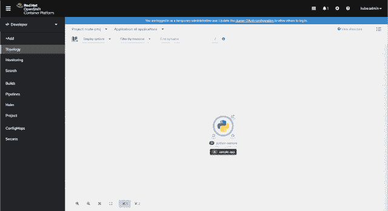
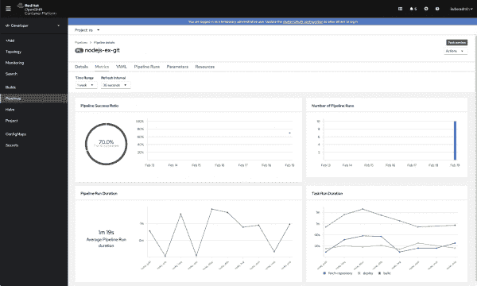
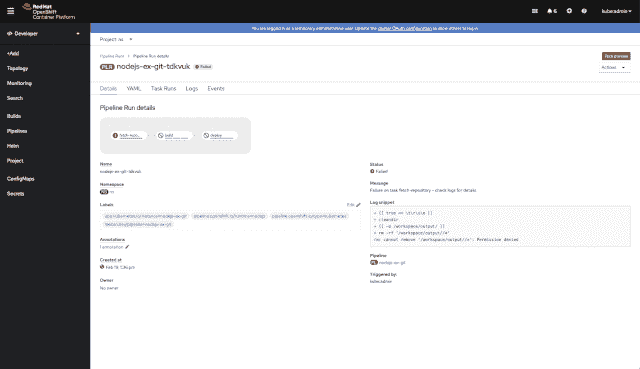

# Red Hat OpenShift 4.7 web 控制台中的新开发人员快速入门和更多功能

> 原文：<https://developers.redhat.com/blog/2021/03/08/new-developer-quick-starts-and-more-in-the-red-hat-openshift-4-7-web-console>

我们将继续在 [Red Hat OpenShift 4.7](https://www.openshift.com) 中改进开发者体验。本文重点介绍了 OpenShift 4.7 web 控制台中对开发人员的新增功能。请继续阅读，了解拓扑视图的激动人心的变化、改进的开发人员目录体验、新的开发人员快速入门、对 [Red Hat OpenShift 管道](/courses/middleware/openshift-pipelines)和 [Red Hat OpenShift 无服务器](/topics/serverless-architecture)的用户界面支持等等。

## 拓扑视图中的快速添加

OpenShift 4.7 中我最喜欢的功能之一是 web 控制台拓扑视图中新的快速添加选项。您可以使用这个 UI 控件直接从拓扑视图中搜索开发人员目录中的项目，而无需更改上下文。当您键入时，匹配项会动态显示在列表中。然后，您可以单击一个匹配项，在右侧面板中查看快速概览，然后单击行动要求来安装它。图 1 中的演示展示了新的快速添加特性。

Figure 1: The new quick-add feature in the OpenShift web console's topology view.

Figure 1: The new quick-add feature in the OpenShift web console's topology view.

此外，web 控制台现在为用户设置提供持久存储，以便您可以在拓扑视图中持久存储布局。对于这个特性，我们收到了很多请求，如图 2 所示。

Figure 2: Topology graph layouts are now persisted.

Figure 2: Topology graph layouts are now persisted.

## 开发者目录中的新特性

开发人员目录是开发人员快速开始使用 OpenShift 的一站式商店。在 OpenShift 4.7 中，我们通过创建跨目录的一致体验，同时为特定目录类型提供上下文视图，改善了开发人员的体验。

当进入开发者目录时，用户现在可以在单个目录中查看所有内容。默认情况下，有几个子目录可用:构建器图像、舵图、操作员支持的服务和样本。根据安装的[操作符](/topics/kubernetes/operators)提供其他子目录。OpenShift 4.7 有事件源和虚拟机的子目录，在未来的版本中还会有更多。

当您深入到子目录时，显示的功能和过滤器特定于给定的目录类型。举例来说，您知道管理员可以添加多个舵图表存储库吗？掌舵图表目录显示来自多个存储库的图表，并允许您按任何掌舵图表存储库进行筛选。

最后，我们收到了许多请求，要求允许管理员定制开发人员目录体验。在 OpenShift 4.7 中，我们为目录管理员添加了一个定制功能。要修改开发人员目录的可用类别，只需向控制台操作员资源添加一个定制部分。然后，您可以使用生成的 YAML 代码片段添加默认类别，并在那里编辑它们。

## 开发人员快速入门

你现在可以从**+添加**页面或者从 OpenShift web 控制台的**帮助**菜单中的**快速入门**项访问开发者快速入门。如图 3 所示，快速入门目录提供了各种新的开发人员快速入门——试一试吧！

Figure 3: Quick Starts for the developer

Figure 3: Developer quick starts in the quick-starts catalog.

## 泰克顿管道公司

OpenShift 4.7 web 控制台为 Tekton 管道提供了一些增强功能。首先，您现在可以轻松地访问 Tekton 管道指标，如图 4 所示。

Figure 4: Pipeline Metrics

Figure 4: Tekton pipeline metrics.

我们还增强了 **PipelineRun** 细节页面，如图 5 所示。

Figure 5: The improved PipelineRun details page.

Figure 5: The improved PipelineRun details page.

从**事件**选项卡，您现在可以轻松访问与`PipelineRun`相关的事件，包括`TaskRun`和 pod 事件。您也可以从**日志**选项卡下载日志。

## 无服务器

Web 控制台对 OpenShift Serverless 的支持包括创建频道的能力。创建后，代理和通道将显示在拓扑视图中。除了从 action 菜单中创建订阅和触发器之外，您现在还可以从拓扑视图中通过拖放来启动这些操作。

我们还增强了事件源的创建流程。事件源是自定义资源，我们需要解决此功能中的可伸缩性问题，因此我们将用户体验更改为基于目录。现在，您可以在服务目录中查看事件源以及其他对象。或者，您可以单击事件源类型，深入查看仅关注事件源的目录。例如，如果您安装了[Red Hat Integration](/integration)[Camel K](/topics/camel-k)操作符，您将在目录中看到 Camel K 连接器。

我们还更新了 OpenShift Serverless 的管理员视角。web 控制台包括 OpenShift 无服务器的主导航部分，其中包含两个子部分。一个子部分侧重于服务资源，另一个用于事件。您可以导航到这些部分，找到有关您的 OpenShift 事件源、经纪人、触发器、渠道和订阅的详细信息。这些项目也可以在 developer 透视图的拓扑视图和搜索页面上访问。

## 我们需要您的反馈

社区反馈有助于我们不断改进 OpenShift 开发者体验，我们希望听到您的意见。您可以在我们的办公时间参加 [Red Hat OpenShift Streaming](http://openshift.tv) 或加入 [OpenShift 开发者体验谷歌小组](https://groups.google.com/forum/#!forum/openshift-dev-users)。我们希望您能分享您使用 OpenShift web 控制台的技巧，获得关于无效操作的帮助，并塑造 OpenShift 开发人员体验的未来。准备好开始了吗？[今天试试 OpenShift】。](http://www.openshift.com/try)

*Last updated: October 7, 2022*