# Eclipse 2020-03 的 Red Hat code ready Studio 12 . 15 . 0 . ga 和 JBoss Tools 4.15.0.Final 中的新特性

> 原文：<https://developers.redhat.com/blog/2020/04/28/new-features-in-red-hat-codeready-studio-12-15-0-ga-and-jboss-tools-4-15-0-final-for-eclipse-2020-03>

用于 Eclipse 4.15 (2020-03)的 JBoss Tools 4.15.0 和[Red Hat code ready Studio 12.15](https://developers.redhat.com/products/codeready-studio/overview)现已发布。对于这个版本，我们专注于改进 Quarkus 和基于容器的开发，并修复错误。我们还更新了 Hibernate Tools runtime provider 和 Java Developer Tools (JDT)扩展，它们现在与 Java 14 兼容。此外，我们对平台视图、对话框和工具栏进行了许多 UI 更改。

## 装置

首先，让我们看看如何安装这些更新。CodeReady Studio(以前的 Red Hat Developer Studio)在安装程序中预装了所有东西。只需从 [Red Hat CodeReady Studio 产品页面](https://developers.redhat.com/products/codeready-studio/overview)下载安装程序，并按如下方式运行:

```
$ java -jar codereadystudio-<installername>.jar

```

另一方面，安装 JBoss Tools 4 . 15 . 0——也就是“自带 Eclipse(BYOE)code ready Studio”——需要更多的努力。这个版本至少需要 Eclipse 4.15 (2020-03)，但是我们建议安装最新的 [Eclipse 4.15 2020-03 Java EE 捆绑包](http://www.eclipse.org/downloads/packages/release/2020-03/r/eclipse-ide-java-ee-developers)。安装最新的包可以确保您获得最新的 Java 依赖项。

一旦你安装了 Eclipse 4.15 (2020-03)或更高版本，你就可以打开 **Eclipse Marketplace** 标签，寻找 **JBoss Tools** 或 **Red Hat CodeReady Studio** 。或者，您可以[直接从我们的更新站点下载 JBoss Tools 4.15.0](http://download.jboss.org/jbosstools/photon/stable/updates/) 。

## OpenShift 容器平台 4.4 支持

随着新的 OpenShift 容器平台(OCP) 4.4 的推出，JBoss Tools 以一种透明的方式与这个主要版本兼容。就像之前为 OCP 3 集群所做的那样，定义到基于 OCP 4.4 的集群的连接，并使用工具。

## 对 Kubernetes、Openshift、S2i 和 docker 属性的语言支持

现在有对`kubernetes.properties`、`openshift.properties`、`s2i.properties`、`docker.properties`的完成、悬停、文档化和验证，如图 1、2、3 和 4 所示。

[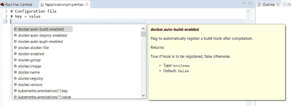](/sites/default/files/blog/2020/04/img_5ea544fd6d6c6.png)

输入`kubernetes`前缀:

[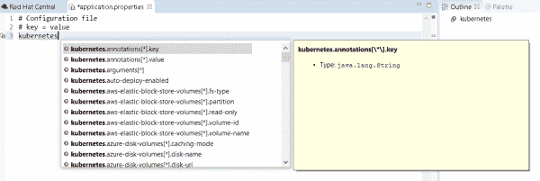](/sites/default/files/blog/2020/04/img_5ea5455f28985.png)

输入`openshift`前缀:

[](/sites/default/files/blog/2020/04/img_5ea54584001e0.png)

输入`s2i`前缀:

[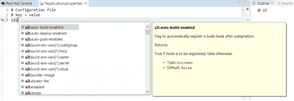](/sites/default/files/blog/2020/04/img_5ea545ae81494.png)

## 微配置文件 Rest 客户端属性的语言支持

同样，现在 REST 客户机中的微文件属性也有了完成、悬停、文档化和验证。首先使用`@RegisterRestClient`注册一个 REST 客户端，如下所示:

```
package org.acme;

import javax.ws.rs.GET;
import javax.ws.rs.Path;
import javax.ws.rs.core.Response;

import org.eclipse.microprofile.rest.client.inject.RegisterRestClient;

@RegisterRestClient
public interface MyServiceClient {
	@GET
    @Path("/greet")
    Response greet();
}
```

相关的 MicroProfile Rest 配置属性将具有语言特性支持(完成、悬停、验证等。)，如图 5 所示。

[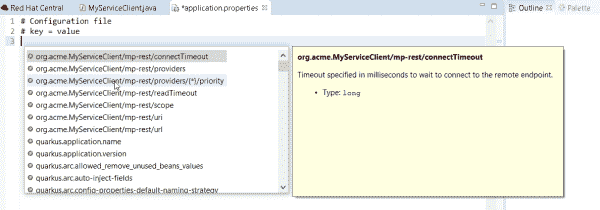](/sites/default/files/blog/2020/04/img_5ea547eb6d9ad.png)

Figure 5: Hover and documentation example: MicroProfile completion.

更改 Java 代码，以便更改配置密钥:

```
package org.acme;

import javax.ws.rs.GET;
import javax.ws.rs.Path;
import javax.ws.rs.core.Response;

import org.eclipse.microprofile.rest.client.inject.RegisterRestClient;

@RegisterRestClient(configKey = "myclient")
public interface MyServiceClient {
	@GET
    @Path("/greet")
    Response greet();
}
```

请注意，代码辅助也相应地发生了变化，如图 6 所示:

[](/sites/default/files/blog/2020/04/img_5ea548210cc6e.png)

Figure 6: Code changes are reflected in the configuration.

## 微配置文件健康的语言支持

同样，现在有了 MicroProfile 健康工件的完成、悬停、文档和验证。所以如果你有以下健康课:

```
package org.acme;

import org.eclipse.microprofile.health.Health;

@Health
public class MyHealth {

}
```

您将得到一个验证错误(因为该类没有实现`HealthCheck`接口)，如图 7 所示:

[](/sites/default/files/blog/2020/04/img_5ea5485db0c0c.png)

Figure 7: Language support for MicroProfile Health.

类似地，如果您有一个实现了`HealthCheck`但没有用`Health`注释的类，一些工作流适用:

```
package org.acme;

import org.eclipse.microprofile.health.HealthCheck;
import org.eclipse.microprofile.health.HealthCheckResponse;

public class MyHealth implements HealthCheck {

	@Override
	public HealthCheckResponse call() {
		// TODO Auto-generated method stub
		return null;
	}

}
```

您将得到一条验证消息(因为该类没有使用`Health`接口进行注释)，如图 8 所示:

[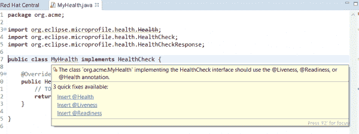](/sites/default/files/blog/2020/04/img_5ea548b209899.png)

Figure 8: Adding HealthCheck yields message to implement MicroProfile Health.

由于有多种方法可以解决该问题，因此提出了几种快速解决方法。

## quartus 项目向导中更好的扩展报告

随着 Quarkus 扩展生态系统的发展，我们改进了 Quarkus 项目向导中关于扩展的信息。当您在向导中选择一个扩展时，您将在向导的下方看到扩展的描述，如图 9 所示。如果该扩展在 Quarkus 网站上有指南，还会显示一个链接。

[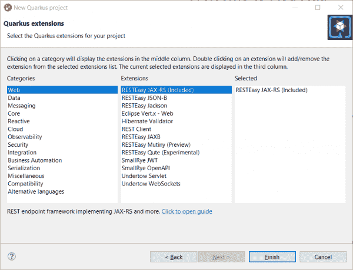](/sites/default/files/blog/2020/04/img_5ea548faa7c78.png)

Figure 9: Improved support for Quarkus extensions.

单击该链接将在本地 web 浏览器上打开指南，如图 10 所示:

[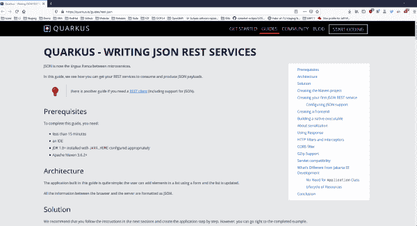](/sites/default/files/blog/2020/04/img_5ea54926c1203.png)

Figure 10: Web-based help is available.

## Hibernate 运行时提供程序更新

对可用的 Hibernate 运行时提供程序进行了大量的添加和更新:

*   Hibernate 5.4 运行时提供程序现在合并了 Hibernate 核心版本 5.4.14.Final 和 Hibernate 工具版本 5.4.14.Final。
*   Hibernate 5.3 运行时提供程序现在合并了 Hibernate 核心版本 5.3.16.Final 和 Hibernate 工具版本 5.3.16.Final。

## 平台

有多种平台变化。

### 项目浏览器中默认的分层项目布局

为了更好地处理多模块、嵌套和分层项目，在**项目浏览器**视图中的默认项目布局已经从*平面*更改为*分层*。

您可以使用视图菜单( **⋮** )将布局恢复为*平面*。

### 控制台视图现在可以解释换页符和垂直制表符

在支持的语言中，**控制台**视图中 ASCII 控制字符的解释被扩展到识别字符`\f`(换页符)和`\v`(垂直制表符)。默认情况下，此功能是禁用的。您可以在**运行/调试- >控制台**首选项页面启用它，如图 11 所示:

[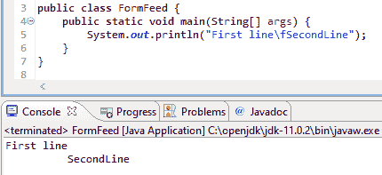](/sites/default/files/blog/2020/04/img_5ea549817e62c.png)

Figure 11: Form feed and vertical tab now supported.

### 控制台视图中的终止时间

除了启动时间之外，**控制台**视图标签现在还会显示流程的终止时间。

[](/sites/default/files/blog/2020/04/img_5ea5499ba88ad.png)

Figure 12: Process timing information is readily available.

### 选择资源重命名模式的首选项

在 **General** preferences 页面中添加了一个首选项，允许您在 Project Explorer 中选择资源重命名模式:打开一个内联文本字段或一个对话框，如图 13 所示。默认情况下，选择内联重命名模式。

也可以通过产品定制来指定首选项:

*   `org.eclipse.ui.workbench/RESOURCE_RENAME_MODE=inline`
*   `org.eclipse.ui.workbench/RESOURCE_RENAME_MODE=dialog`

**注意:**影响多个资源的重命名总是通过对话框执行。

[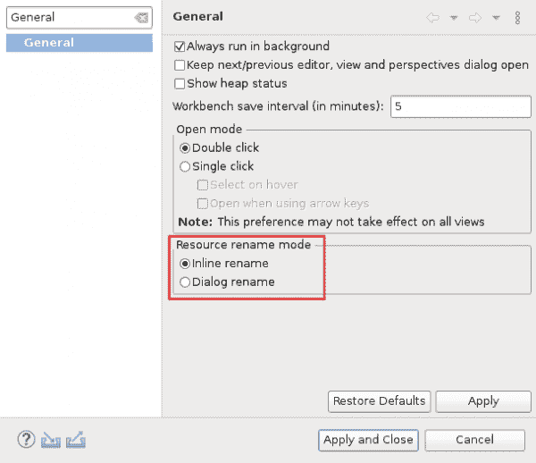](/sites/default/files/blog/2020/04/img_5ea549fa7e0a1.png)

Figure 13: Renaming a resource can be inline or dialog-driven.

### 黑暗主题中的欢迎屏幕

当 Eclipse 处于黑暗主题时， **Welcome** 屏幕在 macOS 和 Linux 上也是黑暗的，如图 14 所示。

[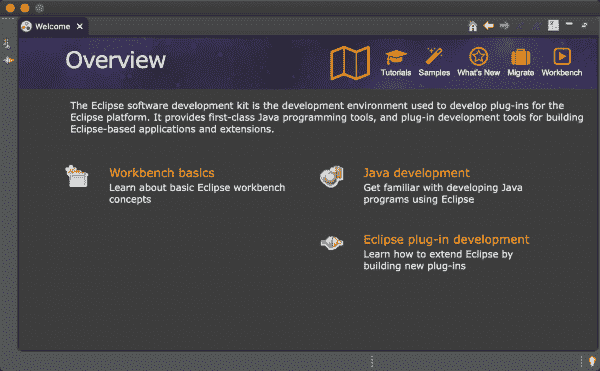](/sites/default/files/blog/2020/04/img_5ea54a12b3b91.png)

Figure 14: Welcome screen now available in dark mode.

### 互动表演

在此版本中，交互性能得到了进一步改进。为了提高交互性能，默认情况下，在树查看器的折叠和展开操作期间，重绘是关闭的。与同步绘制更新相比，这种行为大大改进了这些操作。

### Java 开发工具(JDT)

围绕 Java 开发工具也有许多改进。

#### Java 14 支持

Java 14 是可用的，Eclipse JDT 在 Eclipse 4.15 版本中支持 Java 14。该版本特别包括以下 Java 14 特性:

*   JEP 361:开关表达式(标准)。
*   JEP 359:记录(预览)。
*   JEP 368:文本块(第二次预览)。
*   JEP 305:实例的模式匹配(预览)。

请注意，语言预览功能的预览选项应该打开。关于这种支持的非正式介绍，请参考 [Java 14 示例 wiki](https://wiki.eclipse.org/Java14/Examples) 。

#### 子词代码完成

内容辅助现在支持子词模式，类似于 Eclipse 代码推荐器和其他 ide。例如，在`addmouselistener`上完成会产生类似于`addMouseMoveListener`和`addMouseWheelListener`的结果，如图 15 所示。

[](/sites/default/files/blog/2020/04/img_5ea54a3dd2f5d.png)

Figure 15: Related patterns suggestions now appear.

可以使用 **Java - >编辑器- >内容辅助**首选项页面上的**显示子词匹配**选项来启用该功能。

#### 子类型代码完成

Content Assist 将优先显示其声明类型从完成上下文中的预期返回类型继承的构造函数完成。例如，完成日期:

```
Queue<String> queue = new L
```

为`LinkedBlockingQueue`、`LinkedBlockingDeQueue`和`LinkedList`区分构造函数的优先级，如图 16 所示。

[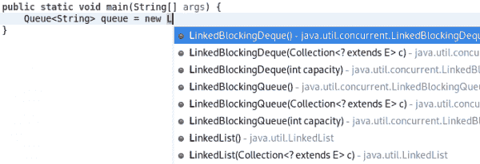](/sites/default/files/blog/2020/04/img_5ea54a594cb93.png)

Figure 16: Suggestions based on return type are prioritized.

#### 非阻塞 Java 完成选项

Java 编辑器中的代码完成现在可以在一个单独的非 UI 线程中运行，以防止 UI 在长时间计算的情况下冻结。要启用这种非阻塞计算，请转到**首选项- > Java - >编辑器- >内容辅助- >高级**，并选中**在计算完成建议时不阻塞 UI 线程**首选项。默认情况下，此选项当前处于禁用状态。

当完成建议的计算时间很长时，非阻塞完成非常有用，因为它允许您同时键入或使用 IDE 的其他部分。一些完成参与者可能会阻止该选项生效(通常是在 Java 完成扩展没有声明`requiresUIThread="false"`的情况下)，因此即使设置了该选项，UI 线程仍可能被使用。

#### 包装可选语句的快速修复

添加了一个快速修复来包装一个`Optional`语句。原语语句的选项有:`Optional.empty()`和`Optional.of()`。类型语句也有`Optional.ofNullable()`。

图 17 显示了一个类型对象的例子。

[](/sites/default/files/blog/2020/04/img_5ea54a7946544.png)

Figure 17: Improved support for Optional statement.

为类型对象选择 **Wrap with nullable Optional** 会产生如图 18 所示的结果。

图 19 显示了这个原语的一个例子。

[](/sites/default/files/blog/2020/04/img_5ea54aaad0336.png)

Figure 19: Without Wrap with Optional.

为原语选择 **Wrap with Optional** 会产生如图 20 所示的结果。

[](/sites/default/files/blog/2020/04/img_5ea54ac3e1b2d.png)

Figure 20: Using Wrap with Optional.

#### 简化功能界面实例

添加了一个新的清理功能，它简化了 lambda 表达式和方法引用语法，并且只支持 Java 8 和更高版本。清理会删除单个非类型化参数的括号、单个表达式的 return 语句和单个语句的括号。它尽可能用创建或方法引用来替换 lambda 表达式。

要选择清理，调用 **Source - > Clean Up…** ，使用一个自定义概要文件，并在 **Configure…** 对话框的 **Code Style** 选项卡上选择**Simplify lambda expression and method reference syntax**，如图 21 所示。

[](/sites/default/files/blog/2020/04/img_5ea54ae30f8d6.png)

Figure 21: Enabling Lambda cleanup.

考虑图 22 所示的代码。

[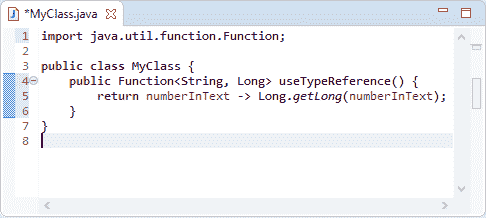](/sites/default/files/blog/2020/04/img_5ea54af95ab8c.png)

Figure 22: Before Lambda cleanup.

清理之后，您会看到如图 23 所示的内容。

[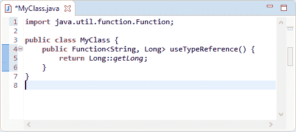](/sites/default/files/blog/2020/04/img_5ea54b14aa0c8.png)

Figure 23: After Lambda cleanup.

#### 直接使用地图方法

一些地图操作不必要地冗长。新的清理选项**直接在 map**上操作，如图 24 所示，在 map 上调用方法，而不是在键集或值上调用相同的方法。不过，要小心。如果您创建不遵循`Map`规范的 Map 实现，这种清理可能会破坏行为(改变值的`size()`方法，破坏项目的迭代器，等等)。)

[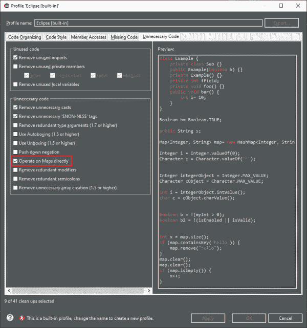](/sites/default/files/blog/2020/04/img_5ea54b3069cf4.png)

Figure 24: You can enable easier Map manipulation.

考虑图 25 所示的代码。

[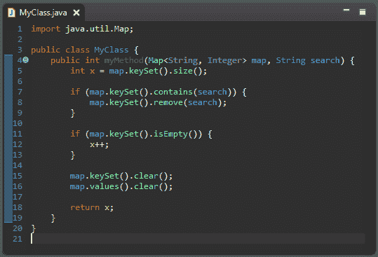](/sites/default/files/blog/2020/04/img_5ea54b49e484a.png)

Figure 25: Before Map cleanup.

清理之后，您会看到如图 26 所示的内容。

[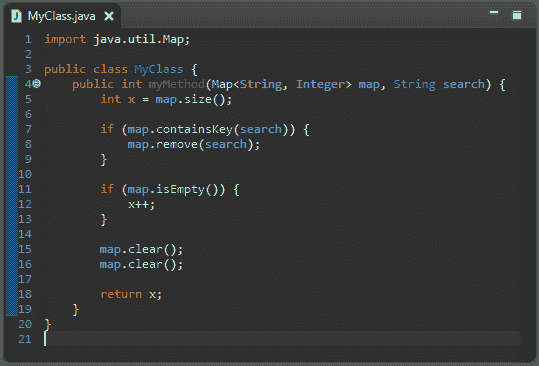](/sites/default/files/blog/2020/04/img_5ea54b603c3cb.png)

Figure 26: After Map cleanup enabled.

#### 长文字后缀的大写字母

添加了一个新的清理选项，**使用大写字母作为长文字后缀**，如图 27 所示。它会用一个像`101L`一样的大写字母 L 重写像`101l`这样的长文字以避免歧义。

[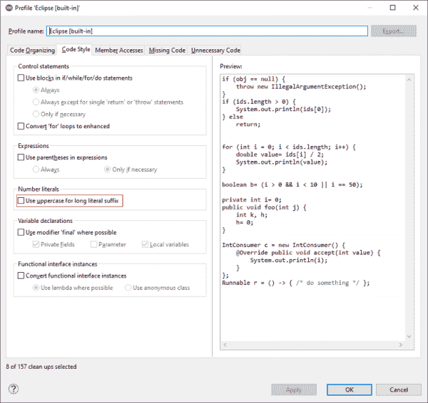](/sites/default/files/blog/2020/04/img_5ea54b8515354.png)

Figure 27: Automatically convert long literal suffixes to UPPERCASE.

#### 用“用资源尝试”块包围

对应于用“用资源尝试”块包围选择的快速修复，一个新的动作被添加到**用**包围菜单中。例如，您可以选择如图 28 所示的行。

[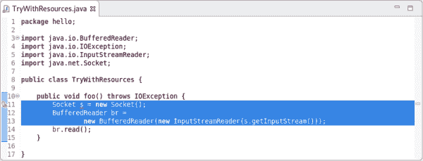](/sites/default/files/blog/2020/04/img_5ea54ba07119f.png)

Figure 28: Select lines to be surrounded by Try-with-resources.

然后，您可以右键单击并选择**用- >包围 Try-with-resources 块**，如图 29 所示。

[](/sites/default/files/blog/2020/04/img_5ea54bbbe84f9.png)

Figure 29: Applying Try-with-resources to a code block.

图 30 显示了结果。

[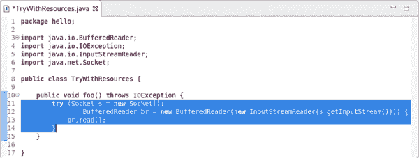](/sites/default/files/blog/2020/04/img_5ea54bd3bae1c.png)

Figure 30: Try-with-resources automatically added to code.

#### 快速修复模块信息 Javadoc

添加了快速修复来修复`module-info`文件中丢失和重复的`@provides`和`@uses` Javadoc 标签，如图 31 所示。

[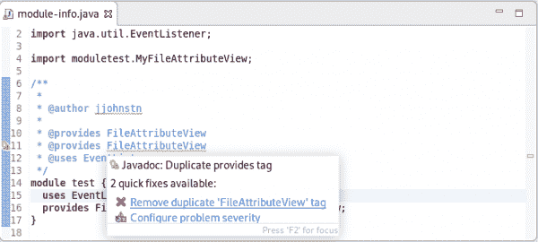](/sites/default/files/blog/2020/04/img_5ea54bf57445b.png)

Figure 31: Duplicate Javadoc @provides detected.

#### 导入完成后不再有虚假的分号

大约 18 年前，有报道称，如果已经存在分号，那么完成导入会添加一个不必要的分号(比如在更改现有导入时)。现在，不再插入这个多余的分号。

### Java 编译器

Java 编译器也有许多改进。

#### 当遗留代码可能污染空检查值时发出警告

当使用空注释进行高级空分析时，将您的代码与没有空注释并且没有受到这种分析的支持的遗留代码结合起来是一件非常棘手的事情。以前，Eclipse 只会在您从遗留 API 的中获得一个可疑的值*时警告您，但是在相反的情况下它会保持沉默:*将一个带注释类型的值*传递到遗留 API 中。***

尽管如此，在特定的情况下，这种行为会导致空检查代码中抛出一个`NullPointerException`,如图 32 所示。

[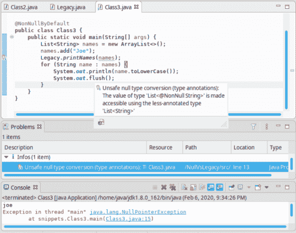](/sites/default/files/blog/2020/04/img_5ea54c0fb5b82.png)

Figure 32: Potential NullPointerException errors are detected.

控制台显示从您检查的 main 方法中抛出的异常(参见类级别`@NonNullByDefault`)。它还显示了新的警告，Eclipse 会提醒您这种危险。

**注意:**显示的代码假设列表`names`具有类型`List<@NonNull String>`，但是遗留方法`Legacy.printNames()`通过插入一个`null`元素成功地污染了这个列表。这个结果没有被注意到，因为该方法将列表视为具有类型`List<String>`，对类型参数没有空性约束。

默认情况下，这个问题在级别`info`出现，但是严重性可以在编译器设置中配置，如图 33 所示。

[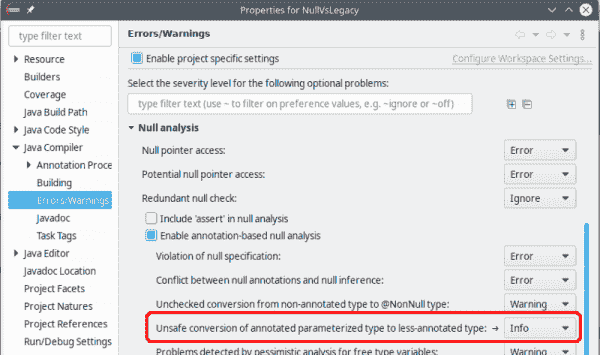](/sites/default/files/blog/2020/04/img_5ea54c3725df8.png)

Figure 33: You can force compile errors for potential NullPointerException errors.

#### 改进的资源泄漏分析

资源泄漏分析在几个方面得到了改进。最重要的是，分析现在一致地考虑使用方法调用获取的资源(=类型为`AutoCloseable`的值)，而以前在某些情况下，如果资源分配被包装在工厂方法中，则不会被注意到，如下例所示:

```
makePrintWriter("/tmp/log.txt").printf("%d", 42);
// a PrintWriter is never closed!
```

第二，资源泄漏分析现在利用关于支持流畅编程的众所周知的资源类的知识，即，返回`this`以启用方法调用链的实例方法。一个简单的分析可能会将方法结果视为一个进入范围的新资源，关于这些类的特殊知识会通知分析它是同一个资源。

此问题涉及以下系统类别:

*   **来自 java.io**

CharArrayWriter，控制台，PrintStream，PrintWriter，StringWriter，Writer

*   **来自 java.nio.channels**

AsynchronousFileChannel，asynchronous ServerSocketChannel，FileChannel，NetworkChannel，SeekableByteChannel，SelectableChannel，选择器，ServerSocketChannel

*   **来自 java.util**

格式程序

下面的例子现在被认为是安全的，因为分析认为由`append()`返回的资源与初始的`pw`相同:

```
PrintWriter pw = new PrintWriter("/tmp/log.txt");
pw.printf("%d", 42).append(" is the answer").close();
```

一般来说，对于几种特定的情况，资源泄漏分析变得更加精确。

#### Java 格式化程序应用程序需要工作空间

如果需要一个工作空间，但没有提供(使用`-data`命令行选项)，Java formatter 应用程序将提供一个合理的错误消息。这种行为也使得`-help`选项能够在没有指定工作空间的情况下在格式化程序上运行。

一个新的捆绑包服务于`org.eclipse.jdt.core.JavaCodeFormatter`应用。这个新包是 JDT 特性的一部分。没有使用 JDT 特性来定义他们的包集的用户需要将`org.eclipse.jdt.core.formatterapp`添加到他们的包集中。

#### 函数调试表达式

Lambda 表达式和方法引用现在在调试表达式中得到支持，比如在**表达式**视图和断点条件表达式中，如图 34 所示。

[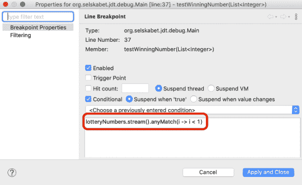](/sites/default/files/blog/2020/04/img_5ea54c717e1fb.png)

Figure 34: Using a Lambda function in the debug window.

### 新捆绑包 org . eclipse . JDT . core . formatterapp

`org.eclipse.jdt.core.JavaCodeFormatter`应用程序的入口点已经被移动到一个新的包`org.eclipse.jdt.core.formatterapp`中。

## 结论

如你所见，JBoss Tools 4.15.0 和 Red Hat code ready Studio 12.15 for Eclipse 4.15(2020-03)中有大量的添加和改进。每个人都应该有所收获。

*Last updated: June 29, 2020*