# Eclipse 2020-06 的 Red Hat code ready Studio 12 . 16 . 0 . ga 和 JBoss Tools 4.16.0.Final 中的新特性

> 原文：<https://developers.redhat.com/blog/2020/07/21/new-features-in-red-hat-codeready-studio-12-16-0-ga-and-jboss-tools-4-16-0-final-for-eclipse-2020-06>

用于 Eclipse 4.16 (2020-06)的 JBoss Tools 4.16.0 和[Red Hat code ready Studio 12.16](https://developers.redhat.com/products/codeready-studio/overview)现已发布。对于这个版本，我们专注于改进 [Quarkus](https://developers.redhat.com/products/quarkus/getting-started) 和基于容器的开发并修复错误。我们还更新了[Hibernate Tools](https://tools.jboss.org/features/hibernate.html)runtime provider 和 Java Developer Tools (JDT)扩展，它们现在与 [Java](https://developers.redhat.com/topics/enterprise-java) 14 兼容。此外，我们对用户界面(UI)中的平台视图、对话框和工具栏进行了许多更改。

本文概述了 JBoss Tools 4.16.0 和 Red Hat CodeReady Studio 12.16 for Eclipse 4.16(2020-06)中的新增功能。

## 装置

首先，让我们看看如何安装这些更新。CodeReady Studio(以前的 Red Hat Developer Studio)在安装程序中预装了所有东西。只需从 [Red Hat CodeReady Studio 产品页面](https://developers.redhat.com/products/codeready-studio/overview)下载安装程序，并按如下方式运行:

```
$ java -jar codereadystudio-<installername>.jar

```

安装 JBoss Tools 4 . 16 . 0——也就是“自带 Eclipse(BYOE)code ready Studio”——需要更多的努力。这个版本至少需要 Eclipse 4.16 (2020-06)，但是我们建议安装最新的 [Eclipse 4.16 2020-06 Java EE 捆绑包](http://www.eclipse.org/downloads/packages/release/2020-06/r/eclipse-ide-java-ee-developers)。安装最新的包可以确保您获得最新的 Java 依赖项。

一旦你安装了 Eclipse 4.16 (2020-06)或更高版本，你就可以打开 **Eclipse Marketplace** 标签，寻找 **JBoss Tools** 或 **Red Hat CodeReady Studio** 。或者，您可以[直接从我们的更新站点下载 JBoss Tools 4.16.0](http://download.jboss.org/jbosstools/photon/stable/updates/) 。

在接下来的几节中，我们将看看新的 Red Hat OpenShift 4.5 版本的更新以及对 Quarkus 和基于容器的开发的改进。我们还将了解 Hibernate 工具运行时提供程序的更新，以及面向 JDK 14 的 Java 开发人员工具包的更新。

## OpenShift

我们在此版本中添加了安全 URL 支持和对新的 [Red Hat OpenShift 容器平台 4.5](https://developers.redhat.com/products/openshift/getting-started) 的支持。

### 安全 URL 支持

现在可以在 OpenShift 的应用浏览器视图中创建安全的 URL。如果选择这个选项，创建的 URL 将可以通过`https`访问，如图 1 所示:

[](/sites/default/files/blog/2020/07/img_5f081ba53dc07.png)

Figure 1: Create a secured URL in OpenShift's Application Explorer view.

当 URL 显示在树中时，图标现在有一个安全锁指示器，如图 2 所示:

[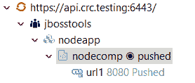](/sites/default/files/blog/2020/07/img_5f081bcc5595c.png)

Figure 2: The secure lock indicator in the URL tree.

### OpenShift 容器平台 4.5

red Hat open shift Container Platform(OCP)4.5 现已推出，JBoss Tools 与这个主要版本透明兼容。只需像定义 OCP 3 集群一样定义到基于 OCP 4.4 的集群的连接，并使用工具！

## 服务器工具

我们对这个版本的服务器工具进行了一次更新，为 WildFly 20 添加了一个服务器适配器。新的服务器适配器增加了对 Java EE 8、Jakarta EE 8 和 MicroProfile 3.3 的支持。

## 休眠工具

我们对可用的 Hibernate 工具运行时提供程序进行了以下添加和更新:

*   Hibernate 5.4 运行时提供程序现在合并了 Hibernate 核心版本 5.4.17.Final 和 Hibernate 工具版本 5.4.17.Final。
*   Hibernate 5.3 运行时提供程序现在合并了 Hibernate 核心版本 5.3.17.Final 和 Hibernate 工具版本 5.3.17.Final。

## 平台

我们对 UI 中的平台视图、对话框和工具栏做了许多更改，我将在接下来的部分中讨论。

### 视图、对话框和工具栏

现在，您可以使用新建文件向导直接创建丢失的文件夹，而无需事先显式创建文件夹。图 3 中的屏幕截图显示了新建文件向导:

[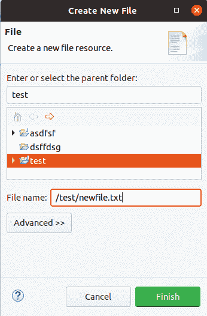](/sites/default/files/blog/2020/07/img_5f081cbf35b98.png)

Figure 3: Use the New File wizard to create missing folders.

### 文本编辑器

Linux 和 Mac OS 已经支持这个特性，现在我们在 Eclipse 中增加了对 Windows 字体连字的支持。使用以下首选项为文本编辑器指定所需的连字字体:

**通用>外观>颜色和字体>基本>文字字体**

图 4 显示了在 Windows 10 上的 Java 编辑器中呈现的连字的屏幕截图:

[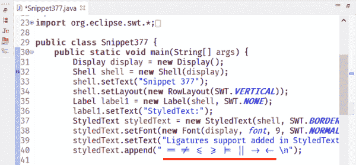](/sites/default/files/blog/2020/07/img_5f081cf3b2b48.png)

Figure 4: Ligatures rendered in the Java editor on Windows 10.

### 主题和风格

Eclipse 黑暗主题现在使用 Windows 原生的黑暗滚动条。我们还淘汰了编辑器区域的软件解决方案。图 5 显示了一个带有新的深色滚动条的打开项目:

[](/sites/default/files/blog/2020/07/img_5f081d1d5586a.png)

Figure 5: An open project with the new dark scrollbar.

#### Eclipse Windows 工具栏样式与 Windows 10 保持一致

我们更新了默认的 Eclipse light 主题，以便更好地与 Windows 10 的默认主题保持一致。图 6 显示了旧的灯光主题:

[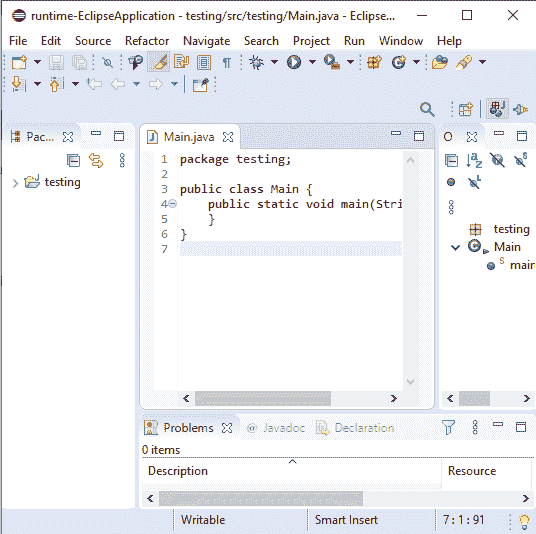](/sites/default/files/blog/2020/07/img_5f081d413022b.png)

Figure 6: The old light theme.

图 7 显示了新的灯光主题:

[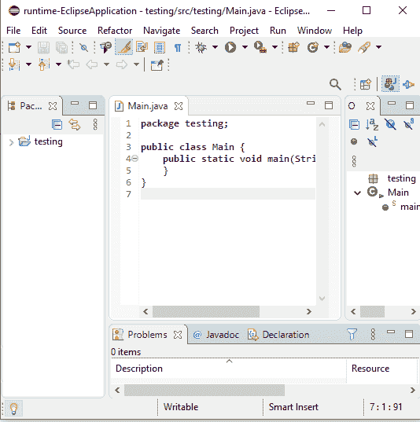](/sites/default/files/blog/2020/07/img_5f081d5aa3a5d.png)

Figure 7: The new light theme.

#### 视图的方形选项卡

默认情况下，Eclipse IDE 现在对视图使用方形选项卡，如图 8 所示:

[](/sites/default/files/blog/2020/07/img_5f081d8782b8b.png)

Figure 8: The Eclipse IDE now uses square tabs for views.

我们还为想要切换回使用圆形选项卡的用户添加了一个首选项，如图 9 所示:

[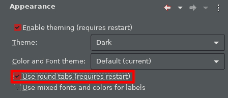](/sites/default/files/blog/2020/07/img_5f081d9f98b97.png)

Figure 9\. Users can select the preference for round tabs.

#### 深色主题中一致的工具栏颜色

深色主题中的工具栏样式与这些更新一致，如图 10 所示:

[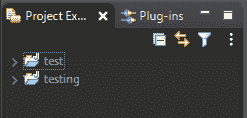](/sites/default/files/blog/2020/07/img_5f081dc03f106.png)

Figure 10: Square tabs in the Eclipse dark theme.

### 偏好；喜好；优先；参数选择

我们对平台首选项进行了大量更改和添加。

#### 根据当前 JRE 验证安装操作

默认情况下，**验证供应操作与当前运行的 JRE** 兼容选项可从安装/更新首选项页面获得。此选项允许在安装、更新或卸载运行 IDE 所需的内容时进行额外的检查。它使用标准对话框来报告错误。如果任何新安装的单元需要与当前正在使用的不同的 Java 运行时，操作将失败，并显示一条有用的消息。图 11 显示了带有新选项的安装/更新首选项页面:

[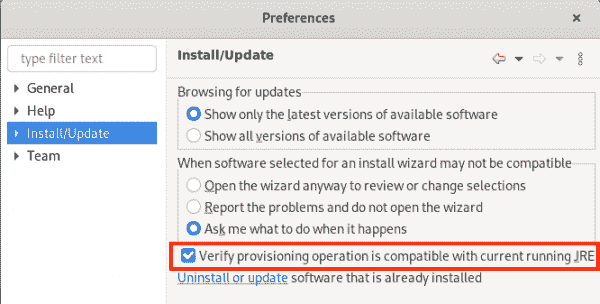](/sites/default/files/blog/2020/07/img_5f081df230ed8.png)

Figure 11: The Install/Update preferences page with the option to verify compatible provisioning.

图 12 显示了在运行带有旧 Java 版本的 Eclipse IDE 时，试图安装一个需要 Java 14 的单元后的错误消息:

[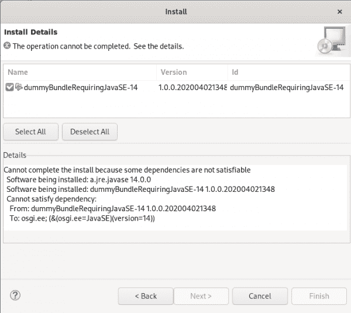](/sites/default/files/blog/2020/07/img_5f081e0cf2d7c.png)

Figure 12: The error message lists the incompatible dependencies.

#### 内联重命名资源

在 4.15 版本中，我们添加了内联重命名资源或使用对话框重命名资源的选项。到目前为止，它一直是一个单选按钮，但是我们把它改成了复选框，如图 13 所示:

[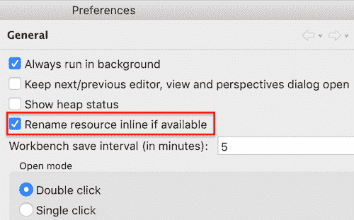](/sites/default/files/blog/2020/07/img_5f081e34b977a.png)

Figure 13: The 'Rename resources inline' option is now a checkbox.

### 排除故障

我们在导入断点向导中添加了**全选**和**取消全选**按钮用于调试。现在，在导入断点时，您可以使用这些按钮来选择或取消选择所有断点标记，如图 14 所示:

[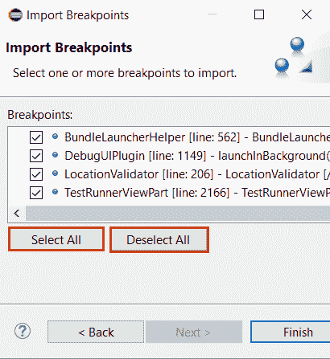](/sites/default/files/blog/2020/07/img_5f081e60f1527.png)

Figure 14: Select All and Deselect All enable faster decisions when importing breakpoints.

### 常规更新

两个通用更新值得分享。

#### 调用命令时显示键绑定

对于演示、截屏和学习目的，在调用命令时显示相应的键绑定非常有帮助。我们在几个版本之前添加了这个特性，如图 15 所示:

[](/sites/default/files/blog/2020/07/img_5f081e96541d7.png)

Figure 15: Hover over a command to see the corresponding key binding.

在 4.16 版本中，现在可以为键盘交互和鼠标点击单独或一起启用该功能。您可以仅针对鼠标点击、仅针对键盘交互或两者启用该功能。只在鼠标点击时显示按键绑定对于想要学习现有按键绑定的用户很有帮助。

通过**通用>按键**首选项页面上的首选项对话框启用**命令被调用时显示按键绑定**功能。使用命令**切换显示键绑定**来快速更改该设置。图 16 显示了 Find Actions 对话框下的这个选项:

[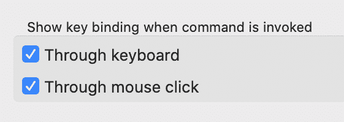](/sites/default/files/blog/2020/07/img_5f081eb37b1cc.png)

Figure 16: Key binding options under the Find Actions dialog.

#### Ant 1.10.8

Eclipse 采用了 Ant 版本 1.10.8。

## Java 开发工具(JDT)

最重要的 Java 开发工具更新是对 Java 14 的支持。Eclipse JDT 现在支持 Eclipse 4.16 版本的 Java 14。该版本特别包括以下 Java 14 特性:

*   JEP 361:开关表达式(标准)
*   JEP 359:记录(预览)
*   JEP 368:文本块(第二次预览)
*   JEP 305:`Instanceof`的模式匹配(预览)

**注意**:预览语言功能的预览选项应该打开。有关该支持的非正式介绍，请参考 [Java 14 示例 wiki](https://wiki.eclipse.org/Java14/Examples) 。

### 如何将 JDK 合规性设置为 14

如图 17 所示，您可以使用**首选项> Java >编译器**将您的 JDK 编译器兼容性设置为 14，然后启用预览功能:

[](/sites/default/files/blog/2020/07/img_5f081ef319772.png)

Figure 17: Set your JDK compiler compliance to 14 and enable the preview features.

#### 记录

您可以通过两种方式之一创建新记录:使用模板或使用记录创建向导。

#### 使用模板创建新记录

您可以使用`new_record`模板在一个空的`.java`文件中创建一个记录，如图 18 所示:

[](/sites/default/files/blog/2020/07/img_5f081f0c6a548.png)

Figure 18: Use the new_record template to create a record in an empty .java file.

#### 使用记录创建向导

或者，您可以使用记录创建向导:

*   右键点击**项目>新建>记录**。
*   右键点击**项目>新建>其他，搜索记录**。
*   右键点击**项目>新建>其他> Java >记录**。

记录创建向导出现，如图 19 所示:

[](/sites/default/files/blog/2020/07/img_5f081f2568ca2.png)

Figure 19: The Record Creation wizard.

**注意**:在旧的工作区中，**记录**条目可能不会直接出现在 Java 透视图中的**新**菜单下。您可以通过使用一个新的工作区或者为您现有的工作区启动带有选项`-clearPersistedState`的 Eclipse 来解决这个问题。

### 如何启用 JDK 14 预览版功能

您可以通过右键单击项目并选择**Configure>Enable preview features**来快速启用适用 Java 项目的 JDK 14 预览功能，如图 20 所示:

[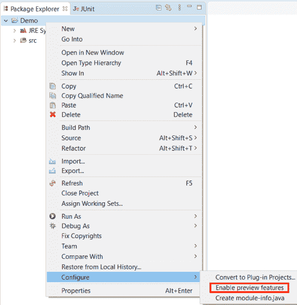](/sites/default/files/blog/2020/07/img_5f081f3eb3406.png)

Figure 20: Enable the JDK 14 preview features for a Java project.

如图 21 所示，您还可以使用打开的**项目属性**对话框，针对预览功能的编译问题，将默认严重级别更改为“警告”:

[](/sites/default/files/blog/2020/07/img_5f081f5c298eb.png)

Figure 21: Change the default severity level to 'Warning' for potential compilation issues.

### Java 编辑器的更新

我们对 Java 编辑器做了一些更新，其中一些是为了适应新的预览功能。

#### 非阻塞 Java 代码完成

默认情况下，Java 编辑器中的代码补全现在被配置为在单独的非 UI 线程中计算(如果可能的话)。这种配置可以防止 UI 在长时间计算的情况下冻结。

如果您想恢复遗留行为，路径是**首选项> Java >编辑器>内容辅助>高级**，在这里您可以取消选中**启用非阻塞完成**复选框。积分器可以改变`org.eclipse.jdt.ui.content_assist_noUIThread_computation`到`false`的值。图 22 显示了启用(或禁用)非阻塞完成的选项:

[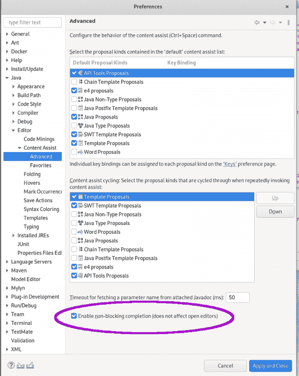](/sites/default/files/blog/2020/07/img_5f081f7eea4b7.png)

Figure 22: Enable (or disable) nonblocking completion.

#### 合并控制工作流

如果可能的话，新的清理会合并具有相同块的`if/else if/else`的条件。一个`else`块可能不同，因此不会被合并。一个条件可能是相反的，以允许合并。条件与`||`合并，以保持控制工作流的一致性。添加括号可以避免优先级问题。我们保留了大部分的括号、格式和注释。

要选择清理，调用**源>清理**并使用自定义配置文件。在**配置**对话框中选择**多余代码**标签。选择**合并具有相同块的 if/else if/else 条件**。图 23 显示了不必要代码的合并选项:

[](/sites/default/files/blog/2020/07/img_5f081fa1cfe5e.png)

Figure 23: The merge option for unnecessary code.

例如，对于图 24 所示的代码:

[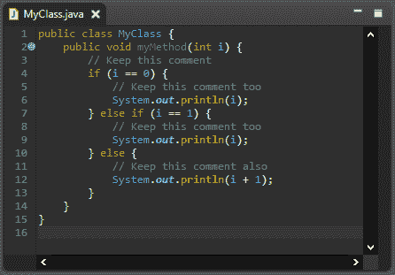](/sites/default/files/blog/2020/07/img_5f081fb8b6841.png)

Figure 24: The MyClass.java class before cleanup.

清理之后，您将得到如图 25 所示的结果:

[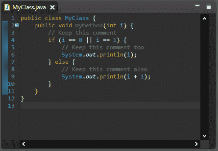](/sites/default/files/blog/2020/07/img_5f081fd1abb74.png)

Figure 25: The MyClass.java class after cleanup.

#### 局部变量类型推理

另一种新的清理方法是尽可能对局部变量使用`var`关键字。请注意，只有 Java 10 和更高版本才支持这种清理。

当变量初始化知道显式变量类型时，清理用`var`替换该类型。它还用参数化类型替换了实例创建中的菱形运算符。最后，清理会在初始化数字文字上添加一个后缀来匹配变量类型。在任何情况下，变量类型都保持不变。

要选择清理，调用**源>清理**并使用自定义配置文件。在**配置**对话框中，打开**代码样式**选项卡，然后选择**使用局部变量类型推理**，如图 26 所示:

[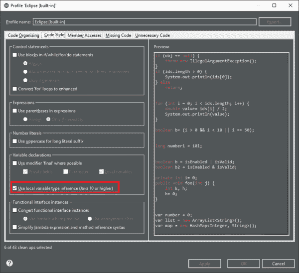](/sites/default/files/blog/2020/07/img_5f081ff080a0f.png)

Figure 26: Use local variable type inference in Java 10 or higher.

例如，对于图 27 中的代码:

[](/sites/default/files/blog/2020/07/img_5f08200c68ec2.png)

Figure 27: MyClass.java before cleanup.

清理之后，您将得到如图 28 所示的结果:

[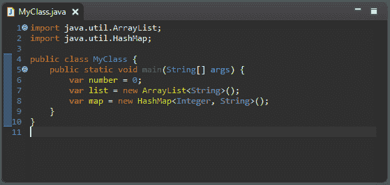](/sites/default/files/blog/2020/07/img_5f082032341e2.png)

Figure 28: MyClass.java after cleanup.

#### 偏好惰性逻辑运算符

另一种新的清理方法是尽可能用惰性操作符替换急切的逻辑操作符。清理分别用`||`和`&&`替换`|`和`&`。只有当操作数(如赋值、递增、递减、对象创建或方法调用)不会产生副作用时，它才会这样做。如果一个操作数可能导致副作用，清理将保留急切的操作符。它还保持二元运算不变。

要选择清理，调用**源>清理**并使用自定义配置文件。在**配置**对话框中，打开**代码样式**选项卡，然后选择**使用惰性逻辑运算符**，如图 29 所示:

[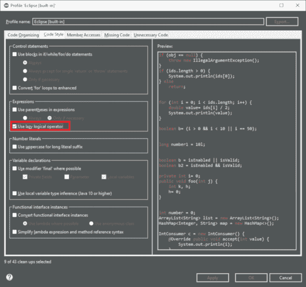](/sites/default/files/blog/2020/07/img_5f083d49eb262.png)

对于图 30 中的代码:

[](/sites/default/files/blog/2020/07/img_5f083d600584e.png)

Figure 30: MyClass.java before cleanup.

清理之后，您将得到如图 31 所示的结果:

[](/sites/default/files/blog/2020/07/img_5f083d768fd4d.png)

Figure 31: MyClass.java after cleanup.

#### 快速切换表达式

我们添加了一个快速修复，将一个`switch`表达式的`return`语句转换成一个`yield`语句，如图 32 所示:

[](/sites/default/files/blog/2020/07/img_5f083d949426d.png)

Figure 32: Convert a switch expression's 'return' statement to a 'yield' statement.

### Java 格式化程序

Java 格式化程序有支持记录声明的新设置。这些设置类似于与其他类型声明相关的现有设置。要查看它们，使用 Filter 字段并输入关键字`record`，如图 33 所示:

[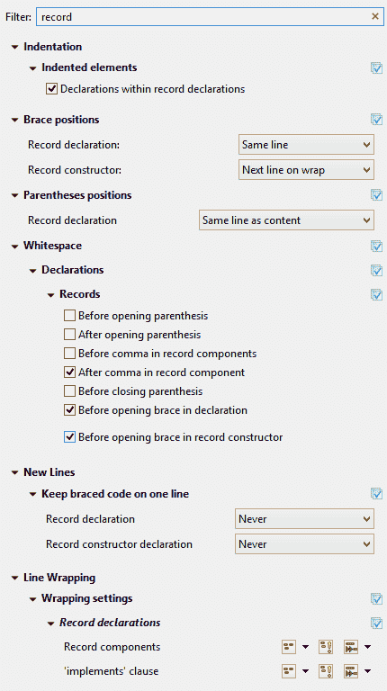](/sites/default/files/blog/2020/07/img_5f083dae5a648.png)

Figure 33: How to access the Java formatter's new settings for record declarations.

### 排除故障

JDT 调试器现在能够检查 Java 编译器生成的合成变量。例如，假设我们需要调试方法`java.util.stream.ReferencePipeline.filter(Predicate<? super P_OUT>)`并检查谓词变量。图 34 显示了调试前的方法:

[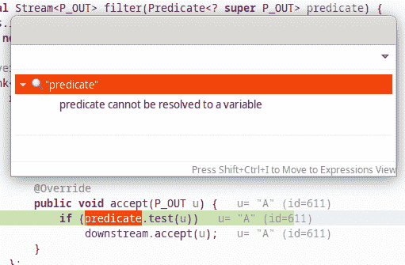](/sites/default/files/blog/2020/07/img_5f083dca71e21.png)

Figure 34: The JDT debugger flags a synthetic variable.

图 35 显示了调试后的方法:

[](/sites/default/files/blog/2020/07/img_5f083de132228.png)

Figure 35: The corrected variable.

### 偏好；喜好；优先；参数选择

我们已经从 JDT 的内容辅助首选项选项中删除了**显示子串匹配**选项。该功能现在已启用，默认情况下始终处于打开状态。使用 VM 属性将其禁用:

```
-Djdt.codeCompleteSubstringMatch=false

```

## 结论

正如你所看到的，我们在 JBoss Tools 4.16.0 和 Red Hat code ready Studio 12.16 for Eclipse 4.16(2020-06)中进行了广泛的添加和改进。这次更新包含了一点给每个人的东西。你可以在[这个页面](https://tools.jboss.org/documentation/whatsnew/jbosstools/4.16.0.Final.html)找到更多值得关注的更新。

*Last updated: July 30, 2020*