# Eclipse 2020-09 的 Red Hat CodeReady Studio 12.17 GA 和 JBoss Tools 4.17.0 Final 中的新特性

> 原文：<https://developers.redhat.com/blog/2020/11/02/new-features-in-red-hat-codeready-studio-12-17-ga-and-jboss-tools-4-17-0-final-for-eclipse-2020-09>

用于 Eclipse 4.17 (2020-09)的 JBoss Tools 4.17.0 和[Red Hat code ready Studio 12.17](https://developers.redhat.com/products/codeready-studio/overview)现已发布。对于这个版本，我们专注于改进 [Quarkus](https://developers.redhat.com/products/quarkus/getting-started) 和[基于容器的开发](https://developers.redhat.com/topics/containers)并修复错误。我们还更新了[Hibernate Tools](https://tools.jboss.org/features/hibernate.html)runtime provider 和 Java Developer Tools (JDT)扩展，它们现在与 [Java](https://developers.redhat.com/topics/enterprise-java) 15 兼容。此外，我们对用户界面(UI)中的平台视图、对话框和工具栏进行了许多更改。

请继续阅读 JBoss Tools 4.17.0 和 CodeReady Studio 12.17 for Eclipse 4.17(2020-09)中的新增内容概述。

## 装置

首先，让我们看看如何安装这些更新。CodeReady Studio(以前的 Red Hat Developer Studio)在安装程序中预装了所有东西。从 [Red Hat CodeReady Studio 产品页面](https://developers.redhat.com/products/codeready-studio/overview)下载安装程序，并按如下方式运行:

```
$ java -jar codereadystudio-<installername>.jar

```

安装 JBoss Tools 4.17.0— *又名*“自带 Eclipse(BYOE)code ready Studio”—需要更多的努力。这个版本至少需要 Eclipse 4.17 (2020-09)，但是我们建议安装最新的 [Eclipse 4.17 2020-09 Java EE 捆绑包](http://www.eclipse.org/downloads/packages/release/2020-09/r/eclipse-ide-java-ee-developers)。安装最新的包可以确保您获得最新的 Java 依赖项。

一旦你安装了 Eclipse 4.17 (2020-09)或更高版本，你就可以打开 **Eclipse Marketplace** 标签，寻找 **JBoss Tools** 或 **Red Hat CodeReady Studio** 。或者，您可以[直接从我们的更新站点下载 JBoss Tools 4.17.0](http://download.jboss.org/jbosstools/photon/stable/updates/) 。

在接下来的章节中，我们将关注新的 Red Hat OpenShift 4.6 版本的更新以及对 Quarkus 和基于容器的开发的改进。我们还将了解针对 JDK 15 版的 Hibernate 工具运行时提供程序和 Java 开发人员工具包的更新。

## JBoss Tools 支持 Red Hat OpenShift 4.6

JBoss Tools 与新的 [Red Hat OpenShift](https://developers.redhat.com/products/openshift/overview) 4.6 版本透明兼容。只需定义到基于 OpenShift 4.6 的集群的连接，就像之前对 OpenShift 3 集群所做的那样。然后，您将能够使用新的工具。

## quartus 中的 yaml 文件配置

Quarkus 现在支持 YAML 配置文件。如果您想使用 YAML 文件来配置您的 Quarkus 应用程序，请执行以下操作:

1.  使用新建 Quarkus 向导创建一个 Quarkus 项目。
2.  在`src/main/resources`中的`application.properties`旁边新建一个`application.yaml`或`application.yml`。

编辑器将打开内容辅助和 YAML 格式的语法验证。

更多信息参见 [Quarkus 文档](https://quarkus.io/guides/config#yaml)。

## WildFly 21 的新服务器适配器

我们添加了一个服务器适配器来处理 wild fly 21 T1。新的服务器适配器支持 Java EE 8、Jakarta EE 8 和 [Microprofile 3.3](https://projects.eclipse.org/projects/technology.microprofile/releases/microprofile-3.3) 。

## Hibernate 运行时提供程序更新

我们更新了 Hibernate 运行时提供程序，如下所示:

*   Hibernate 5.4 运行时提供程序现在合并了 Hibernate 核心版本 5.4.21 最终版和 Hibernate 工具版本 5.4.21 最终版。
*   Hibernate 5.3 运行时提供程序现在合并了 Hibernate 核心版本 5.3.18 最终版和 Hibernate 工具版本 5.3.18 最终版。

## 视图、对话框和工具栏

我们已经做了一些更新来改进用户界面中的视图、对话框和工具栏。我将在下一节中详细介绍这些内容。

### 可调视图字体

您可以使用新的**树和表格视图字体**首选项来自定义用于树和表格视图的字体。要找到新的偏好设置，导航到**窗口>偏好设置>常规>外观>颜色和字体**，打开**视图和编辑器文件夹**类别。图 1 显示了选择字体首选项的对话框。

[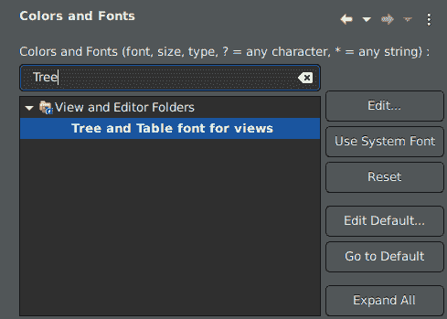](/sites/default/files/blog/2020/10/img_5f7deb651e944.png)

Figure 1: Set a font preference for trees and tables.

图 2 显示了设置了字体首选项的项目浏览器。

[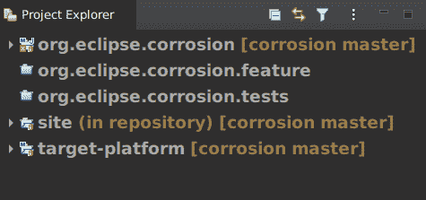](/sites/default/files/blog/2020/10/img_5f7deb900791a.png)

Figure 2: Custom font preferences in the Project Explorer.

### 从视图中删除 gif

几年前，我们将平台视图的图标迁移到 PNG 文件。已经打开的视图存储它们对图像的引用，所以我们将 GIF 文件留在代码中。我们现在已经删除了这些文件。如果您多年来一直使用同一个工作区，您可能会发现自己缺少视图图标。关闭并重新打开视图以刷新图标。

### 没有退出确认对话框

默认情况下，如果您选择最后一个窗口上的关闭图标，Eclipse 现在会自动关闭。没有额外的确认对话框。如果你想得到一个确认对话框，你可以通过**窗口>首选项>常规>启动和关闭>确认退出当关闭最后一个窗口**时。

### 2014 年之前创建的工作台模型没有新的转换

我们对 workbench 模型(`workbench.xmi`)进行了更改，这些模型存储在 2014 年之前版本创建的工作区中。如果您从未使用更高版本打开工作台模型，那么当您使用 2020-09 版本打开它时，它将不会被自动转换。

## 文本编辑器

此版本在文本编辑器首选项中包括了几个新选项。

### 改进的“上次编辑”导航

我们已经用**先前编辑位置**替换了**最后编辑位置**导航选项，它记住了 15 个先前编辑位置。我们还合并了彼此靠近的相似编辑位置，这样 15 个记忆位置中的每一个都保持不同。图 3 显示了新的**上一个编辑位置**和**下一个编辑位置**选项高亮显示的导航。

[](/sites/default/files/blog/2020/10/img_5f7debdecefff.png)

Figure 3: The new Previous Edit Location and Next Edit Location navigation options.

我们还添加了两个新的键盘快捷键来帮助您导航到上一个和下一个编辑位置。

#### 上一次编辑位置

输入 **Ctrl+Alt+LEFT_ARROW** (或者，在 Mac 上， **Ctrl+Opt+LEFT_ARROW** )导航到最近的编辑位置。这种新的导航工作方式与之前版本中的 **Ctrl+Q** 相同。然而，现在你可以通过按住 **Ctrl+Alt** 并按下**左箭头**来遍历先前编辑位置的历史。每按一次**左箭头**，就在编辑历史中向后移动一步。当您停止遍历时，未来的 **Ctrl+Alt+LEFT_ARROW** 动作会暂时锚定到这个历史位置，以便于浏览该代码区域。

我们增强了经典的 **Ctrl+Q** 映射，也增强了这个新功能，因此 **Ctrl+Q** 和 **Ctrl+Alt+LEFT_ARROW** 是同义词。

#### 下一个编辑位置

**Ctrl+Alt+RIGHT_ARROW** (或者，在 Mac 上， **Ctrl+Opt+RIGHT_ARROW** )导航在您的编辑历史中向前移动锚点。就像你用**左箭头**按钮向后移动一样，你可以按住 **Ctrl+Alt** 并按下**右箭头**按钮向前移动。我们还为这个向前导航添加了一个新的菜单项。

**注意**:新的编辑位置总是被插入到文件的末尾，所以原始的历史顺序保持不变。新编辑还会将最后一个位置锚点重置为最近的编辑。因此，按下 **Ctrl+Alt+LEFT_ARROW** 总是会把你带到最近的编辑，而不是历史编辑。

### 打印页眉上的日期和时间戳

如图 4 所示，编辑器现在在每个打印页面的标题中包含当前日期和时间戳以及文件名。

[](/sites/default/files/blog/2020/10/img_5f7dec13b62de.png)

Figure 4: A date has been added to the file header for printed pages.

## 主题和风格

在新的 JBoss Tools 4.17 和 Red Hat CodeReady Studio 12.17 版本中，我们做了一些更新来改进主题和样式。

### GTK 之光主题已经更新

我们更新了 GTK (Gnome)工具包的灯光主题，以符合默认的 [GTK 3 广告主题](https://blog.gtk.org/2019/01/14/theme-changes-in-gtk-3/)。图 5 显示了旧的主题。

[](/sites/default/files/blog/2020/10/img_5f7dec386c79f.png)

Figure 5: The old GTK light theme.

图 6 显示了新的 GTK 3 广告主题。

[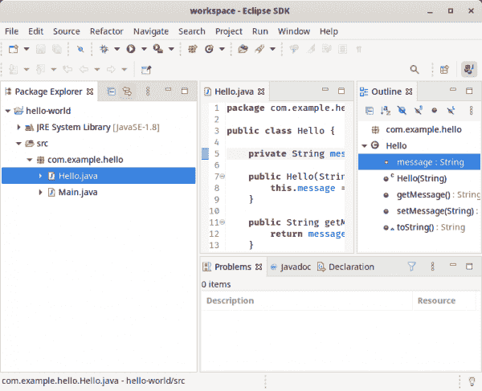](/sites/default/files/blog/2020/10/img_5f7dec52d1f08.png)

Figure 6: The new GTK 3 Adwaita light theme.

### Windows 下 SWT 的新默认样式

我们已经将黑暗主题设置为 Windows 下 Eclipse 的标准小部件工具包(SWT)的默认主题。这一变化影响菜单和下拉框，并带来了新的选择荧光笔。

#### 菜单和下拉框

深色主题是 Windows 下 SWT 菜单的新风格。图 7 显示了新样式的窗口菜单。

[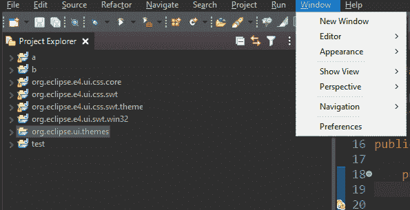](/sites/default/files/blog/2020/10/img_5f7dec741bfdd.png)

Figure 7: The Project Explorer with the new dark theme.

图 8 显示了搜索菜单。

[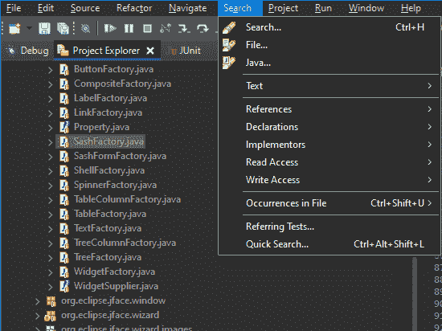](/sites/default/files/blog/2020/10/img_5f7dec8802ef8.png)

Figure 8: The Search menu with the new dark theme.

SWT 下拉框也默认为深色主题，如图 9 所示。

[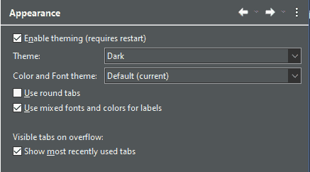](/sites/default/files/blog/2020/10/img_5f7decbd94bc7.png)

Figure 9: The dark theme is selected as the default.

#### 新款精选荧光笔

如图 10 所示，当使用深色主题时，活动选项卡选择高亮显示使识别哪个选项卡是活动的变得容易。

[](/sites/default/files/blog/2020/10/img_5f7dece148e21.png)

Figure 10: Active tab selection in the dark theme.

SWT 本身也支持表格的选择荧光笔，如图 11 所示。

[](/sites/default/files/blog/2020/10/img_5f7ded0b62b59.png)

Figure 11: Tables are also highlighted.

## 排除故障

我们对这个版本的常规调试功能进行了一次更新。

### 从控制台输出中过滤空字节

我们扩展了 ASCII 控制字符的解释，以便您现在可以在控制台视图中过滤空字节。视图将字符`\0`识别为空字节。如果启用了解释，任何空字节都将被去除，不会显示在控制台中。这与 Linux 最为相关，在 Linux 中，控制台视图中的空字节会阻止同一行中其后的任何内容被呈现。默认情况下，此功能被禁用；您可以在**运行/调试>控制台**首选项页面上启用它。

**注意**:Linux aarch 64(arm 64)的二进制文件现在可以测试了。随着这种架构越来越受欢迎，人们甚至可以在更换机器时继续使用 Eclipse IDE。

## Java 开发工具(JDT)

这个版本更新了 Java 15 的 Java 开发工具套件，增加了两个新特性来改进 JUnit 视图，并为 Java 编辑器带来了新的优化特性。

### Java 15

Eclipse JDT 现在通过 Eclipse Marketplace 支持 Eclipse 4.17 的 Java 15。我们添加了这些显著的 Java 15 特性:

*   JEP 378:文本块(标准)
*   JEP 384:记录(第二次预览)
*   JEP 375:`Instanceof`的模式匹配(第二次预览)
*   JEP 360:密封类(预览)

请注意，如果您想访问预览语言功能，应打开**预览**选项。关于 Java 15 新特性的非正式介绍，请参见 [Java 15 示例 wiki](https://wiki.eclipse.org/Java15/Examples) 。

### JUnit 视图中的更新

我们添加了两个新特性来改善开发人员在 JDT 中使用 JUnit 的体验。

#### 折叠所有节点

一个新的上下文菜单选项允许您折叠 JUnit 视图中的所有节点，如图 12 所示。

[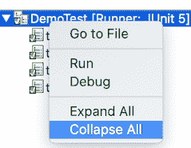](/sites/default/files/blog/2020/10/img_5f7ded6f6c753.png)

Figure 12: The new Collapse All option.

#### 按执行时间对测试结果进行排序

默认情况下，测试结果是按执行顺序排序的，但是您现在可以选择按执行时间排序结果。在所有测试完成后，从 **JUnit 视图**菜单中选择**按>执行时间**排序对结果进行重新排序。当测试仍在运行时，它们将按照执行顺序显示，如图 13 所示。

[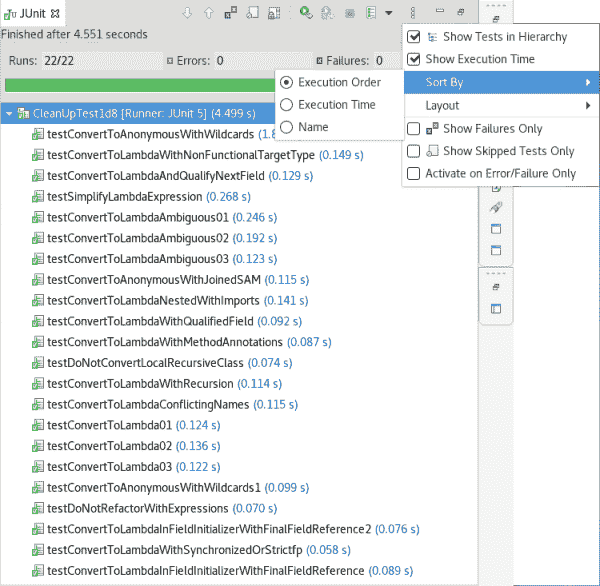](/sites/default/files/blog/2020/10/img_5f7ded917bdb3.png)

Figure 13: JUnit tests shown in order of execution.

图 14 显示了按执行时间排序后的视图。

[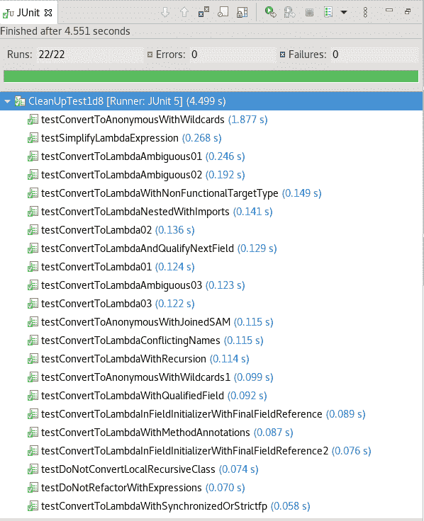](/sites/default/files/blog/2020/10/img_5f7dedad7c658.png)

Figure 14: Tests sorted by execution time.

### Java 编辑器的改进

我们为 JDT 的 Java 编辑器添加了许多特性和小的改进。

#### 类型的子字符串/子词匹配

内容辅助特性现在完全支持类型的子串和子词匹配，如图 15 所示。

[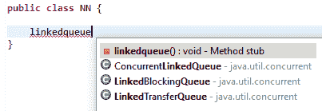](/sites/default/files/blog/2020/10/img_5f7dedd807617.png)

Figure 15: Content Assist supports substring and subword matches.

始终显示子字符串匹配。您可以使用 **Java >编辑器>内容辅助**首选项页面上现有的**显示子词匹配**选项来启用或禁用子词匹配。

#### 优化选项卡

惰性操作符清理和 regex 预编译器清理现在在同一个选项卡下，如图 16 所示。这两种清理都优化了时间性能。

[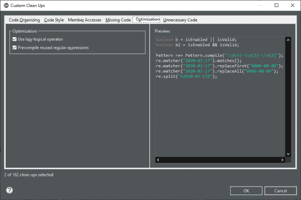](/sites/default/files/blog/2020/10/img_5f7dee8eba48d.png)

Figure 16: Two cleanups are available and selected under the Optimization tab.

选择**预编译重用的正则表达式**选项会用`java.util.regex.Pattern`替换`java.lang.String`的某些用法。为了确保这种清理只发生在用作正则表达式的字符串上，必须在执行清理之前显式地使用正则表达式几次。否则，什么都不会发生。

图 17 显示了运行**预编译重用正则表达式**清理之前的代码片段。

[](/sites/default/files/blog/2020/10/img_5f7deea575c78.png)

Figure 17: A Java class before cleanup.

清理之后，代码看起来如图 18 所示。

[](/sites/default/files/blog/2020/10/img_5f7deec1e7027.png)

Figure 18: The same Java class after cleanup.

要选择此清理，请导航到**源>清理**并使用自定义配置文件。打开**配置**对话框，在**优化**选项卡上选择**预编译重用正则表达式**。

#### Objects.equals()

另一个新的清理使用`Objects.equals()`来实现`equals(Object)`方法。这种清理减少了代码，使代码更容易阅读。它仅适用于 Java 7 或更高版本。虽然这种比较几乎只出现在`equals(Object)`方法中，但是它也可以减少其他方法中的代码。

要选择清理，导航到**源>清理**并选择自定义配置文件。在**配置**对话框中，选择**多余代码**选项卡上的中的**使用 Objects.equals()。图 19 显示了带有预览的 **Use Objects.equals()** 清理选项。**

[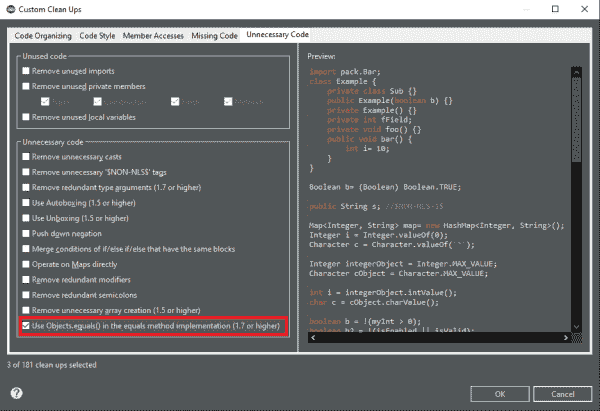](/sites/default/files/blog/2020/10/img_5f7dee2e874dd.png)

图 20 显示了清理前的`MyClass.java`。

[](/sites/default/files/blog/2020/10/img_5f7dee4b0f07c.png)

Figure 20: The sample Java class before cleanup.

清理之后，您将得到如图 21 所示的代码:

[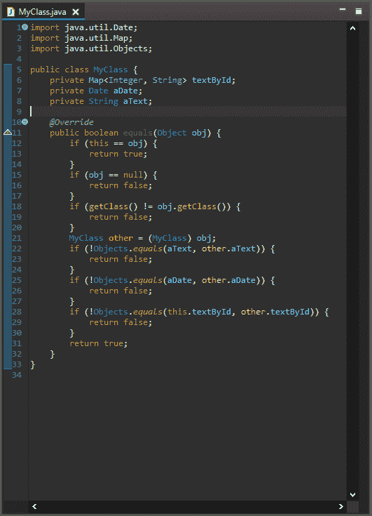](/sites/default/files/blog/2020/10/img_5f7dee69e2e53.png)

Figure 21: The cleaned-up Java class.

#### 字符串.格式快速修复

一个新的 quickfix 用`String.format`替换了字符串连接，类似于现有的`StringBuilder`和`MessageFormat`的连接，如图 22 所示。

[](/sites/default/files/blog/2020/10/img_5f7deee1270e0.png)

#### 方法引用的快速修复(包括使用注意事项)

在这个版本中，我们添加了一个 quickfix 来为方法引用创建缺失的方法。

图 23 显示了在代码片段中添加缺失方法的选项。

[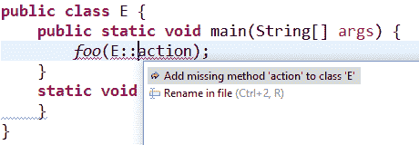](/sites/default/files/blog/2020/10/img_5f7def70cd9cd.png)

Figure 23: Add the missing method 'action' to class 'E'.

这是一项新功能，正在开发中。它带有几个警告:

*   它仅在当前课程中可用。
*   期待它在简单的用例上工作。
*   调用嵌套泛型或类型参数的方法引用可能很难解决。

### JDT 的新编辑器首选项

我们分别为 Java 视图和对话框以及 Java 格式化程序添加了两个新的参数设置。

#### 切换代码挖掘

现在，您可以启用或禁用在编辑器中切换代码挖掘的功能。如图 24 所示，可以在**查找动作**菜单下设置 toggle(**Ctrl+3**)。

[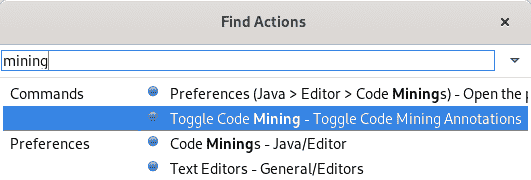](/sites/default/files/blog/2020/10/img_5f7def96ab782.png)

Figure 24: The new toggle option under Find Actions.

#### 断言语句换行

Java 格式化程序配置文件中的一个新设置控制断言语句的换行。现在，您可以在断言条件及其错误消息之间添加换行。在**换行>换行设置>语句>‘断言’消息**节点的**配置文件编辑器(首选项> Java >代码样式>格式化程序>编辑**)中可以找到该设置。图 25 显示了新的设置。

[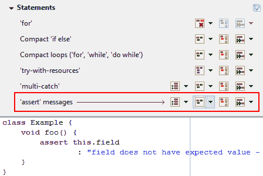](/sites/default/files/blog/2020/10/img_5f7defc393b87.png)

Figure 25: Add a line wrap between an assert condition and its error message.

### JDT 调试器中的新特性

我们在 JDT 调试器中添加了几个新的调试特性。

#### 评估匿名类实例

JDT 调试器现在可以评估带有匿名类实例的表达式，如图 26 所示。

[](/sites/default/files/blog/2020/10/img_5f7defe54393e.png)

Figure 26: Evaluate an expression with an anonymous class instance.

图 27 显示了评估后的表达式。

[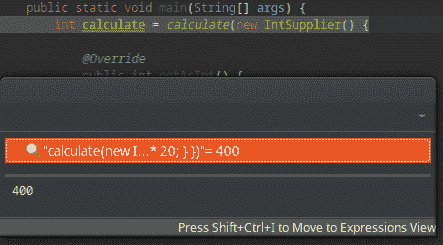](/sites/default/files/blog/2020/10/img_5f7deff1c405d.png)

Figure 27: The evaluated expression.

#### JEP 358:有用的空指针异常

JDT 调试器现在有一个复选框选项来激活对 JEP 358 的命令行支持。这在 Java 14 以下是禁用的，对于用 Java 14 和更高版本启动的 Java 程序，默认情况下是启用的。

图 28 显示了选择的`-XX:+ShowCodeDetailsInExceptionMessages`选项。

[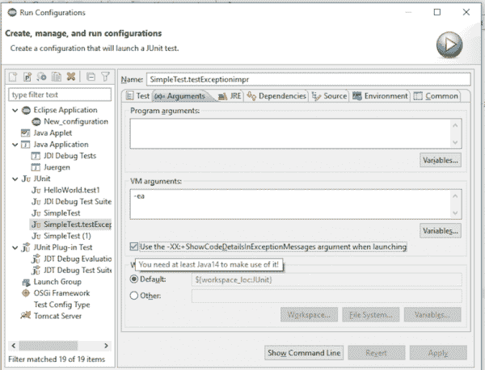](/sites/default/files/blog/2020/10/img_5f7df017c17fa.png)

JVM 现在能够分析哪个变量在`NullPointerException`点为空，并在异常中用空详细信息描述变量。

#### 变量视图中的实际类型

**变量**和**表达式**视图中的**显示类型名**选项现在显示值的实际类型，而不是其声明的类型。这简化了调试，尤其是当变量细节(`toString()`)显示为所有变量的标签时:

```
Object s = "some string";
	Collection<?> c = Arrays.asList(s, 1);
	// breakpoint
```

要在**变量**视图中启用**显示类型名称**，必须禁用列模式。导航到**视图菜单>布局>显示列**。

图 29 显示了新视图与旧视图的对比。

[](/sites/default/files/blog/2020/10/img_5f7df04de87e6.png)

Figure 29: Compare views.

## 结论

JBoss Tools 4.17.0 和 Red Hat code ready Studio 12.17 for Eclipse 4.17(2020-09)提供了一系列更新和改进，每个人都有一些东西。更多信息可以在官方 [JBoss Tools 4.17.0 更新](https://tools.jboss.org/documentation/whatsnew/jbosstools/4.17.0.Final.html)中找到。

*Last updated: October 30, 2020*