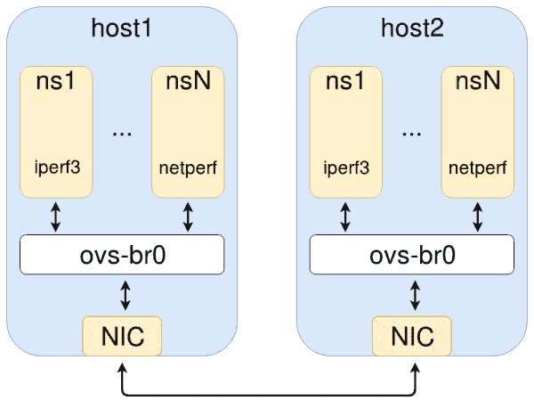
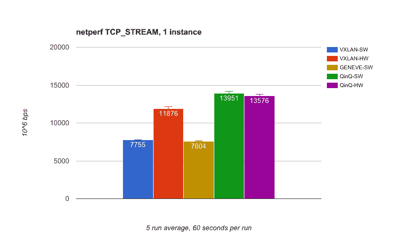
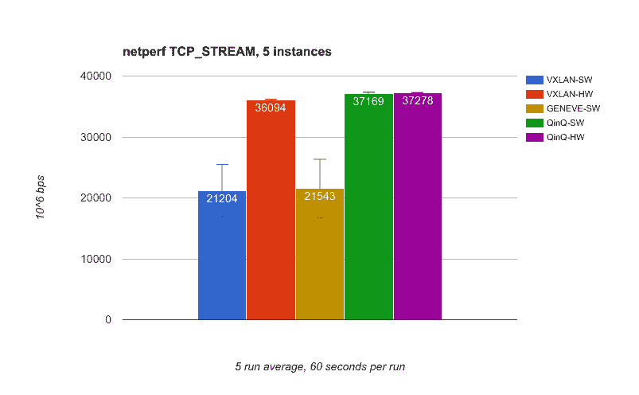
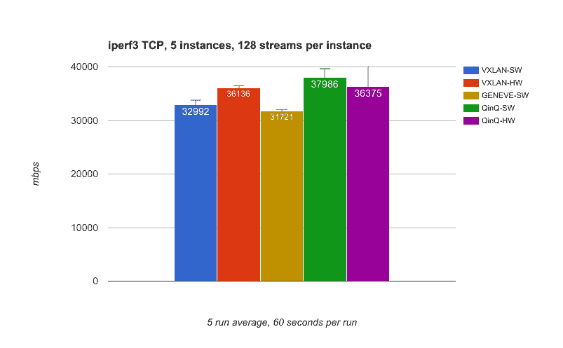
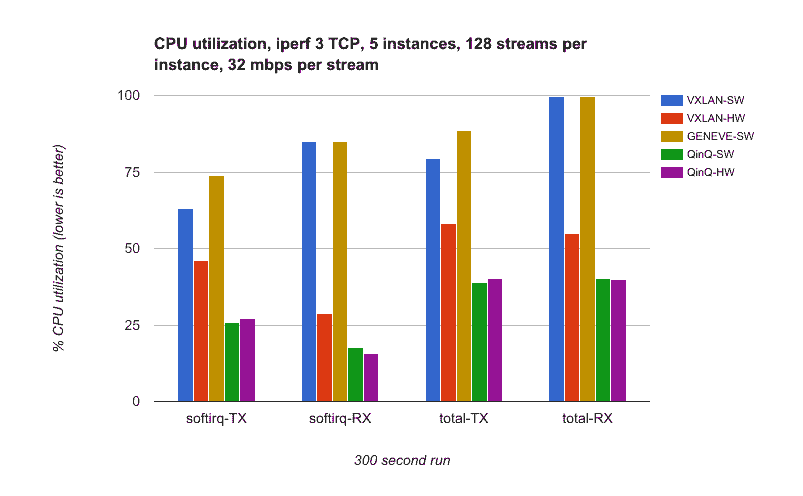

# 打开 vSwitch: QinQ 性能

> 原文：<https://developers.redhat.com/blog/2017/06/27/open-vswitch-qinq-performance>

在之前的帖子中，我们介绍了对 Open vSwitch 的 QinQ 支持。这篇文章将研究 QinQ 在吞吐量和 CPU 利用率方面的表现。这将使我们理解为什么我们会考虑 QinQ 而不是 VXLAN 或 GENEVE。

我们将了解以下隧道类型和配置:

1.  VXLAN-SW
    *   仅软件中的 VXLAN。无硬件卸载。
2.  VXLAN-HW
    *   带硬件卸载的 VXLAN。这包括 UDP 隧道分段卸载和接收端流量导向。
3.  日内瓦西南区
    *   GENEVE 仅提供软件。无硬件卸载。
4.  秦西南
    *   QinQ 仅在软件中。无硬件卸载。
5.  QinQ 硬体
    *   带硬件卸载的 QinQ。这包括 VLAN 语法分析。不幸的是，用于测试的网卡不支持 VLAN 插入。

### 测试描述

所有测试都是在相同的硬件和软件上使用 OVS 内核数据路径运行的。该设置由两个直接相连的节点组成。VLAN 标记的流量从网络名称空间通过 OVS 桥，最后到达物理网络。这模拟了容器或虚拟机在不同的主机节点上相互通信。

测试分为两类:单流和多流。单流测试使用 netperf 的单个实例，并且仅使用单个隧道。多流测试使用 netperf 或 iperf3 的多个实例，并利用多个隧道。对于 VXLAN 和 GENEVE，这意味着每个主机使用多个外部 IP 地址进行封装。对于 QinQ，使用了多个外部 VLAN id。来自每个命名空间的流量被映射到一个特定的隧道。

[](/sites/default/files/blog/2017/06/test_diagram.png)Diagram of test setup (simplified)">

### 测试配置

具体来说，使用了以下硬件和软件:

*   内核:4.12.0-rc2 (a3995460491d
*   网卡:mlx4、ConnectX-3 Pro、MT27520(固件 2.40.5000)
*   CPU:至强 E5-2690

OVS 配置是最小的，只有六个端口-端口 1 是通向物理网络的隧道接口。端口 2-6 是与我们用于流量生成的名称空间相关联的 Linux veth 接口。

以下是 VXLAN 和 GENEVE 的流程规则片段。通过 OVS 的魔力，他们是一样的。对于北向流量(朝向物理网络)，它设置隧道目的地。对于南行流量(朝向名称空间)，它与我们接收流量的隧道相匹配，并将其导向适当的名称空间。

```
in_port=1,tun_dst=10.222.0.1 action=output:2
in_port=2 action=set_field:10.222.0.6->tun_dst,output:1
...
...
in_port=1,tun_dst=10.222.0.5 action=output:6
in_port=6 action=set_field:10.222.0.10->tun_dst,output:1
```

以下是 QinQ 流程规则的片段。对于北向流量，添加一个 TPID 0x88a8 的 VLAN 标签。对于南行流量，它匹配外部 VLAN ID，删除 VLAN 标记，然后将其定向到适当的名称空间。

```
in_port=1,dl_vlan=1 action=pop_vlan,output:2
in_port=2 action=push_vlan:0x88a8,mod_vlan_vid:1,output:1
...
...
in_port=1,dl_vlan=5 action=pop_vlan,output:6
in_port=6 action=push_vlan:0x88a8,mod_vlan_vid:5,output:1
```

### 试验结果

我们的第一个结果来自单实例 netperf 测试。这是单个隧道上的单个 netperf 实例。带硬件卸载的 QinQ 和 VXLAN 的优势非常明显。QinQ 的性能几乎是 VXLAN-SW 和 GENEVE-SW 的两倍。



第二组结果再次使用 netperf，但是这次使用了 5 个 netperf 实例和 5 个隧道。这利用了更多的 CPU 核心和 NIC 接收队列。我们看到隧道类型之间的性能差距与单实例测试相同，但在 VXLAN-HW 和 QinQ 基本上使 40g 链路饱和的情况下，这种差距更加明显。需要注意的一点是，VXLAN-SW 和 GENEVE-SW 的标准差很大，而其他产品的标准差几乎不存在。



第三个测试使用 5 个 iperf3 实例，每个实例有 128 个流。一般来说，这里的吞吐量比 netperf 好，因为我们使用了更多的套接字，因此有更多的缓冲。



我们的最终测试测量 CPU 利用率。这与之前的 iperf3 测试几乎相同，但为了使比较更加公平，我们设定了一个特定的数据速率。在本例中，它是 32 Mbps * 128 个流* 5 个实例，相当于 20 Gbps。使用 sysstat 包中的 mpstat 在两个节点上收集 CPU 利用率。在此测试中，除了 5 个 CPU 内核(每个通道一个)之外，其他所有内核都被禁用，以给出更容易理解的利用率百分比。



### 测试分析

现在，让我们从上面的图表中挑选出一些值得注意的东西。

1.  QinQ 性能很棒。鉴于我们在[概览帖子](https://developers.redhat.com/blog/2017/06/06/open-vswitch-overview-of-802-1ad-qinq-support/)中了解到的情况，这并不奇怪。QinQ 的开销很小，这意味着花费在封装上的周期更少。另一件要注意的事情是，基于 IP 的隧道在被封装后必须通过内核的路由代码。QinQ 帧可以直接放在出口接口的输出队列中。
2.  QinQ-SW CPU 利用率不到其他软件专用隧道的一半。在 CPU 利用率测试中，我们看到 QinQ-SW 的利用率不到 VXLAN-SW 和 GENEVE-SW 的一半。这种节省意味着主机有更多的周期用于其他任务。
3.  VXLAN 卸载非常有帮助。这在图表中非常清楚。硬件卸载确实有助于 VXLAN 提高吞吐量和 CPU 利用率。
4.  QinQ-SW 和 QinQ-HW 差别不大。内核在插入和解析 VLAN 标签方面是高效的。使用 perf 进行的快速分析显示，将 VLAN 插入数据包数据仅占传输开销的 0.02%。这表明硬件 S-VLAN 插入和解析可能有所帮助，但帮助很小。

### 结论

我们发现 OVS QinQ 在吞吐量和 CPU 利用率方面表现非常好。因此，它可能是您部署的可靠选择。如果硬件卸载不可用(虚拟机和较旧的硬件就是这种情况)，情况尤其如此。这意味着您可以从一家云提供商或网卡迁移到另一家，并期望获得类似的性能。您不依赖于供应商子集提供的硬件功能。

要开始学习 OVS QinQ，你可以查看[以前的帖子](https://developers.redhat.com/blog/2017/06/06/open-vswitch-overview-of-802-1ad-qinq-support/)快速浏览。

* * *

**下载 Kubernetes** [**备忘单**](https://developers.redhat.com/promotions/kubernetes-cheatsheet/)****跨主机集群自动部署、扩展和操作应用容器，提供以容器为中心的基础设施。****

***Last updated: September 18, 2018***